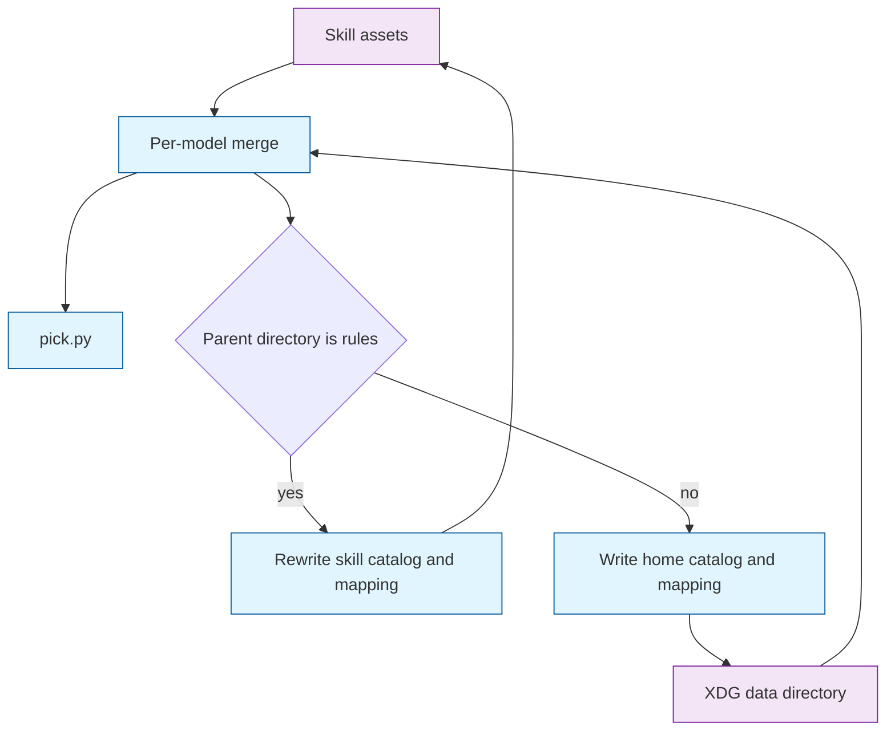

# Architecture Decision: Asset Overlay

## Requirements & Constraints

Ranked quality attributes:

1. Correctness of the overlay. A model the user set keeps their setting. A model they did not set takes the shipped default, including models that arrive in a later skill update.
2. Agent invisibility. `pick.py` and `refresh.py` keep the same command lines. The agent does not merge files and does not learn a new flag.
3. Simplicity. Stdlib only, one user directory, the same three filenames the skill already uses.
4. Maintainer publish. A refresh run from the canonical source tree still rewrites the committed assets and does not fold personal tiers into that commit.
5. Reversibility. The layout is one directory of files. Removing it restores shipped behavior.

Technical constraints:

- Shipped assets stay at `rules/choose-verification-model/assets/`: `catalog.json`, `mapping.json`, and hand-edited `tiers.toml`. Refresh never writes `tiers.toml`.
- The installed skill on this machine is a real copy at `~/.cursor/skills/ai-rizz/choose-verification-model`, not a symlink into `rules/`.
- Pick today reads only the JSON. Shipped tiers are already baked into `catalog.json`. A home `tiers.toml` is the extra file pick must learn to read. Parsing it needs `tomllib` (Python 3.11), which refresh already requires.
- Scripts must run under Bash and PowerShell. `XDG_DATA_HOME` follows the [XDG Base Directory spec](https://specifications.freedesktop.org/basedir-spec/latest/): set and non-empty wins on every OS; empty or unset uses `$HOME/.local/share`. On Windows, when that variable is unset, the directory is `%LOCALAPPDATA%`.
- The user directory holds the same asset names beside each other. Tiers are not split into `XDG_CONFIG_HOME`.

In scope: where files live, which process writes them, and the per-model merge pick and refresh both use.

Out of scope: changing `select`, the tier ladder, BenchLM scoring, or the text of `SKILL.md`.

## Components

`pick.py` always merges, then selects. It never writes.

`refresh.py` merges only on the consumer path, where the merged mapping and the merged tiers are the inputs to the existing build. The source-tree path keeps today's inputs: the skill's own `mapping.json` and `tiers.toml`.

## Options Evaluated

- **Read-time overlay, write target by tree**: Pick merges on every run. Refresh in `rules/choose-verification-model` rewrites the skill assets from those files alone. Refresh from any other install writes `catalog.json` and `mapping.json` under the XDG data directory and does not touch the install.
- **Home is the only write, publish is a flag**: No-arg refresh always writes the XDG directory. Updating the committed catalog requires a new destination argument.
- **Snapshot then prefer home**: Refresh writes a full catalog into the home directory, and pick reads the home catalog when it exists, otherwise the shipped one.

The rejected constraint case, not scored below: a home `tiers.toml` that replaces the shipped tier list. Models absent from the home file would lose their shipped tiers, so a skill update's new models would not receive defaults.

## Analysis

| Criterion | Read-time overlay | Home-only write plus flag | Snapshot then prefer home |
|-----------|-------------------|---------------------------|---------------------------|
| Fitness | Skill updates show up on the next pick. A home tier list overrides per model. A consumer refresh adds models the shipped catalog lacks. | Publish needs a new argument, so the documented no-arg command can no longer update the repo. | A skill update's new models stay invisible until the user runs refresh again. |
| Simplicity | One merge function. Source-tree refresh stays the current function. | Simplest write path, plus a flag and a doc change the agent would follow. | Simplest read path, and it misses the update case. |
| Maintainability | Publish versus consumer is one path check. Tests inject directories. | Two documented commands to keep straight. | Easy to read, hard to explain once a snapshot has frozen tiers. |
| Scalability | Dozens of models. Not a factor. | Same. | Same. |
| Risk | A future installer that nests the skill under a directory named `rules` would take the publish path. The check is one function. | Low structural risk, and it changes the maintainer command the agent already runs. | High product risk: local snapshot hides shipped defaults. |

Key insights:

- The five-new-models case is a read-time union. A home file that is consulted only after refresh cannot see a skill update by itself.
- The home tier list is the local setting. The `tier` field inside a home `catalog.json` is a generated copy. Letting that copy win would freeze tiers for every model a consumer refresh had written, including models the user never edited.
- Scores and the rest of a catalog row may use ordinary local-wins. The brief treats a later score change as unlikely. Tiers do not get that treatment.
- Source-tree refresh must ignore the home directory. Otherwise a maintainer's personal tiers would be written into the files they commit.

## Decision

### Choice Pre-Mortem

- The publish check keys off the skill directory's parent being named `rules`. That would be wrong if an install were ever placed there. Checked against the live install: `~/.cursor/skills/ai-rizz/choose-verification-model` is a real copy whose parent is `ai-rizz`. Canonical source under `rules/` is the repo contract in `memory-bank/systemPatterns.md`.
- Ignoring `tier` on a home catalog row would be wrong if that field were the user's setting. Checked against the brief: the user edits the tier list beside the catalog, and models they do not set keep shipped defaults after a skill update.
- Source-tree refresh ignoring the home directory would be wrong if that command were how a consumer pulls a new model. Checked against today's maintainer flow: no-arg refresh in this repo rewrites the committed assets. Consumer refresh is the installed script.

**Selected**: Read-time overlay, write target by tree
**Rationale**: It is the only option that shows shipped defaults on the next pick, keeps personal tiers out of the committed catalog, and leaves both command lines unchanged.
**Tradeoff**: A home catalog row wins on score, price, and `has_fast` for a model that exists on both sides, so a later shipped score change stays hidden behind that row. The brief accepts that. Tiers are exempt: only the home `tiers.toml` overrides a shipped tier.

## Implementation Notes

- User directory: `$XDG_DATA_HOME/choose-verification-model`, or `~/.local/share/choose-verification-model` when the variable is unset or empty. On Windows with the variable unset, `%LOCALAPPDATA%/choose-verification-model`.
- Filenames in that directory match the skill: `catalog.json`, `mapping.json`, `tiers.toml`. Missing files contribute nothing. Refresh creates the directory when it writes. Pick does not create it. Refresh still never writes `tiers.toml`.
- Publish mode: the skill directory is named `choose-verification-model` and its parent is named `rules`. That path reads and writes the skill assets exactly as refresh does today.
- Consumer mode: any other location. Inputs are the merge of skill assets and the home directory. Outputs are home `catalog.json` and `mapping.json` only.
- Mapping merge: union of `models`. A home row replaces the shipped row for the same stem.
- Catalog merge: union of `models`. For a stem in both, take the home row, then put the shipped `tier` back. For a stem in only one side, take that row. `tier_order` comes from the shipped catalog.
- Tier override: parse the home `tiers.toml` with the same stem rules as `previous_from_tiers` (`model_key`, first listing wins). For each stem it names, set that tier on the merged catalog. Stems it does not name keep the tier from the catalog step. Pick drops the warnings. Refresh keeps printing them.
- Consumer refresh builds tiers by overlaying the home tier lists on the shipped tier lists, then runs the existing fill and catalog build. A stem listed at home is removed from its shipped tier.
- `SKILL.md` stays as it is. `references/refresh.md` is updated so its description of the write matches this split. The commands in it stay `python3 scripts/refresh.py` and `py -3 scripts/refresh.py`.
- Tests that call `pick.main` without an injected catalog must point `XDG_DATA_HOME` at an empty directory. Otherwise a developer's home tier list changes the result.
