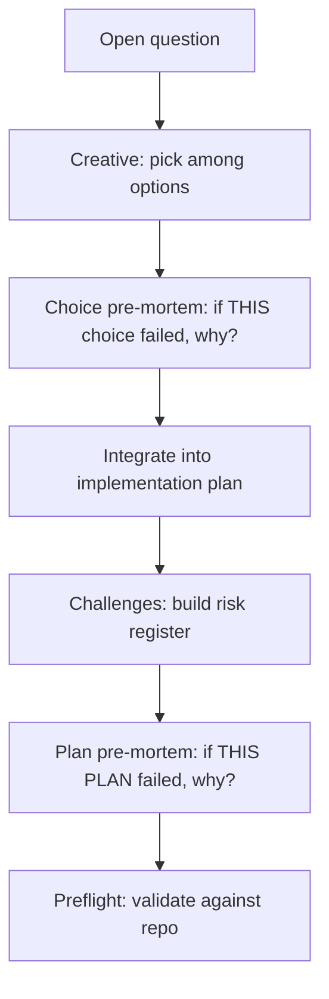

# Decision: Creative-Phase Pre-Mortem Complement

## Context

**What:** What (if anything) should go in creative-phase docs to complement the plan-end Pre-Mortem (after Challenges), without duplicating it or diluting Challenges?

**Why it matters:** SLOBAC-class failures were *choice* failures marked high-confidence, then invalidated by an unstated constraint. Plan-end pre-mortem is a safety net after the plan is written inside that frame; creative-local stress-test catches the bad bet at decision time. Operator asked to investigate the complement before build, not necessarily ship both in one go without design.

**Constraints:**
- Plan-end Pre-Mortem (B2) is locked: after Challenges; visualize whole-*plan* failure; Challenges unchanged
- Creative object is a *choice* among options, not the whole plan
- Architecture creative already has **Risk** (blast radius / reversibility) in tradeoff evaluation — adjacent, not Klein
- Generic/algorithm/uiux lack an equivalent Risk row (generic has Reversibility)
- Template (`creative-phase-template.md`) defines the shared Decide → Output shape; four phase types + template must stay consistent if we add a beat
- Prompt-authoring: explicit steps; decompression key OK
- L2 has no creative — plan-end remains the only pre-mortem for L2
- Prefer complement over substitute; YAGNI on ceremony for low-stakes creatives

## Options Evaluated

- **A — Plan-end only (no creative change):** Ship L2/L3 plan Pre-Mortem; leave creative docs untouched; document creative as follow-up.
- **B — Architecture-only closing beat:** After Decide (before/as part of Output), for architecture creative only: "If this choice turned out wrong, what would the likely reason be?" Record in creative doc; if the reason is an unchecked constraint → prefer low-confidence / reopen framing.
- **C — All creative types, same closing beat:** Add the choice-level pre-mortem to architecture, generic, algorithm, uiux (+ template).
- **D — Strengthen Risk only:** Expand architecture's existing Risk criterion with Klein wording; no new step/section.
- **E — Creative + plan both in this task (B or C + plan-end):** Implement creative complement in the same build as plan-end Pre-Mortem.

## Analysis

| Criterion | A Plan only | B Arch-only beat | C All types | D Risk expand | E Ship both now |
|-----------|-------------|------------------|-------------|-----------------|-----------------|
| Catches SLOBAC-class | Weak (late) | Strong | Strong | Medium — still comparative | Strong |
| Complements plan-end | N/A | Clear — choice vs plan | Clear | Blurs Risk vs pre-mortem | Clear |
| Ceremony / YAGNI | Lowest | Low | Medium — naming/UI creatives get tax | Lowest touch | Higher build scope |
| Consistency across types | — | Architecture special-cased | Best | Architecture only | Depends on B vs C |
| Distinct from plan Pre-Mortem | — | Different object (choice) | Same | Easy to conflate with blast-radius | Must word carefully |
| Fits this task | Under-delivers "investigate" | Good investigate+optional ship | Good if we want uniformity | Weak investigate outcome | Scope risk |

Key insights:
- **Risk ≠ pre-mortem.** Risk asks "how bad / how reversible if wrong?" Pre-mortem asks "assume it *is* wrong — *why*?" Comparative scoring doesn't force naming the invalidating premise (Invariant #11-style).
- **Placement inside creative:** After Decide, not during Enumerate/Tradeoffs — you need a selected option to pre-mortem. Record under Decision (or a short `## Pre-Mortem` / `## If this choice failed` subsection) so the creative artifact carries it into plan resume.
- **Confidence gate:** If the likely failure reason is an *unchecked constraint or unverified assumption*, that should push toward low-confidence or an explicit "verify X before treating as high confidence" — matching SLOBAC's process improvement almost verbatim.
- **All types vs architecture-only:** SLOBAC/stockroom evidence is architectural. Naming and small generic creatives rarely need the beat. **B** is the evidence-fit default; **C** is consistency/polish. Template should document the beat as required for architecture and recommended/optional for others — or require for all if we value uniformity over YAGNI.
- **A alone** fails the operator's ask to investigate the complement; investigation can conclude "defer implement" but must specify *what would go there*.
- **E:** Reasonable if B's surface area is small (architecture.md + template note + output format). C+E is a larger diff (4 phase files + template).

## Decision

**Selected**: Investigate → specify **B** as the creative complement design; **implement B in this task alongside plan-end** (light E), unless build reveals template churn that should split — default is ship both.

**Rationale:**
- Complements plan-end with a different object (choice vs plan).
- Targets the failure class archives actually showed (high-confidence architecture picks with unstated constraints).
- Avoids taxing every naming creative (not C by default).
- Rejects D because expanding Risk keeps comparative language and won't summon "what would make this wrong."
- Rejects A-as-final-state for this investigation; A remains the fallback only if we explicitly defer creative edits to a follow-up issue after specifying B.

**Tradeoff:** Architecture is special-cased vs other creative types. Accepted — evidence is arch-heavy; generic/algorithm/uiux can adopt the same beat later via template guidance as "recommended."

## Implementation Notes

### What goes in creative (the complement)

**Where:** `creative-phase-architecture.md` — new step after Decide (renumber Output), *or* a mandatory subsection of Decide before confidence is finalized.

**Incantation (decompression key):** Pre-mortem this choice — *If we shipped this decision and it turned out wrong, what would the likely reason be?*

**Required output (1–3 bullets):**
1. Likely reason(s) the choice would be wrong (premise/constraint/layer — not implementation footguns).
2. Whether each reason is already checked in Requirements & Constraints / evidence.
3. If an unchecked constraint/assumption: do not mark high confidence until verified, **or** return low confidence / surface to operator.

**Template doc:** Update `creative-phase-template.md` so new phase types know the pattern; state architecture **requires** it; other types **may** use the same beat when the decision is load-bearing.

**Do not:**
- Re-run Challenges-style tech risk lists
- Replace the Risk criterion — keep Risk as blast radius/reversibility; pre-mortem is a separate closing beat
- Put whole-*plan* pre-mortem in creative (that's plan-end's job)

### Complementarity diagram

### Files if shipping B now

- `rulesets/niko/skills/niko/references/phases/creative/creative-phase-architecture.md`
- `rulesets/niko/skills/niko/references/phases/creative/creative-phase-template.md` (document required-for-architecture / optional-elsewhere)
- Optionally one line in `niko-creative/SKILL.md` only if needed for routing clarity — prefer not (closed stack; detail stays in phase docs)

### Out of scope for creative (this task)

- Rewriting generic/algorithm/uiux with a mandatory beat (follow-up if drift/unevenness hurts)
- Creative-hosted whole-plan pre-mortem
- Changing creative confidence machine beyond the unchecked-constraint gate above
