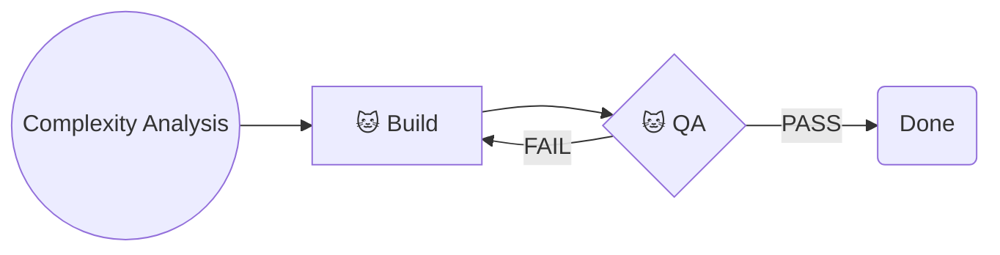
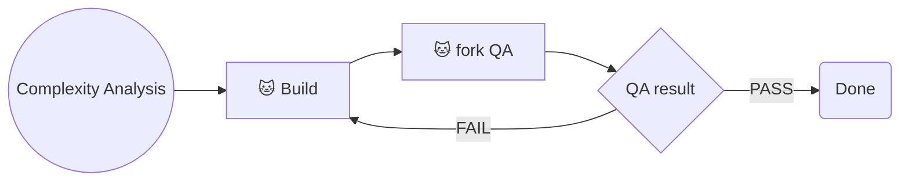
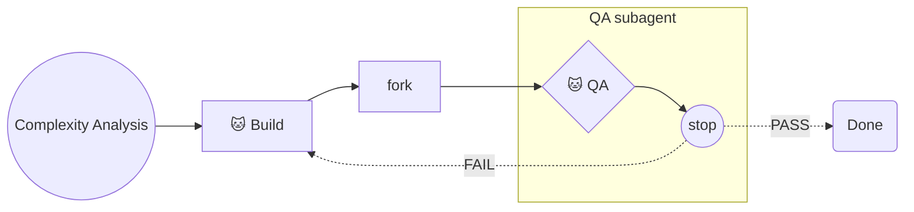
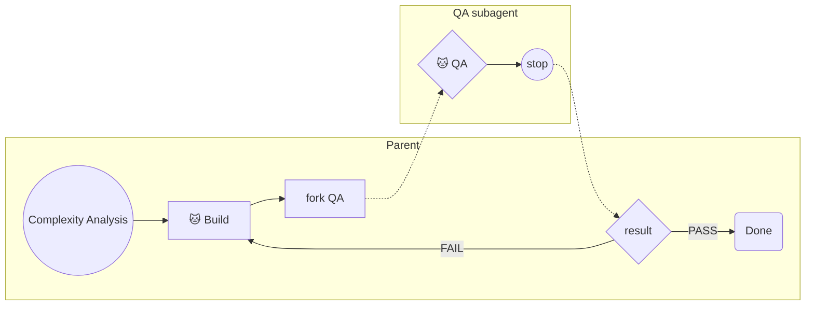
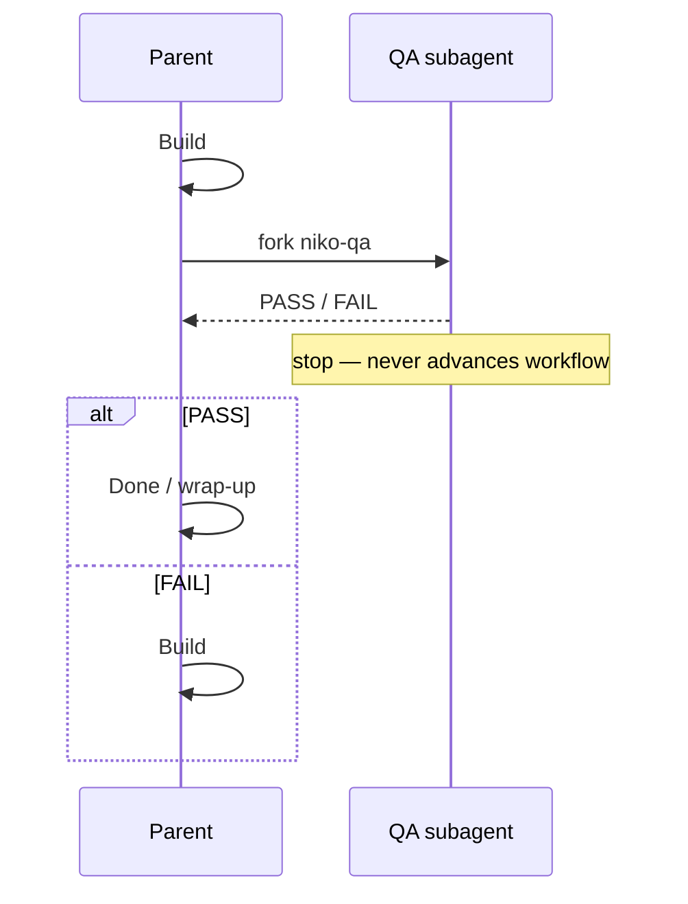
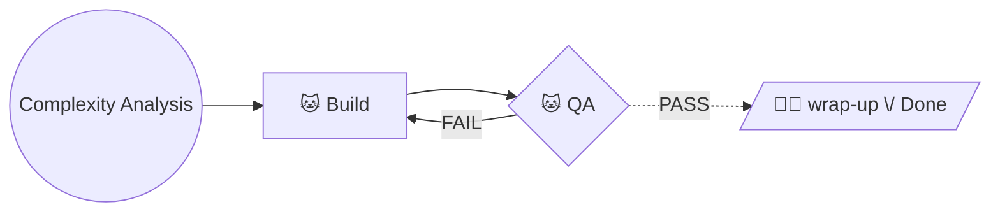
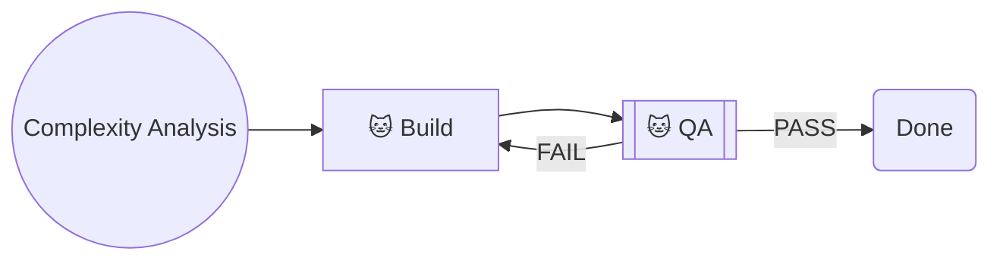

# Decision: L1 Workflow Diagram — Verification as Terminal Subagent

**Status:** ⚠️ UNRESOLVED — operator selects or refines a rendition; charts are source of truth; prose percolates after.

**Approach:** Generic creative (process / visual grammar for Niko level workflows)

## Context

### What

How should `level1-workflow.md`'s mermaid express that QA runs in a **subagent that never advances the workflow**, while **advancing is a parent (or operator) act** after the verifier stops?

L1 is the degenerate case: one verification node (QA), no preflight. The chosen grammar must scale to preflight + QA on L2–L4 without a different dialect per level.

### Why it matters

Operator: level-N workflow charts are the **handcrafted source of truth**; phase mappings and skills derive from them. Prior plan treated subagent as an implementation detail and left mermaid alone — that is reversed. Wrong visual grammar either (a) still reads as “QA continues to Done” (today’s failure mode) or (b) invents notation that cannot extend to preflight or that overloads the existing solid/dashed legend.

### Constraints

- Stay in Mermaid that GitHub / Cursor preview render (`graph` / `sequenceDiagram`; no exotic plugins).
- Preserve existing Niko legend vocabulary where possible: 🐱 autonomous, 🧑‍💻 operator command, solid vs dashed edges — or **extend the legend explicitly** if meaning changes.
- Verification agent must not look like it owns the edge into Build/Done/Reflect.
- Manual recovery remains: skill alone is terminal; resume is elsewhere.
- Match Niko directness: prefer a small legend change over a baroque subgraph if both carry the meaning.
- Operator may hand-edit the winning chart; this doc’s job is options, not a premature lock.

### Semantic fork (decide with the picture)

Two different “terminal” meanings are in play. Pick one; the diagram should make it obvious.

| Sense | Meaning | L1 PASS edge |
| --- | --- | --- |
| **T1 — Subagent-terminal** | The agent that ran QA always stops; the **parent** still takes solid edges (L2 automation kept). | Solid `PASS → Done` owned by parent after fork returns |
| **T2 — Phase-terminal** | Like Reflect → Archive and L3 Preflight → `/niko-build`: verification **ends the turn**; next phase needs a new invoke (🧑‍💻 or parent re-entry). | Dashed `PASS → …` |

Today L1 is neither: QA looks like a normal diamond that advances. L3 preflight is already **T2**. Reflect is **T2**. The amended one-liner plan assumed **T1**. Your “like reflect / like L3 preflight” leans **T2**.

---

## Options Evaluated (L1 chart renditions)

Baseline today:

### A — Legend-only (chart shape unchanged)

Keep the same graph; extend the legend:

> Verification phases (🐱 QA, 🐱 preflight) run in a forked subagent and are terminal in that agent. Outbound edges are taken by the parent after the subagent stops (or by the operator on dashed edges).

| Pros | Cons |
| --- | --- |
| Zero chart churn; scales by legend | Easy to miss; agents pattern-match edges harder than legends |
| Fits T1 without redraw | Does not *show* the subagent cycle |

**Pattern fit:** Weakest visual; strongest minimalism.

### B — Parent gate node (result owned outside QA)

QA skill is not a diamond — only “fork” + parent gate. Subagent is implied.

| Pros | Cons |
| --- | --- |
| Clear: Done is not an edge out of QA | QA procedure invisible as a phase node |
| Natural T1 | “fork QA” is a new node type; must repeat for preflight |
| | Degenerate L1 gets busier |

### C — Subgraph: child stops; return edges to parent

| Pros | Cons |
| --- | --- |
| Shows subagent cycle + stop | Dashed overloaded if dashed still means “operator input” |
| Halt is visually terminal | Mermaid subgraph + cross edges can render messy in LR |
| | Agents may still follow Halt→Done as “QA continues” |

**Legend fix if chosen:** dashed from a `stop` node = “return to parent / operator,” not “QA executes Done.”

### D — Dual subgraph (parent vs verifier) — clearest ownership

| Pros | Cons |
| --- | --- |
| Ownership unmistakable: only Parent reaches Done | Heaviest L1 diagram; L2/L3 get large |
| Scales: add Preflight subgraph the same way | More ceremony than Niko’s usual LR strip |
| Supports T1 (solid inside Parent) or T2 (dashed Parent edges) | |

### E — Sequence diagram (different type for verification handoff)

Keep a simple LR flowchart for phases, **or replace L1 chart** with:

| Pros | Cons |
| --- | --- |
| Best at “Q never progresses” | Breaks flowchart-only consistency across levels |
| Matches how harnesses actually fork | FAIL→Build loop is clumsier in sequence form |
| | Operator would maintain two diagram dialects |

**Hybrid:** keep `graph LR` for the phase strip; add a tiny sequence under “Verification” — usually too much for L1.

### F — Phase-terminal like L3 preflight (T2, minimal new shapes)

Reuse existing dashed + 🧑‍💻 grammar; QA does not solid-edge to Done:

Or PASS also dashed back only via operator `/niko` / wrap-up command — exact 🧑‍💻 node label is yours to craft.

| Pros | Cons |
| --- | --- |
| Same dialect as L3 preflight + Reflect | Drops L1/L2 autonomous PASS continuity (behavior change) |
| No subgraph; Niko-familiar | Does not draw “subagent” — only “terminal phase” |
| Recovery path matches the chart | “Subagent” may still need one legend line |

**Pattern fit:** Strongest consistency with *existing* terminal phases; weakest at depicting fork.

### G — Shape cue + T2/T1 edge choice (light touch)

Use a distinct shape for verification diamonds (e.g. subroutine `[["🐱 QA"]]` or stadium) plus legend: “verification shape = forked subagent; node is terminal for that agent.”

| Pros | Cons |
| --- | --- |
| Small diff; greppable shape | Shape semantics are easy to forget |
| Works with T1 or T2 edge style | Still looks like QA owns PASS→Done unless edges change too |

---

## Analysis

| Criterion | A Legend | B Gate | C Child subgraph | D Dual subgraph | E Sequence | F T2 dashed | G Shape |
| --- | --- | --- | --- | --- | --- | --- | --- |
| Shows subagent can’t advance | Weak | Medium | Strong | Strongest | Strongest | Medium (phase-terminal) | Weak |
| Fits Niko chart dialect | Strong | Medium | Medium | Weak | Weak | Strongest | Strong |
| L1 simplicity | Best | OK | Busy | Busiest | OK as replace | Good | Best |
| Scales to preflight+QA | Legend only | Repeat gate | Repeat subgraph | Repeat V subgraph | Repeat seq | Same as L3 | Same shape |
| Aligns T2 “like Reflect” | Optional | Optional | Needs legend | Optional | Optional | Native | Optional |
| Agent misread risk | High | Low | Medium | Low | Low | Low | High |

Key insights:

- **Depicting “subagent” and “phase-terminal (T2)” are separable.** F gives you T2 with almost no new notation; D/E give you subagent ownership; you can combine F’s edge semantics with a one-line legend for fork.
- **Dashed already means operator input** in L2–L4 legends. Using dashed for “return from subagent” without a legend edit will be misread. Either keep dashed = operator (T2) or add a third edge kind (messy) or use subgraph returns with an explicit legend line.
- **L1 Wrap-Up is already a parent-side terminal ritual** after QA PASS (reconcile, commit, STOP). Today’s chart lies by drawing `QA → Done` as if QA performed Done. Even under T1, a Parent gate or Wrap-Up node would be more honest than an edge out of the QA diamond.
- **Do not overload Step 4 skill prose to carry chart semantics** — you asked for charts first; skills should later say “stop” in the same vocabulary as the legend (terminal / STOP and wait).

---

## Decision

**None selected — low confidence by design.** Operator will choose or hybridize.

### Soft recommendation (non-binding)

If the goal is **one grammar for all levels** and you meant **T2 (like L3 preflight / Reflect)**: start from **F**, add **one legend line** that verification runs in a forked subagent. No subgraph on L1.

If the goal is **show the subagent cycle** and keep **T1 parent automation**: start from **D** (or **B** if you refuse subgraphs), keep solid edges inside Parent.

If you want **maximum honesty on L1 with minimum novelty**: **B** with the PASS node labeled as today’s Wrap-Up, not a vague “Done.”

### Implementation notes (after you pick)

1. Edit `level1-workflow.md` mermaid + legend (+ “STOP and wait” list if T2).
2. Mirror the same grammar onto L2–L4 charts (preflight + QA).
3. Only then percolate: phase mappings one-liner, skill Step 4 / Handle Results, secondary call sites, README — vocabulary aligned to the legend (“terminal”, dashed, STOP).
4. Strike brief requirement “mermaid stay as-is” / out-of-scope “no redraw” (superseded).

### Validation

Renditions B–G were checked with `mmdc` (parse/render). Fix forward if a chosen hybrid fails render on GitHub.
