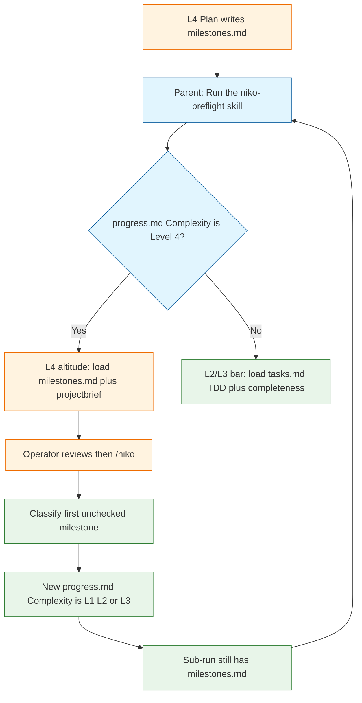

# Architecture Decision: L4 Preflight Mechanism

## Requirements & Constraints

**Functional requirements**
- When Complexity is Level 4, preflight judges the L4 design, not each `milestones.md` one-liner as an L2/L3 implementation plan ([issue #122](https://github.com/Texarkanine/.cursor-rules/issues/122)).
- L2/L3 `tasks.md` plans keep TDD Plan Encoding and completeness-of-steps unchanged.
- L4 checks: required milestones present (covers the brief); dependency order (DAG skippable if the checklist is a line); each milestone has a task-description reference; a judgeable definition of done; critical invariants or risks that must not be lost.
- Reuse an existing ticket if one exists; never create tickets.
- Canonical edits under `rulesets/` only.

**Ranked quality attributes**
1. **Dispatch correctness** — a sub-run Preflight must not take the L4 bar. `milestones.md` still exists during every sub-run.
2. **L4-altitude fitness** — the checks above, plus whatever an L4 run actually needs to succeed (see research below).
3. **Simplicity** — fewest new entry points and spawn-line variants.
4. **Maintainability** — one status glossary; L4 instructions not sitting next to TDD encoding where an agent can mix bars.
5. **Spawn-contract stability** — L2/L3 keep `Run the /niko-preflight skill` as the only added instruction.

**Technical constraints**
- Judge-and-report: four strings in `preflight-status.mdc` only; no Handle Results; allowed writes unchanged.
- `milestones.mdc`: one checkbox line each; no sub-bullets; no implementation-plan notes on those lines.
- `/niko` Step 2a deletes `tasks.md`, `activeContext.md`, `progress.md`, `creative/`, `troubleshooting/`, `.qa-validation-status`, `.preflight-status`. It preserves `milestones.md`, `projectbrief.md`, `reflection/`.
- Complexity analysis, when `milestones.md` exists, writes a **new** `progress.md` whose `**Complexity:**` is the sub-run's level. That field is the system of record.

**Boundaries**
- In: how L4 Preflight is invoked, what it loads, what it judges, where judged facts must live.
- Out: relaxing L2/L3 TDD; turning the L4 checklist into an implementation plan; creating tracker tickets.

## Components

L4 Preflight and sub-run Preflight share a slash name today. They must not share a bar.

**Dispatch rule (all mechanisms must obey):** L4 mode if and only if `progress.md` `**Complexity:**` is `Level 4`. Presence of `milestones.md` is **not** sufficient. Using file presence as the switch would skip TDD on every sub-run.

## What an L4 milestone must have

Research from the L4 workflow, Step 2a, and the nervouscsstem incident — not extra fields invented for their own sake.

### Already required, and L4 Preflight should judge

| Need | Why the run fails without it |
| --- | --- |
| Independently deliverable, L1–L3 scoped, not itself L4 | A nested L4 cannot be classified; `/niko` has no recursion. |
| Concrete one-line deliverable | Complexity analysis classifies the checkbox text plus the memory bank. Vague lines force guessing. |
| Set covers the brief with no overlap | Gaps reappear as surprise sub-runs; overlap fights over the same files. |
| Checklist order compatible with serial execution; DAG only if not a line | `/niko` always takes the first unchecked box. A parallel DAG that is not serial-safe deadlocks. |
| Cross-milestone invariants | Sub-run workers never see each other's deleted `tasks.md`. |
| Header `task-id` matches the active task | Format is the in-flight signal; a wrong header is a wrong project. |
| Extra sections must not use `- [ ]` except for real milestones | Classification keys off checkbox markers only. |

### Operator-requested, and they belong in surviving files

| Need | Why |
| --- | --- |
| Task-description reference (existing ticket URL/id if one exists; otherwise a pointer into `projectbrief.md`) | The one-liner is not the spec. A later session needs a durable pointer. |
| Judgeable definition of done | Someone who did not write the L4 plan must be able to say shipped or not. |
| Critical invariants **or** risks for that milestone | Lost the moment Step 2a deletes the L4 `progress.md` / stub `tasks.md`. |

### Discovered, load-bearing

1. **Durability.** Per-milestone done, risks, ticket refs, and handoff rules cannot live only in L4 `tasks.md` or L4 `progress.md`. Those files are replaced or deleted before later milestones run. They must live in `milestones.md` and/or `projectbrief.md` (and persistent product/system/tech context for repo-wide facts).
2. **Handoff as a rule, not a file inventory.** Issue #122 asked for "who may touch a shared file, and when." File lists on checklist lines are out of scope. A stated ownership rule *is* in scope when two milestones share an artifact ("M2 creates release-please; M5 may only add a SKILL.md extra-files entry"). That is an invariant, which `level4-plan.md` already knows how to record.
3. **Persistent-file sufficiency.** `level4-plan.md` already says a future agent classifies from the milestone **plus the memory bank**. Preflight should FAIL (blocking) when a checkbox plus surviving files (and any ticket it points at) are not enough to know what to build. That is the operational meaning of "links to task description."
4. **Do not judge:** numbered test-first substeps, concrete file paths, or validation sequences on the one-liners. Those are the sub-run's job.
5. **Do not require L-estimates on the checkbox line.** `level4-plan.md` Step 5 currently tells the planner to write L1/L2/L3 plus rationale onto `milestones.md`; `milestones.mdc` forbids notes on those lines. Preflight should ignore that contradiction, not enforce the Step 5 wording. Implementation of the chosen mechanism should fix Step 5 (estimates in the plan-result printout / `progress.md`, not on the checkbox).

### Not required for L4-run success

Creating GitHub/JIRA tickets. Offering to create them. Per-milestone file lists. Turning `milestones.md` into `tasks.md`.

## Where those facts can live

Any mechanism still needs a place to put done / risks / refs without violating the one-line checklist. These are **orthogonal** to the skill-vs-branch vote; pick one.

| | **W1. Sections below the checklist** | **W2. `projectbrief.md` only** | **W3. Ticket URL in the one-liner only** | **W4. W1 + W3** |
| --- | --- | --- | --- | --- |
| What | After the checkboxes: invariants, then a compact per-milestone block (ref, done, risks) — **not** sub-bullets of a checkbox | Map brief requirements / acceptance criteria to milestone ids | `- [ ] Ship release-please (org/repo#N)` as the description | One-liner may carry a ticket; done/risks/invariants in sections |
| For | Survives Step 2a; worker opens one file; matches `level4-plan.md` already having an invariants section the mdc example omitted | Brief is already the north star; no format fight with `milestones.mdc` | Zero format change; reuses tickets | Matches "sequencing plus enough to understand the document" plus "persistent files hold most of the spec" |
| Against | `milestones.mdc` example is checklist-only today; sections must be specified so agents don't stuff TDD into them | Brief becomes a second tracker; easy to forget to map a milestone | One line gets cramped; no ticket means no spec pointer; done/risks still homeless | Two places to read |
| Risk | Sections rot into mini-plans | Mapping drifts from checkboxes | Un-ticketed work is under-specified | Same as W1 if sections grow |
| Reward | One surviving artifact | Checklist stays tiny | Cheap when issues already exist | Cheap when tickets exist; complete when they don't |

**Recommendation on placement (not the mechanism vote):** **W4**. Allow a ticket in the one-liner when one exists; require a short per-milestone done + risks/invariants section (or a row in a table) in `milestones.md`; keep narrative requirements in `projectbrief.md`. Update `milestones.mdc` **only** to document those sections — not to allow checklist sub-bullets or TDD steps. That is format clarification, not "implementation plans in the L4 checklist."

## Options Evaluated

Operator-named first; discovered after.

- **A. New skill** (`/niko-preflight-l4` or similar): L4 Plan/workflow spawn the new skill; L2/L3 keep `/niko-preflight`.
- **B. Branch inside `niko-preflight`**: one SKILL.md; early exclusive `if Complexity is Level 4` path with different checks.
- **C. Different L4 routing**: change what happens after L4 Plan (skip Preflight; or parent-passes extra instructions; or Plan self-gates and never spawns).
- **D. Same skill, extracted L4 workflow** (discovered): `niko-preflight` detects Level 4, then follows **only** `references/l4-preflight.md` (or equivalent). One slash name, one spawn line, L4 prose not adjacent to TDD encoding.
- **E. Minimal bugfix** (discovered, inadequate): drop "milestone" from the TDD unit list; treat the L4 plan as prose/policy. No new L4 checks.
- **F. Dual-write a fake L4 `tasks.md` plan** (discovered, inadequate): keep the current skill, feed it file-level steps that describe the decomposition. Drift vs `milestones.md`; contradicts "the L4 plan **is** the milestone list."

### Option A — New skill

One sentence: isolate L4 altitude in its own slash skill and point the two L4 spawn sites at it.

**For**
- A subagent told only `Run the /niko-preflight-l4 skill` cannot see TDD Plan Encoding.
- Matches how humans think ("L4 preflight is a different job").
- The 2026-02-22 L4 archive already named "a dedicated preflight checklist item" for milestone quality and never built it.

**Against**
- Second judge-and-report skill: status strings, allowed writes, Step 4 stop, findings shape will drift unless copied verbatim.
- New frontmatter, ruleset symlink, README, skill index.
- Operators and muscle-memory `/niko-preflight` on an L4 plan get the wrong bar unless L4 routing also forbids the old skill.
- Breaks spawn-line identity at the two L4 sites (intentional, but the grep tripwire must be rewritten, not "fixed" back).

**Risks**
- Dual glossary. Duplicate Handle-Results regressions. Someone spawns the wrong skill.
- ai-rizz consumers install niko as a ruleset: two skills to keep in lockstep.

**Rewards**
- Strongest isolation. L2/L3 SKILL.md can stay boring. L4 checks can grow without scaring the TDD bar.

**Alignment:** isolation over simplicity. Conflicts with "one Preflight semaphore."

### Option B — Branch inside the existing skill

One sentence: `niko-preflight` reads `progress.md` Complexity and runs a different Step 2.

**For**
- Zero spawn-line edits. Nine-site instruction stays true.
- One status writer, one allowed-writes list, one Step 4.
- Issue #122's suggested fix.

**Against**
- Agents read the whole SKILL.md. TDD encoding and "do not require TDD" in one file is how mixed-bar failures happen (this incident is that failure mode, with "milestone" in the TDD sentence).
- Detection bugs are silent: wrong predicate → every sub-run skips TDD, or every L4 still FAILs blocking.
- SKILL.md gets longer; Preflight is already a dense workflow.

**Risks**
- `if milestones.md exists` as the predicate (the issue's wording) **poisons sub-runs**. The correct predicate is Complexity Level 4.
- A future editor "simplifies" the branch away.

**Rewards**
- Smallest diff. Fastest to ship. No new operator-facing name.

**Alignment:** simplicity. Fights maintainability unless the branch is exclusive and early ("do ONLY these steps, then Write Status, then stop").

### Option C — Different L4 routing

Sub-variants, because "routing" is several different means.

**C1. Spawn a different skill** — this is Option A. Not a separate choice.

**C2. Skip L4 Preflight; ManualReview is the gate**
- For: L4 chart already has operator review; the nervouscsstem plan was fine; the bug was the judge, not the plan.
- Against: operator asked for *proper* L4 preflighting (coverage, DAG, done, risks), not "stop judging." A second agent is the point of Preflight.
- Risk: busy operators rubber-stamp one-liners. Reward: zero mixed-bar.

**C3. L4 Plan self-validates; do not spawn Preflight until the first sub-run**
- For: the planner already has `milestones.mdc` quality criteria; a bounce through the same model as a "preflight subagent" is theater if the checks live in Plan.
- Against: Preflight exists because the planner does not catch its own missing invariants. FAIL (fixable) → re-plan is useful.
- Risk: Plan and Preflight responsibilities blur. Reward: no L4 Preflight skill to get wrong.

**C4. Parent adds extra instructions** ("this is L4, load milestones.md")
- For: none that survive the spawn contract. The only added instruction is the skill name, on purpose, so the subagent cannot be steered into a lighter review.
- Against: forbidden. Do not do this.

**Alignment:** C2/C3 fail fitness (requirement 3: there is an L4 preflight bar). C4 fails constraints. C as a *distinct* option is therefore mostly a reject, except as the spawn-site half of A.

### Option D — Same skill, extracted L4 workflow

One sentence: keep `/niko-preflight` and the spawn line; the skill's first act is dispatch; Level 4 follows a sibling file that does not mention TDD encoding.

**For**
- Isolation of *prose* (A's win) without a second slash skill (B's win).
- Prompt-authoring: L4 checks are a closed-stack workflow sibling, not a cross-prompt paraphrase.
- Detection still lives in one place (the SKILL.md dispatcher).
- L4 file can name `milestones.md`, projectbrief, DAG, done, risks, ticket-reuse without sitting next to "function, slice, milestone."

**Against**
- Still one skill name: a confused agent might load both files if the dispatcher is soft ("also consider…").
- Two files to keep in the same "judge-and-report" shape (status, allowed writes). Mitigate by: L4 file contains **only checks**; SKILL.md keeps Write Status / Step 4 / allowed writes for both paths.
- Slightly more moving parts than a tight B branch.

**Risks**
- Dispatcher predicate wrong (same as B).
- Someone inlines the reference back into SKILL.md "to simplify" and recreates B's mixed-bar.

**Rewards**
- Best maintainability/simplicity mix if the dispatcher is exclusive. Spawn contract intact. Room for the L4 check catalog to grow.

**Alignment:** existing Niko pattern of `SKILL.md` + `references/` for level-specific procedures (`level4-plan.md` etc.). Preflight is the odd skill that currently has **no** `references/` split.

### Option E — Minimal bugfix

Drop "milestone" from the TDD unit list; Completeness still wants files/functions for "every requirement."

**For:** tiny diff; might have unblocked nervouscsstem's TDD FAIL.

**Against:** Completeness Precheck still FAILs one-liners. Operator's DAG/done/risks/ticket bar is not implemented. Issue expected L4-altitude judgment, not silence.

**Rejected** as the whole solution. The word "milestone" should still come out of the TDD sentence under any accepted option.

### Option F — Dual-write `tasks.md`

**Rejected.** Two plans will drift. The L4 plan is the milestone list.

## Analysis

| Criterion | A New skill | B Branch in SKILL.md | C Skip / self-gate / extra prompt | D Extracted reference |
| --- | --- | --- | --- | --- |
| Dispatch correctness | High if spawn sites change and L4 skill does not load TDD | High *only* with Complexity predicate, not file presence | C2/C3: no L4 judge. C4: forbidden | Same as B on predicate; better isolation of bars |
| L4-altitude fitness | High — dedicated check list | High if the L4 branch is real, not a skip | Fail (no dedicated judge) | High |
| Simplicity | Low — new skill + spawn edits + index | Highest diff-size | Highest if skip | Medium |
| Maintainability | Dual skill drift | Mixed-bar in one file | N/A / worse | One semaphore, two workflows |
| Spawn-contract stability | Breaks two L4 sites | Unchanged | C2/C3 remove a spawn; C4 violates the line | Unchanged |
| Reversibility | Medium — leftover skill | High | High | High |

Key insights:
- The issue's "when `milestones.md` exists" dispatch is **wrong** during sub-runs. Complexity Level 4 is the switch.
- Isolation vs one-entry-point is the real tension. A and D isolate prose; B does not; C abandons the judge.
- Creating tickets is out; referencing them is in; facts must survive Step 2a.
- `level4-plan.md` already wanted invariants in `milestones.md` and already spawned `/niko-preflight`. The missing piece is the *bar*, not a new phase on the chart.

## Decision

### Choice Pre-Mortem

- **Wrong dispatch predicate (`milestones.md` exists):** checked — documented above; any chosen option must say Complexity Level 4.
- **Operator wanted to choose the mechanism, not have the agent pick:** unchecked as a *process* constraint — this is why the result is low confidence even if D looks strongest.
- **Sections in `milestones.md` get treated as a license to paste TDD into the L4 list:** checked as a format risk — W4 plus an explicit "still no checklist sub-bullets" rule; if the operator forbids any `milestones.mdc` edit, W2+W3 must carry done/risks instead and Preflight will be weaker.

**Low-Confidence Result:** No winner is locked. The operator asked to review every viable mechanism with for/against, risks, and rewards, and to choose. D is the agent's best guess (below), not a decision.

**Recommendation (caveated):** **D + W4**, with these non-negotiables whichever letter you pick:
1. Dispatch on `progress.md` `**Complexity:** Level 4` only.
2. L4 loads `milestones.md` + `projectbrief.md`; does not treat the L4 `tasks.md` stub as the design surface.
3. Drop "milestone" from the TDD unit list so a future mix-up is less lethal.
4. Do not create tickets; reference them when present.
5. Fix `level4-plan.md` Step 5 so L-estimates are not written onto checkbox lines; Preflight does not require them there.
6. Keep four-string judge-and-report and the L2/L3 bar.

If you prefer maximum isolation and accept a second skill, pick **A** (and still extract the L4 checks so the new skill is not a fork of TDD encoding with find-replace). If you prefer the smallest diff and will accept mixed-bar risk, pick **B** with an exclusive early branch. Do not pick C2/C3/C4/E/F.

## Implementation Notes

Wait for the operator's letter (A/B/C/D) and placement (W1–W4). After that, Plan can name files:
- A: new `rulesets/niko/skills/niko-preflight-l4/SKILL.md`; edit L4 spawn sites; symlink; README.
- B: branch at top of `rulesets/niko/skills/niko-preflight/SKILL.md`.
- D: dispatcher in that SKILL.md plus `rulesets/niko/skills/niko-preflight/references/l4-preflight.md`.
- All: `level4-plan.md`, `level4-workflow.md`, possibly `milestones.mdc` (sections only), drop "milestone" from TDD units.

No new technology. Entirely prose/policy besides any ruleset symlink for a new skill.
