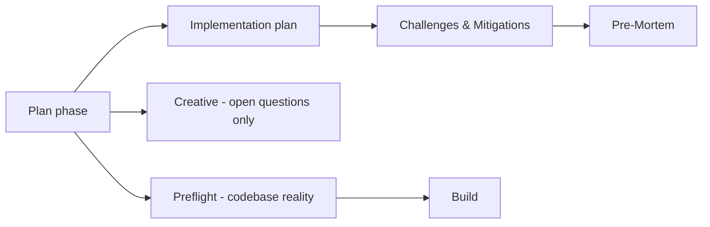

# Architecture Decision: Pre-Mortem Placement

## Requirements & Constraints

**Functional**
- Inject Klein prospective hindsight: imagine the plan has already failed; name the likely cause(s); change the plan in response
- Preserve existing Challenges & Mitigations behavior (risk register: identify + mitigate) — do not replace or dilute it
- Findings must be able to change the plan before preflight/build

**Quality attributes (ranked)**
1. Fitness — summons whole-plan failure imagination (ShadowBox step 1), not another tech risk list
2. Preserve Challenges — keep today's useful identify+mitigate register intact
3. Distinctness — agents must not conflate Pre-Mortem with Challenges or Preflight
4. Simplicity — one new step + template section; no new phase
5. Explicit ordering — numbered steps + transition text (agents do not infer order from document position)

**Technical constraints**
- Plan docs are workflows under `rulesets/niko/skills/niko/references/level*/`
- Must compose with L2 (no creative) and L3 (mid-plan creative loop)
- Preflight stays "validate against concrete" — do not host pre-mortem there
- Prompt-authoring: state order explicitly; "pre-mortem" may be used as a decompression key for the visualize-failure frame

**Scope**
- In: where pre-mortem lives relative to Challenges / creative / preflight; what each section owns
- Out: which levels get it (Q2); hard-no disposition (Q3); exact prompt wording polish

## Components

Existing risk-adjacent hooks:
- **Invariants & Constraints** — static preservation rules
- **Challenges & Mitigations** — risk register (ShadowBox identify + strategies); historically strong; almost never plan-failure framed
- **Preflight** — validate plan against repo (keep that identity)
- **Creative** — ambiguous HOW only

## Options Evaluated

- **A — Reframe Challenges as pre-mortem**: Fold the Klein key into Challenges; no new section.
- **B1 — Pre-Mortem before Challenges**: New step after Implementation Plan, before Challenges (original creative pick).
- **B2 — Pre-Mortem after Challenges**: New step after Challenges; Challenges unchanged; Pre-Mortem = visualize-failure only.
- **C — Preflight advisory sibling**: Host pre-mortem in `/niko-preflight`.
- **D — New phase / creative ritual**: Separate skill or creative-type.

## Analysis

| Criterion | A | B1 before Ch | B2 after Ch | C | D |
|-----------|---|--------------|-------------|---|---|
| Fitness (visualize failure) | Weak — register absorbs the key | Strong | Strong | Weak — wrong neighborhood | Strong / heavy |
| Preserve Challenges | Poor — rewrite risk | Good | Best — untouched intent | Good | Good |
| Distinctness | Poor | Good if worded carefully | Best — Challenges first, then step back | Poor | Clear but heavy |
| Simplicity | Highest | Medium | Medium | Medium | Lowest |
| Evidence fit | Corpus shows Challenges already good as register | Optimizes "holistic informs steps" | Matches "keep register; add missing frame" | Dilutes preflight | YAGNI |

Key insights (revised after operator pushback + corpus study):
- Challenges ≈ ShadowBox steps 2–3 (identify + mitigate). Pre-mortem's distinctive move is step 1 (visualize failure). Collapsing them (A) either no-ops or overwrites a register worth keeping.
- Preflight should stay concrete validation; "wrong cognitive mode" was overstated as phase doctrine, but hosting imagination there still dilutes a useful mechanism.
- Corpus (~70 historical Challenges): bold risk→mitigation registers; ~0 plan-failure framing. Expensive failures (SLOBAC four-pass architecture; stockroom wrong-layer router) were premise/layer mistakes Challenges did not frame.
- Document position is not order (prompt-authoring). "After Challenges" must be a numbered step with an explicit transition, not merely later in the file.
- **B2 over B1:** After Challenges preserves what's working and uses the register as context for "step back; the plan failed; why?" If a likely cause is already covered by a Challenge, say so in one line — avoid duplicate dumps.

## Decision

**Selected**: Option B2 — Dedicated Pre-Mortem step in the plan phase **after** Challenges & Mitigations

**Rationale**: Fitness + preserve Challenges. Pre-Mortem owns only prospective hindsight (plan already failed → likely cause → how the plan changes). Challenges keeps today's risk register. Preflight stays concrete. Order enforced by numbered steps and transition text.

**Tradeoff**: Slightly more ceremony than A. Accepted — the missing piece is the visualize-failure frame, not better Challenges wording. B1 rejected after evidence that Challenges should not be disturbed and that "after" better matches the desired complementarity.

## Implementation Notes

- Insert **Pre-Mortem** in L2/L3 plan workflows **after** Identify Challenges & Mitigations and **before** Technology Validation (renumber subsequent steps).
- Explicit transition in the Pre-Mortem step: e.g. "After Challenges & Mitigations are recorded, run Pre-Mortem…"
- Challenges step body: leave intent unchanged; optional one-liner that Pre-Mortem (next) handles whole-plan failure imagination — only if needed for distinctness without rewriting Challenges.
- `tasks.md` template: `## Challenges & Mitigations` then `## Pre-Mortem` (likely cause(s) + plan response; if already covered by a Challenge, note that and move on).
- Pre-Mortem must **not** re-list step/tech risks.
- Use "pre-mortem" as the decompression key for the visualize-failure frame; keep the required outputs concrete (causes + plan changes).
- Do **not** put pre-mortem in creative or preflight.
- Levels: Q2 (L2+L3). Hard-no: Q3 (decline; clarify L3 Invariants).
