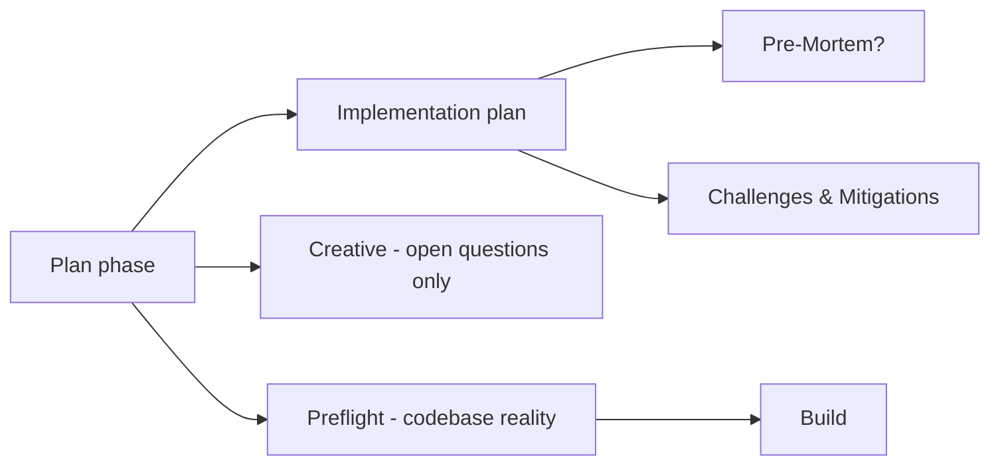

# Architecture Decision: Pre-Mortem Placement

## Requirements & Constraints

**Functional**
- Inject prospective failure imagination: "If this plan were to fail, what would be the likely cause?"
- Findings must be able to change the plan (mitigations, scope cuts, open questions) before preflight/build

**Quality attributes (ranked)**
1. Fitness — actually summons holistic failure-mode thinking (not step laundry lists)
2. Simplicity — minimal new ceremony; reuse existing plan structure where possible
3. Distinctness — agents must not confuse this with Challenges, Invariants, or Preflight
4. Reversibility — wrong placement is cheap to fix (prompt text), but wrong *phase* confuses the whole workflow

**Technical constraints**
- Plan docs are workflows under `rulesets/niko/skills/niko/references/level*/`
- Must compose with L2 (no creative) and L3 (mid-plan creative loop)
- Must not duplicate preflight's codebase-reality checks

**Scope**
- In: where pre-mortem lives relative to Challenges / creative / preflight
- Out: which levels get it (Q2); hard-no disposition (Q3); exact prompt wording polish

## Components

Existing risk-adjacent hooks:
- **Invariants & Constraints** — static preservation rules (not failure imagination)
- **Challenges & Mitigations** — per-step "what could go wrong"
- **Preflight** — does the plan match the repo?
- **Creative** — ambiguous HOW, not routine critique

## Options Evaluated

- **A — Reframe Challenges as pre-mortem**: Replace or heavily rewrite Challenges & Mitigations with pre-mortem language; no new section.
- **B — Dedicated Pre-Mortem step in plan**: New named step/section after the implementation plan exists; Challenges stays step-scoped; complementary.
- **C — Preflight advisory sibling**: Add a pre-mortem check next to Radical Innovation in `/niko-preflight`.
- **D — New phase / creative ritual**: Separate skill or creative-type invocation for plan stress-testing.

## Analysis

| Criterion | A Reframe Challenges | B Dedicated plan step | C Preflight advisory | D New phase |
|-----------|----------------------|-----------------------|----------------------|-------------|
| Fitness | Weak — step-scoped stays step-scoped; renaming won't summon holistic "plan failed because…" | Strong — named ritual + plan-level question | Weak — preflight mindset is "is this true of the repo?" | Strong ritual, but overkill |
| Simplicity | Highest — edit one section | Medium — one new step + template section | Medium — new check in busy skill | Lowest — new skill/phase wiring |
| Distinctness | Poor — conflates two different lenses | Clear — plan-level vs step-level | Poor — mixes reality-check with imagination | Clear but heavy |
| Risk if wrong | Medium — lose step-level value | Low — easy to tune wording | High — agents skip imagination under "validate against code" | High — ceremony tax forever |

Key insights:
- Klein-style pre-mortem is **top-down** (whole plan fails → why). Challenges are **bottom-up** (this step fails → how). Collapsing them (A) loses one lens.
- Preflight (C) is the wrong cognitive mode: it rewards evidence from the codebase, not speculative failure causes. Radical Innovation already occupies the "improve the plan" advisory slot with a different question.
- A new phase (D) violates YAGNI: the plan phase already owns "think before build," and L2 has no creative loop to hang a ritual on.
- Option B needs the implementation plan to exist first (you cannot pre-mortem a blank). Order: **Create Implementation Plan → Pre-Mortem → Challenges & Mitigations** (holistic findings inform step mitigations) → Technology Validation → Generate Plan Report.

## Decision

**Selected**: Option B — Dedicated Pre-Mortem step in the plan phase

**Rationale**: Fitness and distinctness dominate. A named plan-level step after the implementation plan summons the right behavior without stealing Challenges' step-scoped job or polluting preflight. Simplicity cost is one step + one `tasks.md` section — proportional to the value.

**Tradeoff**: Slightly more plan ceremony than Option A. Accepted because the issue's insight is that the *incantation* matters; burying it under Challenges is likely to produce more step laundry lists, not pre-mortems.

## Implementation Notes

- Insert a **Pre-Mortem** step in plan workflows **after** Create Implementation Plan and **before** Challenges & Mitigations (L2/L3 step renumbering as needed).
- `tasks.md` template gains a `## Pre-Mortem` section: likely failure cause(s) + how the plan changes in response (mitigation, scope cut, or new open question).
- Challenges & Mitigations remain; guidance may note they can absorb pre-mortem mitigations that are step-local.
- Do **not** put pre-mortem in creative or preflight.
- Exact level coverage deferred to Q2; wording deferred to implementation (guided by prompt-authoring: ask for likely causes and plan responses, not a "never" list).
