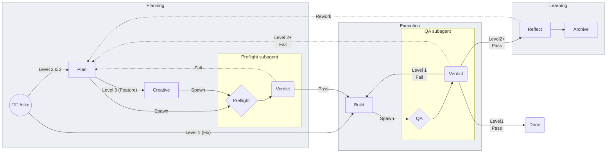
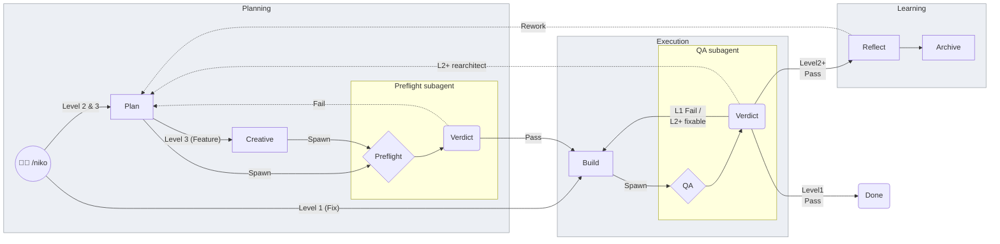
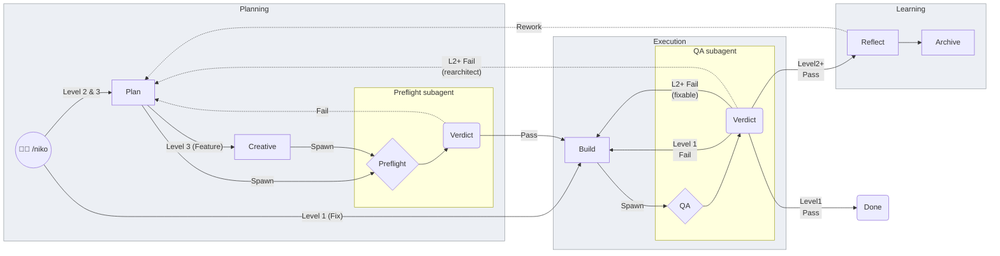

# Scratch: README long-chart QA Fail edges

**Decision (operator 2026-08-07):** Option A — by a long shot. Shipped on the live README long chart.

Exploration record below (A vs B). Not gospel for further edits.

**Goal:** L2+ fixable Fail also returns to Build (like L1). L2+ rearchitect Fail stays dashed to Plan. L1 has no Plan, so L1 Fail→Build is always true.

---

## Current (under-labeled)

L2+ Fail is drawn only as → Plan. Fixable→Build is invisible.

---

## Option A — Expand the shared Build-edge label

One solid edge Build←Verdict carries both audiences. Plan edge keeps dashed and gets an honest rearchitect label. **No new edge geometry** — only label text changes (plus Plan label rename).

---

## Option B — Second solid edge to Build

Same destinations as A, but **two parallel solid arcs** Verdict→Build (L1 vs L2+ fixable) plus dashed Verdict→Plan. Adds one edge; labels stay short and single-purpose.

---

## Rendered SVGs

Scratch SVGs were generated for side-by-side compare during the Option A/B decision and then deleted (not committed). The mermaid blocks above are the durable comparison.

---

## Opine (human visual intuition only)

This chart is an overview for humans, not a state machine for agents — per-level charts already carry the executable edges. So optimize for **glanceability**: what returns to Build vs what needs a human at Plan.

**Prefer Option A (stacked / expanded label on one Build edge).**

- The load-bearing visual signal is already solid→Build vs dashed→Plan. Adding a second solid cord between the same two nodes mostly doubles ink without doubling meaning — mermaid often draws parallel edges as near-overlapping curves, and the eye has to parse *two* labels to learn “both mean Build again.”
- One Build edge whose label names both riders (`L1 Fail / L2+ fixable`) matches how people chunk it: “broken implementation → rebuild” vs “broken plan → replan.”
- Option B wins when you want each word to be a single concept with no slash — nicer on a sparse per-level chart. On this crowded long chart, a third Fail arc is more clutter than clarity.

Caveat both options still share: L3 fixable actually lands on `/niko-build` (operator), not autonomous Build. The long chart already collapses that into the Build node; neither A nor B fixes that, and they shouldn’t try.
