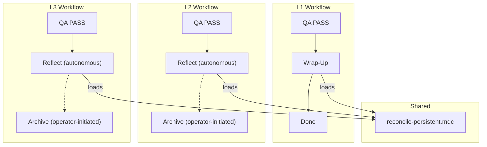

# Architecture Decision: Reconciliation Injection Point

## Requirements & Constraints

**Functional**: At the end of every code-producing workflow (L1–L3), persistent files must be checked and updated if invalidated. L4 inherits via sub-runs.

**Quality attributes** (ranked):
1. **Maintainability** — core logic lives in one place; injection points are minimal
2. **Simplicity** — quick scan-and-skip for most tasks; not a ritual
3. **Correctness** — the reconciling agent has full context of the work just done
4. **Consistency** — same behavior at every level

**Technical constraints**:
- L1 has no reflect or archive phase — just Build → QA → Wrap-Up
- L2/L3 have reflect (autonomous) → archive (operator-initiated, separate session)
- L4 capstone archive consolidates sub-runs — sub-runs already reconcile, so capstone doesn't need to
- Existing persistent file `.mdc` rules define what belongs in each file
- Non-duplicated logic may live in multiple places

**Boundaries**:
- In scope: where to inject, invocation pattern, reconciliation instructions
- Out of scope: `/niko-synthesize` (full audit), changing persistent file definitions

## Components

Key observations:
- L1's terminal autonomous step is **Wrap-Up** (in the workflow file)
- L2/L3's terminal autonomous step is **Reflect** (in the phase file)
- Archive is operator-initiated for L2/L3 — a different session with potential context loss
- The agent doing the reconciliation needs maximum context about the work just completed

## Options Evaluated

- **Option A — Reflect/Wrap-Up**: Inject into reflect (L2/L3) and wrap-up (L1). The reconciliation runs in the same autonomous session that built and reviewed the work.
- **Option B — Archive/Wrap-Up**: Inject into archive (L2/L3) and wrap-up (L1). The reconciliation runs during the finalization/cleanup session.
- **Option C — New Phase**: Add a dedicated "reconcile" phase node to each workflow graph, between reflect and archive (L2/L3) or after QA (L1).

## Analysis

| Criterion | A: Reflect/Wrap-Up | B: Archive/Wrap-Up | C: New Phase |
|---|---|---|---|
| **Maintainability** | ✅ 3 small injection points + 1 shared rule | ✅ Same structure | ❌ New workflow nodes + shared rule |
| **Simplicity** | ✅ One line added to each existing step | ⚠️ Modifies archive's "preserve persistent" semantics | ❌ New phase feels disproportionate |
| **Correctness (context)** | ✅ Agent has full context — it just did the work and reflected on it | ❌ Archive may be a different session/agent | ⚠️ Depends on placement |
| **Consistency** | ✅ All levels: "last autonomous step before done/archive" | ⚠️ L1 wrap-up is autonomous, L2/L3 archive is manual | ⚠️ L1 still has no reflect |
| **Risk** | Low — additive change to existing steps | Medium — changes archive semantics | Medium — adds workflow complexity |

Key insights:
- **Context is the decisive factor.** The agent doing reconciliation must understand what was built. The reflect phase (L2/L3) is the last autonomous step where the agent has full context. Archive may happen in a different session, potentially with a different agent that must re-read and re-understand everything.
- **L1's lack of reflect** means it must go in wrap-up regardless. All three options agree on L1.
- **Option C is over-engineered.** The issue says "quick scan and skip, not a ritual." A whole phase with its own mermaid node is disproportionate for something that silently does nothing 90% of the time.
- **Option B conflicts with archive semantics.** Archive phases explicitly say "PRESERVE the persistent memory-bank files - do NOT touch them." Option B would require changing this to "update if needed, then preserve" — muddying a clean instruction.

## Decision

**Selected**: Option A — Inject into reflect (L2/L3) and wrap-up (L1)

**Rationale**: Maximizes context (the reconciling agent is the one that just did and reflected on the work), preserves archive's clean "preserve persistent files" semantics, adds minimal complexity (one line per injection point + one shared rule), and aligns with the constraint that most tasks skip silently.

**Tradeoff**: Three injection points instead of one, but each is a single "load and execute" instruction pointing to the same shared rule — no duplicated logic.

## Implementation Notes

- **Shared rule file**: Create `rulesets/niko/niko/core/reconcile-persistent.mdc` containing all reconciliation logic. This is the single source of truth.
- **L1 injection**: Add a step to the Wrap-Up section of `level1-workflow.mdc`, before the final commit.
- **L2 injection**: Add a step to `level2-reflect.mdc`, after the reflection document is written (Step 6) but before the commit (Step 7).
- **L3 injection**: Add a step to `level3-reflect.mdc`, after the reflection document is written (Step 5) but before the commit (Step 6).
- **L4**: No changes needed — sub-runs execute L1/L2/L3 workflows which include reconciliation. The capstone archive does not reconcile (sub-runs already did).
- **Invocation**: Each injection point adds: `Load rulesets/niko/niko/core/reconcile-persistent.mdc and follow its instructions.`
