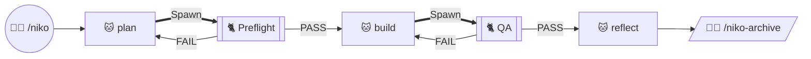

# UI/UX Decision: Subagent Visual Encoding

## User & Context

**Users:** Repo author + anyone reading Niko docs on GitHub; agents reading level-workflow charts as routing maps.

**Task:** Mark “this phase runs in a spawned verification subagent” without nested filled subgraphs that break on GitHub / mermaid.live (edges under fills, cluster-border attachments, ignored subgraph `direction` when nodes link outside).

**Context:** Live charts in `rulesets/niko/` (README + L1–L4 workflows). Spawn/Verdict *semantics* stay; visual encoding may change. Layout SoT = mermaid.live / GitHub (Cursor preview is non-authoritative).

## Design System

No UI Design System section in `techContext.md`. Diagram authority: Mermaid via `illustrate-complexity`; layout acceptance SoT for this rework = mermaid.live / GitHub. Encoding choice here becomes de facto Niko chart grammar for subagents.

## Options Evaluated

- **A — Subprocess node:** `Plan --Spawn--> Preflight[["🐱 Preflight subagent"]]` with Pass/Fail outs from that node. No nested subagent subgraph; no separate Verdict node on the chart. Subprocess double-bar shape = “subroutine / subagent.”
- **B — Flat diamond + Verdict:** Keep `{preflight} --> Verdict(...)` without a wrapping subgraph. Subagent identity only via `--Spawn-->` + reading note.
- **C — Ideology subgraphs + subprocess:** README long keeps Planning/Execution/Learning washes; Preflight/QA become subprocess nodes inside those clusters (no nested yellow subagent boxes).

## Analysis

| Criterion | A Subprocess | B Flat diamond+Verdict | C Ideology + subprocess |
|-----------|--------------|------------------------|-------------------------|
| Usability (GitHub read) | Excellent on mermaid.live (verified) | Good (no cluster fill) | Still wide/spaghetti; feedback arcs cross washes |
| Clarity (subagent chrome) | Strong — shape itself means subagent | Weak — easy to miss vs normal phase | Mixed — ideology clear, layout noisy |
| Consistency with C.2a teaching | Drops on-chart Verdict node | Keeps Verdict node | Keeps semantics; drops nested subagent box |
| Feasibility | Trivial Mermaid | Trivial | Same as A for subagents; ideology still fights dagre |
| Simplicity | Highest | Medium (extra nodes) | Lowest among survivors |

Key insights:
- Mermaid docs: subgraph `direction` ignored when any interior node links outside — nested subagent boxes were doomed once Verdict linked to Build/Plan.
- Operator’s subprocess proposal matches flowchart “subroutine” idiom and verified clean on mermaid.live for the short chart.
- Explicit Verdict node was educational for C.2a; can move to the reading note under the chart (“outbound edges from the subprocess are the parent’s”) without losing the contract.
- Ideology washes alone still produce a hard long-chart layout; they are optional polish, not load-bearing for Spawn semantics.

## Decision

**Selected**: Option A — subprocess nodes for Preflight/QA subagents; remove nested `PreflightSubagent` / `QASubagent` subgraphs everywhere.

**Rationale**: Solves the GitHub failure class at the root (no cross-boundary cluster edges for subagents), gives a scannable glyph for “subagent,” and matches the operator’s proposed encoding. Verified readable on mermaid.live (short chart).

**Tradeoff**: On-chart `Verdict` node goes away; parent-owns-outbound-edges doctrine moves to the shared reading note / legend. Acceptable — ink stays honest, prose carries the teaching.

**Long-chart fallback (implementation constraint):** Prefer Option C first (ideology washes + subprocess). If mermaid.live still shows under-fill edges or unreadable spaghetti, **flatten ideology too** (no Planning/Execution/Learning boxes) rather than reintroducing nested subagent clusters. Requirement 7 in the brief (“README long ideology”) yields to readability.

## Implementation Notes

### Operator polish (2026-08-10, post-preflight)

Locked under Option A — same structure, clearer glance/token cues:

1. **Drop the word “subagent” from the node label** — e.g. `[["🐈 Preflight"]]`, `[["🐈 QA"]]` (phase name only).
2. **🐈 on subagent subprocess nodes** — distinct from parent autonomous phases that keep 🐱.
3. **Update legends** so humans and agents both decode the triple cue: shape + emoji + Spawn edge.
4. **Thick Spawn edges** — use Mermaid heavy arrow with label: `Plan ==Spawn==> Preflight` (not thin `--Spawn-->`). Compiles on mmdc 11.14 / mermaid.live. Reinforces “this edge forks a subagent” in ink and in source tokens.

Canonical short pattern:

**Legend cues (shared idea; tailor per chart):**
- 🐱 = Phase executed autonomously (parent)
- 🐈 + `[[ ]]` = Verification subagent (subprocess node)
- `==Spawn==>` = Parent forks that subagent; do not run it in this conversation
- Solid / dashed = operator gating (unchanged)
- Reading note: outbound edges from the 🐈 subprocess are taken by the parent (former Verdict outs)

### Deferred this pass

- **Done / MergePR node shapes:** today often plain stadium/rounded rects, neither Mermaid [stop / double-circle](https://mermaid.ai/open-source/syntax/flowchart.html#stop-double-circle) nor [terminal / stadium](https://mermaid.ai/open-source/syntax/flowchart.html#event). Nice consistency fix; **out of scope unless operator expands** — newer `@{ shape: … }` forms need a GitHub-version check and aren’t required to fix the subgraph failure class.

### Still in force

- Validation: every touched chart on mermaid.live / GitHub before Build done; Cursor preview non-authoritative.
- Long-chart ideology fallback unchanged.

## Mermaid.live Evidence

- **A (short subprocess):** Clean LR flow; double-bar subagent nodes; FAIL loops readable; no under-fill. **Accept.**
- **C (long ideology + subprocess):** Compiles; still very wide with crossing feedback arcs; not yet “good enough” without possible ideology flatten. **Build validates; fallback ready.**
