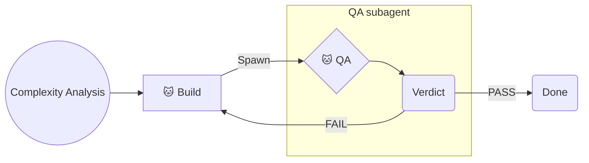
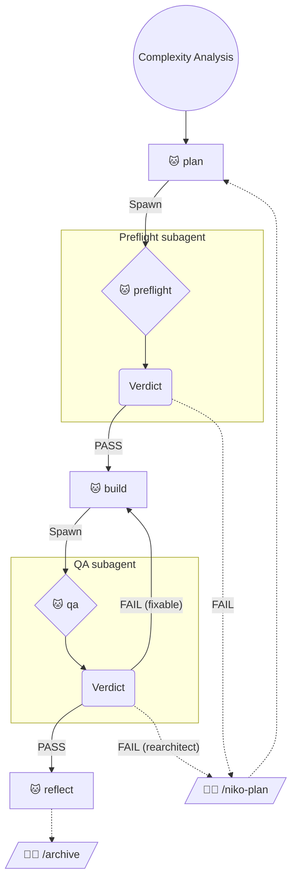
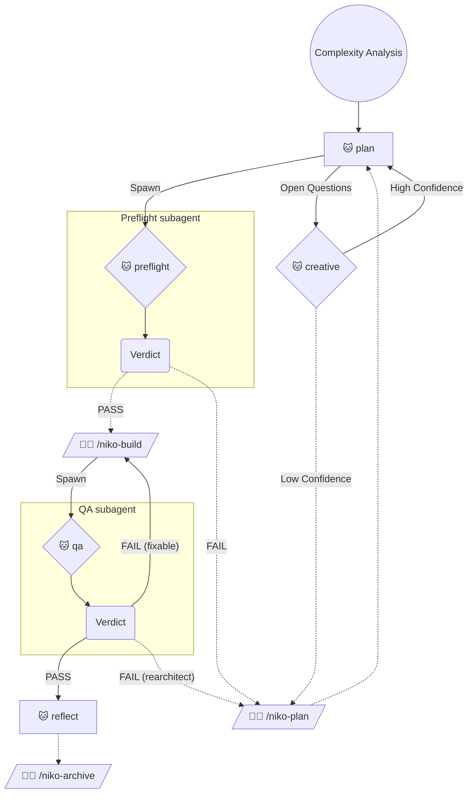
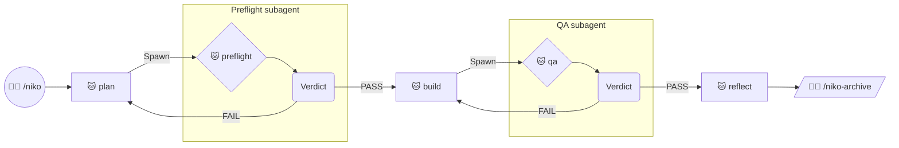
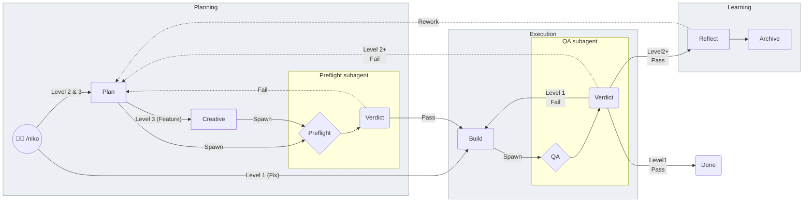
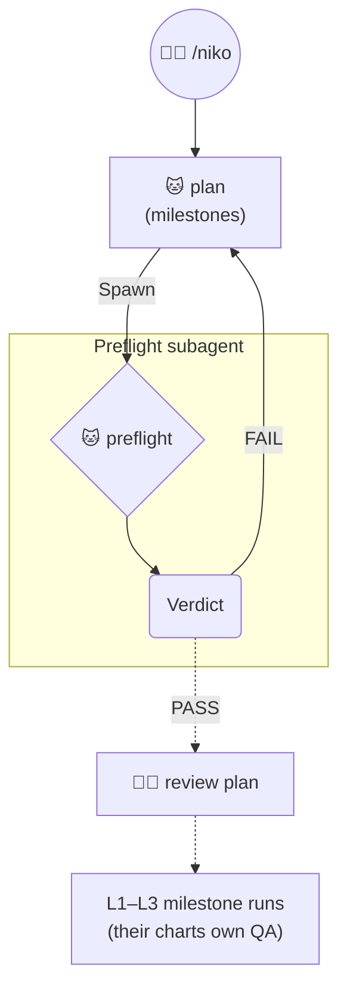

# Review Page: C.2a Spawn / Verdict Charts

**Status:** ✅ LOCKED (operator-approved 2026-08-07) — apply to `rulesets/` at build. This page is the chart source of truth for the task.  
**Grammar:** C.2a + Spawn vocabulary. Exploration trail: `creative-l1-verification-diagram.md` (historical).  
**Renderer:** Cursor markdown preview.

## Shared legend

- 🐱 = Phase executed autonomously  
- 🧑‍💻 = Phase initiated by operator with explicit command  
- Solid edge = Transition does not require operator input (parent continues)  
- Dashed edge = Transition requires operator input (STOP and wait)  
- `--Spawn-->` = Parent forks a subagent to run that phase; do not run it in this conversation  
- Subagent ends at `Verdict`; outbound edges from `Verdict` are taken by the **parent**  
- **Terminal node** = only dashed outs (e.g. Reflect → Archive)  

---

## Level 1

---

## Level 2

Parent auto-continues on solid Verdict→build / Verdict→reflect. Reflect remains a **terminal node** (only dashed out).

---

## Level 3

Same Spawn/Verdict shape as L2; preflight PASS stays **dashed** to `/niko-build` (already operator-gated today).

Both Verdict outs from preflight are dashed → preflight’s *Verdict* is terminal-shaped in the old sense, but we still call the phase a **Spawn**, not a “terminal node,” so vocabulary stays consistent with L2. The STOP list still includes Preflight PASS → Build.

---

## Level 4

L4 has no L4-scoped QA/build/reflect — only **plan preflight** before milestone runs. Sub-run verification stays inside L1–L3 charts. Beastie change is just wrapping that one preflight in Spawn/Verdict.

Milestone bodies inherit Spawn/QA from whichever L1/L2/L3 chart applies — L4 chart does not redraw them.

---

## README abridged (proposed)

Not applied to `rulesets/niko/README.md` yet — preview only.

### Short version

(Short chart stays idealized — collapses L2/L3 preflight PASS differences.)

### Long version (abridged)

Ideology subgraphs: **Planning / Execution / Learning**. Subagent boxes nest inside them. Spawn is an **edge label** only (`--Spawn-->`).

- Preflight → inside **Planning**
- QA → inside **Execution** (with Build)
- Ideology bands get a light wash (`classDef ideology`); **subagent subgraphs stay unstyled** (Mermaid default) so they read as the sharp inner boxes

Fill is a soft gray wash — custom Mermaid fills do **not** reliably flip for GitHub/Cursor dark mode; if dark preview looks wrong, tune the wash later rather than styling the subagent boxes.

**Pin — Creative as subagent?** Intuition: **no** — creative stays in parent context. Revisit later.

**Pin — Spawn emoji?** No obvious diminutive-cat emoji (🐱 is already “autonomous phase”). Could label edges `🐾` / `Spawn` later; not blocking.

### Per-level README details

Same Spawn/Verdict bodies as the level sections above; README can keep PR/Merge ornaments outside the verification subgraphs. No need to duplicate full PR machinery here — when applying, swap only the preflight/QA diamonds for the Spawn→subgraph→Verdict pattern from L1–L3 above.

### README Level 4 init slice

---

## What to look for in review

1. Does Spawn + Verdict + subgraph read clearly in Cursor preview at L2 and L3 side by side?  
2. Is L3’s double-dashed preflight Verdict acceptable next to L2’s solid PASS?  
3. Is L4’s single Spawn preflight enough, with QA only inside sub-run charts?  
4. README long version: ideology wash + nested Preflight (Planning) / QA (Execution) — do the bands read distinct from default subagent boxes in preview (light and dark)?  
5. Confirm: never list Spawn phases under “terminal nodes” / STOP lists — only Reflect-style only-dashed nodes (plus L3 preflight PASS→build as operator wait, worded as today without calling the phase “terminal”).  
