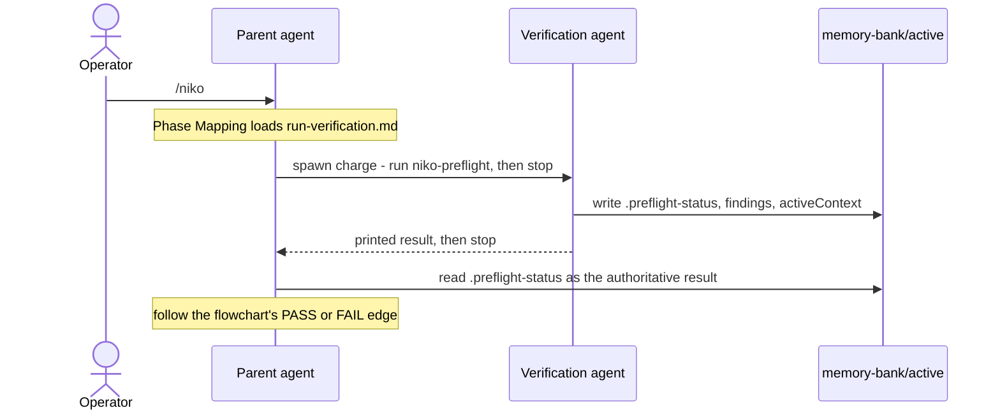

# Architecture Decision: Verification Orchestration

**Task:** verification-subagents-preflight-qa
**Scope of this document:** Q1 (placement factoring), Q2 (skill Step 4 contract), Q3 (portable spawn / model heuristic). Structure and rules only. Final prose lives in `creative-verification-wording.md`, whose blocks were written against an undecided structure; this document picks the structure and says which of those blocks land where, plus the additions they still need.

## Requirements & Constraints

Quality attributes, ranked. Architecture is tradeoffs, and the order below decides every close call in this document:

1. **Flow correctness.** No verifier ever continues into the phase it just judged, and no PASS auto-advances a manual-recovery conversation. Getting this wrong is the entire failure mode the task exists to remove; everything else is negotiable against it.
2. **Portability.** Must hold on Cursor, on Claude Code, and on a harness with no subagent facility at all. No vendor SKU, no harness tool name, no OptMem reference in `rulesets/niko/`.
3. **Dual-context validity.** `/niko-preflight` and `/niko-qa` stay correct when an operator invokes them alone in a fresh window, with no parent and no spawn prompt.
4. **Minimal surface.** Placement over volume. Canonical edits under `rulesets/niko/` only; the generated `.cursor/` and `.claude/` trees are re-synced separately.
5. **Automation continuity.** Keep the solid edges automatic where it is free to do so. Ranked last on purpose: one extra operator hop is an acceptable price for 1–3.

Technical constraints:

- Nine sites invoke verification today: six level-workflow Phase Mapping lines (L1 QA, L2 preflight, L2 QA, L3 preflight, L3 QA, L4 preflight) and three secondary call sites (`level2-build.md` and `level3-build.md` missing-preflight guards, `level4-plan.md` Step 7).
- `.preflight-status` and `.qa-validation-status` already exist and already gate Build and Reflect. They are the machine-readable channel and need no new contract.
- `/niko` resumes an in-progress task by reading the `**Phase:**` field of `activeContext.md` (`niko/SKILL.md` Step 6). Neither verification skill writes that field today.
- The level workflow mermaid diagrams are out of scope. A subagent is an implementation detail of executing a phase, not a new node.

## Components

Four participants, three of which already exist. The only new one is the verification agent, and it is deliberately given no way to affect the workflow except by writing files and returning text.

The load-bearing boundary is between the verifier and the workflow: the verifier writes a **result**, never a **transition**. Every design choice below protects that boundary from a different direction.

## Q1: Placement Factoring

### Options Evaluated

- **A — Shared reference.** One new file holding the whole parent-side procedure; every call site points at it.
- **B — Verbatim duplication.** The full fork/wait/read/resume block copied into all nine call sites, grep-verifiable in the style `systemPatterns.md` documents for the consent header.
- **C — Thin edits only.** No shared file; each call site gets a compressed one-or-two-line instruction, with the skill's unconditional stop carrying the safety.

### Analysis

| Criterion | A: shared reference | B: verbatim duplication | C: thin edits only |
| --- | --- | --- | --- |
| Fitness | Full procedure stated once, correctly | Full procedure at every site | Cannot fit spawn charge + model heuristic + fallback into a line |
| Simplicity | One new file, nine one-line pointers | Nine copies of a ~15-line block | Fewest files, but the content has nowhere to live |
| Maintainability | Single edit point | Nine-way drift, guaranteed over time | Nothing to maintain, because nothing is written down |
| Risk | Indirection may be skipped | Low per-site risk, high drift risk | Highest: under-specified parents improvise |

Key insights:

- **The tripwire pattern does not apply to the procedure, but it does apply to one sentence.** `systemPatterns.md` warns that verbatim duplication here is sometimes the mechanism, not an accident — but its examples (the consent header, the "factually wrong or materially incomplete" contract phrase) are *single sentences whose local presence is the point*. A fifteen-line orchestration procedure has no per-site semantics; nine copies would drift. The genuinely site-local requirement is the prohibition: a phase-mapping line gets read in isolation mid-workflow, and if that line does not itself forbid running the skill in the current conversation, an agent that never loads the reference will do exactly the wrong thing. So the two patterns split cleanly — **the procedure centralizes, the prohibition duplicates.**
- **Skipping the indirection degrades safely, because of Q2.** If a parent ignores the pointer and invokes the skill directly, the skill still stops after writing status, and the parent still reads the status file and continues its own edges. The cost is independence, not flow correctness. That asymmetry is what makes A's one real weakness survivable, and it is why Q2 must be decided as it is below.

### Decision

**Selected: A, with the prohibition duplicated inline at every call site.**

New shared reference at `rulesets/niko/skills/niko/references/core/run-verification.md`, joining `complexity-analysis.md`, `intent-clarification.md`, `memory-bank-init.md`, and `reconcile-persistent.md` — all core procedures already loaded by path from the level workflows. It holds: the spawn facility check, the model heuristic, the verbatim spawn charge, the wait, the authoritative read, the resume rule, and the no-spawn fallback.

Every call site becomes one line of the shape *load the reference, run the named skill, and do not run it here*. Six Phase Mapping lines match the `Load ...` shape their siblings already use; three secondary call sites keep their `🚨 ... STOP` framing and point at the same file, rather than routing back through Phase Mappings — a direct pointer works even when the build or plan document is read on its own.

**Rationale:** ranked #1 flow correctness is protected by the duplicated prohibition; #4 minimal surface is served by one new file plus nine single-line edits and no restructuring anywhere else.

**Tradeoff:** an agent that loads the reference pays one extra file read per verification phase, and a tenth call site added later can be missed. Both are cheap relative to nine-way drift.

## Q2: Skill Step 4 Contract

### Options Evaluated

- **A — Unconditional stop.** Step 4 ends the skill in every context, PASS or FAIL.
- **B — Conditional stop.** Stop when some signal indicates a parent is waiting; otherwise continue as today.
- **C — Stop, and name the next phase.** Unconditional stop, plus the skill reads the level workflow to tell the reader which phase comes next.

### Analysis

B is eliminated by requirement, not by tradeoff: any signal the skill could test is either "am I a subagent" — the child identity the brief forbids — or a proxy for it that fails in the manual-recovery case, where a PASS must not continue and there is no signal at all to distinguish it from an in-context parent run. Once B is gone, the only real question is C, and C is a trap: naming the next phase requires reading the level workflow file, which is precisely the action whose removal is the point of this task. Handing the skill a legitimate reason to open that file leaves the failure path one sentence away from re-opening.

Key insight: **the resume point is already computable by the resumer and should be left to them.** `/niko` Step 6 loads the level workflow and reads the flowchart; a parent mid-workflow already has it open. Neither needs the verifier's opinion. What both need is a durable record that this phase ran and how it came out — and today neither skill writes the `**Phase:**` field that `/niko` reads to resume. Without that, a manual-recovery PASS followed by `/niko` in a new conversation resumes at the *preflight* phase and re-verifies. Not dangerous, since the re-run goes through the same fork, but wasteful and confusing, and trivially fixed by one sentence.

### Decision

**Selected: A, plus a durable outcome record.**

`## Step 4: Phase Transition` becomes `## Step 4: End of Verification` in both skills, and says three things:

1. **Record the outcome in `memory-bank/active/activeContext.md`** — this phase complete, PASS or FAIL. This is the resume signal `/niko` reads.
2. **Stop, on PASS as much as on FAIL.** The status file and the printed report are the skill's entire output.
3. **Do not load a level workflow file, and do not choose or execute a next phase.** Resuming belongs to whoever requested the verification, or to the operator in a new conversation.

Fable's **Block A1** is the wording, with item 1 added — A1 currently tells the operator the result is recorded in the status file but leaves nothing in `activeContext.md` for `/niko` to resume from. A1 is preferred over A2 for the reason Fable gives: PASS is the only branch whose behavior changes, so PASS gets named.

Fable's four **companion micro-edits** are ratified as part of this contract. `niko-qa` Step 2.5's "Return to the Build phase" and "Return to the Plan phase", and `niko-preflight` Step 2.9's "re-run `/niko-plan`" and "Allow transition to `/niko-build`", are all the skill routing the workflow. Under this contract it reports; it does not route. The FAIL print block in Step 3 keeps its operator-facing Next Steps — that is information for a human reading a report, not the skill transitioning itself.

**Rationale:** unconditional is the only rule that is simultaneously true for a forked verifier and for an operator in a fresh window, which is exactly what "no child identity" demands. It also makes Q1's indirection fail-safe.

**Tradeoff:** the skill no longer tells a reader what comes next on PASS. Accepted — the resumer has the flowchart, and the alternative reintroduces the workflow read.

## Q3: Portable Spawn and Model Selection

### Options Evaluated

- **A — Capability ladder with a terminal rung.** State the preference order as principles, with an explicit, always-satisfiable last rung.
- **B — Harness-conditional instructions.** Name the known spawn facilities and their model arguments.
- **C — Vague delegation.** "Run this in a separate agent with a good model."

### Analysis

B fails portability outright and rots as harnesses change. C fails in the specific way this task is trying to prevent: an under-specified parent stays in-process, or accepts whatever model the harness volunteers. A works only if every rung is answerable by an agent that may not know its own model name or the menu it can draw from — which is the real design problem here, not the preference order.

Two constraints emerged that the preference order alone does not cover:

- **The verifier must share this working tree.** The entire handoff is files under `memory-bank/active/`. A harness that can only run isolated or worktree-separated agents cannot satisfy this contract, and must be treated as having no spawn facility rather than as a working fork whose status file silently never appears.
- **A harness may refuse a deliberate model choice.** Some agent-spawn facilities default to inheriting the current model unless the operator explicitly asked for another. Under Niko, the operator's invocation of the workflow *is* that ask — the consent-by-invocation principle this repo already relies on. Saying so is what turns the heuristic from advice into an authorization the harness will honor.

Key insight: **the fallback is not a degradation of independence, only of automation.** A fresh operator conversation running `/niko-preflight` has its own context and its own model selection — the two things the fork was for. That is what makes "stop and hand it to the operator" clearly correct over "verify in-process as a last resort," and it is why requirement #5 could be ranked last without cost.

### Decision

**Selected: A, with a shared-tree precondition and a consent clause.**

The reference states, in this order:

1. **Spawn facility.** Use the harness's facility for starting a subordinate agent that shares this working tree and returns its output. If there is none, it cannot share the tree, or the spawn fails, take the fallback — do not verify in this conversation.
2. **Model, by capability and never by name.** Never less capable than the model running this conversation. Among candidates clearing that bar, prefer the more capable; where capability is comparable, prefer a different family, because a second perspective is part of the verification. If the menu or your own identity is unknown, spawn with the default and say so in the report — separate context still counts.
3. **Consent clause.** The operator's invocation of this workflow is their request for verification to run on a deliberately chosen model. Where the harness defaults to inheriting the current model unless the operator asked otherwise, this instruction is that ask.
4. **The spawn charge, quoted verbatim** so every parent issues the same one: invoke the named skill and follow it to its end; report the printed result and stop; run no other skill, phase, or workflow step; make no commits; and if an operator decision is needed, record it as a finding rather than asking, because no one is watching for a question.
5. **Read the status file, not the returned prose.** Some harnesses summarize a subagent's output on the way back. A missing, unreadable, or outcome-less status file means verification did not happen — take the fallback rather than substituting your own judgment.
6. **Fallback.** Print that no verification agent could be started, tell the operator to run the skill in a new conversation and then resume with `/niko` in another, and stop.

Fable's **Block C1** is the wording for item 2 and **Block B1**'s blockquoted charge for item 4; items 1, 3, 5, and the shared-tree precondition are additions this document introduces and Fable has not yet drafted.

**Rationale:** every rung is answerable without introspection the agent may not have, and the last rung always terminates. Portability (#2) is bought with principles rather than a harness matrix.

**Tradeoff:** on a harness with a single model family, or none exposed, the fork gets fresh context and nothing more. Accepted — that is the larger half of the value.

### L1 QA Runs the Same Way

Level 1 prioritizes speed and skips preflight entirely, so routing its QA through a forked verifier is a real cost on the cheapest tasks. It is still correct: L1's QA is the *only* gate the level has, and the agent that would grade it is the one that just wrote the fix — the rubber-stamp risk is at its maximum there, not its minimum. Uniform treatment also keeps six identical phase-mapping lines instead of five and an exception. Reversible in one line if the operator finds the latency not worth it.

## Choice Pre-Mortem

If we shipped these decisions and they turned out wrong, the likely reasons:

- **Q1 — parents skip the indirection and invoke the skill directly.** *Checked.* Degrades to in-context verification that still stops and still reports; the parent reads the status file and continues correctly. Independence is lost, flow is not. The duplicated prohibition on each call site is the primary guard, this is the backstop.
- **Q1 — a tenth call site is added later without the pointer.** *Checked, partially.* Same graceful degradation as above. Both the pointer and the prohibition are fixed-shape strings, so `rg` finds conforming and non-conforming sites alike. No further mitigation proposed; a silent runaway is not among the outcomes.
- **Q1 — DRY was wrong because duplication was the mechanism.** *Checked.* Tested against the two documented tripwire cases in `systemPatterns.md`; both are single sentences with per-file semantics. The split adopted here keeps that property for the one sentence that has it.
- **Q2 — unconditional stop strands the solid edges.** *Checked.* The parent, not the skill, has carried those edges since Q1's decision; the parent is still running and still holds the flowchart. Only the no-spawn fallback costs an operator hop.
- **Q2 — the stop leaves no resume signal.** *Was unchecked; now addressed* by the `activeContext.md` record. Verify at build against `niko/SKILL.md` Step 6, which reads the `**Phase:**` field.
- **Q3 — the harness refuses a non-default model.** *Checked by design, unverified in practice.* The consent clause is the intended unblock and the default-model rung is the floor, so the worst case is a fresh-context fork on the same model. Worth a dry run in this repo during build, but it cannot block: no branch of the heuristic fails closed.
- **Q3 — the verifier cannot see the working tree.** *Checked.* Covered twice: the shared-tree precondition at spawn, and the missing-status-file rule after.

No unchecked premise remains. High confidence on all three.

## Implementation Notes

### Edit inventory

One new file, eleven edits, nothing else:

| Site | Change |
| --- | --- |
| `references/core/run-verification.md` | **New.** The six-item parent-side contract from Q3, structured as spawn → charge → wait → read → resume → fallback |
| `level1-workflow.md` QA line | Pointer + prohibition |
| `level2-workflow.md` preflight and QA lines | Pointer + prohibition |
| `level3-workflow.md` preflight and QA lines | Pointer + prohibition |
| `level4-workflow.md` preflight line | Pointer + prohibition |
| `level2-build.md` missing-preflight guard | Replace "invoke the skill and proceed as instructed there" with pointer + re-check status |
| `level3-build.md` missing-preflight guard | Same |
| `level4-plan.md` Step 7 | Same |
| `niko-preflight/SKILL.md` | Step 4 rewrite + two Step 2.9 micro-edits |
| `niko-qa/SKILL.md` | Step 4 rewrite + two Step 2.5 micro-edits |

`rulesets/niko/README.md` needs no change: its tables describe the status files as gates, which stays true, and its diagrams are logical flow. Confirm during build that no README sentence claims the verification phase continues in the same conversation.

### Skeletal draft of the reference

Structure and content, not final prose — Fable polishes, and Blocks B1 and C1 supply the sentences already drafted.

~~~markdown
# Running a Verification Phase

Preflight and QA judge work that has already been done, and judgment is worth less when the judge is the author. Run them in a separate agent with its own context. You are the orchestrator: you consume the result, and the transition is yours.

## Step 1: Start the Verifier

Use your harness's facility for starting a subordinate agent that shares this working tree and returns its output to you. If it has none, the agent cannot be given this working tree, or the spawn fails, go to Fallback — do not run the verification here.

[Block C1: model by capability, not by name.]

The operator's invocation of this workflow is their request for verification to run on a deliberately chosen model. Where your harness defaults to inheriting the current model unless the operator asked otherwise, treat this instruction as that ask.

Give the verifier exactly this charge, and nothing that prejudges the outcome:

[Block B1 blockquoted charge, plus: if you need an operator decision, record it as a finding rather than asking - no one is watching for a question.]

Substitute `niko-qa` and `.qa-validation-status` when the phase is QA.

## Step 2: Wait, Then Read the Result

Wait for the verifier to finish. The authoritative result is `memory-bank/active/.preflight-status`, not the prose that came back — some harnesses summarize a subagent's output in transit. Read the findings too; the status file carries the outcome, the report carries the reasoning.

If the status file is missing, unreadable, or names no outcome, verification did not happen. Do not substitute your own judgment: go to Fallback.

## Step 3: Resume the Workflow

Take the outcome to your level workflow's flowchart and follow the edge it names, exactly as you would have if you had run the verification yourself. A dashed edge still means stop and wait for the operator. The transition is yours; the verifier never makes it.

## Fallback: No Verifier Available

Do not run the verification yourself — that is the self-grading this phase exists to prevent. Print this and stop:

> Could not start a verification agent. Open a new conversation and run `/niko-preflight`. When it reports, open another new conversation and run `/niko` to resume this workflow.

A fresh operator conversation buys the same independence a subagent would; only the automation is lost.
~~~

### Dry-read walkthroughs for build verification

Five paths, each traced end to end against the edited files:

1. **L2 parent, preflight PASS.** Phase Mapping loads the reference, forks, waits, reads `PASS`, follows the solid edge into Build. No operator hop.
2. **L3 parent, preflight PASS.** Same up to the read; the edge is dashed, so the parent stops and waits for `/niko-build`.
3. **Manual recovery, PASS.** Operator runs `/niko-preflight` alone. Skill writes status, records the outcome in `activeContext.md`, prints, stops. Nothing continues. A later `/niko` resumes from the recorded phase.
4. **Forked verifier tries to continue.** Blocked twice: the spawn charge forbids it, and Step 4 forbids it. Confirm neither skill retains a path that opens a level workflow file.
5. **No spawn facility.** Parent takes the fallback, prints, stops. Confirm the printed instruction names both hops — verify in one new conversation, resume in another.
