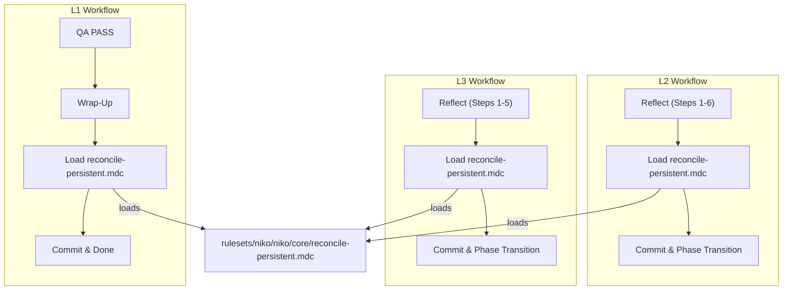

# Task: Persistent File Reconciliation at Workflow End

* Task ID: issue-57-persistent-file-reconciliation
* Complexity: Level 3
* Type: feature

Add a reconciliation step at the end of every code-producing Niko workflow (L1–L3) that checks persistent memory bank files against completed work and surgically updates them if invalidated.

## Pinned Info

### Injection Point Architecture

Where the reconciliation step is invoked from each workflow level:

## Component Analysis

### Affected Components
- **`rulesets/niko/niko/core/`** (shared core rules): New file `reconcile-persistent.mdc` — the single source of truth for reconciliation logic.
- **`rulesets/niko/niko/level1/level1-workflow.mdc`** (L1 workflow): Add reconciliation load to Wrap-Up section, before the final commit.
- **`rulesets/niko/niko/level2/level2-reflect.mdc`** (L2 reflect phase): Add reconciliation step after reflection document is written, before the commit.
- **`rulesets/niko/niko/level3/level3-reflect.mdc`** (L3 reflect phase): Add reconciliation step after reflection document is written, before the commit.

### Cross-Module Dependencies
- `level1-workflow.mdc` → `reconcile-persistent.mdc`: loads as a sub-step during wrap-up
- `level2-reflect.mdc` → `reconcile-persistent.mdc`: loads as a sub-step during reflect
- `level3-reflect.mdc` → `reconcile-persistent.mdc`: loads as a sub-step during reflect
- `reconcile-persistent.mdc` → persistent file `.mdc` rules: references their guidance for how to write updates

### Boundary Changes
- None. No public interfaces change. The workflow flowcharts gain no new nodes — reconciliation is a sub-step within existing steps.

## Open Questions

- [x] Where should the reconciliation step be injected in each workflow? → Resolved: Reflect phases (L2/L3) and Wrap-Up (L1). See `memory-bank/active/creative/creative-reconciliation-injection-point.md`

## Test Plan (TDD)

### Behaviors to Verify

- **Reconciliation rule is well-formed**: File follows `.mdc` conventions (YAML frontmatter, clear structure)
- **L1 injection**: `level1-workflow.mdc` Wrap-Up section loads `reconcile-persistent.mdc` before final commit
- **L2 injection**: `level2-reflect.mdc` loads `reconcile-persistent.mdc` after reflection document, before commit
- **L3 injection**: `level3-reflect.mdc` loads `reconcile-persistent.mdc` after reflection document, before commit
- **L4 unaffected**: No changes to L4 files; sub-runs inherit reconciliation from their own level
- **Reconciliation logic is selective**: Instructions mandate "skip silently" when nothing changed; surgical update only when invalidated
- **Reconciliation references existing guidance**: Instructions point to each persistent file's `.mdc` rule, not redefine content expectations

### Test Infrastructure

- **Framework**: None — this is a pure rule/documentation project with no automated tests
- **Validation approach**: Manual review of file structure, cross-referencing with existing conventions, and end-to-end workflow read-through
- **New test files**: None

## Implementation Plan

1. **Create shared reconciliation rule**
    - Files: `rulesets/niko/niko/core/reconcile-persistent.mdc`
    - Changes: New file with YAML frontmatter (`alwaysApply: false`), reconciliation instructions covering what to check, how to check, and guardrails
    - Creative ref: Decision from `creative-reconciliation-injection-point.md`

2. **Inject into L1 Wrap-Up**
    - Files: `rulesets/niko/niko/level1/level1-workflow.mdc`
    - Changes: Add a reconciliation step to the Wrap-Up section, before the existing step 1 (commit). Renumber existing steps.

3. **Inject into L2 Reflect**
    - Files: `rulesets/niko/niko/level2/level2-reflect.mdc`
    - Changes: Add a new step between current Step 6 (Write Reflection Document) and Step 7 (Update Memory Bank). Renumber subsequent steps.

4. **Inject into L3 Reflect**
    - Files: `rulesets/niko/niko/level3/level3-reflect.mdc`
    - Changes: Add a new step between current Step 5 (Write Reflection Document) and Step 6 (Update Memory Bank). Renumber subsequent steps.

5. **Verify L4 is unaffected**
    - Files: `rulesets/niko/niko/level4/level4-archive.mdc`, `rulesets/niko/niko/level4/level4-workflow.mdc`
    - Changes: None — read-only verification that no modifications are needed.

6. **Update documentation**
    - Files: `memory-bank/systemPatterns.md`
    - Changes: This is self-referential — the reconciliation step itself will handle this during its first real execution. No preemptive update needed for the systemPatterns file as part of this implementation.

## Technology Validation

No new technology — validation not required. All deliverables are `.mdc` markdown files following existing project conventions.

## Challenges & Mitigations

- **Step numbering drift**: Inserting a step into reflect phases requires renumbering all subsequent steps. Mitigation: careful re-read after edit to verify step references remain consistent.
- **Over-prescriptive reconciliation instructions**: Too-detailed instructions could turn a "quick scan" into a "ritual rewrite." Mitigation: keep the reconciliation rule brief and emphasize the "skip silently" default.
- **ai-rizz sync**: Canonical edits in `rulesets/` need to be synced to `.cursor/rules/` by the ai-rizz tool. Mitigation: note this in the output to the operator.

## Status

- [x] Component analysis complete
- [x] Open questions resolved
- [x] Test planning complete (TDD)
- [x] Implementation plan complete
- [x] Technology validation complete
- [x] Preflight
- [x] Build
- [ ] QA
