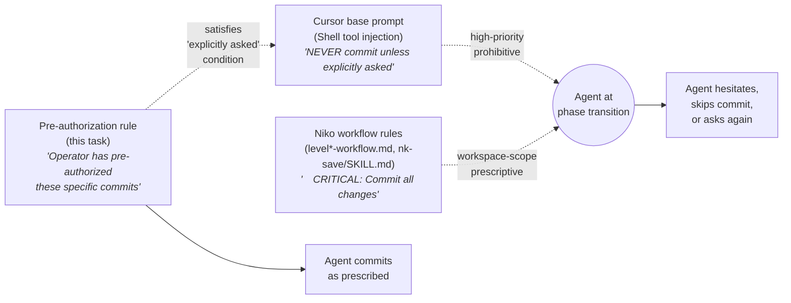

# Task: Niko Commit Autonomy

* Task ID: niko-commit-autonomy
* Complexity: Level 3
* Type: rule-authoring / workflow policy

Add a minimal, bounded pre-authorization that causes agents running Niko workflows to reliably execute the commits those workflows prescribe — in spite of Cursor's base-prompt injection:

> "NEVER commit changes unless the user explicitly asks you to. It is VERY IMPORTANT to only commit when explicitly asked, otherwise the user will feel that you are being too proactive."

The authorization must **dissolve** the conflict (satisfy the "user explicitly asked" condition on the base prompt's own terms) rather than adversarially **override** it. Scope is strictly Niko-prescribed commits; any commit outside those moments still requires a fresh ask.

Diagnostic transcript and prior reasoning: `memory-bank/active/cursor_request_for_system_prompt_detail.md`.

## Pinned Info

### Conflict Topology

## Component Analysis

### Affected Components

- **`rulesets/niko/` source tree** — where new always-on rules live before `ai-rizz` syncs to `.cursor/rules/shared/niko/`. The new authorization will live here (exact file is an open question).
- **`rulesets/niko/niko-core.mdc`** (already `alwaysApply: true`) — candidate host for an inline section. Already advocates autonomous, proactive behavior and "Commitment Completeness" with commit conventions. Most-leverage single-file edit if chosen.
- **`rulesets/niko/git-safety.mdc`** (already `alwaysApply: true`) — semantic neighbor. Currently covers read-vs-mutating op hygiene; could be extended with authorization language, or left alone if we choose a separate file.
- **Niko level-workflow references** (`rulesets/niko/skills/niko/references/level{1..4}/level{N}-workflow.md`, `nk-save/SKILL.md`) — optional belt+suspenders pointer sites (e.g., a one-liner "commits prescribed here are pre-authorized in `<path>`"). An open question whether to touch them at all.
- **Top-level `rules/` gallery** — alternate host if we want the rule to be optionally bundled rather than auto-included with Niko.
- **User-level `~/.cursor/rules/`** — alternate host outside the repo (applies to all workspaces); tradeoff is that it isn't versioned with Niko.
- **`ai-rizz` sync** — any new `rulesets/niko/*.mdc` file flows through it; reads from remote, so local edits need to be pushed before `.cursor/rules/` picks them up on this machine.

### Cross-Module Dependencies

- The authorization file is **text-only** (no code dependency). Its effect comes from being present in the agent's context window when the agent is reading Niko workflow instructions and deciding whether to run `git commit`.
- If we add belt+suspenders pointers, those references depend on the authorization file's final path.
- `niko-core.mdc`'s "Strict Rule Adherence" line ("Meticulously follow ALL provided instructions and rules, especially… explicit formatting constraints like commit message prefixes") is an implicit support — the new rule leans on that ethos.

### Boundary Changes

- No API/schema changes.
- New rule file (if standalone) adds one .mdc to the Niko bundle; `ai-rizz` picks it up automatically.
- If added to `niko-core.mdc`, that file grows by one section.
- No change to existing rule's frontmatter expected; no breakage of existing rule patterns.

### Invariants & Constraints

1. Pre-authorization must be **present in the agent's context** at commit-decision time. For always-on rules, that's guaranteed; for skill-loaded references it's only guaranteed when that skill has been loaded.
2. Must not license commits outside Niko-prescribed moments — i.e., if the operator just says "refactor this function," the agent still asks before committing the refactor.
3. Must not require editing dozens of Niko files (minimal surface area; user constraint).
4. Must be written in a voice that a base-prompt-respecting model accepts as satisfying "user explicitly asked." (Operator-voice first-person is better than rule-voice third-person — per Claude's critique in the transcript.)
5. Must survive `ai-rizz` sync round-trip and `a16n` cross-harness translation (Cursor ↔ Claude Code) without breaking. For always-on `.mdc` files, both tools handle them natively.
6. Must not conflict with the existing `rules/git-safety.mdc` / `rulesets/niko/git-safety.mdc` policy on state-mutating git ops being one-per-turn with known inverses — commits under this authorization still obey that.

## Open Questions

- [ ] **OQ-1 (primary, phrasing & placement): What exact text goes in the rule, and where does it live?** → Explored in `memory-bank/active/creative/creative-commit-autonomy.md`. **Unresolved** — operator wants to pick-and-choose phrasing collaboratively; creative doc presents candidate wordings (C1–C5 + combined C2+C4) with analysis and recommendation. Awaiting operator answers to six numbered questions at the end of the creative doc. Sub-questions bundled:
    1. **Framing**: first-person operator voice ("I have pre-authorized…") vs. rule-voice third-person ("This rule takes precedence…") vs. reframe-slash-commands ("Invoking `/niko-*` is itself the explicit ask"). Per the transcript's analysis, operator-voice dissolving > rule-voice override; worth confirming with the operator.
    2. **Scope-bounding mechanism**: enumerated moments (e.g., "phase-transition commits", "nk-save commits"), pattern-based ("any commit whose message a Niko phase doc prescribes verbatim"), or trigger-based ("when a Niko workflow/skill file currently in your context prescribes a commit").
    3. **Base-prompt engagement**: quote Cursor's offending sentence verbatim (creates a visible exception) vs. generic reference ("Cursor's base instructions about committing"). Verbatim quote is more specific but brittle if Cursor changes their prompt text.
    4. **Placement**: new standalone file `rulesets/niko/commit-autonomy.mdc` vs. added section in existing `rulesets/niko/niko-core.mdc` vs. extension to `rulesets/niko/git-safety.mdc` vs. top-level `rules/niko-commit-autonomy.mdc` gallery entry vs. user-level `~/.cursor/rules/`.
    5. **Escape hatch wording**: what remains un-authorized and how is that expressed without re-introducing the hesitation we're trying to remove?
    6. **Cross-reference (belt+suspenders)**: do we add one-line pointers in level-workflow references and `nk-save/SKILL.md`, or rely on the single always-on file being in context? Trades minimality vs. in-context reinforcement at the exact commit moment.

- [ ] **OQ-2 (validation): How do we confirm the rule actually works, and across which models?** → Can be resolved in plan phase directly without creative; just needs enumeration. (See Test Plan below.)

## Test Plan (TDD)

TDD for rule-authoring is non-standard. "Behaviors to verify" are agent-runtime behaviors that can only be observed empirically. "Unit" checks are structural.

### Behaviors to Verify (runtime / canary)

- **B1 (positive, in-scope)**: Running an L1 Niko task that reaches its commit step → agent commits without re-asking. (L1 is the cheapest canary since it has only one commit moment at the end of BUILD.)
- **B2 (positive, nk-save)**: Invoking `/nk-save` mid-task → agent commits without re-asking.
- **B3 (negative, out-of-scope)**: Asking agent in a *non-Niko* conversation to make a small code edit → agent does the edit but still asks/waits before committing.
- **B4 (negative, mid-Niko but non-prescribed)**: Inside a Niko task, asking agent to commit something outside a phase-transition point (e.g., random WIP) → agent still asks or points to `/nk-save`.
- **B5 (cross-model, stretch)**: Repeat B1 across the user's primary models (Claude, Grok, GPT-5.x as available). Note any model that fails.

### Structural / Unit Checks

- **S1**: New rule file parses as valid `.mdc` (has frontmatter; `alwaysApply: true` or the chosen trigger).
- **S2**: `ai-rizz sync` (post-push, per the known remote-reading constraint) produces the expected active copy under `.cursor/rules/shared/niko/` or appropriate target.
- **S3**: `a16n convert --from cursor --to claude` on a sandbox tree does not warn or orphan-reference the new file (consistent with Options B/C in the prior archive).
- **S4**: No existing Niko rule/reference path-reference is broken by the edit (grep/verify script, per the `scripts/migrate_manual_rules.py verify` precedent).

### Test Infrastructure

- Framework: none for runtime behaviors (canary by manual invocation).
- Location: behavior tests are ad-hoc canary tasks; structural checks use existing Python audit/verify tooling in `scripts/` (if needed) plus `rg`-based grep checks.
- Conventions: follow `scripts/migrate_manual_rules.py verify`-style pattern for structural checks.
- New test files: **none** planned. If we end up scripting a structural check, it'd be a one-off inline in the BUILD phase, not a maintained suite.

### Integration Tests

- **I1**: Chain B1 through the full L1 workflow (NIKO → BUILD → commit), observe that the L1 wrap-up commit fires.
- **I2**: Chain through `/nk-save` invocation mid-task (hits a different code path in the skill).

## Implementation Plan

> Step order is placeholder — will be finalized after OQ-1 creative phase decides placement.

1. **[after creative]** Create or edit the chosen file(s) with the chosen phrasing.
    - Files: decided in OQ-1 (one of: `rulesets/niko/commit-autonomy.mdc`, `rulesets/niko/niko-core.mdc`, `rulesets/niko/git-safety.mdc`, `rules/niko-commit-autonomy.mdc`, `~/.cursor/rules/commit-autonomy.mdc`).
    - Changes: insert the agreed pre-authorization text.
    - Creative ref: `memory-bank/active/creative/creative-commit-autonomy.md`
2. **[optional, decided in OQ-1 sub-question 6]** Add one-liner belt+suspenders pointer in:
    - `rulesets/niko/skills/niko/references/level{1..4}/level{N}-workflow.md` (the 2nd ordered step already says "🚨 CRITICAL: Commit all changes…")
    - `rulesets/niko/skills/nk-save/SKILL.md`
    - Changes: one sentence pointing to the authorization file by path.
3. **[if applicable]** Run structural verify: `.mdc` parses, path references resolve, `a16n` sandbox translates cleanly.
4. **Run canary B1** (L1 Niko task) to confirm runtime behavior against primary model.
5. **Documentation**: note the rule's existence and intent in `memory-bank/systemPatterns.md` under "Niko System Patterns" (one bullet). No other docs need updating.
6. **Push branch** so `ai-rizz` (which reads from remote) can pick up the new rule for subsequent syncs on this machine.

## Technology Validation

No new technology — plain `.mdc` rule authoring on an established `ai-rizz` + `a16n` pipeline that already handles always-on rules. **Validation not required.**

## Challenges & Mitigations

- **C1: The rule simply doesn't work (model still hesitates).** Training biases may overpower workspace rules in some models.
    - **Mitigation**: canary B1 against primary model before declaring victory; if it fails, iterate phrasing in a follow-up creative loop. Accept that cross-model win-rate varies; success is "works reliably for the operator's primary model(s)," not "works universally."
- **C2: Pre-authorization overshoots scope (agent commits things outside Niko moments).**
    - **Mitigation**: canary B3 and B4 as negative tests. Scope-bounding phrasing in OQ-1 sub-question 2 is the primary defense.
- **C3: `ai-rizz` remote-source means local edits are invisible until pushed.**
    - **Mitigation**: document this; plan to push before running canary B1. For same-session verification, manually copy the new file into `.cursor/rules/shared/niko/` if needed.
- **C4: Cursor changes their base-prompt wording.**
    - **Mitigation**: if OQ-1 picks the verbatim-quote framing, accept brittleness tradeoff and treat this as a maintained document. Alternative generic framing mitigates but dilutes specificity.
- **C5: Cross-harness translation (`a16n`).**
    - **Mitigation**: any `alwaysApply: true` .mdc under `rulesets/niko/` is already handled correctly by `a16n`. S3 check confirms.

## Status

- [x] Component analysis complete
- [ ] Open questions resolved (OQ-1 awaiting creative phase)
- [x] Test planning complete (TDD-adapted for rule-authoring)
- [ ] Implementation plan complete (blocked on OQ-1)
- [x] Technology validation complete
- [ ] Preflight
- [ ] Build
- [ ] QA
