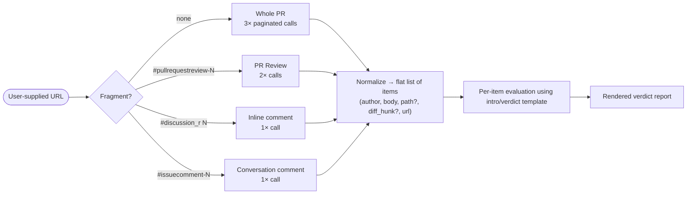

# Task: PR Feedback Judge Command

* Task ID: pr-feedback-judge
* Complexity: Level 3
* Type: feature (new ruleset + command)

Build a Cursor command, packaged as the new `pr-feedback-judge` ruleset, that takes one or more GitHub PR-feedback URLs (whole PR, PR review, or single comment in any combination) and renders per-item "valid or invalid" verdicts using a formalized questioning/evaluation intro. The ruleset composes the existing `script-it-instead` rules so the batch-fetch guidance comes along automatically without duplicating content for consumers who already include them.

## Pinned Info

### URL Shape → GitHub API Endpoint

The command's dispatch logic depends entirely on classifying input URLs. This table is the contract.

| URL fragment | Shape | gh API call | Yields |
|---|---|---|---|
| (none) — `…/pull/N` | Whole PR | `pulls/N/comments --paginate` + `issues/N/comments --paginate` + `pulls/N/reviews --paginate` | Every inline review comment, every conversation comment, every review body |
| `#pullrequestreview-<rid>` | PR review | `pulls/N/reviews/<rid>` + `pulls/N/reviews/<rid>/comments --paginate` | Review body + every inline comment in that review |
| `#discussion_r<cid>` | Inline review comment | `pulls/comments/<cid>` | Single inline comment (incl. `diff_hunk`, `path`, `in_reply_to_id`) |
| `#issuecomment-<cid>` | Conversation comment | `issues/comments/<cid>` | Single conversation comment |

## Component Analysis

### Affected Components

- **`rules/pr-feedback-judge.md`** (NEW): canonical command body. Lives top-level in `rules/` matching the `wiggum-niko-coderabbit-pr.md` convention. Contains: the questioning/evaluation intro template (TBD by creative), URL-classification rubric (above), the gh-CLI fetch recipe, the per-item verdict format, and the orchestration prose that tells the agent how to chain them.
- **`rulesets/pr-feedback-judge/`** (NEW directory): ruleset bundle. Contents:
  - `commands/pr-feedback-judge.md` → symlink to `../../../rules/pr-feedback-judge.md`
  - `script-it-instead.mdc` → symlink to `../../rules/script-it-instead.mdc`
  - `how-to-script-it-instead.mdc` → symlink to `../../rules/how-to-script-it-instead.mdc`
  - `README.md` (NEW): standard ruleset README in the style of `rulesets/shell/README.md`.

### Cross-Module Dependencies

- `rulesets/pr-feedback-judge/` → `rules/pr-feedback-judge.md`, `rules/script-it-instead.mdc`, `rules/how-to-script-it-instead.mdc` (all via symlink)
- The command body itself depends at runtime on: `gh` CLI (auth assumed), `jq`, and the always-on `script-it-instead` rule that the same ruleset injects.

### Boundary Changes

- **New public surface**: `/pr-feedback-judge <url>...` slash command becomes available to anyone who installs the ruleset via `ai-rizz add ruleset pr-feedback-judge`.
- No existing ruleset, rule, or skill changes shape. `script-it-instead` and `how-to-script-it-instead` are referenced (via symlink), not modified.

### Invariants & Constraints

1. **Canonical-source rule**: the command body MUST be edited only at `rules/pr-feedback-judge.md` (per `agent-customization-locations.mdc`). Any `.cursor/` or `.claude/` copies are downstream of `ai-rizz` / `a16n` sync.
2. **Composition without duplication**: `script-it-instead.mdc` and `how-to-script-it-instead.mdc` MUST be referenced via symlink, not copied. ai-rizz dedupes by file path, so a user who has both `script-it` and `pr-feedback-judge` rulesets installed sees each rule exactly once.
3. **No runtime persistence**: the command renders verdicts to chat and does not write to the memory bank. (Persistence concerns are explicitly out of scope per the brief.)
4. **No Niko coupling**: the command MUST work both inside and outside a live Niko conversation. Memory-bank-context loading is `/nk-chat`'s job (issue #63, separate thread).
5. **Batch-fetch discipline**: per `script-it-instead`, N input URLs MUST NOT produce N+ tool calls for the fetch step — pagination per URL is unavoidable, but per-comment lookups must be batched.

## Open Questions

- [x] **Q1 — Questioning intro & per-item verdict template.** → **Resolved**: scaffolded intro (names three criteria — technical accuracy, scope alignment, severity) + hybrid verdict (triage table for all items, detailed blocks for valid-only, summary tail). Templates fully drafted. See `memory-bank/active/creative/creative-pr-feedback-judge-template.md`.

(GitHub access strategy and URL parsing/dispatch were flagged as open in the projectbrief but collapsed during plan-phase research: `gh` CLI is installed/authenticated/clean and the URL→endpoint mapping is unambiguous. Recorded in the Pinned Info table above.)

## Test Plan (TDD)

### Behaviors to Verify

This is a documentation/rule repo with no automated test framework (confirmed: no `tests/`, `test/`, `package.json`, or `Makefile`). "Tests" are inspection-grade validations. Each behavior maps to one mechanical check.

**Packaging**

- B1: `rulesets/pr-feedback-judge/` exists and is a directory.
- B2: `ai-rizz list` shows `pr-feedback-judge` under "Available rulesets" (after push to remote — ai-rizz reads remote per `techContext.md`).
- B3: `ai-rizz list` shows `/pr-feedback-judge` under "Available commands".
- B4: All symlinks in the ruleset resolve (`find rulesets/pr-feedback-judge -type l -xtype l` returns empty).
- B5: The ruleset includes README.md, `commands/pr-feedback-judge.md`, `script-it-instead.mdc`, and `how-to-script-it-instead.mdc` — and nothing else.

**Command-body well-formedness**

- B6: `rules/pr-feedback-judge.md` parses as Markdown without lint errors (using whatever markdown linter the repo uses; if none, manual visual review).
- B7: The command body documents all four URL shapes from the Pinned Info table.
- B8: The command body specifies the exact `gh api` invocations for each shape.
- B9: The command body includes the intro/verdict template selected in Q1.
- B10: The command body explicitly references `script-it-instead` (so the agent knows to treat the fetch as a batch script, not a loop).

**Behavioral (manual smoke test)**

- B11: Pasting a real PR URL (e.g. `https://github.com/Texarkanine/a16n/pull/97`) plus a real `#discussion_r…` URL into a fresh chat with the command attached produces: one verdict per inline-review comment + one verdict per conversation comment + one verdict for the single inline comment, with no duplicate evaluations.
- B12: An invalid / malformed URL produces a clear "could not classify" message, not a crash.

### Test Infrastructure

- **Framework**: none formally; this repo treats inspection + manual smoke as the test plane.
- **Test location**: N/A.
- **Conventions**: shell one-liners for B1–B5 and B7–B10; visual review for B6; live chat invocation for B11–B12.
- **New test files**: none. The validation procedure goes inline in the QA-phase commands.

### Integration Tests

- B11/B12 are the integration test — they exercise the URL parser → gh fetch → template-rendering chain end-to-end.

## Implementation Plan

Diagram-first. The new files are tiny and acyclic; the implementation order matches the dependency direction (leaves first).

1. **Resolve Q1 in creative phase.** Output: `memory-bank/active/creative/creative-pr-feedback-judge-template.md` containing the chosen intro + per-item verdict template, with rationale.
   - Files: `memory-bank/active/creative/creative-pr-feedback-judge-template.md` (new)
   - Triggers: a return to plan to splice the decision into Step 4 below.

2. **Write the canonical command body.** This is the bulk of the work.
   - Files: `rules/pr-feedback-judge.md` (new)
   - Sections (in order): purpose / when-to-use; URL shape table (lifted from Pinned Info); gh fetch recipes per shape with exact API paths; the intro template (from Q1); the per-item verdict format (from Q1); orchestration walkthrough that ties batch-fetch (script-it-instead) to per-item evaluation; failure-mode handling for malformed URLs; example invocation.
   - Creative ref: Q1 → `creative-pr-feedback-judge-template.md`.

3. **Create the ruleset directory and symlinks.**
   - Files:
     - `rulesets/pr-feedback-judge/commands/pr-feedback-judge.md` → `../../../rules/pr-feedback-judge.md`
     - `rulesets/pr-feedback-judge/script-it-instead.mdc` → `../../rules/script-it-instead.mdc`
     - `rulesets/pr-feedback-judge/how-to-script-it-instead.mdc` → `../../rules/how-to-script-it-instead.mdc`
   - Verification: `find rulesets/pr-feedback-judge -type l -xtype l` is empty.

4. **Write the ruleset README.**
   - Files: `rulesets/pr-feedback-judge/README.md` (new)
   - Style: match `rulesets/shell/README.md` — brief purpose, links to each contained file, scope notes.
   - Content: explain the command's purpose, the four URL shapes accepted, the dependency on `gh` CLI auth, and the rationale for bundling `script-it-instead`.

5. **Run inspection-grade validations B1–B10.**
   - Mechanical shell one-liners; capture results into the QA report later.

6. **Manual smoke test B11–B12** (deferred to QA phase, but listed here so the implementer remembers it's part of "done").

## Technology Validation

- `gh` CLI 2.83.0 — installed, authenticated as `Texarkanine`, verified working with `gh api repos/Texarkanine/a16n/pulls/97/comments` returning clean JSON.
- `jq` 1.6 — installed.
- `ai-rizz` — installed at `/home/mobaxterm/.local/bin/ai-rizz`; `ai-rizz list` works and already lists the existing `script-it` ruleset and `wiggum-niko-coderabbit-pr` command, confirming the conventions we're modeling on.

No new dependencies are introduced.

## Challenges & Mitigations

- **Challenge: ai-rizz reads from git remote, not local working tree.** End-to-end validation of B2/B3 requires the branch to be pushed. → Mitigation: do B1, B4, B5, B7–B10 locally without push; defer B2/B3 to a single post-push check during QA. Document this expectation in the QA section.
- **Challenge: PR review fetch returns review bodies that may be empty** (review with no comment text but with inline comments attached). → Mitigation: command body must specify "skip review entries with empty body and no associated inline comments" in the orchestration walkthrough; covered by Q1 template design.
- **Challenge: `in_reply_to_id` chains** mean an inline comment can be a reply to an earlier comment, and judging it in isolation can miss context. → Mitigation: the fetch recipe for a single inline comment recommends a one-extra-call resolution of the parent thread (cheap, single call) before evaluation. Documented in the command body.
- **Challenge: Rate limiting / private repos.** → Mitigation: gh CLI handles auth and rate-limit errors with clear messages; the command body's failure-mode section instructs the agent to surface these verbatim rather than retry blindly.

## Status

- [x] Component analysis complete
- [x] Open questions resolved (Q1 → creative-pr-feedback-judge-template.md)
- [x] Test planning complete (TDD-equivalent inspection plan)
- [x] Implementation plan complete
- [x] Technology validation complete
- [ ] Preflight
- [ ] Build
- [ ] QA
