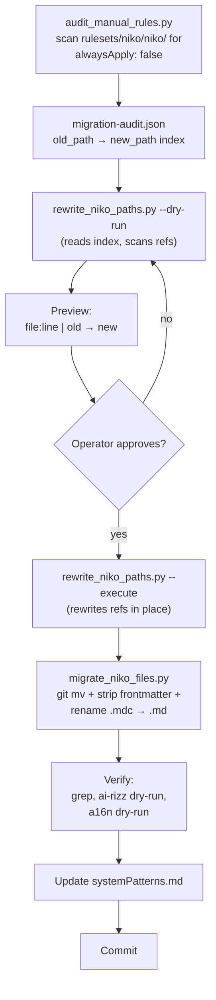

# Task: Migrate Manual Rules to Skill Resources

* Task ID: manual-rules-to-skill-resources
* Complexity: Level 3
* Type: Refactor / structural migration

Relocate the 24 `alwaysApply: false` niko content files out of `rulesets/niko/niko/{core,level1..4,phases}/**/*.mdc` into `rulesets/niko/skills/niko/resources/` mirroring the current tree. Strip frontmatter. Rename `.mdc` → `.md`. Rewrite every `.cursor/rules/shared/niko/...` path reference across the niko tree, driven by two/three scripts with a dry-run audit that the operator approves before execution. Update `systemPatterns.md`. Verify via `ai-rizz` dry-run and `a16n --rewrite-path-refs --dry-run`.

Architecture decision: [creative-manual-rules-as-skill-resources.md](creative/creative-manual-rules-as-skill-resources.md).

## Pinned Info

### Migration Flow

Shows the end-to-end pipeline from audit → preview → approval → execute → move → verify. Pinned because it's the mental model for the whole task.

## Component Analysis

### Affected Components

- **`rulesets/niko/niko/core/`** (4 files in scope; 1 stays)
  - Move: `complexity-analysis.mdc`, `intent-clarification.mdc`, `memory-bank-init.mdc`, `reconcile-persistent.mdc`
  - Keep: `memory-bank-paths.mdc` (`alwaysApply: true`, deferred)
- **`rulesets/niko/niko/level{1,2,3,4}/`** (15 files; all in scope)
  - level1: `level1-build.mdc`, `level1-workflow.mdc` (2)
  - level2: `level2-{archive,build,plan,reflect,workflow}.mdc` (5)
  - level3: `level3-{archive,build,plan,reflect,workflow}.mdc` (5)
  - level4: `level4-{archive,plan,workflow}.mdc` (3)
- **`rulesets/niko/niko/phases/creative/`** (5 files; all in scope)
  - `creative-phase-{algorithm,architecture,generic,template,uiux}.mdc`
- **`rulesets/niko/niko/memory-bank/`** (13 files; **not in scope** — these are Cursor File Rules via `globs:`, cross-harness-clean).
- **`rulesets/niko/niko-core.mdc`** (rule, out of scope; stays at current location).
- **`rulesets/niko/skills/**/SKILL.md`** (10 skills; some contain `.cursor/rules/shared/niko/...` references that must be rewritten).
- **`rulesets/niko/skills/niko/`** — grows a new `resources/` subtree holding the 24 moved files.
- **`memory-bank/systemPatterns.md`** — "File Organization" section updated to document the new rule-vs-resource split.
- **`scripts/`** (new directory) — three Python scripts.
- **`.cursor/rules/shared/niko/`** and **`.cursor/skills/niko/`** — regenerated by `ai-rizz`; no manual edits.

### Cross-Module Dependencies

- SKILL.md files → resource files, via explicit `Load: <path>` or inline prose path refs.
- Resource files → other resource files (e.g., workflow files reference phase files, `memory-bank-init.mdc` references memory-bank templates which are staying as rules).
- `reconcile-persistent.mdc` and `memory-bank-paths.mdc` reference the memory-bank templates via `.cursor/rules/shared/niko/memory-bank/...` — those target paths stay unchanged (templates not moving), so these refs do NOT get rewritten.
- Memory-bank persistent files (`memory-bank/systemPatterns.md`, etc.) — we only touch `systemPatterns.md`'s File Organization section.

### Boundary Changes

- Public-facing change: the canonical path for the 24 resource files changes from `.cursor/rules/shared/niko/<subtree>/<name>.mdc` to `.cursor/skills/shared/niko/resources/<subtree>/<name>.md` (Cursor form, produced by ai-rizz `cp -rL` into `.cursor/skills/shared/`). a16n's Claude-form output is verified during QA (advisory preflight finding).
- Any external consumer hardcoding the old `.cursor/rules/shared/niko/...` paths will break. Accepted per creative decision.
- Refs to `memory-bank-paths.mdc` and `memory-bank/**` templates keep the old `.cursor/rules/shared/niko/...` form because those files are NOT moving.

### Invariants & Constraints

- `niko-core.mdc` remains always-on (`alwaysApply: true`, unchanged).
- `memory-bank-paths.mdc` remains always-on (unchanged in this task).
- Cursor `@`-mention completion remains functional (files live under the synced skills tree).
- Rewrite scripts default to dry-run; destructive ops require an explicit flag.
- After migration: `grep -r '.cursor/rules/shared/niko' rulesets/niko/skills/ rulesets/niko/niko/level* rulesets/niko/niko/core/* rulesets/niko/niko/phases/` returns zero hits EXCEPT for refs to still-at-rules files (`memory-bank-paths`, `memory-bank/**`).
- `ai-rizz` sync config (`ai-rizz.skbd`) is not modified — it already syncs `rulesets/niko/skills/` as a whole tree.

## Open Questions

None. The architecture decision (Option B) is resolved via the creative phase. Tactical decisions below have defensible defaults:

- **Script language**: Python 3, stdlib only (`pathlib`, `json`, `re`, `argparse`). Cross-platform, readable, no new deps.
- **Audit index format**: JSON, one record per file with fields `{ "old_path", "new_path", "had_frontmatter" }`.
- **Rewrite preview format**: tabular plain text (`file:line | old_ref → new_ref`), also dumpable to JSON via `--json`.
- **Path syntax in rewrites**: Cursor source-form with the ai-rizz `shared/` infix: `.cursor/skills/shared/niko/resources/<subtree>/<name>.md`. Keeps visual style symmetric with the existing `.cursor/rules/shared/niko/...` pattern; `a16n --rewrite-path-refs` handles Cursor→Claude at conversion time.
- **Script location**: `scripts/` at repo root. New directory.
- **Script count**: two scripts (matching user's mental model). `scripts/audit_manual_rules.py` is the helper; `scripts/migrate_manual_rules.py` is the main with subcommands.
- **Audit JSON**: `scripts/migration-audit.json` — gitignored (deterministically regenerable).

## Test Plan (TDD)

### Behaviors to Verify

Since this is a docs/config refactor with no runtime code, "tests" are verification checks — not unit tests in the traditional sense. Each verification maps to an acceptance predicate.

1. **Audit script correctness**: `audit_manual_rules.py` output lists exactly the 24 in-scope files and nothing else. Every entry maps an `old_path` under `rulesets/niko/niko/` to a `new_path` under `rulesets/niko/skills/niko/resources/` mirroring the subtree, with `.mdc` → `.md` rename.
2. **Rewrite script dry-run fidelity**: running `rewrite_niko_paths.py --dry-run` produces one preview line per matched reference; zero files are modified.
3. **Rewrite script coverage**: every existing `.cursor/rules/shared/niko/<movable-path>` reference in `rulesets/niko/` (both skills tree and niko tree) is included in the preview. Refs to still-at-rules files (`memory-bank-paths.mdc`, `memory-bank/**`) are NOT rewritten.
4. **Execute mode effect**: after `rewrite_niko_paths.py --execute`, `grep -r '.cursor/rules/shared/niko/(core/complexity-analysis|core/intent-clarification|core/memory-bank-init|core/reconcile-persistent|level[1-4]/|phases/creative/)' rulesets/` returns zero.
5. **Still-at-rules refs preserved**: after rewrite, refs to `.cursor/rules/shared/niko/core/memory-bank-paths.mdc` and `.cursor/rules/shared/niko/memory-bank/...` still exist (count matches pre-rewrite count).
6. **Migrate script effect**: after `migrate_niko_files.py --execute`, every `old_path` no longer exists and every `new_path` does exist, with `.md` extension, no leading `---\n...\n---\n` frontmatter block, and content otherwise byte-identical to the stripped original.
7. **No broken internal refs**: every `.cursor/skills/niko/resources/...` path that appears in any file in `rulesets/niko/` resolves to an actual file on disk. Implemented as a check script or a subcommand of the rewrite script.
8. **ai-rizz dry-run clean**: `ai-rizz` dry-run (or equivalent sync preview) succeeds with no errors.
9. **a16n dry-run clean**: `a16n convert --from cursor --to claude --rewrite-path-refs --dry-run .` produces zero `orphan-path-ref` warnings.
10. **systemPatterns.md updated**: the File Organization section mentions the skill-resources layout explicitly.

### Test Infrastructure

- Framework: none. This repo has no unit test runner — it's a docs/rules repo. Verification is via grep, script self-checks, and external tool dry-runs.
- Location: verification commands can live as inline assertions in a top-level verify script (`scripts/verify_migration.sh`) or be run ad hoc from the task terminal.
- Conventions: Python 3 stdlib; shebang line; `--dry-run` default; `--execute` required to mutate.
- New test files: none in a traditional sense. `scripts/verify_migration.sh` (or equivalent) bundles the checks.

### Integration Tests

- **End-to-end on a branch**: run the full pipeline (audit → preview → execute rewrite → migrate files → verify), then `ai-rizz` sync dry-run, then `a16n` dry-run. All expected to pass.

## Implementation Plan

Two scripts total, matching the user's mental model: a helper that audits, and a main script with subcommands for each migration stage.

1. **Write `scripts/audit_manual_rules.py`** (helper).
    - Files: `scripts/audit_manual_rules.py` (new), `scripts/migration-audit.json` (generated; gitignored).
    - Inputs: walks `rulesets/niko/niko/` recursively.
    - Logic: for each `*.mdc`, read leading frontmatter; include if `alwaysApply: false` is present. Exclude explicit skip list (`memory-bank-paths.mdc`).
    - For each included file: derive `{ old_path, new_path, old_ref, new_ref }` where:
        - `old_path` = e.g. `rulesets/niko/niko/level3/level3-plan.mdc`
        - `new_path` = e.g. `rulesets/niko/skills/niko/resources/level3/level3-plan.md`
        - `old_ref` = e.g. `.cursor/rules/shared/niko/level3/level3-plan.mdc`
        - `new_ref` = e.g. `.cursor/skills/shared/niko/resources/level3/level3-plan.md`
    - Output: JSON array to `scripts/migration-audit.json`. Prints count + path to stdout. Optional `--print-table` for human-readable preview.
    - Verification: run it; confirm exactly 24 entries; spot-check subtree mapping; confirm `memory-bank-paths.mdc` and all of `memory-bank/**/*.mdc` are absent from output.

2. **Write `scripts/migrate_manual_rules.py`** with dry-run default and subcommands.
    - Files: `scripts/migrate_manual_rules.py` (new).
    - Shared setup: loads `scripts/migration-audit.json`; builds `{old_ref → new_ref}` mapping from audit entries.
    - Subcommand `preview` (default; dry-run; no mutations):
        - Scan `rulesets/niko/` (configurable `--target-dir`).
        - For each file, for each line, find all `old_ref` matches; print `<file>:<line_no> | <old_ref> → <new_ref>`.
        - Print summary: `N refs across M files`.
        - `--json` to emit machine-readable records.
    - Subcommand `rewrite-refs`:
        - Same scan as `preview` but writes in place.
        - Prints the same table plus a `WROTE` summary.
        - Explicit flag required; does nothing without it. Name the flag `rewrite-refs` itself (positional subcommand), not a toggle.
    - Subcommand `move-files`:
        - For each audit entry: `mkdir -p` destination; `git mv` old → new; strip leading `^---\n.*?\n---\n?\n?` frontmatter from the new file (non-greedy, anchored at line 1; must NOT touch in-body fenced-block frontmatter examples like `creative-phase-template.mdc` line 83); preserve rest byte-for-byte.
        - Has `--dry-run` flag that prints intended operations without executing. (Default is execute, since this is an explicit destructive subcommand.)
    - Subcommand `verify`:
        - `grep` invariant checks (spelled out below) — each PASS/FAIL.
        - Broken-ref check: every `new_ref` that appears in any rulesets/ file must resolve to an actual file on disk (post-move).
        - Always dry-run; read-only.
    - Verification for the script itself: subcommand help text is correct; `preview` on pristine state lists all expected rewrites; `rewrite-refs` on a sandbox copy produces expected diff.

3. **Operator review + approval.** Run `preview`; operator reads the full table and confirms nothing unexpected, then greenlights the remaining subcommands.

4. **Execute path rewrite.** Run `migrate_manual_rules.py rewrite-refs`. Spot-check with a quick grep.

5. **Execute file move + frontmatter strip.** Run `migrate_manual_rules.py move-files`. Check `git --no-pager status` shows the 24 renames and the frontmatter diffs.

6. **Update `memory-bank/systemPatterns.md`** "File Organization" section.
    - Files: `memory-bank/systemPatterns.md`.
    - Changes: document the three-tier split (rules = `rulesets/niko/*.mdc` and `rulesets/niko/niko/core/memory-bank-paths.mdc` and `rulesets/niko/niko/memory-bank/**/*.mdc`; resources = `rulesets/niko/skills/niko/resources/**/*.md`; skills = `rulesets/niko/skills/*/SKILL.md`). Mention the migration scripts briefly.

7. **Run `migrate_manual_rules.py verify`** and confirm all checks PASS.
    - `grep -r '\.cursor/rules/shared/niko/(core/complexity-analysis|core/intent-clarification|core/memory-bank-init|core/reconcile-persistent|level[1-4]/|phases/creative/)' rulesets/` → zero matches.
    - `grep -r '\.cursor/rules/shared/niko/(core/memory-bank-paths\.mdc|memory-bank/)' rulesets/` → matches preserved at expected count.
    - Every `.cursor/skills/shared/niko/resources/...` ref resolves to an actual file.
    - Count of `*.md` files under `rulesets/niko/skills/niko/resources/` == 24.

8. **Run `ai-rizz sync`** (or the maintainer's equivalent) and confirm `.cursor/` regenerates correctly — `.cursor/skills/shared/niko/resources/` populated, `.cursor/rules/shared/niko/` free of the 24 files' former presence, `niko-core.mdc` and the remaining rules (`memory-bank-paths`, memory-bank templates) still present as rules.

9. **Run `a16n convert --from cursor --to claude --rewrite-path-refs --dry-run .`** and confirm zero `orphan-path-ref` warnings. If `shared/` infix causes issues, report findings and triage (see Challenges).

10. **Add `scripts/migration-audit.json` to `.gitignore`** (if not already covered by existing patterns).

11. **Commit**: semantically-separated commits:
    - `feat(scripts): add manual-rules migration tooling` — adds audit + migrate scripts, updates `.gitignore`.
    - `refactor: migrate manual rules to niko skill resources` — path rewrites + file moves + frontmatter strip, all 24 files.
    - `docs: update systemPatterns file-organization for rule/resource split`.

## Technology Validation

No new runtime dependencies. Scripts use Python 3 stdlib only (`pathlib`, `json`, `re`, `argparse`, `sys`, `subprocess` for `git mv`). Python 3 is already installed (`/home/mobaxterm/.pyenv/shims/python3`).

External tool dry-runs (`ai-rizz`, `a16n`) are verification-only; no install required (they're either already available or the user will run them from a known install).

No new technology — validation not required.

## Challenges & Mitigations

- **Challenge: Literal string match false positives.** The old path prefix `.cursor/rules/shared/niko/` is highly specific; false-positive risk is minimal. **Mitigation:** dry-run preview gives the operator a chance to catch any anomaly; the script prints exact line context.
- **Challenge: Frontmatter stripping must not damage files whose body contains an example frontmatter block** (e.g., `creative-phase-template.mdc` shows an example at line 83). **Mitigation:** strip only the single leading `^---\n.*?\n---\n` block anchored at line 1. Body examples inside fenced code blocks are not at column 1 of line 1 and are untouched.
- **Challenge: `reconcile-persistent.mdc` and `memory-bank-paths.mdc` contain refs to `memory-bank/**/*.mdc` (not moving) AND are themselves being moved / staying. Easy to over- or under-rewrite.** **Mitigation:** the mapping is derived mechanically from the audit JSON, which excludes `memory-bank-paths.mdc` and the `memory-bank/**` templates. Refs to those files therefore never appear in the mapping and are never touched.
- **Challenge: The niko `SKILL.md` references `.cursor/rules/shared/niko/core/memory-bank-paths.mdc` at line 15 — this stays unchanged. The rewrite must not touch it.** **Mitigation:** same as above — `memory-bank-paths.mdc` is excluded from the audit.
- **Challenge: `ai-rizz`'s sync expectations about file extensions.** `ai-rizz` syncs `rulesets/niko/skills/` trees into `.cursor/skills/`. It should treat `.md` files under a skill's `resources/` as plain asset files. **Mitigation:** inspect `ai-rizz` behavior during dry-run before committing. If it flags `.md` resources as problematic, investigate; otherwise proceed.
- **Challenge: a16n converts Cursor skills → Claude skills by moving `.cursor/skills/` → `.claude/skills/`. Path refs inside the skill's resources must be rewritten from `.cursor/skills/niko/resources/...` → `.claude/skills/niko/resources/...`.** **Mitigation:** `a16n --rewrite-path-refs` is documented to do this for any source-format path, not only rules paths. Verify in the dry-run step.
- **Challenge: Not actually a Level 4.** Double-checked: single workstream, cohesive scope, no parallel milestones needed, fully reversible. L3 stands.

## Preflight Findings

- **Finding 1 (BLOCKING → fixed in plan):** Cursor-form path must be `.cursor/skills/shared/niko/resources/...` (includes `shared/` infix from ai-rizz commit mode). Plan updated.
- **Finding 2 (PASS):** ai-rizz uses `cp -rL` for skills (source line 4826); full subdirectory tree is preserved. Resources-under-skill layout is safe.
- **Finding 3 (PASS):** ai-rizz does no frontmatter transformation; source must be committed with frontmatter already stripped.
- **Finding 4 (ADVISORY, defer to QA):** a16n behavior for `.cursor/skills/shared/...` paths is unverified; check via dry-run in QA. Fallbacks: accept orphan-path-ref warnings or adjust a16n mapping.
- **Finding 5 (ADVISORY → fixed in plan):** `scripts/migration-audit.json` added to gitignore plan.
- **Finding 6 (RADICAL INNOVATION → applied):** Consolidated three scripts into two (audit helper + main with subcommands), matching user's mental model.

## Status

- [x] Component analysis complete
- [x] Open questions resolved (none open; tactical defaults documented)
- [x] Test planning complete (TDD)
- [x] Implementation plan complete
- [x] Technology validation complete
- [x] Preflight complete (findings applied)
- [ ] Build
- [ ] QA
