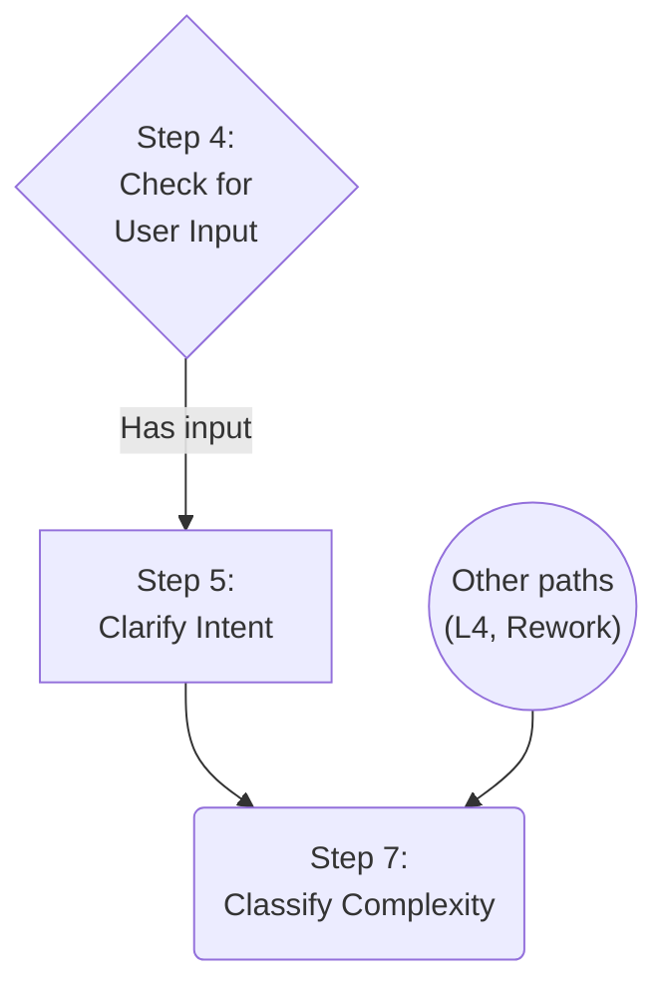

# Task: Intent Clarification Loop

* Task ID: intent-clarification-loop
* Complexity: Level 3
* Type: feature

Add an intent-clarification loop to Niko's `/niko` entrypoint (after entry, before complexity analysis) that restates user intent for confirmation before proceeding.

## Pinned Info

### State Machine Integration

Where the intent clarification step fits in the `/niko` flowchart. Only the Step 4 "has input" path routes through it; all other paths to Classify bypass it.

## Component Analysis

### Affected Components
- **`/niko` entrypoint** (`.claude/skills/niko/SKILL.md`): State machine routing — new Step 5 between Step 4 "has input" and Classify Complexity (renumbered to Step 7). Current Step 5 (Resume) renumbered to Step 6.
- **Intent clarification skill** (NEW: `.claude/skills/intent-clarification/SKILL.md`): Contains the full loop specification — research, restatement, user approval, refinement loop.
- **Complexity analysis** (`.claude/skills/complexity-analysis/SKILL.md`): Step 4 loses its "prompting for clarification" clause. Now classifies validated input.

### Cross-Module Dependencies
- `/niko` → intent clarification → complexity analysis: serial pipeline
- Intent clarification produces dialogue context (no file artifact) consumed by downstream phases in the same session
- Complexity analysis still writes projectbrief.md from the validated input

### Boundary Changes
- New step in `/niko` state machine (Step 5)
- Existing steps renumbered: Resume 5→6, Classify 6→7
- Complexity analysis Step 4 wording change (remove clarification clause)
- New skill file: `.claude/skills/intent-clarification/SKILL.md`

## Open Questions

- [x] **Q1: Which paths need intent clarification?** → Resolved: Only Step 4 "has input" (see `creative-scope-which-paths.md`)
- [x] **Q2: Output artifact and projectbrief.md relationship?** → Resolved: No artifact — dialogue only. Restatement stays in conversation context. (see `creative-artifact-projectbrief.md`)
- [x] **Q3: Interaction with complexity analysis?** → Resolved: Remove clarification clause from CA. It classifies validated input. (see `creative-complexity-analysis-interaction.md`)
- [x] **Q4: Structural form?** → Resolved: New step + separate skill file, mirroring complexity-analysis pattern. (see `creative-structural-form.md`)

## Test Plan (TDD)

### Behaviors to Verify

Since the deliverables are Markdown skill files (not executable code), "testing" means structured review against behavioral specifications:

- **B1: Fresh input triggers intent clarification** — `/niko` with user input and no active state → Step 5 fires before complexity analysis
- **B2: L4 milestone paths bypass intent clarification** — L4 re-entry paths go directly to Classify Complexity
- **B3: Rework paths bypass intent clarification** — Step 3b goes directly to Classify Complexity
- **B4: Resume paths bypass intent clarification** — Step 5 (Resume, now Step 6) is unaffected
- **B5: Restatement is proportional to input** — Terse input gets short restatement; verbose input gets compressed restatement
- **B6: External references are preserved, not summarized** — Linked issues/specs are referenced, not lossy-compressed
- **B7: Loop converges** — User can approve to proceed, or refine. No infinite cycles.
- **B8: No file artifact written by intent loop** — The loop is dialogue-only; projectbrief.md is still written by complexity analysis
- **B9: Complexity analysis no longer prompts for clarification** — The "prompting for clarification" clause is removed

### Test Infrastructure

- Framework: Manual walkthrough/review of Markdown specifications against behavioral specs
- Test location: N/A (no executable test files — this is a specification project)
- Conventions: Review the modified Mermaid flowcharts for consistency with step definitions; verify all edges are accounted for
- New test files: None

### Integration Tests

- **IT1: Full fresh-input path** — Walk through `/niko` with fresh input → verify Step 5 fires → verify complexity analysis consumes validated input without re-prompting
- **IT2: Full L4 path** — Walk through `/niko` with L4 milestone → verify Step 5 is skipped → complexity analysis proceeds normally

## Implementation Plan

1. **Create intent-clarification rule file**
    - Files: `rulesets/niko/niko/core/intent-clarification.mdc` (canonical source; `.claude/` and `.cursor/` copies generated by ai-rizz/a16n)
    - Changes: New file containing the full loop specification:
      - Step 1: Ingest input (read linked resources, do research as judgment dictates)
      - Step 2: Construct restatement (sized proportionally to input; reference external specs by link, not summary)
      - Step 3: Present restatement to user
      - Step 4: If approved → proceed. If not → ask questions, research further, loop to Step 2.
      - Convergence: the loop ends only on user approval
    - Frontmatter: `alwaysApply: false` (Cursor rule format, matching `complexity-analysis.mdc` pattern)
    - Creative ref: Q2 (dialogue only), Q4 (separate skill file)

2. **Update `/niko` state machine**
    - Files: `rulesets/niko/skills/niko/SKILL.md` (canonical source)
    - Changes:
      - Renumber Step 5 (Resume) → Step 6
      - Renumber Step 6 (Classify) → Step 7
      - Insert new Step 5 (Clarify Intent) with `Load:` directive pointing to intent-clarification rule
      - Update flowchart: Step 4 "has input" → Step 5 → Step 7
      - All other paths to Classify update their target to Step 7
      - Update "How to Navigate" section if step references change
      - Update all step cross-references in definitions
    - Creative ref: Q1 (fresh input only), Q4 (new step)

3. **Update complexity analysis**
    - Files: `rulesets/niko/niko/core/complexity-analysis.mdc` (canonical source)
    - Changes: Step 4 — change "Populate it from the user's input, prompting for clarification if the requirements are incomplete or ambiguous" to "Populate it from the user's input (validated by the intent clarification step)"
    - Creative ref: Q3 (remove clarification clause)

4. **Update milestones reference doc**
    - Files: `rulesets/niko/niko/memory-bank/active/milestones.mdc` (canonical source)
    - Changes: Update "Step 2a → Step 6 (Classify)" reference to "Step 2a → Step 7 (Classify)"

5. **Update systemPatterns.md**
    - Files: `memory-bank/systemPatterns.md`
    - Changes: Update the Niko System Patterns section to reflect the new step in the workflow (intent clarification between entry and complexity analysis)

6. **Review and validate**
    - Walk through all paths in the updated flowchart to verify consistency
    - Verify all step numbers and cross-references are correct after renumbering
    - Verify edge labels match step definitions

## Technology Validation

No new technology - validation not required. All deliverables are Markdown files following existing conventions.

## Challenges & Mitigations

- **Step renumbering ripple effects**: Renumbering Steps 5→6 and 6→7 affects references in `/niko` SKILL.md, milestones.mdc, and potentially other files. Mitigation: systematic search-and-replace with manual verification of each reference. Only canonical sources in `rulesets/` are edited; `.claude/` and `.cursor/` copies are regenerated by ai-rizz/a16n.
- **Convergence specification**: The loop must be specified precisely enough that the agent doesn't get stuck in infinite refinement. Mitigation: clear termination condition (user approval only) and explicit instruction that the agent should not self-reject its own restatements.
- **Cross-session context loss**: If the session dies mid-intent-clarification, the dialogue is lost. Mitigation: no ephemeral files exist yet at this point, so `/niko` re-enters cleanly as "Fresh." Acceptable tradeoff per Q2 analysis.

## Status

- [x] Component analysis complete
- [x] Open questions resolved (4/4)
- [x] Test planning complete (TDD)
- [x] Implementation plan complete
- [x] Technology validation complete
- [x] Preflight — PASS with advisory
- [ ] Build
- [ ] QA
