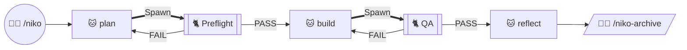

# Task: verification-subagents-preflight-qa (rework pass 3 — Mermaid layout)

* Task ID: verification-subagents-preflight-qa
* Complexity: Level 3
* Type: remediation (chart layout / visual encoding for GitHub)

Make Spawn/Verdict Mermaid charts human-readable on GitHub.com and mermaid.live. Preserve Spawn semantics; encode subagents as Mermaid subprocess nodes (creative lock).

**Authority:** This plan + `projectbrief.md` Rework pass 3. Creative = exploration. Live charts = `rulesets/niko/`.

## Pinned Info

### Subagent encoding (locked)

See `memory-bank/active/creative/creative-subagent-visual-encoding.md`. Short-form pattern:

```mermaid
graph LR
  Start(("🧑‍💻 /niko")) --> Plan["🐱 plan"]
  Plan ==Spawn==> Preflight[["🐈 Preflight"]]
  Preflight -->|"PASS"| Build["🐱 build"]
  Preflight -->|"FAIL"| Plan
  Build ==Spawn==> QA[["🐈 QA"]]
  QA -->|"PASS"| Reflect["🐱 reflect"]
  QA -->|"FAIL"| Build
  Reflect --> Archive[/"🧑‍💻 /niko-archive"/]
```

**Operator polish (locked into creative 2026-08-10):** drop word “subagent” from labels; 🐈 on subprocess nodes (🐱 stays on parent phases); `==Spawn==>` thick edges; legends decode shape+emoji+thick Spawn. Done/stop node shapes deferred.
## Component Analysis

### Affected Components
- **README charts** (`rulesets/niko/README.md`): short, long, per-level L1–L4 — primary GitHub consumer surface
- **Level workflows** (`rulesets/niko/skills/niko/references/level{1,2,3,4}/*-workflow.md`): agent routing maps with same nested subagent pattern
- **Legend / reading notes** under those charts: align with subprocess glyph; drop nested-box implications; keep Spawn/solid/dashed meanings
- **Entry `/niko` skill chart** (`rulesets/niko/skills/niko/SKILL.md`): audit only — no nested Preflight/QA subagent boxes today
- **illustrate-complexity / techContext**: optional one-line that GitHub/mermaid.live is layout SoT — only if standing contract warrants

### Cross-Module Dependencies
- Workflow charts ↔ README share Spawn grammar; README long may keep ideology washes under the creative fallback rule
- Legend prose ↔ chart ink must match

### Boundary Changes
- Visual public surface of Niko docs on GitHub. No runtime/API change.
- On-chart `Verdict` node removed; doctrine moves to reading note.

### Invariants & Constraints
- Must preserve: `--Spawn-->` forks verifier; subagent does not advance phases; outbound Pass/Fail(/rearchitect) edges are parent's; solid vs dashed operator meaning; terminal-node = only-dashed-outs
- Must hold: charts readable on **mermaid.live / GitHub**
- Must preserve: edit only `rulesets/` (+ memory-bank); not lagging `.cursor/` / `.claude/`
- Encoding lock: subprocess `[[ ]]` for Preflight/QA; no nested `PreflightSubagent` / `QASubagent` subgraphs

## Open Questions

- [x] Q1 Subagent visual encoding → Resolved: Option A subprocess (`creative-subagent-visual-encoding.md`); long-chart ideology fallback = flatten if needed

## Test Plan (TDD)

Prose/policy — always-tdd carve-out. No change-detector tests locking diagram source text.

### Behaviors to Verify

- [Dry-read]: no `subgraph PreflightSubagent` / `subgraph QASubagent` under `rulesets/niko/`
- [Dry-read]: Preflight/QA use `[["🐈 …"]]` subprocess nodes (no word “subagent” in label); Spawn edges are thick `==Spawn==>`; Pass/Fail(/rearchitect) leave those nodes
- [Dry-read]: legends document 🐱 vs 🐈, `[[ ]]`, and `==Spawn==>` as the subagent triple cue; reading note covers parent-owned outbound edges
- [mermaid.live]: every touched chart loads and is human-traceable (no edges buried under fills)
- [make test]: existing rulesets link checks still green

### Test Infrastructure

- Framework: Make / scripts in `scripts/` (layout + README link checks)
- New test files: none
- Ad-hoc: mermaid.live paste (or pako URL); `mmdc` parse-only is insufficient for acceptance

## Implementation Plan

1. **README short chart → subprocess encoding**
    - Files: `rulesets/niko/README.md` (short mermaid block ~L69–86)
    - Tests first: `N/A for prose & policy artifacts`
    - Changes: replace nested Preflight/QA subgraphs with `[["🐈 Preflight"]]` / `[["🐈 QA"]]`; thick `==Spawn==>` edges; Pass/Fail from those nodes; update legend + reading note (🐈+`[[ ]]`+thick Spawn = subagent; outbound edges are parent's)
    - Creative ref: Option A + operator polish

2. **README long chart → subprocess + ideology fallback**
    - Files: `rulesets/niko/README.md` (long block ~L93–137)
    - Tests first: `N/A for prose & policy artifacts`
    - Changes: Preflight/QA as subprocess; keep Planning/Execution/Learning washes; validate on mermaid.live; if unreadable, remove ideology subgraphs (fallback). Drop nested subagent clusters either way.
    - Creative ref: Option A + long fallback

3. **README per-level charts (L1–L4 details)**
    - Files: same README.md detail blocks
    - Tests first: `N/A for prose & policy artifacts`
    - Changes: same subprocess encoding; preserve each level’s edge labels (PASS/FAIL fixable/rearchitect, operator parallelograms)

4. **Level workflow charts L1–L4**
    - Files: `rulesets/niko/skills/niko/references/level1/level1-workflow.md`, `level2/level2-workflow.md`, `level3/level3-workflow.md`, `level4/level4-workflow.md`
    - Tests first: `N/A for prose & policy artifacts`
    - Changes: same encoding; update legends/reading notes under each chart to match (glyphs only / subprocess note)

5. **Audit `/niko` entry chart + optional techContext pointer**
    - Files: `rulesets/niko/skills/niko/SKILL.md`; optionally `memory-bank/techContext.md` Diagrams bullet
    - Tests first: `N/A for prose & policy artifacts`
    - Changes: confirm no nested subagent pattern; only edit if needed. techContext: one line that consumer-facing Mermaid must be checked on mermaid.live/GitHub — only if standing-contract incomplete

6. **Verify**
    - Files: touched charts only
    - Tests first: `N/A for prose & policy artifacts`
    - Changes: `make test`; `rg 'subgraph PreflightSubagent|subgraph QASubagent'` clean under `rulesets/niko/`; mermaid.live eyeball (agent draft + operator if low confidence on long)

## Technology Validation

No new technology - validation not required (`mmdc` / mermaid.live already in use).

## Challenges & Mitigations

- **Long chart still spaghetti with ideology washes:** Apply creative fallback — flatten ideology subgraphs.
- **Agents over-trust Cursor preview again:** Acceptance criterion is mermaid.live/GitHub; note in verify step and optionally techContext.
- **Legend drift across files:** Keep reading-note wording shared/minimal; grep for “Verdict” / “subagent” in legend lines after edits.
- **Emoji/font variance on GitHub:** Already present; don’t expand emoji surface.

## Pre-Mortem

- **Plan fails because we “fixed” charts in Cursor preview only:** Already covered — mermaid.live is the gate in step 6 and creative SoT.
- **Plan fails because we kept nested subagent boxes “just for ideology nesting”:** Encoding lock forbids nested Preflight/QA subgraphs; ideology may nest only ordinary nodes / subprocess leaves.
- **Plan fails by re-litigating C.2a semantics:** Invariant list + reading note preserve parent-owns-outbound-edges without on-chart Verdict.

## Status

- [x] Component analysis complete
- [x] Open questions resolved
- [x] Test planning complete (TDD)
- [x] Implementation plan complete
- [x] Technology validation complete
- [x] Pre-Mortem complete
- [x] Preflight
- [ ] Build
- [ ] QA
