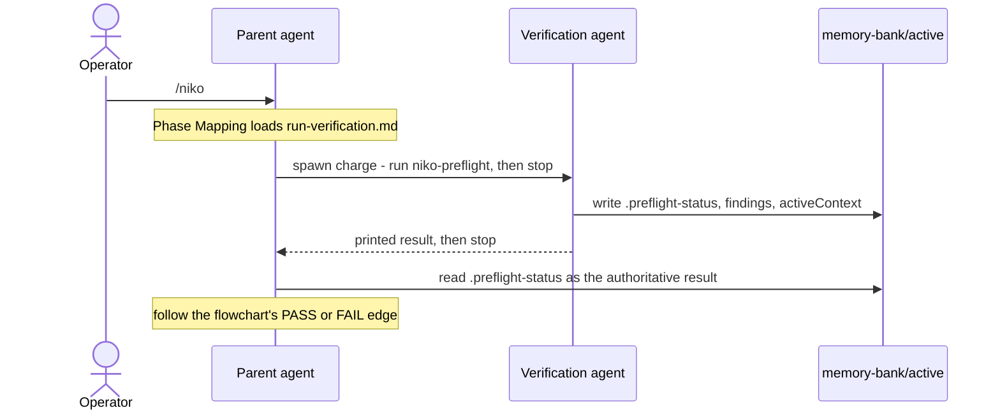

# Task: verification-subagents-preflight-qa

* Task ID: verification-subagents-preflight-qa
* Complexity: Level 3
* Type: orchestration / prompt authorship

Run Niko preflight and QA as portable verification subagents: parent forks, waits, reads status, continues PASS/FAIL edges; skills end unconditionally without child identity; manual recovery never auto-continues.

## Pinned Info

### Verification handoff

Parent owns transitions; verifier writes results only. From `creative-verification-orchestration.md`.

```mermaid
sequenceDiagram
    actor Op as Operator
    participant P as Parent agent
    participant V as Verification agent
    participant MB as memory-bank/active

    Op->>P: /niko
    Note over P: Phase Mapping loads run-verification.md
    P->>V: spawn charge - run niko-preflight, then stop
    V->>MB: write .preflight-status, findings, activeContext
    V-->>P: printed result, then stop
    P->>MB: read .preflight-status as the authoritative result
    Note over P: follow the flowchart's PASS or FAIL edge
```

## Component Analysis

### Affected Components

- `niko-preflight` / `niko-qa` skills: Step 4 continue-into-workflow → End of Verification (unconditional stop + `activeContext` outcome); companion micro-edits so skills report, not route
- Level 1–4 workflow Phase Mappings (6 lines): `Invoke the skill` → load `run-verification.md` + duplicated prohibition
- Secondary call sites (`level2-build.md`, `level3-build.md`, `level4-plan.md` Step 7): remove “invoke and proceed as instructed”
- New: `rulesets/niko/skills/niko/references/core/run-verification.md` — parent-side fork/wait/read/resume/fallback

### Cross-Module Dependencies

- Workflows / build / plan docs → `run-verification.md` → spawn → skills → status files + `activeContext` → parent reads status → flowchart edges
- `/niko` Step 6 resumes from `activeContext` `**Phase:**` — skills must write it

### Boundary Changes

- Direct `/niko-preflight` / `/niko-qa`: PASS no longer continues the workflow in that conversation
- Status-file contracts unchanged; mermaid unchanged

## Open Questions

- [x] Q1 Placement → Shared `run-verification.md` + prohibition duplicated at nine call sites (`creative-verification-orchestration.md`)
- [x] Q2 Step 4 → Unconditional End of Verification + `activeContext` record; Fable A1 + companion micro-edits ratified
- [x] Q3 Spawn/model → Capability ladder (Fable C1) + shared-tree precondition + consent clause + status-file authority; no in-process fallback

## Test Plan (TDD)

No executable test suite (prose / skill / workflow only; `always-tdd` carve-out). Build verification = dry-read of five walkthroughs in the creative doc + one live dry-run of the model heuristic in this harness.

### Behaviors to Verify (dry-read)

1. L2 parent, preflight PASS → fork → read PASS → solid edge into Build (no operator hop)
2. L3 parent, preflight PASS → fork → read PASS → dashed edge, wait for `/niko-build`
3. Manual recovery PASS → skill stops; later `/niko` resumes from recorded phase (does not silently re-verify)
4. Forked verifier cannot continue (spawn charge + Step 4); skills retain no path that opens a level workflow
5. No spawn facility → fallback print names both hops (verify convo, then `/niko` resume convo); never verify in-process

### Test Infrastructure

- Framework: none (manual dry-read / dry-run)
- New test files: none

## Implementation Plan

Creative refs: `memory-bank/active/creative/creative-verification-orchestration.md`, `creative-verification-wording.md`.

1. **New shared reference**
    - Files: `rulesets/niko/skills/niko/references/core/run-verification.md`
    - Changes: Author from orchestration skeletal draft + Fable Blocks B1 charge / C1 heuristic. Include: shared-tree spawn facility; model-by-capability; consent clause; verbatim spawn charge (+ “if you need an operator decision, record it as a finding rather than asking”); wait; read status file not returned prose; resume via flowchart; fallback (never verify in-process). Parameterize preflight vs QA (skill name + status path).
    - Creative ref: Q1, Q3

2. **Six Phase Mapping lines (pointer + prohibition)**
    - Files: `level1-workflow.md` (QA), `level2-workflow.md` (preflight + QA), `level3-workflow.md` (preflight + QA), `level4-workflow.md` (preflight)
    - Changes: Replace `Invoke the niko-* skill` with Load `.../references/core/run-verification.md` for that skill; include verbatim “do not run the skill in this conversation.”
    - Creative ref: Q1; L1 QA same fork (no exception)

3. **Three secondary call sites**
    - Files: `level2-build.md`, `level3-build.md` (missing-preflight guards), `level4-plan.md` Step 7
    - Changes: Replace “invoke the skill and proceed as instructed there” with STOP → run verification per `run-verification.md` → re-check status before continuing (Fable B2 shape).
    - Creative ref: Q1

4. **`niko-preflight` Step 4 + micro-edits**
    - Files: `rulesets/niko/skills/niko-preflight/SKILL.md`
    - Changes: Replace Step 4 with End of Verification (Fable A1 + record PASS/FAIL in `activeContext.md` `**Phase:**`). Step 2.9: “Allow transition to `/niko-build`” → record PASS + advisories; “re-run `/niko-plan`” → route to Plan in the report.
    - Creative ref: Q2

5. **`niko-qa` Step 4 + micro-edits**
    - Files: `rulesets/niko/skills/niko-qa/SKILL.md`
    - Changes: Same End of Verification (QA status file; “PASS is not permission to reflect”). Step 2.5: “Return to Build/Plan” → record in report that Build/Plan must rerun.
    - Creative ref: Q2

6. **README confirm**
    - Files: `rulesets/niko/README.md` (read-only unless a false same-conversation claim exists)
    - Changes: Confirm only; edit only if needed

7. **Dry-read + heuristic dry-run**
    - Trace walkthroughs 1–5 against edited files; once in this repo, attempt a verification fork and note what model selection the harness honors (non-blocking)

## Technology Validation

No new technology - validation not required (prompt/orchestration prose only).

## Challenges & Mitigations

- Parent skips `run-verification.md` and invokes skill in-process: Q2 unconditional stop still ends verification; independence lost, flow preserved. Mitigation: duplicated prohibition on every call site.
- Harness refuses non-default model: consent clause + terminal rung (default model, separate context still counts).
- Harness cannot share working tree: treat as no spawn facility → operator fallback.
- Missing `activeContext` Phase on recovery: Step 4 must write it so `/niko` does not re-enter verification.
- Final prose quality: build from Opus skeletal + Fable A1/B1/C1; keep minimal.

## Pre-Mortem

- Parents skip indirection → already covered (Challenge: skip reference); independence loss acceptable
- Solid edges stranded → false: parent still holds flowchart (Q1)
- No resume signal → addressed by `activeContext` record in Step 4
- Tenth call site missed later → same graceful degradation; `rg` for conforming pointer/prohibition strings
- In-process “helpful” fallback reintroduced in wording → reject at review; fallback must name two new conversations

## Final merged wording (build source)

### Skill Step 4 (preflight; QA swaps status path and “reflect”)

~~~markdown
## Step 4: End of Verification

Verification ends in this conversation, on PASS as much as on FAIL. Record the outcome in `memory-bank/active/activeContext.md` (this phase complete, PASS or FAIL — the `**Phase:**` field `/niko` reads to resume). The status file and printed report are this skill's entire output; acting on the result belongs to whoever requested verification, never to this conversation. Do not load a level workflow or begin another phase — a PASS is not permission to build.

Tell the operator: the result is recorded in `memory-bank/active/.preflight-status`; the workflow resumes from the conversation that requested this verification, or from a fresh one they start when ready.
~~~

### Phase-mapping line shape

~~~markdown
- **Level N Preflight Phase**: Load `.cursor/skills/shared/niko/references/core/run-verification.md` and run it for `niko-preflight` — do not run the skill in this conversation.
~~~

### Secondary call site shape

~~~markdown
🚨 If preflight has not passed: STOP — load `.cursor/skills/shared/niko/references/core/run-verification.md` and run it for `niko-preflight`, then re-check the status file before continuing. Do not run the skill in this conversation.
~~~

## Status

- [x] Component analysis complete
- [x] Open questions resolved
- [x] Test planning complete (TDD carve-out / dry-read)
- [x] Implementation plan complete
- [x] Technology validation complete
- [x] Pre-Mortem complete
- [ ] Preflight
- [ ] Build
- [ ] QA
- [ ] Reflect
- [ ] Archive
