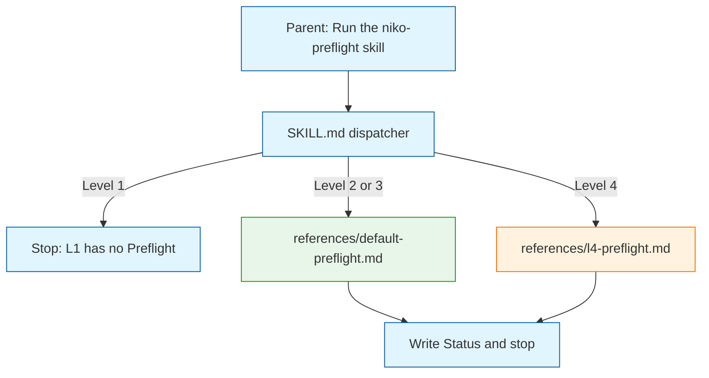

# Task: l4-preflight-altitude

* Task ID: l4-preflight-altitude
* Complexity: Level 3
* Type: enhancement / bugfix

Give `/niko-preflight` an internal split so Level 4 judges milestone design (W4) and Levels 2–3 keep today's implementation-plan bar. Spawn line unchanged. Canonical edits under `rulesets/` only. Fixes https://github.com/Texarkanine/.cursor-rules/issues/122.

## Pinned Info

### Preflight dispatch

The parent still says only `Run the /niko-preflight skill`. The skill loads exactly one sibling reference. It does not load the level workflow.

```mermaid
graph TD
    classDef skill fill:#e1f5fe,stroke:#01579b;
    classDef l4 fill:#fff3e0,stroke:#ef6c00;
    classDef def fill:#e8f5e9,stroke:#2e7d32;

    Spawn["Parent: Run the niko-preflight skill"]:::skill --> Skill["SKILL.md dispatcher"]:::skill
    Skill -->|"Level 1"| Stop["Stop: L1 has no Preflight"]:::skill
    Skill -->|"Level 2 or 3"| Default["references/default-preflight.md"]:::def
    Skill -->|"Level 4"| L4["references/l4-preflight.md"]:::l4
    Default --> Shared["Write Status and stop"]:::skill
    L4 --> Shared
```

## Component Analysis

### Affected Components
- **niko-preflight skill**: one spawned workflow that today loads `tasks.md`, applies TDD Plan Encoding (word "milestone") and file-level Completeness, and never loads `milestones.md`. Becomes a dispatcher: shared load/status/stop; checks live in `references/default-preflight.md` (L2/L3) and `references/l4-preflight.md` (L4).
- **L4 plan + workflow**: still spawn `/niko-preflight`; must write W4 sections into `milestones.md` and say Preflight judges L4 altitude, not sub-run TDD. Stop putting L-estimates on checkbox lines.
- **milestones.mdc**: document W4 sections (invariants, optional DAG, per-milestone done/risks/ref). Still forbid checklist sub-bullets, TDD steps, and file lists on checkbox lines.
- **complexity-analysis.md**: classification target is the first unchecked checkbox plus that milestone's W4 row if present.
- **`/niko` Step 2a** (unchanged code path): deletes `tasks.md` / `progress.md`; W4 facts must already live in `milestones.md` / `projectbrief.md`.
- **README L4 key differences**: one bullet stating L4 Preflight altitude. Do not restyle charts.

### Cross-Module Dependencies
- L4 Plan writes `milestones.md` → spawn Preflight → L4 path loads that file + `projectbrief.md` → operator `/niko` → new `progress.md` Complexity is L1/L2/L3 → same skill loads `default-preflight.md`.
- Status contract (`preflight-status.mdc`, `.preflight-status`, four strings, judge-and-report) stays in SKILL.md / the existing mdc. Neither reference file grows a glossary.
- Runtime load paths are `.cursor/skills/shared/niko-preflight/references/…` (installed layout). Source files are authored under `rulesets/niko/skills/niko-preflight/references/`. Generated `.cursor/` is not edited in this task; sync is a later `chore(dev): ai-rizz sync`.

### Boundary Changes
- Public slash name and spawn line unchanged.
- `milestones.md` public format gains sections (not checklist notes). Classifiers must ignore non-checkbox lines.
- No new skill; `niko-qa` unchanged.

### Invariants
- Dispatch on `progress.md` `**Complexity:**` only. Never on `milestones.md` presence.
- Exactly one of the two references is loaded. The other is not read "for context."
- L2/L3 TDD encoding and completeness-of-steps are not relaxed.
- `l4-preflight.md` does not contain TDD Plan Encoding and does not require file-level paths on one-liners.
- Four status strings live only in `preflight-status.mdc`.
- Do not create tracker tickets. Reference one when it exists.
- Canonical edits under `rulesets/` only.

## Open Questions

- [x] **How should L4 preflight be structured?** → Resolved: D + W4. Spawned skill dispatches to `references/default-preflight.md` (L2/L3) or `references/l4-preflight.md` (L4). Not a plan/build workflow router. L2 and L3 share one file. (see `memory-bank/active/creative/creative-l4-preflight-mechanism.md`)

## Test Plan (TDD)

### Behaviors to Verify

No new executable behavior. Skill and rule wording are user-facing prose/policy. Do not invent change-detectors on document contents.

### Test Infrastructure

- Framework: `make test` → `scripts/check-ruleset-symlinks.sh` and `scripts/check-ruleset-readme-links.sh`
- Test location: `scripts/`
- Conventions: no markdown-content tests
- New test files: none

### Integration Tests

None. After Build, run `make test`. Live proof is the next real L4 Preflight (and this repo's own L3 Preflight still uses the lagging `.cursor/` copy until sync).

## Implementation Plan

### 1. Extract L2/L3 checks — prose/policy

- Files: `rulesets/niko/skills/niko-preflight/references/default-preflight.md` (new), `rulesets/niko/skills/niko-preflight/SKILL.md` (source of the move)
- No tests: prose/policy artifact
- Creative ref: D — one shared L2/L3 file, not two copies

1. Move current SKILL.md Step 2 items **Verify Prerequisites** through **Completeness Precheck** into `default-preflight.md` as a numbered workflow. Keep **Radical Innovation**, **Judge, Do Not Fix**, **Write Status**, log, and End of Verification in SKILL.md.
2. In the TDD Plan Encoding sentence, delete the word `milestone`. Units remain "function, slice — whatever granularity the plan uses."
3. Keep the Level 3 creative-docs predicate as a predicate, not a fork. Do not mention `milestones.md` as a design surface in this file.

### 2. Write L4 checks — prose/policy

- Files: `rulesets/niko/skills/niko-preflight/references/l4-preflight.md` (new)
- No tests: prose/policy artifact
- Creative ref: W4 check catalog and Step 2a durability

1. Numbered workflow. Additional loads: `memory-bank/active/milestones.md` (required) and `memory-bank/active/projectbrief.md` (already in shared load; this file names it as the L4 design surface). Do **not** treat the L4 `tasks.md` stub as the plan.
2. Checks and outs:
    1. Prerequisites: `**Complexity:**` is Level 4; `milestones.md` exists; header `task-id` matches. Missing `milestones.md` or Complexity not Level 4 → `FAIL (blocking)`. Header mismatch → `FAIL (fixable)`.
    2. Checklist shape: one GFM checkbox per milestone; no sub-bullets on those lines. Any extra `- [ ]` / `- [x]` in sections → `FAIL (blocking)` (poisons `/niko` classify).
    3. Coverage: every brief requirement maps to at least one milestone; no overlap of purpose → `FAIL (blocking)` on gap or overlap.
    4. Independently deliverable, L1–L3 scoped, not itself L4, concrete one-liner → `FAIL (blocking)` if the decomposition is wrong.
    5. Order: checklist is serial-safe; DAG present only if not a line and consistent with the checklist. Future-dependency or unsafe order → `FAIL (blocking)`. Parallel claimed in prose but no DAG → `FAIL (fixable)`.
    6. Cross-milestone invariants section exists and states properties no milestone may violate (include a handoff *rule* when two milestones share an artifact — not a file inventory) → missing section/rule `FAIL (fixable)`.
    7. W4 per-milestone surface (table or heading blocks, **not** checkbox sub-bullets): each checkbox has a joinable **Done**, **Risks / invariants** (or is covered by a cross-milestone invariant), and **Ref** (existing ticket if the brief/issue has one; otherwise a `projectbrief.md` pointer). Missing fields → `FAIL (fixable)`. Never require creating a ticket. Never fail for lacking numbered test-first substeps, concrete file paths, validation sequences, or L-estimates on the checkbox line.
    8. Persistent-file sufficiency: checkbox + W4 row + brief (+ ticket if linked) is enough to classify and plan → too vague to classify `FAIL (blocking)`; missing pointer `FAIL (fixable)`.
    9. Convention/conflict at L4 altitude only (generated-tree edits, published-contract breaks implied by the brief/invariants). Do not require a per-milestone file list.
3. This file must not contain TDD Plan Encoding or "specific files, functions, and approaches" completeness.

### 3. Dispatcher SKILL.md — prose/policy

- Files: `rulesets/niko/skills/niko-preflight/SKILL.md`
- No tests: prose/policy artifact
- Creative ref: spawn-skill router, not plan/build workflow load

1. Step 1 load adds `memory-bank/active/progress.md` (Complexity is the switch). Keep existing loads.
2. Numbered dispatch: Level 1 → stop, `FAIL (blocking)` (this skill is not used at L1; do not run default). Level 2 or 3 → load `.cursor/skills/shared/niko-preflight/references/default-preflight.md` and follow **only** that. Level 4 → load `.cursor/skills/shared/niko-preflight/references/l4-preflight.md` and follow **only** that. Missing or unknown Complexity → `FAIL (blocking)`. Explicit: do not read the other reference; do not load a level workflow.
3. After the loaded checks: Radical Innovation (advisory), Judge / allowed writes (unchanged), Write Status (unchanged four strings), log, End of Verification stop. Meanings stay in `preflight-status.mdc`.
4. Drop the word `milestone` from any leftover TDD sentence in SKILL.md. Checks must not remain duplicated in SKILL.md after the move.

### 4. W4 milestone format — prose/policy

- Files: `rulesets/niko/niko/memory-bank/active/milestones.mdc`, `rulesets/niko/skills/niko/references/level4/level4-plan.md`
- No tests: prose/policy artifact
- Creative ref: W4; still no implementation plans on checklist lines

1. `milestones.mdc` format: keep one checkbox line each (ticket may appear in that one line). Document sections: Cross-milestone invariants; optional Execution Order DAG (omit if a line); Per-milestone done and risks as a **table** (or headings) keyed to checkbox text with Done / Risks or invariants / Ref. State: sections must not use `- [ ]` / `- [x]` except the real checklist. Still no sub-bullets, TDD steps, or file lists on checkbox lines.
2. `level4-plan.md` Step 4 writes that format. Step 5: L1/L2/L3 estimates and rationale go in the plan-result printout and/or `progress.md`, **not** on checkbox lines. Next-step / "Preflight will now validate the milestone list" states L4 altitude (coverage, order, done, risks, refs — not sub-run TDD or file paths). Spawn line unchanged.

### 5. Classify + docs altitude — prose/policy

- Files: `rulesets/niko/skills/niko/references/core/complexity-analysis.md`, `rulesets/niko/skills/niko/references/level4/level4-workflow.md`, `rulesets/niko/README.md`
- No tests: prose/policy artifact

1. Complexity analysis: when `milestones.md` exists, the classification target is the first unchecked checkbox **plus** that milestone's W4 row/block if present.
2. `level4-workflow.md`: one sentence that L4 Preflight judges the milestone design at L4 altitude; spawn line unchanged.
3. README Level 4 key differences: one bullet that L4 Preflight judges decomposition (coverage, order, done, risks, refs), not per-milestone TDD. Do not restyle Mermaid charts.

## Technology Validation

No new technology - validation not required

## Challenges & Mitigations

- **Soft dispatcher reads both references:** SKILL.md says follow ONLY the loaded file and do not read the other. `l4-preflight.md` contains no TDD encoding so a leak is less lethal; `default-preflight.md` never treats `milestones.md` as the plan.
- **Wrong predicate (`milestones.md` exists):** dispatcher copies Complexity from `progress.md` only. Missing/unknown/L1 → `FAIL (blocking)`, not default.
- **Move leaves a duplicate TDD block in SKILL.md:** Step 3.4 is an explicit strip. Preflight of *this* plan cannot catch a future L4 mix-up; QA should grep that `milestone` is gone from TDD sentences and that SKILL.md does not still contain Completeness Precheck.
- **W4 sections grow mini-plans:** mdc forbids checklist sub-bullets and TDD/file lists; L4 checks fail extra checkboxes in sections and do not require file paths.
- **Generated-tree lag:** runtime paths are `.cursor/…`; this task does not edit `.cursor/`. Until `chore(dev): ai-rizz sync`, live L4 dispatch 404s on the new files. Same standing lag as every skill change. Do not sync in this task (`ai-rizz` reads the remote).
- **This task's own Preflight:** L3, prose/policy, still judged by the *current* `.cursor` skill. That is correct. Do not add executable units to dodge the old bar.

## Pre-Mortem

- **We only delete the word `milestone` and never write L4 checks:** Completeness would still FAIL one-liners. Already covered by unit 2 existing as a required file with an explicit "must not contain file-level completeness" constraint.
- **Dispatch uses file presence because the issue text said so:** already covered by the Complexity-only invariant and unit 3.
- **Planner writes W4 into `tasks.md` so Step 2a deletes it:** already covered by units 2 and 4 putting facts in `milestones.md` / `projectbrief.md`.
- **README chart restyle reopens GitHub layout fights:** unit 5 forbids restyling charts; prose bullet only.

## Status

- [x] Component analysis complete
- [x] Open questions resolved
- [x] Test planning complete (TDD)
- [x] Implementation plan complete
- [x] Technology validation complete
- [x] Pre-Mortem complete
- [x] Preflight
- [x] Build
- [ ] QA
