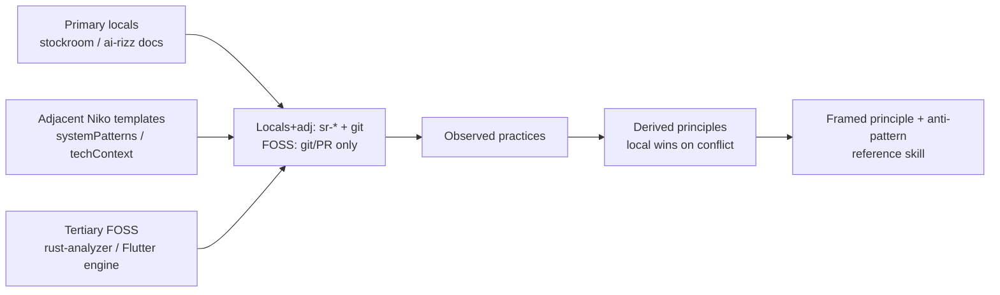

# Task: architecture-docs-authoring-skill

* Task ID: architecture-docs-authoring-skill
* Complexity: Level 3
* Type: feature

Add a Cursor skill (canonical under `rules/`, wired into the `authoring` ruleset) that teaches how to write good architecture documentation as **principles** derived from studied golden examples — primary local goldens (stockroom, ai-rizz), adjacent Niko memory-bank templates (`systemPatterns.mdc`, `techContext.mdc`), secondary a16n, and tertiary FOSS (rust-analyzer, Flutter engine) — researched via stockroom history and git/PR archaeology, not surface recipe mimicry.

## Pinned Info

### Evidence → principle → skill

Research produces observed practices; each practice must be reverse-engineered into a principle; the skill encodes principles (with optional evidence tags), never bare recipes.

```mermaid
flowchart LR
  Local["Primary locals<br/>stockroom / ai-rizz docs"] --> Research
  Adj["Adjacent Niko templates<br/>systemPatterns / techContext"] --> Research
  Foss["Tertiary FOSS<br/>rust-analyzer / Flutter engine"] --> Research
  Research["Locals+adj: sr-* + git<br/>FOSS: git/PR only"] --> Practices["Observed practices"]
  Practices --> Principles["Derived principles<br/>local wins on conflict"]
  Principles --> Skill["Framed principle + anti-pattern<br/>reference skill"]
```

## Component Analysis

### Affected Components
- **`rules/architecture-docs/` (new skill tree)**: New `SKILL.md` (+ optional `references/` only if build proves necessary) — the deliverable agents load when writing architecture docs. Mirrors `rules/prompt-authoring/` (directory-symlinked into ruleset).
- **`rulesets/authoring/`**: Wire the skill into the authoring ruleset (`skills/architecture-docs` → symlink to `../../../rules/architecture-docs`, README entry). Current responsibility: collect guidance for authoring agent-facing artifacts (prompt-authoring, markdown-style, visual-planning).
- **`REUSE.toml` / licensing**: Confirm existing `rules/**/*.md` PPL-S annotation covers the new skill; amend only if a gap appears.
- **Memory-bank research artifacts** (ephemeral during the task): case-study notes, principle drafts, and the TDD acceptance checklist live in `memory-bank/active/` until synthesized into the skill; not a permanent parallel doc set.
- **Out of scope components**: stockroom / ai-rizz / a16n architecture doc trees (read/research only); Niko `systemPatterns.mdc` / `techContext.mdc` templates (read/research only — do not rewrite); Niko workflows (unchanged).

### Cross-Module Dependencies
- **architecture-docs skill → prompt-authoring / markdown-style / visual-planning**: Compositional neighbors in the same ruleset. Skill must not duplicate their guidance; may assume Markdown/Mermaid competence or stay silent (per prompt-authoring cross-reference rules).
- **architecture-docs skill ↔ Niko memory-bank templates**: Adjacent genres. Skill draws principles from them and briefly situates project architecture docs relative to memory-bank files; does not subsume or rewrite those templates.
- **Research tooling → principle derivation**: `stockroom` + git for locals/adjacent; git/PR only for FOSS.
- **Creative decision (skill pedagogy) → SKILL.md shape**: Framed principle + anti-pattern reference (see `memory-bank/active/creative/creative-skill-pedagogy.md`).

### Boundary Changes
- New public installable skill in the authoring ruleset (ai-rizz consumers who install `authoring` gain it after push).
- No API/schema changes; no Niko workflow or memory-bank template changes.

### Invariants & Constraints
- Must preserve: canonical edit path is `rules/` + `rulesets/` only (never `.cursor/` / `.claude/` generated trees).
- Must hold: evidence weight primary local docs ≥ adjacent Niko templates > secondary a16n > tertiary FOSS; FOSS cannot redefine "good."
- Must hold: genres stay distinct — project architecture docs vs memory-bank persistent files.
- Must hold: skill content is principle-first; surface recipes only as illustrations of a stated principle.
- Must preserve: prompt-authoring cross-reference discipline (no brittle sibling content coupling).
- Non-goal: rewriting sibling-repo architecture docs or Niko memory-bank mdc templates.
- Must hold: REUSE licensing for new files.

## Open Questions

- [x] **FOSS supplements** → Resolved: rust-analyzer + Flutter engine as tertiary supplements only; weighted below primary locals because stockroom cannot recover remote author intent. (Operator 2026-07-14)
- [x] **Skill pedagogy / content architecture** → Resolved: **Framed principle + anti-pattern reference** — genre/evidence frame + flat principles with Not-this anti-patterns and optional one-line evidence tags; no narrative case-study body; no workflow-led spine. (see `memory-bank/active/creative/creative-skill-pedagogy.md`)

## Test Plan (TDD)

### Behaviors to Verify

- **Skill discoverability**: authoring ruleset documents / links the skill → agent (or human) can find when to load it from description + README.
- **Principle portability**: given a principle in the skill, an agent can apply it to a *different* project shape without needing stockroom/ai-rizz-specific structure → outcome matches the principle's intent (QA semantic check).
- **Anti-recipe**: skill does not instruct "always open with a control-flow diagram" (or similar surface mandate) without an enclosing principle → grep/QA check.
- **Evidence hierarchy**: skill states primary local ≥ Niko-adjacent > FOSS weighting → explicit in genre/evidence frame.
- **Genre boundary**: skill distinguishes project architecture docs from memory-bank `systemPatterns` / `techContext` → frame present; no pasted Avoid-block duplication of those mdc files.
- **Packaging**: `rulesets/authoring/skills/architecture-docs` is a symlink to `../../../rules/architecture-docs` (same pattern as `prompt-authoring`) → `readlink` check during build.
- **No sibling / template rewrite**: build changeset does not modify stockroom/ai-rizz/a16n architecture markdown or Niko memory-bank mdc templates → verify paths untouched.

### Test Infrastructure

- Framework: **none for skill content** in this repo (no unit/integration test runner for rules/skills).
- Verification mode: build-time packaging checks + Level 3 QA semantic review against acceptance criteria in `projectbrief.md`.
- Conventions: match `prompt-authoring` authoring/QA practices.
- New test files: none (QA-gated prose skill; not a re-level).

### Integration Tests

- Manual/QA: skill + markdown-style + visual-planning co-install without contradictory instructions (read-through).
- Manual/QA: description frontmatter triggers appropriately for "write architecture docs" style asks.
- Manual/QA: skill does not instruct agents to edit `systemPatterns.md` / `techContext.md` when the ask is for `docs/architecture`.

## Implementation Plan

1. **Research primary locals + adjacent Niko templates** — `sr-search` / `sr-query` + git history for stockroom `docs/architecture`, ai-rizz `docs/developer-guide`, and `rulesets/niko/niko/memory-bank/systemPatterns.mdc` + `techContext.mdc`; secondary pass on a16n `understanding-conversions`; extract practices → candidate principles with recoverable why. **Also** search stockroom for sessions that authored or revised those Niko templates (and the local architecture docs) — edit rationale is often denser than the shipped text.
    - Creative ref: pedagogy — research feeds derivation; do not draft skill outline-from-stockroom.
2. **Research FOSS supplements** — git history / PRs for rust-analyzer and Flutter engine architecture docs; extract practices → tertiary candidate principles; never override local on conflict.
3. **Synthesize principle set** — merge, dedupe, elevate to principles; drop surface-only observations lacking portable why; keep architecture-doc vs memory-bank genre boundary explicit. Output: candidate principle inventory in `memory-bank/active/` (research notes), not yet `SKILL.md`.
4. **Skill content (TDD cycle)**
    - 4a. **Write failing verification first**: turn the synthesized inventory into an explicit acceptance checklist (observable checks the finished `SKILL.md` must satisfy: each principle present as principle+why+Not-this; genre frame; evidence-weight note; no surface mandates without enclosing principle; no pasted Niko Avoid-blocks). Record checklist under `memory-bank/active/` (e.g. progress/tasks or a short `architecture-docs-acceptance.md`).
    - 4b. **Implement**: author `rules/architecture-docs/SKILL.md` to satisfy the checklist (frontmatter; genre frame; evidence-weight; principle sections per creative pedagogy).
    - 4c. **Verify**: run the checklist against `SKILL.md`; fix until all checks pass.
    - Creative ref: `memory-bank/active/creative/creative-skill-pedagogy.md`
5. **Packaging (TDD cycle)**
    - 5a. **Write failing packaging assertions first**: symlink path `rulesets/authoring/skills/architecture-docs` → `../../../rules/architecture-docs`; README entry present; `rules/**/*.md` already covered by REUSE PPL-S (confirm; no `REUSE.toml` edit unless annotations prove insufficient).
    - 5b. **Implement**: create directory symlink; update `rulesets/authoring/README.md`.
    - 5c. **Verify**: `readlink` + README grep + confirm no REUSE gap; confirm sibling repos and Niko mdc templates untouched.
6. **Final gate** — re-run full Test Plan behaviors; mark Implementation Plan steps done in Status.

## Technology Validation

No new technology - validation not required. Licensing: existing `REUSE.toml` annotations already cover `rules/**/*.md` (PPL-S) and `rulesets/**/README.md` (AGPL); build confirms coverage rather than adding paths unless a gap appears.

## Challenges & Mitigations

- **Principle collapse into recipes**: Agents default to copying stockroom's outline. Mitigation: framed principle + anti-pattern pedagogy; QA anti-recipe checks.
- **FOSS diluting local goldens**: Mitigation: tertiary labeling; local wins on conflict.
- **Thin stockroom history for "why"**: Mitigation: incomplete evidence → no invented principle.
- **No automated test runner for skill prose**: Mitigation: explicit checklist-as-test in steps 4a/5a before implementation; QA semantic review; packaging smoke checks.
- **Genre collapse**: Skill becomes a second copy of `systemPatterns.mdc` / `techContext.mdc`. Mitigation: explicit genre frame; QA against duplicated Avoid/When-to-Update blocks; templates remain read-only.
- **Wrong packaging pattern**: Plan initially assumed file hardlinks; repo standard is **directory symlink** into `rulesets/authoring/skills/` (as `prompt-authoring`). Mitigation: amended in preflight to match archive/`ls` reality.
- **Orphan research notes**: Mitigation: synthesize into skill; leave ephemeral research in memory bank for archive.

## Pre-Mortem

- **Ship a stockroom outline guide instead of portable principles**: Covered by creative pedagogy + Implementation Plan synthesize/author steps + QA anti-recipe behavior.
- **Absorb Niko memory-bank authorship into this skill**: Covered by genre-collapse challenge; research uses templates as evidence, not as text to fork.
- **FOSS surface patterns override local recoverable why**: Covered by evidence-weight invariant and local-wins-on-conflict synthesis rule.
- **Fractured subagent research with no synthesis**: Single synthesis step owned by primary agent.

## Status

- [x] Component analysis complete
- [x] Open questions resolved
- [x] Test planning complete (TDD)
- [x] Implementation plan complete
- [x] Technology validation complete
- [x] Pre-Mortem complete
- [x] Preflight
- [x] Build
  - [x] 1. Research primary locals + Niko templates
  - [x] 2. Research FOSS supplements
  - [x] 3. Synthesize principle set (`architecture-docs-research.md`)
  - [x] 4a. Acceptance checklist (`architecture-docs-acceptance.md`)
  - [x] 4b–4c. Author + verify `rules/architecture-docs/SKILL.md`
  - [x] 5. Packaging (symlink + README + REUSE)
  - [x] 6. Final gate
- [x] QA
  - Findings: one trivial portability fix ("see Heal" → generic "named model target"); no substantive FAIL
  - Status: PASS (`.qa-validation-status`)
- [x] Reflect
  - See `memory-bank/active/reflection/reflection-architecture-docs-authoring-skill.md`
- [ ] Archive
