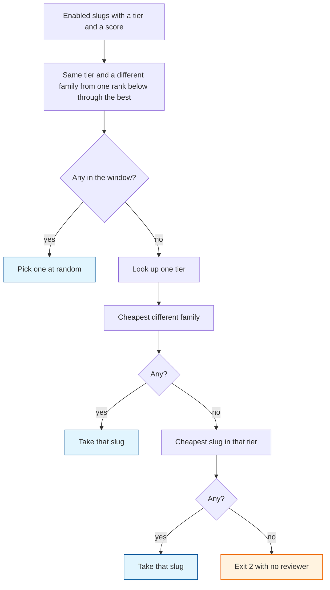

# Task: choose-verification-model

* Task ID: choose-verification-model
* Complexity: Level 3
* Type: feature

A skill named `choose-verification-model` that prints one QA or Preflight reviewer slug. A second executable refreshes scores and output prices. Niko's QA and Preflight spawn lines tell the agent to run the picker.

## Pinned Info

### Reviewer selection

The pick command's decision order. Rank is dense rank by score inside the tier, best at rank 1.

```mermaid
graph TD
    classDef pick fill:#e1f5fe,stroke:#01579b;
    classDef fail fill:#fff3e0,stroke:#ef6c00;

    Start["Enabled slugs with a tier and a score"] --> Window["Same tier and a different family from one rank below through the best"]
    Window --> HasWindow{"Any in the window?"}
    HasWindow -->|yes| Random["Pick one at random"]:::pick
    HasWindow -->|no| Up["Look up one tier"]
    Up --> DiffFam["Cheapest different family"]
    DiffFam --> HasDiff{"Any?"}
    HasDiff -->|yes| TakeDiff["Take that slug"]:::pick
    HasDiff -->|no| Cheap["Cheapest slug in that tier"]
    Cheap --> HasCheap{"Any?"}
    HasCheap -->|yes| TakeCheap["Take that slug"]:::pick
    HasCheap -->|no| Fail["Exit 2 with no reviewer"]:::fail
```

### Spawnable slugs

These are the Task-tool slugs for this session. Each ships with a score and tier `general`.

| Cursor slug | BenchLM slug |
| --- | --- |
| `claude-opus-5-5-medium` | `claude-opus-5-5` |
| `claude-sonnet-5-thinking-high` | `claude-sonnet-5` |
| `composer-2.5` | `composer-2-5` |
| `composer-2.5-fast` | `composer-2-5` |
| `gemini-3.8-flash-high` | `gemini-3-8-flash` |
| `gpt-5.6-terra-medium` | `gpt-5-6-terra` |
| `grok-4.7-high` | `grok-4-7` |
| `kimi-k3-high` | `kimi-k3` |
| `muse-spark-1.3-high` | `muse-spark-1-3` |

## Component Analysis

### Affected Components

- `rules/choose-verification-model/`: new topic skill. Owns `SKILL.md`, `pick.py`, `refresh.py`, `modelpool.py`, `mapping.json`, `catalog.json`, and `test_*.py`.
- `rulesets/niko/skills/choose-verification-model`: new symlink to `../../../rules/choose-verification-model`, same pattern as `illustrate-complexity`, so an install of the niko ruleset ships the script.
- Niko spawn lines: nine sites under `rulesets/niko/skills/niko/references/` that currently say `prefer smarter / different family if available`.
- `rulesets/niko/README.md`: the Subagent Selection tip that quotes the prose user rule, and the supplementary-rules list above it.
- `.github/workflows/rulesets-links.yml`: PR CI. It runs `make test-symlinks` and `make test-readme-links` as separate jobs. It needs a job for the new Python tests.
- `.gitignore`: ignores `**/.summem/__pycache__/` only. A test run would leave `rules/choose-verification-model/__pycache__/`.

### Cross-Module Dependencies

- `pick.py` reads `catalog.json` and `mapping.json` from its own directory.
- `refresh.py` reads `mapping.json` and the previous `catalog.json`, fetches `https://benchlm.ai/data/models.json` and `https://cursor.com/docs/models-and-pricing.md`, and writes `catalog.json`.
- The spawn lines do not import the script. They tell the agent to run `pick.py` beside `SKILL.md` and to pass the printed slug to the subagent. The subagent prompt stays the one-line skill invocation.

### Boundary Changes

- New CLI arguments on `pick.py`: `--model SLUG`, `--reviewer-models SLUG,SLUG`, optional `--seed N`
- New CLI: `refresh.py` with no required arguments
- `catalog.json` schema: `tier_order` is a list of tier names from lowest intelligence to highest. `models` maps a slug to `tier` (string or null), `score` (number or null), `score_source` (`benchlm`, `interim`, or null), and `output_cost_per_million` (number or null).
- `mapping.json` schema: each slug has `family` (string), `pricing_name` (string), `output_multiplier` (number, default 1), `benchlm_slug` (string or null), and `interim_score` (number or null).
- The nine spawn lines change their model-selection clause and keep the rest of the sentence, including which skill is named.

### Invariants

- Python 3.11, standard library only.
- Family comes from the mapping. `grok-*` and `cursor-grok-*` can share `grok`.
- A slug enters the random pool only with a non-null tier that appears in `tier_order` and a non-null score.
- Refresh preserves `tier_order` and each existing `tier`. A slug new to the catalog gets `tier: null` and stderr `WARNING: must set tier for <slug>`.
- The score is the equal-weight mean of `scores.displayCategoryScores` for `agentic`, `coding`, and `reasoning` on the mapped BenchLM item. A null category is left out. All three null, and an `interim_score` is set: use it and set `score_source` to `interim`. Any of the three present: use the mean, set `score_source` to `benchlm`, and drop the interim. Neither: `score` null and stderr `WARNING: must set interim score for <slug>`.
- Cursor effort and fast slugs that share a `benchlm_slug` share that score. Fast still has its own output price.
- BenchLM catalog URL: `https://benchlm.ai/data/models.json`
- Unknown author slug, or any `--reviewer-models` slug absent from the catalog, exits 2 and names the slug on stderr.
- Empty pool exits 2. The skill tells the agent to stop and tell the operator. It does not choose a model by deliberation.
- Canonical edits stay in `rules/` and `rulesets/`. This task does not edit `.cursor/` or `.claude/` and does not run `ai-rizz sync`.
- The nine spawnable slugs ship in one tier, `general`. A slug outside that list still gets `tier: null` until the operator sets it. Refresh preserves tiers.

## Open Questions

- [x] Auto-seed tiers from score quantiles on an empty `tier_order` → Resolved: declined. Tiers stay hand-assigned, matching the brief.
- [x] Keep tiers in a separate file that refresh never writes → Resolved: declined. The brief puts tiers in the catalog and has refresh preserve them.
- [x] Delay the spawn-line edit until tiers are filled → Resolved: declined. The brief includes pointing the spawn lines at the picker in this task.
- [x] Score from SWE-bench, or from BenchLM's overall score → Resolved: score is the mean of BenchLM agentic, coding, and reasoning, skipping a missing category. An operator interim score fills a model that has none of the three, and refresh replaces it once any of the three appears.

## Test Plan (TDD)

### Behaviors to Verify

- Window pick: author rank 2 in a tier with a cheaper same-family model and two different-family models at rank 1 and rank 2 → the printed slug is one of the two different-family models, and a fixed `--seed` makes the choice repeatable.
- One rank below is included: a different-family model at the next-worse distinct score is eligible.
- Two ranks below is excluded: that model is not printed when the window is non-empty.
- Same family is excluded from the window, including the author slug.
- Tied scores share a dense rank, so a different-family model tied with the author is eligible.
- Empty window, next tier has a different family → print the cheapest different-family slug there.
- Empty window, next tier is all the same family → print the cheapest slug there.
- Two models share the cheapest cost → `--seed` selects between them.
- Author is already in the top tier and the window is empty → exit 2, no slug on stdout.
- `tier: null`, a tier missing from `tier_order`, or `score: null` → that slug is never printed.
- Null output cost is skipped by the cheapest fallback and remains eligible in the rank window.
- `--reviewer-models` slug absent from the catalog → exit 2 and the slug appears on stderr.
- Author slug absent from the catalog → exit 2.
- Refresh mean: agentic, coding, and reasoning all present → score is their arithmetic mean and `score_source` is `benchlm`.
- Refresh renormalize: reasoning is null and the other two are numbers → score is the mean of those two. This is the Composer 2.5 shape.
- Interim kept: all three categories null and `interim_score` is set → that number is the score and `score_source` is `interim`.
- Interim replaced: a later refresh has any of the three categories → the category mean replaces the interim score.
- Shared BenchLM slug: two Cursor slugs with the same `benchlm_slug` receive the same score. Their output prices stay independent.
- Pricing link: a Model cell of the form `[Name](url)` yields `Name`, and the Output column is found by its header when tables differ in column order.
- Tier preserve: an existing tier and `tier_order` survive refresh. A new slug is `tier: null` and stderr contains `WARNING: must set tier for <slug>`.
- Price: output dollars come from the pricing-table row named by `pricing_name`, multiplied by `output_multiplier`.
- Missing price row: `output_cost_per_million` is null and stderr contains `WARNING: must set cost for <slug>`.
- Shipped files: every mapping slug is a catalog slug, every catalog model has `tier`, `score`, `score_source`, and `output_cost_per_million`, every mapping `family` is a non-empty string, and each of the nine spawnable slugs has a non-null score and tier `general`. The test does not lock the numeric scores.

### Test Infrastructure

- Framework: stdlib `unittest`, invoked from Make. Existing `make test` runs `scripts/check-ruleset-symlinks.sh` and `scripts/check-ruleset-readme-links.sh`. There is no pytest.
- Test location: `tests/choose-verification-model/test_*.py`. The skill directory stays free of tests so an `ai-rizz` install does not copy them into a consumer's skill folder.
- Conventions: one module per executable, fixture JSON and pricing markdown written in the test, no network.
- New test files: `test_pick.py`, `test_refresh.py`, `test_shipped.py`
- Makefile: `test` also depends on `test-choose-verification-model`, which runs `python3 -m unittest discover -s tests/choose-verification-model -p 'test_*.py'`

### Integration Tests

- Refresh then pick: `build_catalog` on fixture upstreams writes a catalog, then `select` on that catalog returns the slug the rank rule requires. This lives in `test_refresh.py`.

## Implementation Plan

### 1. Reviewer selection — executable

- Files: `rules/choose-verification-model/modelpool.py`, `rules/choose-verification-model/pick.py`, `tests/choose-verification-model/test_pick.py`, `Makefile`, `.gitignore`

- [x] Stub tests: create `tests/choose-verification-model/test_pick.py` with empty test methods for each pick behavior above, including exit-code cases.
- [x] Stub interface: `select(catalog, mapping, author, enabled, rng)` returns a slug or raises `SelectionError`. `main(argv)` on `pick.py` parses `--model`, `--reviewer-models`, and optional `--seed`. Docstrings on both.
- [x] Write tests and run red: assert the behaviors against in-memory catalogs. `python3 -m unittest discover -s tests/choose-verification-model -p 'test_pick.py'` fails.
- [x] Write code and run green: implement dense rank, the window, the one-tier fallback, and exit codes. Add `test-choose-verification-model` and depend on it from `test`. Add `__pycache__/` to `.gitignore`. `make test` passes the new target and the existing link checks.

### 2. Catalog refresh — executable

- Files: `rules/choose-verification-model/modelpool.py`, `rules/choose-verification-model/refresh.py`, `tests/choose-verification-model/test_refresh.py`

- [x] Stub tests: empty methods for the refresh behaviors, including the refresh-then-pick case.
- [x] Stub interface: `build_catalog(benchlm, pricing_markdown, mapping, previous)` returns `(catalog, warnings)`. `main(argv)` on `refresh.py` fetches and writes. Docstrings on both.
- [x] Write tests and run red: a fixture BenchLM catalog and a small pricing markdown table, including a linked Model cell and two tables whose Output column is not in the same place. The new tests fail.
- [x] Write code and run green: fetch `https://benchlm.ai/data/models.json` in `main` only. `build_catalog` takes the already-loaded catalog. Mean the three categories, apply interim replacement, parse the Output column by header, apply `output_multiplier`, preserve tiers, emit the tier and interim warnings. `make test` passes.

### 3. Shipped mapping and catalog — executable

- Files: `rules/choose-verification-model/mapping.json`, `rules/choose-verification-model/catalog.json`, `tests/choose-verification-model/test_shipped.py`

- [x] Stub tests: `test_catalog_and_mapping_share_slugs` and `test_catalog_entries_have_required_keys`, empty bodies.
- [x] Stub interface: `mapping.json` and `catalog.json` exist with `models` set to `{}` and `tier_order` set to `[]`.
- [x] Write tests and run red: required keys, shared slugs, non-empty `family`, and a non-null score plus tier `general` for each of the nine spawnable slugs. The tests fail on the empty objects.
- [x] Write code and run green: fill `mapping.json` for those nine slugs, with the BenchLM slugs in the table above. `composer-2.5` and `composer-2.5-fast` share `composer-2-5`. Point `pricing_name` at a row on the pricing page, with `output_multiplier` when fast is a multiple of that row rather than its own row. Leave `interim_score` null. Run `refresh.py`, then set `tier_order` to `["general"]` and each of the nine tiers to `general`. `make test` passes.

### 4. Skill text — prose/policy

- Files: `rules/choose-verification-model/SKILL.md`, `rulesets/niko/skills/choose-verification-model`
- No tests: prose/policy artifact

- [x] Write `SKILL.md` with frontmatter `name: choose-verification-model`. State that the agent runs `pick.py` beside this file with Python 3, passes its own slug and the enabled Task-tool slugs, and spawns the printed slug. The enabled list is model slugs. Leave out `inherit`. Give both invocations: Bash `python3 pick.py --model SLUG --reviewer-models a,b` and PowerShell `py -3 pick.py --model SLUG --reviewer-models a,b`. The same pair for `refresh.py`. State that a non-zero exit, including an unknown author slug, stops the agent and is reported to the operator. The agent does not guess a reviewer. State that the nine spawnable slugs start in tier `general`, that other tiers are filled by hand in `catalog.json`, and that an interim score is a guess refresh will replace once BenchLM has any of agentic, coding, or reasoning.
- [x] Symlink `rulesets/niko/skills/choose-verification-model` to `../../../rules/choose-verification-model`.
- [x] Mark both Python executables executable.

### 5. Point Niko at the picker — prose/policy

- Files: the nine spawn sites listed below, and `rulesets/niko/README.md`
- No tests: prose/policy artifact

1. Replace the parenthetical model-selection clause with a sentence that sits outside the parentheses: `Run pick.py beside the choose-verification-model SKILL.md with Python 3, passing --model set to your slug and --reviewer-models set to the enabled Task-tool slugs. Spawn a subagent on the printed slug`. Do not name a `python3` or `py` binary on these lines. The skill owns the Bash and PowerShell invocations. Leave the skill name, the "only instruction you add" clause, and any QA status-file sentence as they are. Sites:
    - `rulesets/niko/skills/niko/references/level1/level1-workflow.md`
    - `rulesets/niko/skills/niko/references/level2/level2-workflow.md` (Preflight and QA)
    - `rulesets/niko/skills/niko/references/level2/level2-build.md`
    - `rulesets/niko/skills/niko/references/level3/level3-workflow.md` (Preflight and QA)
    - `rulesets/niko/skills/niko/references/level3/level3-build.md`
    - `rulesets/niko/skills/niko/references/level4/level4-workflow.md`
    - `rulesets/niko/skills/niko/references/level4/level4-plan.md`
2. Rewrite the Subagent Selection section of `rulesets/niko/README.md` so it describes this command, including the Bash and PowerShell invocations. Drop the two sample user-rule blocks.
3. Add a supplementary-rules bullet linking `../../rules/choose-verification-model/SKILL.md`, same shape as the `illustrate-complexity` bullet. The readme checker must accept the link.

### 6. PR CI runs the picker tests — prose/policy

- Files: `.github/workflows/rulesets-links.yml`
- No tests: the job invokes `make test-choose-verification-model`. A test that locks the workflow YAML would be a change-detector. The product tests are units 1–3.

1. Add a job that checks out the repo, sets up Python 3.11, and runs `make test-choose-verification-model`.
2. Leave the existing symlink and readme jobs as they are.

## Technology Validation

No new technology - validation not required. `python3` on this machine is 3.11.11. Tests use `unittest`, `json`, and `urllib` only. JSON and Python files fall under the default AGPL annotation in `REUSE.toml`. `SKILL.md` falls under `rules/**/*.md` as PPL-S. No `REUSE.toml` edit.

## Challenges & Mitigations

- BenchLM category keys or the pricing markdown can change shape. Mitigation: parsers are tested on fixtures; a live mismatch warns and stores null rather than guessing a price or a score.
- The enabled Task-tool list will include a slug the mapping lacks, and pick will exit 2. Mitigation: the shipped mapping covers the nine slugs in the table above. The skill tells the agent to stop and name the missing slug so the operator can add a mapping row and, if BenchLM has none of the three categories, an interim score.
- A new model has none of the three categories. Mitigation: `interim_score` is kept until a category appears, then replaced. The warning names the slug while it has neither.
- The nine spawn lines can drift. Mitigation: one replacement clause, differing only by the skill name already present on each line.
- The generated `.cursor/` tree keeps the old clause until a later `chore(dev): ai-rizz sync`. Mitigation: this task edits canonical files only, which is the repo's sync rule.

## Pre-Mortem

- The catalog is a snapshot, and the next Cursor model makes every pick exit 2 because the agent passes the whole enabled list. Plan response: already covered by the unknown-slug challenge. The nine slugs this session can spawn are the shipped set.
- BenchLM withholds an overall rank, and the picker has nothing to sort on. Plan response: the score is the mean of agentic, coding, and reasoning. A missing category drops out of the mean. Muse Spark 1.3, Grok 4.7, and Composer 2.5 all have at least two of the three in the current catalog.
- Agents keep deliberating because the spawn clause is vague about argv. Plan response: the clause names `pick.py`, both flags, and "use the printed slug". The skill gives the Bash and PowerShell commands.
- The spawn lines name `python3` and a Windows agent cannot run them. Plan response: the nine lines say "with Python 3" and do not name an interpreter binary. `SKILL.md` gives `python3` for Bash and `py -3` for PowerShell.
- PR CI stays green while the picker tests fail. Plan response: unit 6 adds a workflow job that runs `make test-choose-verification-model`.

## Status

- [x] Component analysis complete
- [x] Open questions resolved
- [x] Test planning complete (TDD)
- [x] Implementation plan complete
- [x] Technology validation complete
- [x] Pre-Mortem complete
- [ ] Preflight
- [ ] Build
- [ ] QA
