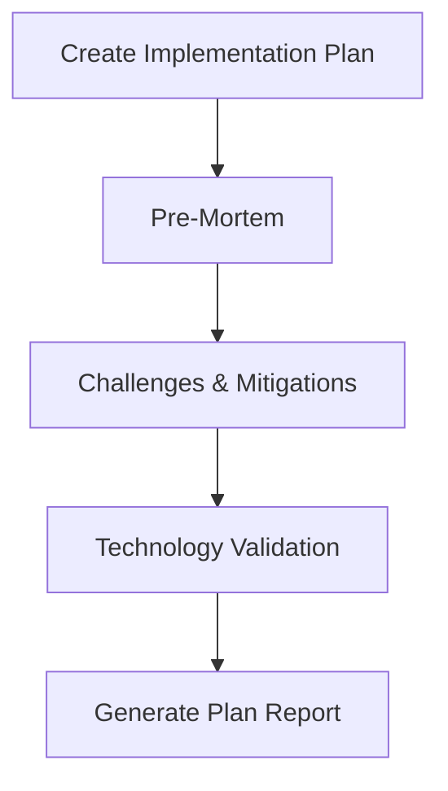

# Task: niko-plan-premortem

* Task ID: niko-plan-premortem
* Complexity: Level 3
* Type: feature

Add a pre-mortem lens to Niko's L2/L3 planning path ([issue #78](https://github.com/Texarkanine/.cursor-rules/issues/78)). Decline a separate "hard no" ritual; clarify L3 Invariants for any useful residue.

## Pinned Info

### Plan-phase insertion order

Pre-mortem runs only after an implementation plan exists, and before step-scoped Challenges so holistic findings can inform mitigations.

```mermaid
flowchart TD
  Impl["Create Implementation Plan"] --> PM["Pre-Mortem"]
  PM --> Ch["Challenges & Mitigations"]
  Ch --> Tech["Technology Validation"]
  Tech --> Report["Generate Plan Report"]
```

## Component Analysis

### Affected Components
- **L2 Plan** (`rulesets/niko/skills/niko/references/level2/level2-plan.md`): Add Pre-Mortem step + `tasks.md` template section; renumber subsequent steps.
- **L3 Plan** (`rulesets/niko/skills/niko/references/level3/level3-plan.md`): Same Pre-Mortem insertion; lightly strengthen Invariants & Constraints (positive framing); renumber subsequent steps; update PASS log if needed.
- **L4 Plan**: No pre-mortem (wrong object); leave cross-milestone invariants as-is (already clear).
- **Preflight / Creative / L1**: No changes.

### Cross-Module Dependencies
- Plan → (L3 creative loop) → Pre-Mortem → Challenges → Preflight → Build
- Reflect already reviews whether Challenges materialized; Pre-Mortem findings that become Challenges remain compatible

### Boundary Changes
- Agent-facing plan procedure and `tasks.md` contract gain a `## Pre-Mortem` section on L2/L3
- No memory-bank file taxonomy changes

### Invariants & Constraints
- Canonical edits only under `rulesets/`
- Pre-mortem must not duplicate preflight codebase checks
- No separate hard-no / what-must-never section
- Pre-mortem wording must not smuggle a negative checklist
- L1 and L4 top-level plan unchanged for this feature

## Open Questions

- [x] **Q1: Pre-mortem placement & relationship to Challenges & Mitigations** → Resolved: Dedicated Pre-Mortem step in plan after Implementation Plan, before Challenges; complementary to step-scoped Challenges; not creative/preflight (see `memory-bank/active/creative/creative-premortem-placement.md`)
- [x] **Q2: Which complexity levels receive pre-mortem** → Resolved: L2 + L3 only; L1 untouched; L4 top-level skipped (sub-runs inherit) (see `memory-bank/active/creative/creative-premortem-levels.md`)
- [x] **Q3: Disposition of "what must never" / hard-no** → Resolved: Decline separate ritual; fold useful residue into existing L3/L4 Invariants (positive framing); no L2 invariants expansion (see `memory-bank/active/creative/creative-hard-no-disposition.md`)

## Test Plan (TDD)

Prose/workflow deliverables — no executable test suite in this repo. Verification = structural `rg` checks + QA semantic review (same pattern as prior Niko prompt work).

### Behaviors to Verify

- **B1**: L2 plan procedure includes a named Pre-Mortem step after Create Implementation Plan and before Challenges & Mitigations → agent following L2 plan encounters the ritual in that order
- **B2**: L3 plan procedure includes the same ordered Pre-Mortem step → same for L3
- **B3**: L2 and L3 `tasks.md` templates include a `## Pre-Mortem` section → plan artifacts record findings
- **B4**: Pre-Mortem guidance asks for likely failure cause(s) and how the plan responds (mitigation / scope cut / open question) → positive, actionable framing
- **B5**: No Hard-No / What-Must-Never section added to plan templates → `rg` finds none in level2/level3 plan files as a new section
- **B6**: L3 Invariants & Constraints guidance remains positively framed ("preserve" / "must hold") and invites plan-level properties → not renamed to hard-no
- **B7**: L1 workflow/build and L4 plan files are unchanged for pre-mortem → `rg` for Pre-Mortem finds hits only in L2/L3 plan files
- **B8**: Challenges & Mitigations sections still exist on L2/L3 → complementary, not replaced

### Test Infrastructure

- Framework: none (prompt/rule prose)
- Verification: `rg` structural invariants + `/niko-qa` semantic constraints
- New test files: none

### Integration Tests

- N/A as automated tests; preflight validates plan against repo; QA validates built prompts against brief

## Implementation Plan

1. **Red — baseline structural checks (TDD substitute for prose)**
    - Files: none (shell only)
    - Changes: Run the B1–B8 `rg` assertions against `rulesets/niko/skills/niko/references/level*/` and record that Pre-Mortem is absent (expected fail/red). Keep the exact command list for step 4.

2. **L3 plan — Pre-Mortem step + template + invariants clarify**
    - Files: `rulesets/niko/skills/niko/references/level3/level3-plan.md`
    - Changes:
        - Strengthen Step 3 **Invariants & Constraints** bullet: plan-level properties that must hold (safety, compatibility, preserved non-goals/boundaries), still positive "must preserve / must hold" — no hard-no naming
        - Insert new step **Pre-Mortem** after Create Implementation Plan (current Step 7), before Challenges (current Step 8)
        - Renumber Technology Validation, Generate Plan Report, Log Progress, Phase Transition accordingly
        - Add `## Pre-Mortem` to `tasks.md` template (before Challenges & Mitigations)
        - Add Pre-Mortem to the Status checklist in the template
        - Add brief Pre-Mortem line to PASS log summary if Challenges is summarized there
        - Step body: ask "If this plan were to fail, what would be the likely cause?" Require 1–3 likely causes and, for each, how the plan changes (mitigation, scope cut, or new open question). Explicitly distinguish from Challenges (plan-level vs step-level) and from preflight (imagination vs codebase reality). Do not ask for a "must never" list.
    - Creative refs: placement, levels, hard-no disposition

3. **L2 plan — Pre-Mortem step + template**
    - Files: `rulesets/niko/skills/niko/references/level2/level2-plan.md`
    - Changes: Same Pre-Mortem insertion after Create Implementation Plan (Step 5), before Challenges (Step 6); renumber; add `## Pre-Mortem` to template + Status checklist; PASS log touch-up if needed. Wording aligned with L3 (shared intent, L2-proportional brevity).
    - Creative refs: placement, levels

4. **Green — re-run structural verification**
    - Files: none (shell `rg` only)
    - Changes: Re-run the step-1 command list; all B1–B8 assertions must pass

5. **Docs / sync note**
    - No README change required (README does not document Challenges internals)
    - Do not edit `.cursor/` copies; sync happens via `ai-rizz` after push per techContext

## Technology Validation

No new technology - validation not required

## Challenges & Mitigations

- **Agents conflate Pre-Mortem with Challenges**: Mitigation — explicit one-line distinction in both step bodies (plan-level likely cause vs per-step what-could-go-wrong).
- **Pre-Mortem becomes a hollow checkbox**: Mitigation — require causes + plan responses (not "N/A" without justification); empty/vague findings should trigger revisiting the implementation plan.
- **Hard-no sneaks back via wording**: Mitigation — creative Q3 + explicit "do not ask for must-never list" in step body; QA checks for negative-checklist sections.
- **Step renumbering breaks internal cross-references**: Mitigation — search each plan file for "Step N" references after renumbering.
- **L2/L3 Pre-Mortem wording drifts**: Mitigation — accept parallel copies (same pattern as Challenges today); do not extract a shared reference in this task (YAGNI). Revisit only if drift appears in the wild.

### Preflight amendments (2026-07-09)

- Reordered implementation for prose TDD: baseline `rg` (red) → edits → `rg` (green).
- Status checklist must include Pre-Mortem in both templates.
- Advisory considered and declined: extracting shared Pre-Mortem reference — would diverge from Challenges' duplicated-inline pattern without proven drift.

## Pre-Mortem

*(This task's own plan — dogfooding the ritual we are adding.)*

**If this plan failed, likely causes:**
1. **Wording too weak** — agents treat Pre-Mortem as another Challenges dump → Mitigation: named section + explicit distinction + require plan-change responses.
2. **Scope creep into L4/L1 or hard-no section** — Mitigation: creative decisions lock scope; verification B5/B7.
3. **Only L3 edited, L2 forgotten** — Mitigation: implementation step 2 is first-class; B1/B2 both required.

## Status

- [x] Component analysis complete
- [x] Open questions resolved
- [x] Test planning complete (TDD)
- [x] Implementation plan complete
- [x] Technology validation complete
- [x] Preflight
- [ ] Build
- [ ] QA
