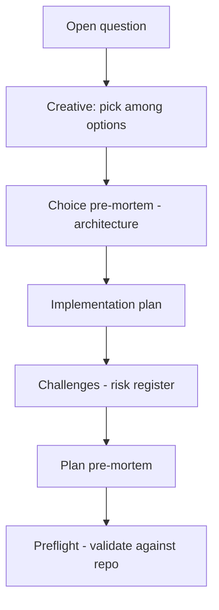

# Task: niko-plan-premortem

* Task ID: niko-plan-premortem
* Complexity: Level 3
* Type: feature

Add Klein pre-mortem lenses to Niko ([issue #78](https://github.com/Texarkanine/.cursor-rules/issues/78)): (1) plan-end whole-plan pre-mortem after Challenges on L2/L3; (2) architecture creative choice-level pre-mortem as complement. Keep Challenges as today's risk register. Decline a separate "hard no" ritual; clarify L3 Invariants for any useful residue.

## Pinned Info

### Two pre-mortem objects

```mermaid
flowchart TD
  OQ["Open question"] --> Creative["Creative: pick among options"]
  Creative --> ChoicePM["Choice pre-mortem - architecture"]
  ChoicePM --> Plan["Implementation plan"]
  Plan --> Ch["Challenges - risk register"]
  Ch --> PlanPM["Plan pre-mortem"]
  PlanPM --> Preflight["Preflight - validate against repo"]
```

Order inside plan phase is enforced by numbered steps and explicit transitions (not document position).

## Component Analysis

### Affected Components
- **L2 Plan** (`rulesets/niko/skills/niko/references/level2/level2-plan.md`): Plan-end Pre-Mortem after Challenges; template; renumber. Challenges unchanged.
- **L3 Plan** (`rulesets/niko/skills/niko/references/level3/level3-plan.md`): Same; strengthen Invariants & Constraints (positive framing); PASS log touch-up.
- **Architecture creative** (`rulesets/niko/skills/niko/references/phases/creative/creative-phase-architecture.md`): Choice-level pre-mortem after Decide; output format subsection; keep Risk criterion as blast radius/reversibility.
- **Creative template** (`.../creative-phase-template.md`): Document architecture-required / optional-elsewhere pattern for new phase types.
- **L4 / Preflight / L1 / other creative types**: No mandatory changes (generic/algorithm/uiux may adopt later).

### Cross-Module Dependencies
- L3: Creative (with choice PM) → Plan → Challenges → Plan PM → Preflight → Build
- L2: Plan → Challenges → Plan PM → Preflight (no creative)
- Reflect: Challenges review unchanged; creative docs may carry choice PM for later reading

### Boundary Changes
- Plan `tasks.md` contract: `## Pre-Mortem` after Challenges
- Architecture creative artifact: choice pre-mortem under Decision (or short subsection)
- No memory-bank taxonomy changes

### Invariants & Constraints
- Canonical edits only under `rulesets/`
- Challenges risk-register preserved
- Plan PM ≠ choice PM (different objects); neither re-lists the other's concerns as a dump
- Risk criterion retained; choice PM is a separate closing beat
- Ordering explicit in numbered steps + transitions

## Open Questions

- [x] **Q1: Plan pre-mortem placement** → B2: after Challenges; visualize-failure only (see `creative-premortem-placement.md`)
- [x] **Q2: Levels** → L2 + L3 plan-end; L1/L4 top-level skip (see `creative-premortem-levels.md`)
- [x] **Q3: Hard-no** → Decline; clarify L3 Invariants (see `creative-hard-no-disposition.md`)
- [x] **Q4: Creative complement** → Architecture-only choice pre-mortem after Decide + template note; ship with plan-end in this task (see `creative-creative-premortem-complement.md`)

## Test Plan (TDD)

Prose/workflow deliverables — verification = structural `rg` + QA.

### Behaviors to Verify

- **B1**: L2 plan has Pre-Mortem after Challenges & Mitigations, before Technology Validation, with explicit transition
- **B2**: L3 plan has the same ordered Pre-Mortem step
- **B3**: L2/L3 `tasks.md` templates have `## Pre-Mortem` after `## Challenges & Mitigations`
- **B4**: Plan Pre-Mortem asks to imagine the *plan* already failed; causes + plan changes; must not re-list Challenges
- **B5**: No Hard-No / What-Must-Never section in plan templates
- **B6**: L3 Invariants positively framed; invites plan-level properties
- **B7**: L1/L4 plan files unchanged for plan Pre-Mortem; plan Pre-Mortem hits only L2/L3 plan files
- **B8**: Challenges step/template intact (identify+mitigate), not replaced by pre-mortem wording
- **B9**: Architecture creative includes a post-Decide choice pre-mortem (incantation + record likely wrong-reason + unchecked-constraint → confidence gate)
- **B10**: Architecture output template includes a place for that choice pre-mortem; existing Risk criterion still present
- **B11**: Creative template documents architecture-required / optional-elsewhere; generic/algorithm/uiux not required to gain a mandatory beat in this task

### Test Infrastructure

- Framework: none
- Verification: `rg` + `/niko-qa`
- New test files: none

## Implementation Plan

1. **Red — baseline structural checks** ✅
    - Files: none (shell)
    - Changes: Run B1–B11 `rg` assertions; plan/creative Pre-Mortem absent (expected red). Keep command list for green step.

2. **L3 plan — plan-end Pre-Mortem + invariants** ✅
    - Files: `rulesets/niko/skills/niko/references/level3/level3-plan.md`
    - Changes: As previously specified (Pre-Mortem after Challenges; invariants clarify; template; Status; PASS log)
    - Creative refs: Q1–Q3

3. **L2 plan — plan-end Pre-Mortem** ✅
    - Files: `rulesets/niko/skills/niko/references/level2/level2-plan.md`
    - Changes: Same pattern; Challenges unchanged
    - Creative refs: Q1–Q2

4. **Architecture creative — choice pre-mortem** ✅
    - Files: `rulesets/niko/skills/niko/references/phases/creative/creative-phase-architecture.md`
    - Changes:
        - After Decide (before Output), add step or Decide subsection: pre-mortem this *choice* — if we shipped it and it turned out wrong, what would the likely reason be?
        - Require 1–3 likely reasons; mark whether each is already checked; if unchecked constraint/assumption → do not finalize high confidence until verified, or return low confidence
        - Keep Risk criterion unchanged (blast radius / reversibility)
        - Extend output document format with choice pre-mortem under Decision
    - Creative ref: Q4

5. **Creative template — document the pattern** ✅
    - Files: `rulesets/niko/skills/niko/references/phases/creative/creative-phase-template.md`
    - Changes: Note architecture requires choice pre-mortem after Decide; other types may use when load-bearing; do not mandate rewriting all phase types in this task
    - Creative ref: Q4

6. **Green — re-run structural verification** ✅
    - Files: none
    - Changes: All B1–B11 pass

7. **Docs / sync note** ✅
    - No README required; no `.cursor/` edits; `ai-rizz` after push

## Technology Validation

No new technology - validation not required

## Challenges & Mitigations

- **Agents conflate plan PM with Challenges**: Mitigation — forbid re-listing tech risks; one-line "already covered" escape.
- **Agents conflate choice PM with plan PM or with Risk**: Mitigation — word choice PM as *this decision*; keep Risk as blast radius; plan PM says *this plan*.
- **Choice PM hollow / always "N/A"**: Mitigation — require reasons; unchecked → confidence gate.
- **Ceremony on tiny creatives**: Mitigation — architecture-only mandatory; others optional via template.
- **Step renumbering breaks refs**: Mitigation — search "Step N" after edits.
- **Scope creep into all creative types**: Mitigation — Q4 explicitly defers mandatory generic/algorithm/uiux.

### Preflight amendments

- Initial + after-Challenges revision as before.
- (2026-07-09) Scope expanded: Q4 creative complement specified and added to implementation (architecture + template); behaviors B9–B11.

## Pre-Mortem

*(Dogfooding plan-end frame.)*

**If this plan failed, likely causes:**
1. **Choice PM and plan PM blur into one vague "think about risks" blur** — Mitigation: different objects in copy; B4 vs B9 assertions.
2. **Architecture special-case forgotten; only plans edited** — Mitigation: steps 4–5 first-class; B9–B11.
3. **Confidence gate too weak (still high-confidence on unchecked premises)** — Mitigation: explicit "do not finalize high confidence" language in architecture step.

## Status

- [x] Component analysis complete
- [x] Open questions resolved
- [x] Test planning complete (TDD)
- [x] Implementation plan complete
- [x] Technology validation complete
- [x] Preflight
- [x] Build
- [x] QA
