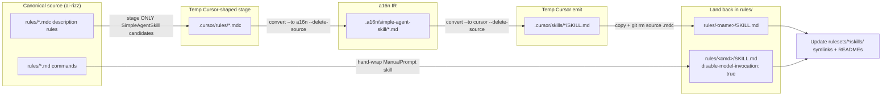

# Task: description-rules-and-commands-to-skills

* Task ID: description-rules-and-commands-to-skills
* Complexity: Level 3
* Type: migration / refactor

Migrate agent-selected description rules and remaining commands under `rules/` into Cursor agent skills. Description rules go through `npx a16n convert` (cursor → a16n IR → cursor) with `--delete-source` on a staged Cursor-shaped tree; the two commands are hand-wrapped as ManualPrompt skills (`disable-model-invocation: true`) because a16n skips them on `@` (false-positive vs GitHub/example mentions). Update ruleset symlinks/docs; commit liberally.

## Pinned Info

### Conversion topology

Why pinned: every build step depends on understanding that a16n only discovers `.cursor/{rules,commands,skills}/`, while this repo’s canonical source is `rules/` + `rulesets/`.


```mermaid
flowchart LR
  subgraph source ["Canonical source (ai-rizz)"]
    R["rules/*.mdc description rules"]
    C["rules/*.md commands"]
  end

  subgraph stage ["Temp Cursor-shaped stage"]
    SR[".cursor/rules/*.mdc"]
  end

  subgraph ir ["a16n IR"]
    SAS[".a16n/simple-agent-skill/*.md"]
  end

  subgraph out ["Temp Cursor emit"]
    SK[".cursor/skills/*/SKILL.md"]
  end

  subgraph land ["Land back in rules/"]
    RS["rules/&lt;name&gt;/SKILL.md"]
    MP["rules/&lt;cmd&gt;/SKILL.md<br/>disable-model-invocation: true"]
  end

  R -->|"stage ONLY SimpleAgentSkill candidates"| SR
  SR -->|"convert --to a16n --delete-source"| SAS
  SAS -->|"convert --to cursor --delete-source"| SK
  SK -->|"copy + git rm source .mdc"| RS
  C -->|"hand-wrap ManualPrompt skill"| MP
  RS --> Sym["Update rulesets/*/skills/ symlinks + READMEs"]
  MP --> Sym
```

## Component Analysis

### Affected Components
- **`rules/` description `.mdc` (10)**: currently agent-selected Cursor rules → become `rules/<name>/SKILL.md` SimpleAgentSkill directories; source `.mdc` deleted.
- **`rules/` commands (2)**: `pr-feedback-judge.md`, `wiggum-niko-coderabbit-pr.md` → hand-wrapped ManualPrompt skills; source `.md` deleted.
- **`rules/` keep-as-rules**: GlobalPrompts (`always-tdd`, `git-safety`, `niko-core`, `script-it-instead`, `test-running-practices`) and FileRules (`markdown-style`, `java-gradle-tdd`) — **out of conversion scope**.
- **`rules/` existing skills**: `architecture-docs`, `prompt-authoring`, `xy-problem` — unchanged.
- **`rulesets/`**: symlinks that pointed at converted `.mdc` must become `skills/<name> → ../../../rules/<name>` (or equivalent); READMEs that link `.mdc` paths updated.
- **`memory-bank/systemPatterns.md`**: File Organization still lists Commands as a first-class tier — update after migration so it is not factually wrong.
- **`.cursor/` / `.claude/`**: generated copies — **do not edit**; consumers re-sync via ai-rizz/a16n after push.

### Cross-Module Dependencies
- Ruleset symlinks → `rules/` targets (broken if `.mdc` deleted before symlink rewrite).
- Ruleset READMEs → relative links into `rules/`.
- a16n classification priority: `alwaysApply: true` → GlobalPrompt; `globs:` → FileRule; else `description:` → SimpleAgentSkill. Do **not** stage FileRules/GlobalPrompts (full-tree convert renames FileRules to `cursor-rules-*`).

### Boundary Changes
- Public surface for consumers: agent-selected description rules become installable skills; slash commands become ManualPrompt skills (`/name` via `disable-model-invocation: true`). Individual `ai-rizz add rule <name>` paths remain for items living under `rules/`.
- No API/schema changes outside this repo’s customization layout.

### Invariants & Constraints
- Must preserve GlobalPrompt and FileRule semantics (do not round-trip them through a16n).
- Must land skills at `rules/<name>/SKILL.md` (ai-rizz authoring layout), not leave them only under temp `.cursor/skills/`.
- Must not edit `.cursor/**` or `.claude/**` canonical content in this repo.
- Must not use `@`-neutralize hacks; commands are hand-wrapped.
- Must commit liberally between reversible stages.
- Content bodies of converted description rules should match a16n emit (frontmatter becomes skill `name`/`description`).

## Open Questions

- [x] Command conversion when a16n skips `@` → **Resolved (operator):** hand-wrap as ManualPrompt skills with `disable-model-invocation: true`, matching a16n’s successful emit shape (`name`, `description: "Invoke with /<name>"`, body unchanged). No `@` mutation.
- [x] Scope of “rules WITH DESCRIPTIONS” vs FileRules that also have `description:` → **Resolved (intent + a16n priority):** only agent-selected SimpleAgentSkill candidates (non-empty `description`, not `alwaysApply: true`, no `globs`). FileRules `markdown-style`, `java-gradle-tdd` stay rules.
- [x] How to apply a16n to ai-rizz `rules/` layout → **Resolved (empirical):** stage only candidates into a temp Cursor tree; IR round-trip with `--delete-source` on stage/IR; harvest skills into `rules/`; `git rm` sources; fix rulesets.

## Test Plan (TDD)

### Behaviors to Verify

- **B1 Discover inventory**: staged discover of candidates → exactly the 10 SimpleAgentSkill paths; FileRules/GlobalPrompts absent from stage.
- **B2 Description → skill**: after conversion+land, each of the 10 names exists as `rules/<name>/SKILL.md` with non-empty `description:` and no sibling `rules/<name>.mdc`.
- **B3 Commands → ManualPrompt skills**: `rules/pr-feedback-judge/SKILL.md` and `rules/wiggum-niko-coderabbit-pr/SKILL.md` exist with `disable-model-invocation: true`; source `.md` files gone.
- **B4 Keep-as-rules intact**: the 5 GlobalPrompts + 2 FileRules still present as `rules/*.mdc` with original classification frontmatter.
- **B5 Existing skills intact**: `architecture-docs`, `prompt-authoring`, `xy-problem` directories unchanged.
- **B6 Ruleset links**: no dangling symlinks under `rulesets/` pointing at deleted `.mdc`; converted members that belonged to a ruleset are linked under that ruleset’s `skills/`.
- **B7 No residual agent-selected description rules**: among `rules/*.mdc`, none remain that a16n would classify as SimpleAgentSkill.
- **B8 No residual commands**: no frontmatter-less `rules/*.md` command files remain at top level.
- **B9 Docs**: ruleset READMEs and `systemPatterns.md` File Organization no longer claim converted items are `.mdc` rules/commands when they are skills.

### Test Infrastructure

- Framework: **none** (content repo; prior art uses scripted/inspection verification — see archives for `pr-feedback-judge`, `manual-rules-to-skill-resources`).
- Test location: ephemeral verify script under `/tmp` or a short-lived `scripts/verify-skillify.sh` if kept; prefer **inline verify commands committed only if reusable** — default: non-committed script regenerated during build, assertions run via shell.
- Conventions: assert via `test -f` / `rg` / staged `npx a16n discover --json` parsing (python3 one-liners), matching prior migrations.
- New test files: none in-repo unless a tiny verify script proves useful; no unit-test framework introduction.

### Integration Tests

- **I1**: End-state staged discover of full `rules/` mirrored Cursor tree → SimpleAgentSkill count from `.mdc` is 0; skills discovered from `rules/*/SKILL.md` when staged under `.cursor/skills/`; ManualPrompt for the two former commands.
- **I2**: Ruleset symlink resolve (`readlink -f` / `test -e`) for every symlink under `rulesets/`.

## Implementation Plan

1. **Verify harness (failing first)** — write `scripts/verify-skillify.py` (or equivalent) encoding B1–B8 as assertions against current tree; run it and confirm **FAIL** (skills missing, description `.mdc` still present).
    - Files: `scripts/verify-skillify.py` (new; may remain as migration aid)
    - Changes: assertions only; no content migration yet

2. **Enumerate + commit baseline inventory** — record discover results for staged candidates; commit memory-bank note if needed.
    - Files: `memory-bank/active/progress.md` (append inventory)
    - Changes: document the 10 + 2 target list

3. **Convert description rules via a16n (TDD cycle)** — for each batch (or all 10):
    - Re-run verify subset expecting skill absent → FAIL
    - Stage only those `.mdc` into temp `.cursor/rules/`
    - `npx a16n convert --from cursor --to a16n --from-dir <stage> --to-dir <ir> --delete-source`
    - `npx a16n convert --from a16n --to cursor --from-dir <ir> --to-dir <out> --delete-source`
    - `mkdir rules/<name> && cp <out>/.cursor/skills/<name>/SKILL.md rules/<name>/`
    - `git rm rules/<name>.mdc`
    - Commit: `refactor(rules): convert <name> description rule to skill`
    - Re-run verify subset → PASS for that name
    - Files: `rules/<name>/SKILL.md` (new), `rules/<name>.mdc` (deleted)
    - Names: `bash-style`, `cursor-conversation-transcript`, `cursor-create-rule`, `github-open-a-pull-request-gh`, `how-to-script-it-instead`, `planning-execution`, `shell-posix-style`, `shell-tdd`, `task-list-management`, `visual-planning`

4. **Hand-wrap commands as ManualPrompt skills (TDD cycle)** — for each of the two commands:
    - Verify skill absent → FAIL
    - Create `rules/<name>/SKILL.md` with frontmatter:
      ```yaml
      ---
      name: "<name>"
      description: "Invoke with /<name>"
      disable-model-invocation: true
      ---
      ```
      followed by the **unchanged** body of the former `.md` (strip nothing; no `@` rewriting)
    - `git rm rules/<name>.md`
    - Commit per command
    - Verify → PASS
    - Files: `rules/pr-feedback-judge/SKILL.md`, `rules/wiggum-niko-coderabbit-pr/SKILL.md`

5. **Rewrite ruleset symlinks (TDD: I2)** — for each converted item that had a ruleset `.mdc` symlink:
    - Remove old symlink
    - Ensure `rulesets/<set>/skills/` exists; `ln -s ../../../rules/<name> <name>`
    - Affected:
      - `rulesets/shell`: `bash-style`, `shell-posix-style`, `shell-tdd` → `skills/`
      - `rulesets/script-it`: `how-to-script-it-instead` → `skills/` (keep `script-it-instead.mdc` GlobalPrompt)
      - `rulesets/meta`: replace `conversation-transcript.mdc` / `create-cursor-rule.mdc` with `skills/conversation-transcript` → `../../../rules/cursor-conversation-transcript` and `skills/create-cursor-rule` → `../../../rules/cursor-create-rule` (preserve short ruleset-local names; targets use a16n/skill directory names)
      - `rulesets/authoring`: `visual-planning` → `skills/`
      - `rulesets/niko`: `visual-planning` → `skills/`
    - Commit: `refactor(rulesets): point converted members at skills`
    - Run I2 → PASS

6. **Update docs**
    - Files: `rulesets/shell/README.md`, `rulesets/authoring/README.md`, `rulesets/niko/README.md`, `memory-bank/systemPatterns.md` (File Organization: Commands deprecated/removed from this repo’s source tiers; Skills cover ManualPrompt + agent skills)
    - Changes: link to `SKILL.md` / skill dirs; drop command tier as active source practice here
    - Commit: `docs: reflect description-rules→skills migration`

7. **Final verify** — run full B1–B9 + I1–I2; fix any stragglers; commit verify script if kept: `test: add skillify migration verifier` (or delete script if one-shot — prefer keep until after QA).

8. **Do not** refresh `.cursor/` / `.claude/` trees in this task (generated; ai-rizz reads remote).

## Technology Validation

No new technology — validation not required. Uses existing `npx a16n` (already exercised in planning dry-runs) and git/symlink conventions already used by this repo.

## Challenges & Mitigations

- **a16n only sees `.cursor/` layout**: mitigate via selective temp staging; never convert the live repo root’s mixed `.cursor/` install tree for this migration.
- **Full-tree convert renames FileRules** (`cursor-rules-*`): mitigate by staging **only** the 10 SimpleAgentSkill `.mdc` files.
- **a16n skips commands containing `@`**: mitigate by hand-wrap (operator decision); do not mutate `@`.
- **Broken ruleset symlinks if order wrong**: delete/rewrite symlinks in the same commit as (or immediately after) source deletion; run I2 after.
- **`--delete-source` only deletes stage/IR, not `rules/`**: always `git rm` canonical sources explicitly after successful harvest.
- **visual-planning** appears in multiple rulesets: both get `skills/visual-planning` symlinks; single canonical `rules/visual-planning/`.

## Pre-Mortem

- **Converted the installed `.cursor/` tree instead of `rules/`**: plan pins staging topology; build steps forbid editing `.cursor/` canonical sources.
- **Round-tripped GlobalPrompts/FileRules and corrupted names**: selective staging invariant + B4 assertions.
- **Left ruleset symlinks dangling / ai-rizz list broken**: I2 + README updates as explicit steps.
- **Treated FileRules with descriptions as in-scope**: open question resolved; B7 checks classification of remaining `.mdc` only.
- **Tried to “fix” command `@` for a16n**: explicitly banned; hand-wrap path only.

## Status

- [x] Component analysis complete
- [x] Open questions resolved
- [x] Test planning complete (TDD)
- [x] Implementation plan complete
- [x] Technology validation complete
- [x] Pre-Mortem complete
- [x] Preflight
- [x] Build
  - [x] Verify harness (fail-first → green)
  - [x] Convert 10 description rules via a16n + land
  - [x] Hand-wrap 2 commands as ManualPrompt skills
  - [x] Rewrite ruleset symlinks
  - [x] Update docs (`rulesets/*/README.md`, `systemPatterns.md`)
  - [x] Final verify B1–B9 + I1–I2
- [x] QA — PASS (trivial: drop unused `stale` local in verifier)
