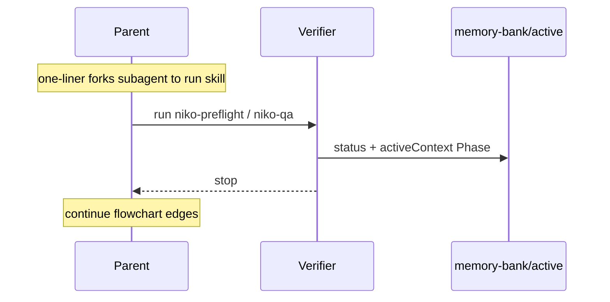

# Task: verification-subagents-preflight-qa

* Task ID: verification-subagents-preflight-qa
* Complexity: Level 3
* Type: orchestration / prompt authorship

Run Niko preflight and QA via a forked subagent that runs the existing skill. Parent one-liner forks; skill ends without continuing the workflow. No new orchestration file.

## Plan Amendment (2026-08-07)

Operator rejected `run-verification.md` and rigid fork/wait liturgy. Further pivot: **workflow mermaid is source of truth**; QA/preflight become terminal (grammar TBD in creative); prose percolates after charts land.

- Drop `run-verification.md`
- **Blocked on** `creative/creative-l1-verification-diagram.md` (operator picks L1 grammar + T1 vs T2)
- Then: mirror charts L2–L4 → phase mappings / skills / secondary sites / README
- Preflight remains stale until plan stabilizes post-diagram
## Pinned Info

### Verification handoff

```mermaid
sequenceDiagram
    participant P as Parent
    participant V as Verifier
    participant MB as memory-bank/active

    Note over P: one-liner forks subagent to run skill
    P->>V: run niko-preflight / niko-qa
    V->>MB: status + activeContext Phase
    V-->>P: stop
    Note over P: continue flowchart edges
```

## Component Analysis

### Affected Components

- `niko-preflight` / `niko-qa`: Step 4 stop + `activeContext` Phase; strip transition verbs in Handle Results
- Level 1–4 workflow Phase Mappings (6 lines): invoke → fork one-liner
- Secondary sites: `level2-build.md`, `level3-build.md`, `level4-plan.md` Step 7
- **Not** adding `run-verification.md`

### Boundary Changes

- Direct skill invoke (manual recovery): PASS does not continue the workflow
- Status-file gates unchanged; mermaid unchanged

## Open Questions

- [x] Q1 Placement → **Amended:** no shared reference; one-liner at each call site
- [x] Q2 Step 4 → Unconditional stop + `activeContext` Phase (kept; wording tightened)
- [x] Q3 Model → Kept as short heuristic inside the one-liner (no separate procedure)

## Breadth gaps (enthusiasm checklist)

Things easy to skip if you only picture the happy-path one-liner — all in scope for build:

| Gap | Why it matters | Plan response |
| --- | --- | --- |
| Skill Step 4 still continues today | Forked child on L2 PASS walks into build | Rewrite Step 4 to stop |
| `activeContext` `**Phase:**` | `/niko` Step 6 resumes phase; without a write, recovery + `/niko` re-enters verification | Step 4 writes phase complete + result |
| “Do not run the skill in this conversation” | Without it, parent helpfully runs inline | On every call-site line |
| Secondary sites (`level2-build` especially) | “proceed as instructed there” is the old single-context path | Same fork one-liner, then re-check status |
| Handle Results transition verbs | “Return to Build”, “Allow transition to `/niko-build`” contradict stop | Report-only wording |
| L4 plan Step 7 | Direct “Invoke preflight to execute” bypasses workflow mapping | Same one-liner |
| L1 QA | Only gate on L1; same rubber-stamp risk | Same one-liner (no exception) |
| Over-specified child lifecycle | Not needed; harness forks/waits | Omitted on purpose |
| In-process fallback essay | User: don’t rigidify; prohibition is enough | No fallback novella; if fork impossible, operator recovers manually (already designed) |

## Test Plan

Prose only (`always-tdd` carve-out). Dry-read:

1. L2 parent PASS → fork → parent continues to build
2. L3 parent PASS → fork → parent waits for `/niko-build`
3. Manual `/niko-preflight` PASS → stop; `/niko` resumes from recorded phase
4. Skills have no path that loads a level workflow after verification
5. No call site still says invoke-and-proceed in-process

## Implementation Plan

1. **Six Phase Mapping one-liners**
    - Files: `level1-workflow.md`, `level2-workflow.md`, `level3-workflow.md`, `level4-workflow.md`
    - Changes: replace `Invoke the niko-* skill` with the parent one-liner (skill name only differs)

2. **Three secondary sites**
    - Files: `level2-build.md`, `level3-build.md`, `level4-plan.md`
    - Changes: same fork one-liner; build guards re-check status before continuing; no “proceed as instructed”

3. **`niko-preflight` Step 4 + Handle Results**
    - File: `rulesets/niko/skills/niko-preflight/SKILL.md`
    - Changes: End of Verification (tight); PASS WITH ADVISORY / TDD-fail lines stop routing the workflow

4. **`niko-qa` Step 4 + Handle Results**
    - File: `rulesets/niko/skills/niko-qa/SKILL.md`
    - Changes: same; FAIL lines report Build/Plan must rerun — do not “Return to” those phases

5. **README**
    - Confirm no false same-conversation claim; edit only if needed

6. **Dry-read** walkthroughs 1–5 after edits

## Technology Validation

No new technology - validation not required.

## Challenges & Mitigations

- Parent runs skill inline despite prohibition: Step 4 still stops (independence lost, flow OK)
- Missing Phase write: resume re-verifies — must land in Step 4
- Prose bloat: match existing Niko directness; do not paste Fable A1/Opus skeletal verbatim

## Pre-Mortem

- Over-orchestration creeps back at build → reject any new reference file or wait/read liturgy
- Step 4 left soft (“prefer stop”) → child continues; must be unconditional
- Secondary sites forgotten → L2 build still single-contexts preflight

## Build-source wording

### Parent one-liner (preflight; QA swaps skill name)

~~~markdown
- **Level N Preflight Phase**: Fork a subagent at least as capable as you (smarter / different family if possible) to run the `niko-preflight` skill — do not run the skill in this conversation.
~~~

### Secondary (build missing-preflight)

~~~markdown
🚨 If preflight has not passed: STOP — fork a subagent at least as capable as you (smarter / different family if possible) to run the `niko-preflight` skill; do not run it in this conversation. Re-check `memory-bank/active/.preflight-status` before continuing.
~~~

### Skill Step 4 (preflight; QA: `.qa-validation-status` / “reflect” if a punch line is needed — prefer none)

~~~markdown
## Step 4: End of Verification

Update `memory-bank/active/activeContext.md` so `**Phase:**` records this phase complete with PASS or FAIL. Do not load a level workflow or begin another phase. Stop.
~~~

### Handle Results micro-edits (direction)

- preflight “Allow transition to `/niko-build`” → keep PASS WITH ADVISORY as a result, not a transition grant
- preflight “re-run `/niko-plan`” → tell the operator in the report
- qa “Return to the Build/Plan phase” → record that Build/Plan must rerun

## Status

- [x] Component analysis complete
- [x] Open questions resolved (amended)
- [x] Test planning complete
- [x] Implementation plan complete (amended)
- [x] Technology validation complete
- [x] Pre-Mortem complete
- [ ] Preflight (re-run required after amendment)
- [ ] Build
- [ ] QA
- [ ] Reflect
- [ ] Archive
