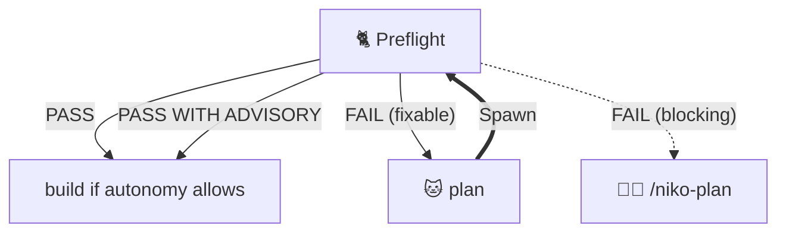

# Task: preflight-analyze-and-report

* Task ID: preflight-analyze-and-report
* Complexity: Level 3
* Type: intermediate feature (rework, issue #114)

Four-way Preflight results and in-phase change-detector strike, as described in https://github.com/Texarkanine/.cursor-rules/issues/114. Judge-only plus TDD step-swap already shipped on this branch.

## Pinned Info

### Preflight outs

Parent routing after spawn. Solid = no operator. Dashed = operator. Spawn stem unchanged.

```mermaid
flowchart TD
  PF["🐈 Preflight"]
  Plan["🐱 plan"]
  OpPlan["🧑‍💻 /niko-plan"]
  Build["build if autonomy allows"]

  PF -->|"PASS"| Build
  PF -->|"PASS WITH ADVISORY"| Build
  PF -->|"FAIL (fixable)"| Plan
  PF -.->|"FAIL (blocking)"| OpPlan
  Plan ==Spawn==> PF
```

## Component Analysis

### Affected Components
- `preflight-status.mdc`: one-line semaphore vocabulary → replace undifferentiated `FAIL` with `FAIL (fixable)` and `FAIL (blocking)` so the file matches Handle Results and the charts
- `niko-preflight` skill: judge-only with TDD swap → add change-detector strike beside that swap; rewrite Handle Results and the FAIL print template to the four outs
- L2/L3 workflow files: single Preflight FAIL, dashed to operator `/niko-plan` → four outs; `FAIL (fixable)` solid to 🐱 plan; STOP lists split
- L4 workflow: solid `FAIL` → plan already matches fixable; add dashed `FAIL (blocking)` and `PASS WITH ADVISORY` on the existing PASS→review edge
- `rulesets/niko/README.md`: short, long, L2, L3, L4 charts still show a single Preflight FAIL → same four-way splice. L1 chart unchanged
- `niko-qa`: QA `FAIL (fixable)` → Build stays. Out of scope

### Cross-Module Dependencies
- Skill writes `.preflight-status` → Build gates on `PASS` / `PASS WITH ADVISORY` (already; both FAIL variants fail the gate) → parent follows the level workflow chart from the result string
- Workflow STOP lists must match chart dashed edges, or the parent will still halt on `FAIL (fixable)`
- README charts are consumer-facing copies of the same edges, not a second contract

### Boundary Changes
- `.preflight-status` allowed values become exactly: `PASS`, `PASS WITH ADVISORY`, `FAIL (fixable)`, `FAIL (blocking)`. Drop bare `FAIL`
- Niko workflow public edges: Preflight `FAIL (fixable)` → Plan (autonomous, may loop); `FAIL (blocking)` → operator `/niko-plan`

### Invariants
- Four outs mean and route as in the pinned chart and issue #114
- In-phase plan writes: TDD step-swap and change-detector strike only; both `PASS WITH ADVISORY`
- Missing tests, a different approach, brief-level scope change: not in-phase; FAIL by the “materially change the plan” line; do not over-define that line
- `FAIL (fixable)` name reuse with QA is intentional; do not rename
- Nine-site Spawn stem unchanged
- QA edges unchanged
- Canonical edits under `rulesets/` only
- No nested Preflight/QA subgraphs
- Status file stays one line; not a findings store
- No emitting missing always-tdd stages

## Open Questions

None - implementation approach is clear

## Test Plan (TDD)

### Behaviors to Verify

No new executable behavior.

### Test Infrastructure

- Framework: `make test`
- Test location: `scripts/`
- Conventions: ruleset symlink targets and README internal links
- New test files: none

### Integration Tests

None. Do not add change-detector tests that assert on skill or chart wording.

## Implementation Plan

### 1. Preflight status vocabulary — prose/policy

- Files: `rulesets/niko/niko/memory-bank/active/preflight-status.mdc`
- No tests: prose/policy artifact

1. Replace the `FAIL` bullet with two allowed values: `FAIL (fixable)` (known fix; planner rewrites; parent → Plan) and `FAIL (blocking)` (material plan change; operator `/niko-plan`).
2. Keep `PASS` and `PASS WITH ADVISORY` as build gates. `PASS WITH ADVISORY` includes in-phase edits.
3. Exact casing; write exactly one. No bare `FAIL`. No findings schema.

### 2. Preflight skill outs and change-detector strike — prose/policy

- Files: `rulesets/niko/skills/niko-preflight/SKILL.md`
- No tests: prose/policy artifact

1. TDD Plan Encoding: when a numbered step is a scheduled change-detector, delete that step. Same remaining steps. Record the finding and continue. Keep the existing TDD swap. Missing test steps still FAIL. Do not invent tests. Do not emit always-tdd stages.
2. Judge, Do Not Fix: allowed plan writes are the TDD swap and that strike only. Bookkeeping writes unchanged.
3. Handle Results: four outs matching unit 1 strings. After a TDD swap or a change-detector strike: `PASS WITH ADVISORY` unless another check fails. `FAIL (fixable)`: parent → Plan; do not patch. `FAIL (blocking)`: operator `/niko-plan`; do not patch. Drop “re-run `/niko-preflight`” as the fixable next step. Drop `FAIL (rearchitect)` / `FAIL (conflict/convention)` names.
4. FAIL print template Next Steps: `FAIL (fixable)` → Plan; `FAIL (blocking)` → `/niko-plan`. End of Verification examples may show the four values. Spawn instruction is not in this file’s parent stem; do not add one.

### 3. Level workflow charts and STOP lists — prose/policy

- Files: `rulesets/niko/skills/niko/references/level2/level2-workflow.md`, `rulesets/niko/skills/niko/references/level3/level3-workflow.md`, `rulesets/niko/skills/niko/references/level4/level4-workflow.md`
- No tests: prose/policy artifact

1. L2: add `PASS WITH ADVISORY` on the existing PASS→build solid edge. `FAIL (fixable)` solid → 🐱 plan. `FAIL (blocking)` dashed → `/niko-plan`. STOP list: replace “Preflight FAIL -> Plan” with “Preflight FAIL (blocking) -> Plan”. Do not STOP on fixable.
2. L3: same four outs; PASS and PASS WITH ADVISORY stay dashed → `/niko-build`. `FAIL (fixable)` solid → 🐱 plan (autonomous loop). `FAIL (blocking)` dashed → `/niko-plan`. STOP list: PASS / PASS WITH ADVISORY → Build; FAIL (blocking) → Plan. Do not STOP on fixable.
3. L4: `FAIL (fixable)` keeps the current solid → plan edge. Add `FAIL (blocking)` dashed → `/niko-plan`. Add `PASS WITH ADVISORY` on the existing dashed PASS→review edge. Do not add a STOP list this file does not already have.
4. Do not nest Preflight as a subgraph. Do not change Spawn stems.

### 4. README Preflight charts — prose/policy

- Files: `rulesets/niko/README.md`
- No tests: prose/policy artifact

1. Short chart, long chart, Level 2, Level 3, and Level 4 Init charts: replace the single Preflight FAIL with the four outs (fixable solid → plan; blocking dashed → operator plan; PASS WITH ADVISORY on the same PASS→build or PASS→review edge that level already uses).
2. Leave the Level 1 chart unchanged.
3. Do not nest Preflight/QA subgraphs. Do not rewrite QA edges.

## Technology Validation

No new technology - validation not required

## Challenges & Mitigations

- Parent still STOPs on every Preflight FAIL: STOP lists must name only `FAIL (blocking)` (plus L3 PASS / advisory → build). Chart solid `FAIL (fixable)` → plan is not enough if the STOP list still says “Preflight FAIL”.
- GitHub Mermaid: extra edges out of the README long-chart Planning cluster already exist for Pass; splice advisory and the two FAILs the same way. Do not nest Preflight.
- Skill still says “re-run `/niko-preflight`” for fixable: unit 2 replaces that with Plan. In-phase edits are not a re-plan.
- L4 hedge in the issue (“only split if needed”): blocking vs fixable now exists, so L4 must split or a blocking fail would auto-replan. If that is wrong, drop step 3 of unit 3 — do not invent a fifth result.
- Strike then no tests left: missing-tests FAIL still applies after the strike. Do not over-specify; keep both checks.
- Name collision with QA `FAIL (fixable)`: intentional. Charts pair the label with the destination node. Do not rename.

## Pre-Mortem

- Preflight “fixes” `FAIL (fixable)` by rewriting the plan itself, undoing judge-only: already covered by Challenge 3 and the in-phase allowlist (swap + strike only).
- Status file stays bare `FAIL`, so the parent cannot tell fixable from blocking: unit 1 drops bare `FAIL`.
- Skill over-defines “materially change the plan” into a taxonomy: do not add one; the issue line is the rule.
- README long chart breaks GitHub layout: already covered by Challenge 2.

## Status

- [x] Component analysis complete
- [x] Open questions resolved
- [x] Test planning complete (TDD)
- [x] Implementation plan complete
- [x] Technology validation complete
- [x] Pre-Mortem complete
- [x] Preflight
- [ ] Build
- [ ] QA
