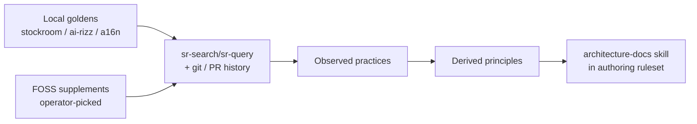

# Task: architecture-docs-authoring-skill

* Task ID: architecture-docs-authoring-skill
* Complexity: Level 3
* Type: feature

Add a Cursor skill (canonical under `rules/`, wired into the `authoring` ruleset) that teaches how to write good architecture documentation as **principles** derived from studied golden examples — primary local goldens (stockroom, ai-rizz, a16n) plus a few operator-selected FOSS supplements — researched via stockroom history and git/PR archaeology, not surface recipe mimicry.

## Pinned Info

### Evidence → principle → skill

Research produces observed practices; each practice must be reverse-engineered into a principle; the skill encodes principles (with optional evidence), never bare recipes.

```mermaid
flowchart LR
  Local["Local goldens<br/>stockroom / ai-rizz / a16n"] --> Research
  Foss["FOSS supplements<br/>operator-picked"] --> Research
  Research["sr-search/sr-query<br/>+ git / PR history"] --> Practices["Observed practices"]
  Practices --> Principles["Derived principles"]
  Principles --> Skill["architecture-docs skill<br/>in authoring ruleset"]
```

## Component Analysis

### Affected Components
- **`rules/architecture-docs/` (new skill tree)**: New `SKILL.md` (+ optional `references/`) — the deliverable agents load when writing architecture docs. Mirrors `rules/prompt-authoring/` (hardlinked into ruleset).
- **`rulesets/authoring/`**: Wire the skill into the authoring ruleset (`skills/` hardlink, README entry). Current responsibility: collect guidance for authoring agent-facing artifacts (prompt-authoring, markdown-style, visual-planning).
- **`REUSE.toml` / licensing**: New files need copyright/license recording per techContext.
- **Memory-bank research artifacts** (ephemeral during the task): case-study notes and principle drafts live in `memory-bank/active/` (and creative docs if needed) until synthesized into the skill; not a permanent parallel doc set.
- **Out of scope components**: stockroom / ai-rizz / a16n architecture doc trees themselves (read/research only); Niko workflows (unchanged).

### Cross-Module Dependencies
- **architecture-docs skill → prompt-authoring / markdown-style / visual-planning**: Compositional neighbors in the same ruleset. Skill must not duplicate their guidance; may assume Markdown/Mermaid competence or stay silent (per prompt-authoring cross-reference rules: avoid brittle sibling content refs).
- **Research tooling → principle derivation**: `stockroom` query/semantic search and git history of introducing branches feed the principle set; FOSS uses git/PR only.
- **Creative decision (skill pedagogy) → SKILL.md shape**: How principles are presented constrains file layout and whether `references/` holds case-study evidence.

### Boundary Changes
- New public installable skill in the authoring ruleset (ai-rizz consumers who install `authoring` gain it after push).
- No API/schema changes; no Niko workflow changes.

### Invariants & Constraints
- Must preserve: canonical edit path is `rules/` + `rulesets/` only (never `.cursor/` / `.claude/` generated trees).
- Must hold: local goldens outrank FOSS; FOSS cannot redefine "good."
- Must hold: skill content is principle-first; surface recipes only as illustrations of a stated principle.
- Must preserve: prompt-authoring cross-reference discipline (no brittle sibling content coupling).
- Non-goal: rewriting existing architecture docs in sibling repos.
- Must hold: REUSE licensing for new files.

## Open Questions

- [ ] **FOSS supplements** — Which surveyed FOSS architecture docs count as supplemental goldens (sample-size enlarge only)? Ambiguous because "good" is operator judgment relative to local goldens; agent cannot self-approve. Constraint: pick a few, not the whole list. → Unresolved: awaiting operator input (survey presented in plan session).
- [ ] **Skill pedagogy / content architecture** — How should a principle-first architecture-docs skill be structured so agents apply *why* rather than copy *what* (options: pure principle reference; principle + anti-pattern; principle + short case-study evidence; composite with a thin workflow)? Ambiguous because multiple viable agent-facing shapes exist and trade off brevity vs grounding. Constraints: follow prompt-authoring kinds lens; compose with authoring ruleset neighbors; principles must stay portable across projects. → Pending creative after FOSS selection.

## Test Plan (TDD)

### Behaviors to Verify

- **Skill discoverability**: authoring ruleset documents / links the skill → agent (or human) can find when to load it from description + README.
- **Principle portability**: given a principle in the skill, an agent can apply it to a *different* project shape without needing stockroom/ai-rizz-specific structure → outcome matches the principle's intent (QA semantic check).
- **Anti-recipe**: skill does not instruct "always open with a control-flow diagram" (or similar surface mandate) without an enclosing principle → grep/QA check.
- **Evidence hierarchy**: skill (or its research trail in memory bank) treats local goldens as primary and FOSS as supplemental → stated explicitly.
- **Packaging**: `rules/architecture-docs/SKILL.md` and `rulesets/authoring/skills/architecture-docs/SKILL.md` are the same inode (hardlink pattern) → `stat` check during build.
- **No sibling doc rewrite**: build changeset does not modify stockroom/ai-rizz/a16n architecture markdown → `git status` across those repos clean of this task's edits.

### Test Infrastructure

- Framework: **none for skill content** in this repo (no unit/integration test runner for rules/skills).
- Verification mode: build-time packaging checks + Level 3 QA semantic review against acceptance criteria in `projectbrief.md`.
- Conventions: match `prompt-authoring` authoring/QA practices.
- New test files: none (blocked automated TDD for prose skills; not a re-level — verification is QA-gated).

### Integration Tests

- Manual/QA: skill + markdown-style + visual-planning co-install without contradictory instructions (read-through).
- Manual/QA: description frontmatter triggers appropriately for "write architecture docs" style asks.

## Implementation Plan

*(Draft — finalize after FOSS selection + creative on pedagogy.)*

1. **Operator gate: FOSS picks** — record chosen supplements in projectbrief/tasks.
2. **Creative: skill pedagogy** — resolve content architecture open question.
3. **Research local goldens** — `sr-search` / `sr-query` + git history of introducing branches/commits for stockroom `docs/architecture`, ai-rizz `docs/developer-guide`, a16n `understanding-conversions`; extract observed practices → candidate principles.
4. **Research FOSS supplements** — git history / PRs for operator-picked docs; extract practices → candidate principles (labeled supplemental).
5. **Synthesize principle set** — merge, dedupe, elevate to principles; drop surface-only observations that lack a portable why.
6. **Author skill** — write `rules/architecture-docs/SKILL.md` (+ `references/` if creative decision requires); follow creative pedagogy + prompt-authoring prose rules.
7. **Wire authoring ruleset** — hardlink into `rulesets/authoring/skills/architecture-docs/`; update `rulesets/authoring/README.md`.
8. **Licensing** — update `REUSE.toml` as required.
9. **Verify packaging** — hardlink inode check; ensure no edits to sibling-repo architecture docs.

## Technology Validation

No new technology - validation not required

## Challenges & Mitigations

- **Principle collapse into recipes**: Agents (and authors) default to copying stockroom's outline. Mitigation: creative pedagogy decision + explicit anti-patterns in skill; QA checks for surface mandates without principles.
- **FOSS diluting local goldens**: Supplemental examples contradict local standards. Mitigation: evidence hierarchy invariant; FOSS labeled supplemental; conflicts resolved in favor of local.
- **Thin stockroom history for "why"**: Session/git archaeology may not explain intent. Mitigation: treat missing why as incomplete evidence — do not invent principles; prefer practices with recoverable rationale.
- **No automated tests for skill prose**: Mitigation: acceptance criteria + QA semantic review; packaging smoke checks only.
- **Orphan research notes**: Mitigation: synthesize into skill; leave ephemeral research in memory bank for archive, not a second public doc tree.

## Pre-Mortem

- **Plan fails because FOSS selection never happens and research stalls**: Already gated — plan does not PASS until operator picks (or explicitly chooses zero FOSS supplements).
- **Plan fails because we ship a "how stockroom's docs are structured" guide instead of portable principles**: Strengthen Implementation Plan step 5 (elevate/dedupe) and QA anti-recipe behavior; creative pedagogy must optimize for transfer, not fidelity to one outline.
- **Plan fails because creative pedagogy is deferred until after all research, then the skill shape fights the evidence volume**: Run creative **before** full research write-up (after FOSS picks), so research is collected to fit the chosen shape.
- **Plan fails by fracturing context across subagent FOSS digs with no synthesis**: Challenge covered — single synthesis step owned by primary agent; subagents may collect only.

## Status

- [x] Component analysis complete
- [ ] Open questions resolved
- [x] Test planning complete (TDD)
- [ ] Implementation plan complete
- [x] Technology validation complete
- [x] Pre-Mortem complete
- [ ] Preflight
- [ ] Build
- [ ] QA
