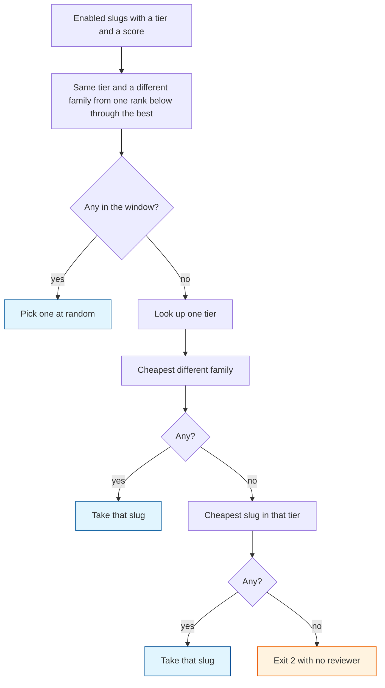

# Task: choose-verification-model

* Task ID: choose-verification-model
* Complexity: Level 3
* Type: feature

A skill named `choose-verification-model` that prints one QA or Preflight reviewer slug. A second executable refreshes scores and output prices. Niko's QA and Preflight spawn lines tell the agent to run the picker.

## Pinned Info

### Reviewer selection

The pick command's decision order. Rank is dense rank by score inside the tier, best at rank 1.

```mermaid
graph TD
    classDef pick fill:#e1f5fe,stroke:#01579b;
    classDef fail fill:#fff3e0,stroke:#ef6c00;

    Start["Enabled slugs with a tier and a score"] --> Window["Same tier and a different family from one rank below through the best"]
    Window --> HasWindow{"Any in the window?"}
    HasWindow -->|yes| Random["Pick one at random"]:::pick
    HasWindow -->|no| Up["Look up one tier"]
    Up --> DiffFam["Cheapest different family"]
    DiffFam --> HasDiff{"Any?"}
    HasDiff -->|yes| TakeDiff["Take that slug"]:::pick
    HasDiff -->|no| Cheap["Cheapest slug in that tier"]
    Cheap --> HasCheap{"Any?"}
    HasCheap -->|yes| TakeCheap["Take that slug"]:::pick
    HasCheap -->|no| Fail["Exit 2 with no reviewer"]:::fail
```

## Component Analysis

### Affected Components

- `rules/choose-verification-model/`: new topic skill. Owns `SKILL.md`, `pick.py`, `refresh.py`, `modelpool.py`, `mapping.json`, `catalog.json`, and `test_*.py`.
- `rulesets/niko/skills/choose-verification-model`: new symlink to `../../../rules/choose-verification-model`, same pattern as `illustrate-complexity`, so an install of the niko ruleset ships the script.
- Niko spawn lines: nine sites under `rulesets/niko/skills/niko/references/` that currently say `prefer smarter / different family if available`.
- `rulesets/niko/README.md`: the Subagent Selection tip that quotes the prose user rule.

### Cross-Module Dependencies

- `pick.py` reads `catalog.json` and `mapping.json` from its own directory.
- `refresh.py` reads `mapping.json` and the previous `catalog.json`, fetches SWE-bench `leaderboards.json` and `https://cursor.com/docs/models-and-pricing.md`, and writes `catalog.json`.
- The spawn lines do not import the script. They tell the agent to run `pick.py` beside `SKILL.md` and to pass the printed slug to the subagent. The subagent prompt stays the one-line skill invocation.

### Boundary Changes

- New CLI: `python3 pick.py --model SLUG --reviewer-models SLUG,SLUG [--seed N]`
- New CLI: `python3 refresh.py`
- `catalog.json` schema: `tier_order` is a list of tier names from lowest intelligence to highest. `models` maps a slug to `tier` (string or null), `score` (number or null), and `output_cost_per_million` (number or null).
- `mapping.json` schema: each slug has `family` (string), `pricing_name` (string), `output_multiplier` (number, default 1), and `swebench` (`null`, or an object with `name` and `effort`). `effort` is a string such as `high` or `medium`, or null when the model has no effort axis.
- The nine spawn lines change their model-selection clause and keep the rest of the sentence, including which skill is named.

### Invariants

- Python 3.11, standard library only.
- Family comes from the mapping. `grok-*` and `cursor-grok-*` can share `grok`.
- A slug enters the random pool only with a non-null tier that appears in `tier_order` and a non-null score.
- Refresh preserves `tier_order` and each existing `tier`. A slug new to the catalog gets `tier: null` and stderr `WARNING: must set tier for <slug>`.
- Scores are the equal-weight mean of SWE-bench boards `Test`, `Verified`, and `Multimodal`, divided by how many of those three actually matched. Verified repeating full SWE-bench tasks is accepted.
- A mapped effort receives only rows that name that effort. Fast slugs share the scored effort and use their own output price. Thinking slugs need their own `swebench` object.
- Match a board row by exact model name after removing one trailing date parenthetical and one effort parenthetical. An agent-prefixed row does not match a bare model name. Several matches: latest `date` wins.
- Unknown author slug, or any `--reviewer-models` slug absent from the catalog, exits 2 and names the slug on stderr.
- Empty pool exits 2. The skill tells the agent to stop and tell the operator. It does not choose a model by deliberation.
- Canonical edits stay in `rules/` and `rulesets/`. This task does not edit `.cursor/` or `.claude/` and does not run `ai-rizz sync`.
- Tiers ship null. The operator fills `tier_order` and each `tier` after refresh.

## Open Questions

None - implementation approach is clear

## Test Plan (TDD)

### Behaviors to Verify

- Window pick: author rank 2 in a tier with a cheaper same-family model and two different-family models at rank 1 and rank 2 → the printed slug is one of the two different-family models, and a fixed `--seed` makes the choice repeatable.
- One rank below is included: a different-family model at the next-worse distinct score is eligible.
- Two ranks below is excluded: that model is not printed when the window is non-empty.
- Same family is excluded from the window, including the author slug.
- Tied scores share a dense rank, so a different-family model tied with the author is eligible.
- Empty window, next tier has a different family → print the cheapest different-family slug there.
- Empty window, next tier is all the same family → print the cheapest slug there.
- Two models share the cheapest cost → `--seed` selects between them.
- Author is already in the top tier and the window is empty → exit 2, no slug on stdout.
- `tier: null`, a tier missing from `tier_order`, or `score: null` → that slug is never printed.
- Null output cost is skipped by the cheapest fallback and remains eligible in the rank window.
- `--reviewer-models` slug absent from the catalog → exit 2 and the slug appears on stderr.
- Author slug absent from the catalog → exit 2.
- Refresh mean: a model on all three boards scores the arithmetic mean of the three `resolved` values.
- Refresh renormalize: a model on only Verified scores that Verified value.
- Effort isolation: a mapping effort of `high` does not receive a `(medium)` row, and a null-effort mapping does not receive a `(high)` row.
- Name match: `Sonar Foundation Agent + Claude 4.5 Opus` does not score a mapping name `Claude 4.5 Opus`.
- Latest date: two exact matches → the newer `date` supplies `resolved`.
- Tier preserve: an existing tier and `tier_order` survive refresh. A new slug is `tier: null` and stderr contains `WARNING: must set tier for <slug>`.
- Price: output dollars come from the pricing-table row named by `pricing_name`, multiplied by `output_multiplier`.
- Missing price row: `output_cost_per_million` is null and stderr contains `WARNING: must set cost for <slug>`.
- Shipped files: every mapping slug is a catalog slug, every catalog model has `tier`, `score`, and `output_cost_per_million`, and every mapping `family` is a non-empty string.

### Test Infrastructure

- Framework: stdlib `unittest`, invoked from Make. Existing `make test` runs `scripts/check-ruleset-symlinks.sh` and `scripts/check-ruleset-readme-links.sh`. There is no pytest.
- Test location: `rules/choose-verification-model/test_*.py`
- Conventions: one module per executable, fixture JSON and pricing markdown written in the test, no network.
- New test files: `test_pick.py`, `test_refresh.py`, `test_shipped.py`
- Makefile: `test` also depends on a target that runs `python3 -m unittest discover -s rules/choose-verification-model -p 'test_*.py'`

### Integration Tests

- Refresh then pick: `build_catalog` on fixture upstreams writes a catalog, then `select` on that catalog returns the slug the rank rule requires. This lives in `test_refresh.py`.

## Implementation Plan

### 1. Reviewer selection — executable

- Files: `rules/choose-verification-model/modelpool.py`, `rules/choose-verification-model/pick.py`, `rules/choose-verification-model/test_pick.py`, `Makefile`

1. Stub tests: create `test_pick.py` with empty test methods for each pick behavior above, including exit-code cases.
2. Stub interface: `select(catalog, mapping, author, enabled, rng)` returns a slug or raises `SelectionError`. `main(argv)` on `pick.py` parses `--model`, `--reviewer-models`, and optional `--seed`. Docstrings on both.
3. Write tests and run red: assert the behaviors against in-memory catalogs. `python3 -m unittest discover -s rules/choose-verification-model -p 'test_pick.py'` fails.
4. Write code and run green: implement dense rank, the window, the one-tier fallback, stderr warnings for nulls that were skipped only when they were the reason a fallback missed, and exit codes. Add the Make target and depend on it from `test`. `make test` passes the new target and the existing link checks.

### 2. Catalog refresh — executable

- Files: `rules/choose-verification-model/modelpool.py`, `rules/choose-verification-model/refresh.py`, `rules/choose-verification-model/test_refresh.py`

1. Stub tests: empty methods for the refresh behaviors, including the refresh-then-pick case.
2. Stub interface: `build_catalog(leaderboards, pricing_markdown, mapping, previous)` returns `(catalog, warnings)`. `main(argv)` on `refresh.py` fetches and writes. Docstrings on both.
3. Write tests and run red: fixture leaderboard objects and a small pricing markdown table. The new tests fail.
4. Write code and run green: parse the Output column, apply `output_multiplier`, match the three board names, preserve tiers, emit the two warning strings. `make test` passes.

### 3. Shipped mapping and catalog — executable

- Files: `rules/choose-verification-model/mapping.json`, `rules/choose-verification-model/catalog.json`, `rules/choose-verification-model/test_shipped.py`

1. Stub tests: `test_catalog_and_mapping_share_slugs` and `test_catalog_entries_have_required_keys`, empty bodies.
2. Stub interface: `mapping.json` and `catalog.json` exist with `models` set to `{}` and `tier_order` set to `[]`.
3. Write tests and run red: required keys, shared slugs, non-empty `family`. The tests fail on the empty objects.
4. Write code and run green: fill `mapping.json` for the Cursor slugs in the model list captured for this task. Set `swebench` only where a `Test`, `Verified`, or `Multimodal` row names that model and effort. Point `pricing_name` at a row on the pricing page, with `output_multiplier` when fast is a multiple of that row rather than its own row. Run `refresh.py` and commit the catalog it writes. Leave every `tier` null and `tier_order` empty. `make test` passes.

### 4. Skill text — prose/policy

- Files: `rules/choose-verification-model/SKILL.md`, `rulesets/niko/skills/choose-verification-model`
- No tests: prose/policy artifact

1. Write `SKILL.md` with frontmatter `name: choose-verification-model`. State that the agent runs `python3 pick.py` beside this file, passes its own slug and the enabled Task-tool slugs, and spawns the printed slug. State that a non-zero exit stops the agent and is reported to the operator. State that `python3 refresh.py` rebuilds the catalog and that null tiers are filled by hand in `catalog.json`.
2. Symlink `rulesets/niko/skills/choose-verification-model` to `../../../rules/choose-verification-model`.
3. Mark both Python executables executable.

### 5. Point Niko at the picker — prose/policy

- Files: the nine spawn sites listed below, and `rulesets/niko/README.md`
- No tests: prose/policy artifact

1. Replace `prefer smarter / different family if available` with `run python3 on pick.py beside the choose-verification-model SKILL.md, with --model set to your slug and --reviewer-models set to the enabled Task-tool slugs, and use the printed slug`. Leave the skill name, the "only instruction you add" clause, and any QA status-file sentence as they are. Sites:
    - `rulesets/niko/skills/niko/references/level1/level1-workflow.md`
    - `rulesets/niko/skills/niko/references/level2/level2-workflow.md` (Preflight and QA)
    - `rulesets/niko/skills/niko/references/level2/level2-build.md`
    - `rulesets/niko/skills/niko/references/level3/level3-workflow.md` (Preflight and QA)
    - `rulesets/niko/skills/niko/references/level3/level3-build.md`
    - `rulesets/niko/skills/niko/references/level4/level4-workflow.md`
    - `rulesets/niko/skills/niko/references/level4/level4-plan.md`
2. Rewrite the Subagent Selection section of `rulesets/niko/README.md` so it describes this command. Drop the two sample user-rule blocks. Add no link the readme checker would reject.

## Technology Validation

No new technology - validation not required. `python3` on this machine is 3.11.11. Tests use `unittest`, `json`, and `urllib` only. JSON and Python files fall under the default AGPL annotation in `REUSE.toml`. `SKILL.md` falls under `rules/**/*.md` as PPL-S. No `REUSE.toml` edit.

## Challenges & Mitigations

- Pricing markdown or SWE-bench row names can change shape. Mitigation: parsers are tested on fixtures; a live mismatch warns and stores null rather than guessing a price or a score.
- The enabled Task-tool list will include a slug the mapping lacks, and pick will exit 2. Mitigation: step 3 covers the slug list captured for this task. The skill tells the agent to stop and name the missing slug so the operator can add a mapping row.
- `tier_order` ships empty, so the first real pick exits 2 until the operator edits tiers. Mitigation: that is the required hand-off. The warning text from refresh lists every slug.
- The nine spawn lines can drift. Mitigation: one replacement clause, differing only by the skill name already present on each line.
- The generated `.cursor/` tree keeps the old clause until a later `chore(dev): ai-rizz sync`. Mitigation: this task edits canonical files only, which is the repo's sync rule.

## Pre-Mortem

- The catalog is a snapshot, and the next Cursor model makes every pick exit 2 because the agent passes the whole enabled list. Plan response: already covered by the unknown-slug challenge. The mapping step is sized to the captured slug list so the failure is a new slug, not the common case.
- Verified plus full SWE-bench double-counts tasks and the ranking looks wrong. Plan response: the operator accepted that double-count. The score formula stays an equal-weight mean. No second weighting step.
- Agents keep deliberating because the spawn clause is vague about argv. Plan response: the clause names `pick.py`, both flags, and "use the printed slug". The skill repeats the same command beside the script.

## Status

- [x] Component analysis complete
- [x] Open questions resolved
- [x] Test planning complete (TDD)
- [x] Implementation plan complete
- [x] Technology validation complete
- [x] Pre-Mortem complete
- [ ] Preflight
- [ ] Build
- [ ] QA
