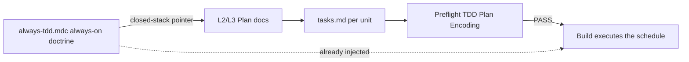

# Task: niko-plan-always-tdd

* Task ID: niko-plan-always-tdd
* Complexity: Level 3
* Type: process enhancement (Plan-phase TDD encoding)

Make Niko Plan emit per-unit always-tdd ordering for executable work so preflight stops rewriting plans.

## Pinned Info

### Plan vs doctrine vs gate

Plan owns the *schedule* (what `tasks.md` looks like). `always-tdd.mdc` owns the *doctrine* (how executable work is done). Preflight only checks that the schedule is unambiguous. Naming "TDD" without numbering the work is the failure mode.

```mermaid
flowchart LR
  doctrine["always-tdd.mdc always-on doctrine"]
  plan["L2/L3 Plan docs"]
  tasks["tasks.md per unit"]
  pref["Preflight TDD Plan Encoding"]
  build["Build executes the schedule"]
  doctrine -->|"closed-stack pointer"| plan
  plan --> tasks
  tasks --> pref
  pref -->|"PASS"| build
  doctrine -.->|"already injected"| build
```

## Component Analysis

### Affected Components
- **L2 Plan** (`rulesets/niko/skills/niko/references/level2/level2-plan.md`): current "maps to one TDD cycle" gloss + `Tests first` / `Changes` sibling fields. This is the output contract L2 agents copy.
- **L3 Plan** (`rulesets/niko/skills/niko/references/level3/level3-plan.md`): same template family; same defect at component granularity.
- **niko-plan router** (`rulesets/niko/skills/niko-plan/SKILL.md`): routes only; no TDD content. Leave thin unless a one-line closed-stack pointer earns its keep.
- **L2/L3 Build**: already numbers stub → red → green. Out of scope unless Plan's new vocabulary would contradict them (it should match, not rewrite Build).
- **Preflight TDD Plan Encoding**: blocking gate; stays. Not the place to invent TDD structure.
- **always-tdd.mdc**: doctrine; do not duplicate into Plan.

### Cross-Module Dependencies
- Plan → `tasks.md` → Preflight check → Build. If Plan's template is the FAIL shape, Preflight must rewrite or hard-FAIL. Stockroom: usually rewrite (band-aid).
- always-tdd is alwaysApply; Plan and Build both assume it is present. Plan must not treat "bundled" as "the schedule is implied."

### Boundary Changes
- Public contract of Niko Plan's `tasks.md` Implementation Plan section changes: per-unit typed steps with numbered test-first substeps, not sibling fields. Consumers are future Plan agents and Preflight.

### Invariants & Constraints
- Must preserve always-tdd as the sole doctrine (no forked four-step essay in Plan).
- Must preserve prose/policy carve-out and change-detector ban.
- Must preserve Preflight as blocking rearchitect on TDD FAIL (no self-heal).
- Must preserve prompt-authoring: numbered list = order; bullets = a set; closed-stack refs OK; restating sibling prompts is not.
- Canonical edits under `rulesets/` only.
- This task's deliverable is skill wording: no markdown change-detector tests.

## Open Questions

- [x] How should Plan activate always-tdd? → Resolved: template-as-schedule (numbered per-unit substeps are the work; closed-stack pointer to always-tdd; no doctrine copy; explicit load held in reserve). See `memory-bank/active/creative/creative-plan-tdd-activation.md`.

## Test Plan (TDD)

(pending Creative, then Test Planning)

## Implementation Plan

(pending Creative)
