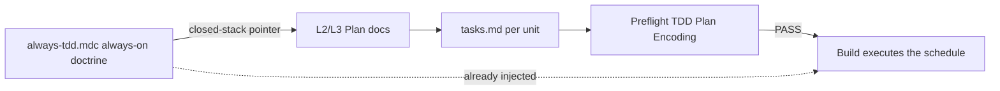

# Task: niko-plan-always-tdd

* Task ID: niko-plan-always-tdd
* Complexity: Level 3
* Type: process enhancement (Plan-phase TDD encoding)

Make Niko Plan emit per-unit always-tdd ordering for executable work so preflight stops rewriting plans.

## Pinned Info

### Plan vs doctrine vs gate

Plan owns the *schedule* (what `tasks.md` looks like). `always-tdd.mdc` owns the *doctrine* (how executable work is done). Preflight only checks that the schedule is unambiguous. Naming "TDD" without numbering the work is the failure mode.

```mermaid
flowchart LR
  doctrine["always-tdd.mdc always-on doctrine"]
  plan["L2/L3 Plan docs"]
  tasks["tasks.md per unit"]
  pref["Preflight TDD Plan Encoding"]
  build["Build executes the schedule"]
  doctrine -->|"closed-stack pointer"| plan
  plan --> tasks
  tasks --> pref
  pref -->|"PASS"| build
  doctrine -.->|"already injected"| build
```

## Component Analysis

### Affected Components
- **L2 Plan** (`rulesets/niko/skills/niko/references/level2/level2-plan.md`): current "maps to one TDD cycle" gloss + `Tests first` / `Changes` sibling fields. This is the output contract L2 agents copy.
- **L3 Plan** (`rulesets/niko/skills/niko/references/level3/level3-plan.md`): same template family; same defect at component granularity.
- **niko-plan router** (`rulesets/niko/skills/niko-plan/SKILL.md`): routes only; no TDD content. Leave thin unless a one-line closed-stack pointer earns its keep.
- **L2 Build**: already numbers stub → red → green. Out of scope; Plan's new vocabulary should match it.
- **L3 Build**: does *not* match — Step 4 substep 1 carries the same red-green-refactor gloss this task deletes from L3 Plan (preflight finding). One line changes, to L2 Build's wording.
- **Preflight TDD Plan Encoding**: blocking gate; stays. Not the place to invent TDD structure.
- **always-tdd.mdc**: doctrine; do not duplicate into Plan.

### Cross-Module Dependencies
- Plan → `tasks.md` → Preflight check → Build. If Plan's template is the FAIL shape, Preflight must rewrite or hard-FAIL. Stockroom: usually rewrite (band-aid).
- always-tdd is alwaysApply; Plan and Build both assume it is present. Plan must not treat "bundled" as "the schedule is implied."

### Boundary Changes
- Public contract of Niko Plan's `tasks.md` Implementation Plan section changes: per-unit typed steps with numbered test-first substeps, not sibling fields. Consumers are future Plan agents and Preflight.

### Invariants & Constraints
- Must preserve always-tdd as the sole doctrine (no forked four-step essay in Plan).
- Must preserve prose/policy carve-out and change-detector ban.
- Must preserve Preflight as blocking rearchitect on TDD FAIL (no self-heal).
- Must preserve prompt-authoring: numbered list = order; bullets = a set; closed-stack refs OK; restating sibling prompts is not.
- Canonical edits under `rulesets/` only.
- This task's deliverable is skill wording: no markdown change-detector tests.

## Open Questions

- [x] How should Plan activate always-tdd? → Resolved: template-as-schedule (numbered per-unit substeps are the work; closed-stack pointer to always-tdd; no doctrine copy; explicit load held in reserve). See `memory-bank/active/creative/creative-plan-tdd-activation.md`.

## Test Plan (TDD)

### Behaviors to Verify

No new executable behavior. Both plan docs are skill wording (prose/policy). Inventing heading/phrase assertions on them would be change-detectors banned by always-tdd.

Live exercise of the new schedule is the next Niko task that changes executable behavior — not this one.

### Test Infrastructure

- Framework: `make test` (ruleset symlink targets + README internal links via `scripts/`)
- Test location: `scripts/` plus `.github/workflows/rulesets-links.yml`
- Conventions: no prompt-content snapshot tests
- New test files: none

### Integration Tests

- None. After the edits, `make test` must still pass (layout/links only).

## Implementation Plan

### 1. L2 Plan instructions — prose/policy ← done

- Files: `rulesets/niko/skills/niko/references/level2/level2-plan.md`
- No tests: prose/policy artifact

1. In Step 3 (Test Planning), state that behaviors to verify are executable only; prose/policy units do not get invented tests (carve-out in `.cursor/rules/shared/always-tdd.mdc`).
2. In Step 5, replace the "maps to roughly one TDD cycle: write failing test → implement to pass → refactor" gloss and the `Tests first` carve-out line with: each step is one unit typed **executable** or **prose/policy**; executable numbered substeps are the stages of `.cursor/rules/shared/always-tdd.mdc` in order; a step whose substeps could be reordered and still read correctly is not planned yet; prose/policy units use ordered work steps plus `No tests: prose/policy artifact` and never schedule a change-detector.
3. In the `tasks.md` template's Implementation Plan, replace the `Files` / `Tests first` / `Changes` sibling fields with typed unit headings and numbered substeps matching the creative sketch (stub tests, stub interface, write tests and run red, write code and run green — names only, no doctrine copy).
4. In the `tasks.md` template's `### Behaviors to Verify`, add the prose/policy alternative alongside the behavior bullets, so a prose/policy-only task has a slot for declaring exemption instead of inventing behaviors.

### 2. L3 Plan instructions — prose/policy ← done

- Files: `rulesets/niko/skills/niko/references/level3/level3-plan.md`
- No tests: prose/policy artifact

1. Same Test Planning qualifier as L2, on Step 6 (include component-boundary executable behaviors; still no invented prose tests).
2. Same Step 7 replacement as L2 Step 5, keeping L3 extras (group by component, creative refs, diagrams).
3. Same Implementation Plan template replacement as L2, keeping L3 fields (`Creative ref` where applicable).
4. Same `### Behaviors to Verify` prose/policy alternative as L2 substep 4.

### 3. Non-goals, plus the one confirmed Build clash — prose/policy

- Files: `rulesets/niko/skills/niko-plan/SKILL.md`, `rulesets/niko/skills/niko-preflight/SKILL.md`, `rules/always-tdd.mdc`, `rulesets/niko/skills/niko/references/level2/level2-build.md`, `rulesets/niko/skills/niko/references/level3/level3-build.md`, `rulesets/niko/skills/niko/references/level4/level4-plan.md`
- No tests: prose/policy artifact

1. Dry-read: router stays a router; preflight TDD gate unchanged in role; always-tdd unchanged; L4 stays a milestone list. Preflight confirmed all four as non-goals — no edit needed.
2. Fix the one confirmed clash: `level3-build.md` Step 4 substep 1 reads `**TDD cycle**: Write failing tests first → implement to pass → refactor`. That is the same gloss Unit 2 removes from L3 Plan — it names a `refactor` stage `always-tdd` does not have and omits the stubbing stages. `level2-build.md` Step 3 substep 1 already names the full sequence. Replace the L3 line with L2 Build's wording so both Build docs name one sequence. One line; do not expand this step further.

## Technology Validation

No new technology - validation not required

## Dependencies

- Creative decision: `memory-bank/active/creative/creative-plan-tdd-activation.md`
- Doctrine: `rules/always-tdd.mdc` (always-on; do not copy)
- Gate: `rulesets/niko/skills/niko-preflight/SKILL.md` TDD Plan Encoding (do not change)

## Challenges & Mitigations

- Agents copy the example harder than the instruction: change Step 5/7 *and* the template; leave no `Tests first` / `Changes` sibling example behind.
- Four stage names look like restating always-tdd: names plus "in order, per `always-tdd.mdc`" only — no stubbing commentary, no change-detector paragraph.
- Next executable Plan still fails encoding: do not add a load step in this change; B is the recorded follow-on, not a preflight self-heal.

## Pre-Mortem

- This plan failed because we rewrote the template but left "maps to one TDD cycle" in the instruction, so agents still emitted a disclaimer plus implementation list: already covered by Challenge 1 (edit both).
- This plan failed because we pasted always-tdd's how-to into Plan and it drifted at the next always-tdd edit: already covered by Challenge 2 (names only).
- This plan failed because structure-alone was not enough salience and we had no recorded next instrument: already covered by Challenge 3 (B in reserve, not this diff).
- This plan failed because we added markdown tests that lock heading strings, violating the carve-out this repo just shipped: Test Plan above forbids it; QA should reject any such tests.

## Preflight Findings

Status: **PASS WITH ADVISORY**. Three plan amendments applied above; no rearchitect.

### Applied amendments

- **Convention** — `always-tdd` pointers in Units 1 and 2 now use the installed-path form `.cursor/rules/shared/always-tdd.mdc`, matching every other cross-file pointer in Niko skill prose (`level2-plan.md:39`, `level3-plan.md:75`, `niko-preflight/SKILL.md:27`). A bare filename would be the lone deviation.
- **Completeness** — Units 1 and 2 gained substep 4. Requirement 4 / AC 3 (prose/policy stays explicitly exempt) was served only in the Implementation Plan template; the `### Behaviors to Verify` template section had no exemption slot, so a prose/policy task filling it is pushed toward inventing behaviors. That is the creative decision's own failure mode — instruction loses to artifact — left in place.
- **Dependency impact** — Unit 3 substep 2 rewritten from a conditional to the confirmed clash. `level3-build.md:38` carries the identical red-green-refactor gloss this task removes from `level3-plan.md:74`; `level2-build.md:27` already names the full `always-tdd` sequence. Dry-reading Build would likely have concluded "no clash" and shipped L3 Plan and L3 Build naming two different rituals.

### Verified clean

- **TDD Plan Encoding** (blocking) — PASS. All three units are typed prose/policy with `No tests: prose/policy artifact`; the deliverable is plan-doc wording, which `always-tdd` carves out. No change-detector tests scheduled; the Test Plan forbids them and Pre-Mortem tells QA to reject any.
- **Conflict detection** — no duplication-in-waiting. Preflight validates the schedule but does not author it; `always-tdd` owns doctrine and is not copied. The `tasks.md` Implementation Plan shape is the intended public-contract change and is recorded under Boundary Changes.
- **Downstream consumers** — `niko-qa`, `nk-save`, `niko-archive`, `niko-plan`, and `level4-plan` read `tasks.md` but none depend on the `Files` / `Tests first` / `Changes` field names. Only L2/L3 Build execute the step shape.
- **Canonical targets** — the `level2/` and `level3/` reference files are real files under `rulesets/`, not symlinks into `rules/`. Constraint 1 satisfied.
- **Baseline** — `make test` passes (symlink + README-link checks only, so it will not exercise these edits; the plan says as much).

### Advisory — operator consideration, not applied

- **Give Plan the grader's rubric.** The strongest remaining lever is one line in L2 Step 5 / L3 Step 7 telling Plan to check its Implementation Plan against the FAIL clauses in `niko-preflight`'s TDD Plan Encoding check before writing the report. Closed-stack pointer, no doctrine copy, no complexity change. **Deliberately not applied:** the creative decision locked D alone with B (explicit load) held in reserve precisely so the next executable plan measures whether structure-alone suffices. Adding a second salience instrument in the same diff destroys that measurement. If the next executable Plan still fails encoding, this competes with B as the follow-on.
- **Pre-existing, out of scope** — both Build docs say to "check off the completed step," but the Implementation Plan template has never used checkboxes. This change does not introduce the mismatch and arguably widens it (headings instead of a numbered list). Worth a separate task.

## Status

- [x] Initialization complete
- [x] Component analysis complete
- [x] Open questions resolved
- [x] Test planning complete (TDD)
- [x] Implementation plan complete
- [x] Technology validation complete
- [x] Pre-Mortem complete
- [x] Preflight (PASS WITH ADVISORY)
- [ ] Build
- [ ] QA
