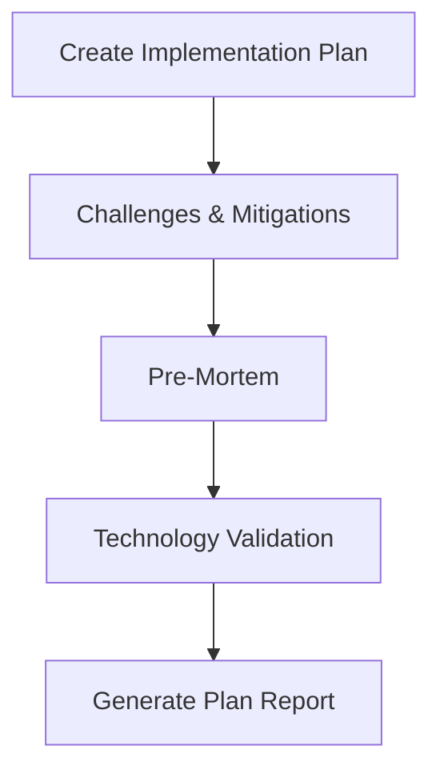

# Task: niko-plan-premortem

* Task ID: niko-plan-premortem
* Complexity: Level 3
* Type: feature

Add a Klein pre-mortem (visualize whole-plan failure) to Niko's L2/L3 planning path after Challenges ([issue #78](https://github.com/Texarkanine/.cursor-rules/issues/78)). Keep Challenges as today's risk register. Decline a separate "hard no" ritual; clarify L3 Invariants for any useful residue.

## Pinned Info

### Plan-phase insertion order

Challenges stay the risk register. Pre-Mortem runs after Challenges and only does prospective hindsight. Order is enforced by numbered steps and explicit transitions (not document position).

```mermaid
flowchart TD
  Impl["Create Implementation Plan"] --> Ch["Challenges & Mitigations"]
  Ch --> PM["Pre-Mortem"]
  PM --> Tech["Technology Validation"]
  Tech --> Report["Generate Plan Report"]
```

## Component Analysis

### Affected Components
- **L2 Plan** (`rulesets/niko/skills/niko/references/level2/level2-plan.md`): Add Pre-Mortem step after Challenges; `tasks.md` template section; renumber subsequent steps. Challenges intent unchanged.
- **L3 Plan** (`rulesets/niko/skills/niko/references/level3/level3-plan.md`): Same; lightly strengthen Invariants & Constraints (positive framing); PASS log touch-up.
- **L4 Plan**: No pre-mortem; leave cross-milestone invariants as-is.
- **Preflight / Creative / L1**: No changes.

### Cross-Module Dependencies
- Plan → (L3 creative loop) → Implementation Plan → Challenges → Pre-Mortem → Preflight → Build
- Reflect already reviews whether Challenges materialized; Pre-Mortem plan-change responses remain compatible

### Boundary Changes
- Agent-facing plan procedure and `tasks.md` contract gain a `## Pre-Mortem` section on L2/L3 (after Challenges)
- No memory-bank file taxonomy changes

### Invariants & Constraints
- Canonical edits only under `rulesets/`
- Challenges risk-register behavior preserved (do not rewrite as pre-mortem)
- Pre-mortem must not duplicate preflight codebase checks or re-list Challenges
- No separate hard-no / what-must-never section
- L1 and L4 top-level plan unchanged for this feature
- Ordering stated explicitly in numbered steps + transition text

## Open Questions

- [x] **Q1: Pre-mortem placement & relationship to Challenges & Mitigations** → Resolved (revised): Dedicated Pre-Mortem step **after** Challenges; Challenges unchanged (identify+mitigate); Pre-Mortem = visualize-failure only; not creative/preflight (see `memory-bank/active/creative/creative-premortem-placement.md`)
- [x] **Q2: Which complexity levels receive pre-mortem** → Resolved: L2 + L3 only; L1 untouched; L4 top-level skipped (sub-runs inherit) (see `memory-bank/active/creative/creative-premortem-levels.md`)
- [x] **Q3: Disposition of "what must never" / hard-no** → Resolved: Decline separate ritual; fold useful residue into existing L3/L4 Invariants (positive framing); no L2 invariants expansion (see `memory-bank/active/creative/creative-hard-no-disposition.md`)

## Test Plan (TDD)

Prose/workflow deliverables — no executable test suite. Verification = structural `rg` checks + QA semantic review.

### Behaviors to Verify

- **B1**: L2 plan procedure includes a named Pre-Mortem step **after** Challenges & Mitigations and before Technology Validation, with an explicit transition → agent encounters that order
- **B2**: L3 plan procedure includes the same ordered Pre-Mortem step → same for L3
- **B3**: L2 and L3 `tasks.md` templates include `## Pre-Mortem` **after** `## Challenges & Mitigations` → plan artifacts record findings in that order
- **B4**: Pre-Mortem guidance asks to imagine the plan has already failed, name likely cause(s), and how the plan changes; must not re-list step/tech Challenges → Klein frame, not a second register
- **B5**: No Hard-No / What-Must-Never section added to plan templates
- **B6**: L3 Invariants & Constraints guidance remains positively framed ("preserve" / "must hold") and invites plan-level properties
- **B7**: L1 workflow/build and L4 plan files are unchanged for pre-mortem → `rg` for Pre-Mortem finds hits only in L2/L3 plan files
- **B8**: Challenges & Mitigations step and template section still exist on L2/L3 with identify+mitigate intent intact (not replaced by pre-mortem wording)

### Test Infrastructure

- Framework: none (prompt/rule prose)
- Verification: `rg` structural invariants + `/niko-qa` semantic constraints
- New test files: none

### Integration Tests

- N/A as automated tests; preflight validates plan against repo; QA validates built prompts against brief

## Implementation Plan

1. **Red — baseline structural checks (TDD substitute for prose)**
    - Files: none (shell only)
    - Changes: Run B1–B8 `rg` assertions against `rulesets/niko/skills/niko/references/level*/`; Pre-Mortem absent (expected red). Keep the exact command list for step 4.

2. **L3 plan — Pre-Mortem after Challenges + invariants clarify**
    - Files: `rulesets/niko/skills/niko/references/level3/level3-plan.md`
    - Changes:
        - Strengthen Step 3 **Invariants & Constraints** bullet: plan-level properties that must hold (safety, compatibility, preserved non-goals/boundaries), positive "must preserve / must hold" — no hard-no naming
        - Leave **Identify Challenges & Mitigations** intent unchanged (optional one-liner pointing forward to Pre-Mortem only if needed for distinctness)
        - Insert new step **Pre-Mortem** immediately after Challenges, before Technology Validation; renumber subsequent steps
        - Explicit transition: after Challenges are recorded, run Pre-Mortem
        - Step body: decompression key "pre-mortem" / imagine the plan has already failed; 1–3 likely causes; for each, how the plan changes (mitigation, scope cut, or new open question). If a cause is already covered by a Challenge, note that in one line. Do not re-list step/tech risks. Do not ask for a "must never" list. Distinguish from preflight (imagination vs codebase reality).
        - Template: `## Pre-Mortem` after `## Challenges & Mitigations`; Status checklist includes Pre-Mortem; PASS log touch-up
    - Creative refs: placement (B2), levels, hard-no disposition

3. **L2 plan — Pre-Mortem after Challenges + template**
    - Files: `rulesets/niko/skills/niko/references/level2/level2-plan.md`
    - Changes: Same pattern after Challenges (current Step 6); renumber; template + Status; L2-proportional brevity; Challenges intent unchanged
    - Creative refs: placement, levels

4. **Green — re-run structural verification**
    - Files: none (shell `rg` only)
    - Changes: Re-run step-1 commands; all B1–B8 must pass

5. **Docs / sync note**
    - No README change required
    - Do not edit `.cursor/` copies; sync via `ai-rizz` after push

## Technology Validation

No new technology - validation not required

## Challenges & Mitigations

- **Agents conflate Pre-Mortem with Challenges**: Mitigation — Challenges unchanged; Pre-Mortem forbids re-listing step/tech risks; explicit "if already in Challenges, one-line note" rule.
- **Pre-Mortem becomes a hollow checkbox**: Mitigation — require causes + plan responses; empty/vague findings → revisit implementation plan.
- **Hard-no sneaks back via wording**: Mitigation — Q3 + explicit ban on must-never lists; QA checks.
- **Step renumbering breaks internal cross-references**: Mitigation — search each plan file for "Step N" after renumbering.
- **L2/L3 wording drifts**: Mitigation — parallel copies (same as Challenges today); no shared extract (YAGNI).
- **Document-position mistaken for order**: Mitigation — numbered step + explicit "After Challenges…" transition per prompt-authoring.

### Preflight amendments

- (2026-07-09 initial) Prose TDD red→green; Status checklist; declined shared extract.
- (2026-07-09 revision) Placement flipped to **after** Challenges; Behaviors B1–B4/B8 updated; Challenges preservation is now an explicit invariant.

## Pre-Mortem

*(Dogfooding — after Challenges, as the feature will require.)*

**If this plan failed, likely causes:**
1. **Pre-Mortem still becomes a second Challenges dump** — Mitigation: forbid re-listing tech risks; require plan-level causes; one-line "already covered" escape.
2. **Challenges get rewritten anyway during build** — Mitigation: implementation steps say leave Challenges intent unchanged; B8 verifies.
3. **Only L3 edited** — Mitigation: step 3 is first-class; B1/B2 both required.

## Status

- [x] Component analysis complete
- [x] Open questions resolved
- [x] Test planning complete (TDD)
- [x] Implementation plan complete
- [x] Technology validation complete
- [x] Preflight
- [ ] Build
- [ ] QA
