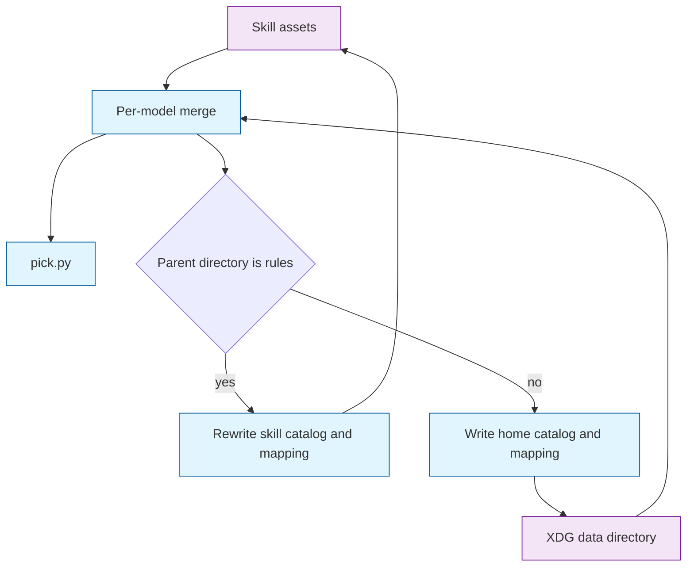

# Task: XDG user assets for choose-verification-model

* Task ID: xdg-user-assets
* Complexity: Level 3
* Type: feature

Consumers of `choose-verification-model` keep a catalog, a mapping, and a tier list in an XDG data directory. `pick.py` merges that directory with the skill's shipped assets on every run. A home `tiers.toml` overrides tiers per model. A later skill update still supplies models and tiers the user never set. `refresh.py` from an install writes the home catalog and mapping. `refresh.py` from `rules/choose-verification-model` still rewrites the skill assets and ignores the home directory. `SKILL.md` stays as it is.

Creative decision: `memory-bank/active/creative/creative-asset-overlay.md`.

## Pinned Info

### Read and write paths

Pick always merges. Refresh writes the skill assets only from the source tree, and writes the home directory from every other install.

```mermaid
graph TD
    classDef store fill:#f3e5f5,stroke:#7b1fa2
    classDef proc fill:#e1f5fe,stroke:#01579b

    Shipped["Skill assets"]:::store
    Home["XDG data directory"]:::store
    Merge["Per-model merge"]:::proc
    Pick["pick.py"]:::proc
    Mode{"Parent directory is rules"}
    Publish["Rewrite skill catalog and mapping"]:::proc
    Local["Write home catalog and mapping"]:::proc

    Shipped --> Merge
    Home --> Merge
    Merge --> Pick
    Merge --> Mode
    Mode -->|yes| Publish
    Mode -->|no| Local
    Publish --> Shipped
    Local --> Home
```

## Component Analysis

### Affected Components

- `rules/choose-verification-model/scripts/homeassets.py` (new): resolves the XDG directory, detects the source tree, and merges shipped documents with home documents. No selection and no network.
- `rules/choose-verification-model/scripts/pick.py`: loads `assets/catalog.json` and `assets/mapping.json` and calls `select`. It will load the merged documents instead when the caller does not inject them.
- `rules/choose-verification-model/scripts/refresh.py`: reads the skill assets and writes `catalog.json` and `mapping.json`. Source-tree runs keep that. Install runs read the merge and write the home directory.
- `rules/choose-verification-model/scripts/modelpool.py`: `model_key` and `previous_from_tiers` stay the stem and tier rules. No edit unless a signature is already sufficient, which it is.
- `rules/choose-verification-model/references/refresh.md`: states where refresh writes. The commands stay.
- `tests/choose-verification-model/`: unittest suite. New cases for the merge and the two write targets. One existing pick invocation must ignore the developer's home directory.

### Cross-Module Dependencies

- `homeassets.py` calls `model_key` and `previous_from_tiers`. `modelpool.py` does not import `homeassets.py`.
- `pick.py` calls `load_effective`, then `select`.
- `refresh.py` calls `is_source_tree`, `overlay_tiers`, and `load_effective` inputs, then the existing `fill_mapping` and `build_catalog`.
- `tomllib` is imported inside the function that reads a home `tiers.toml`, not at import time, so `pick.py` still imports on Python older than 3.11 when that file is absent.

### Boundary Changes

- No new command-line arguments. `SKILL.md` is not edited.
- `pick.main` and `refresh.main` gain optional keyword arguments for tests: `assets_dir` and `user_dir`. Callers that pass `catalog` and `mapping` to pick, or `dest` to refresh, keep today's behavior.
- Home files use the shipped names: `catalog.json`, `mapping.json`, `tiers.toml`.

### Invariants & Constraints

- A stem listed in the home `tiers.toml` uses that tier. A stem not listed there keeps the shipped tier when the shipped catalog has the stem.
- The `tier` field on a home catalog row does not override a shipped tier.
- For score, price, `has_fast`, and the rest of a row present on both sides, the home row wins.
- A stem that exists on only one side is kept.
- `tier_order` comes from the shipped catalog.
- Refresh never writes `tiers.toml`.
- Source-tree refresh reads and writes only the skill assets.
- Missing home files contribute nothing. Invalid JSON still raises.
- The agent-facing commands stay `python3 scripts/pick.py` and `python3 scripts/refresh.py`, and the PowerShell equivalents.

## Open Questions

- [x] How do shipped skill assets and the user's XDG directory combine on read and on write? → Resolved: read-time overlay; home `tiers.toml` is the only local tier authority; source-tree refresh ignores the home directory; an install writes the home catalog and mapping (see `memory-bank/active/creative/creative-asset-overlay.md`)

## Test Plan (TDD)

### Behaviors to Verify

- `XDG_DATA_HOME=/data` → `user_assets_dir` is `/data/choose-verification-model`
- `XDG_DATA_HOME` unset or empty, home `/home/u` → `/home/u/.local/share/choose-verification-model`
- platform `nt`, `XDG_DATA_HOME` unset, `LOCALAPPDATA=/local` → `/local/choose-verification-model`
- skill directory `rules/choose-verification-model` → `is_source_tree` is true
- skill directory `ai-rizz/choose-verification-model` → `is_source_tree` is false
- shipped mapping stems `a` and `b`, home mapping replaces `b` and adds `c` → merged mapping has shipped `a`, home `b`, and `c`
- catalog stem on both sides → home score and `has_fast` win, shipped `tier` is kept
- catalog stem only in the home file → that row is kept, including its tier
- catalog stem only in the shipped file → that row is kept
- home `tiers.toml` lists one stem under another tier → that stem's merged tier changes; every unlisted stem keeps the tier from the catalog step
- home tier list uses an effort spelling → `model_key` names the stem
- the same stem under two home tiers → the first listing wins
- home directory missing → merged catalog and mapping equal the shipped documents
- shipped catalog `tier_order` is the merged `tier_order`
- home `catalog.json` is invalid JSON → the load raises `json.JSONDecodeError`
- `pick.main` with no injected catalog, a temp skill assets directory, and a home `tiers.toml` that moves one stem onto a tier that changes the winner → stdout is the slug that tier produces
- `pick.main` with `XDG_DATA_HOME` pointed at an empty directory and no injected catalog, using the shipped assets and the issue 129 argv → stdout is still `claude-opus-5-5-high-fast`, the shipped catalog bytes are unchanged
- consumer `refresh.main` (`dest` omitted, assets outside `rules/`, network inputs injected, `agent_models=False`) → home `catalog.json` and `mapping.json` exist, home `tiers.toml` is not written, shipped catalog bytes are unchanged
- that consumer run, with a home mapping stem the shipped mapping lacks and a shipped stem the home mapping lacks → both stems are in the written home mapping
- that consumer run, with the home tier list moving one shipped stem → the written catalog has the home tier for that stem and the shipped tier for a stem the home list does not name
- source-tree `refresh.main` (`dest` omitted, assets under `rules/choose-verification-model`, a home tier that disagrees, network inputs injected) → the skill catalog uses the shipped tier, and the home directory's files are unchanged

### Test Infrastructure

- Framework: stdlib `unittest`, the suite under `tests/choose-verification-model/`
- Runner: `make test-choose-verification-model`
- Conventions: one module per area, fixtures in helpers, no network in refresh tests, docstrings on cases whose names are not enough
- New test file: `tests/choose-verification-model/test_homeassets.py`
- Existing file to adjust: `tests/choose-verification-model/test_shipped.py` (`test_issue_129_command_exits_0_and_leaves_the_catalog` points `XDG_DATA_HOME` at an empty directory)

### Integration Tests

- `pick.main` reads a temp skill directory plus a home tier list and prints the overridden slug
- `refresh.main` in consumer layout writes the home directory and leaves the skill catalog untouched
- `refresh.main` in a `rules/choose-verification-model` layout writes the skill catalog and leaves the home directory untouched

## Implementation Plan

### 1. Home directory and merge — executable

- Files: `rules/choose-verification-model/scripts/homeassets.py`, `tests/choose-verification-model/test_homeassets.py`
- Creative ref: `memory-bank/active/creative/creative-asset-overlay.md`

1. Stub tests: add `test_homeassets.py` with empty cases for the directory, the source-tree check, the mapping union, both-sides catalog rows, home-only and shipped-only rows, the tier override, the effort spelling, the first-listing win, a missing home directory, `tier_order`, and invalid JSON. Docstrings state the behavior where the name does not.
2. Stub interface: add `homeassets.py` with empty `user_assets_dir(environ, *, home, platform)`, `is_source_tree(skill_dir)`, `overlay_tiers(shipped, user)`, `merge_documents(shipped_catalog, shipped_mapping, user_catalog, user_mapping, user_tiers)`, and `load_effective(shipped_dir, user_dir)`. Docstrings match the style in `modelpool.py`. `user_tiers` is a parsed TOML document or `None`.
3. Write tests and run red: implement the cases. `user_assets_dir` takes the environ mapping and the platform string so Windows is tested without a Windows host. Run `python3 -m unittest tests.choose-verification-model.test_homeassets`.
4. Write code and run green: implement the functions. `XDG_DATA_HOME` set and non-empty wins. Empty or unset uses `home / ".local" / "share"` except platform `nt`, which uses `LOCALAPPDATA`. Append `choose-verification-model`. `is_source_tree` is true only when the directory is named `choose-verification-model` and its parent is named `rules`. `overlay_tiers` copies shipped lists, then for each home stem removes it from every shipped tier and places it on the home tier. `merge_documents` deep-copies, unions mapping rows with home winning, unions catalog rows with home score and `has_fast` winning, then restores the shipped `tier` when both catalogs have the stem. Apply home tiers through `previous_from_tiers` and `model_key`, first listing wins, and discard the warnings. `tier_order` is the shipped list. `load_effective` treats a missing home file as `None` and lets invalid JSON raise. Import `tomllib` only inside the tiers read. Run the same unittest module.

**Status:** complete. `user_assets_dir` arguments default to `None` and resolve to `os.environ`, `Path.home()`, and `sys.platform`.

### 2. Pick loads the merge — executable

- Files: `rules/choose-verification-model/scripts/pick.py`, `tests/choose-verification-model/test_homeassets.py`, `tests/choose-verification-model/test_shipped.py`
- Creative ref: `memory-bank/active/creative/creative-asset-overlay.md`

1. Stub tests: add an empty `pick.main` case on a temp skill directory whose home `tiers.toml` changes the printed slug. In `test_issue_129_command_exits_0_and_leaves_the_catalog`, plan the `XDG_DATA_HOME` setup only; leave the assertions as they are.
2. Stub interface: add `assets_dir=None` and `user_dir=None` to `pick.main`. When `catalog` and `mapping` are both passed, do not read files. No other signature change.
3. Write tests and run red: the new case builds a two-model catalog where the shipped tiers pick one slug and the home tier list picks the other. Point `user_dir` at that home directory. The issue 129 case sets `XDG_DATA_HOME` to an empty temp directory for the duration of the call and restores the environment. Run `python3 -m unittest tests.choose-verification-model.test_homeassets tests.choose-verification-model.test_shipped`.
4. Write code and run green: when a document was not injected, call `load_effective(assets_dir or _ASSETS, user_dir or user_assets_dir())`. Run the same modules.

**Status:** complete. A passed `catalog` and `mapping` still skip the filesystem. Either omitted document comes from the merge.

### 3. Refresh write target — executable

- Files: `rules/choose-verification-model/scripts/refresh.py`, `tests/choose-verification-model/test_homeassets.py`
- Creative ref: `memory-bank/active/creative/creative-asset-overlay.md`

1. Stub tests: empty cases for the consumer write, the union of home-only and shipped-only mapping stems, the home tier override on the written catalog, and the source-tree write ignoring a disagreeing home tier.
2. Stub interface: add `assets_dir=None` and `user_dir=None` to `refresh.main`. When `dest` is passed, keep the current read and write. Do not implement the branch yet.
3. Write tests and run red: consumer cases use a temp directory whose parent is not `rules`, omit `dest`, write shipped `mapping.json` and `tiers.toml` plus a home mapping and tier list, and inject `benchlm`, `pricing_markdown`, and `agent_models=False` using the fixtures already in `test_refresh.py`. Source-tree case uses `tmp/rules/choose-verification-model/assets` and a home tier that would change the written tier if it were consulted. Run `python3 -m unittest tests.choose-verification-model.test_homeassets tests.choose-verification-model.test_refresh`.
4. Write code and run green: `dest` set keeps today's body. `dest` omitted and `is_source_tree` reads `assets_dir` and writes there, without reading `user_dir`. Otherwise load shipped and home files, `overlay_tiers` the TOML, `fill_mapping` and `build_catalog` as today, create the home directory, and write `catalog.json` and `mapping.json` there. Do not write `tiers.toml`. Do not modify the skill assets. Run the same modules, then `make test-choose-verification-model`.

**Status:** complete. A passed `dest` still writes beside that path.

### 4. Refresh write-up — prose/policy

- Files: `rules/choose-verification-model/references/refresh.md`
- No tests: prose/policy artifact
- Creative ref: `memory-bank/active/creative/creative-asset-overlay.md`

1. State that a run from `rules/choose-verification-model` still reads and writes that tree's `assets/`, and that a run from an install writes `catalog.json` and `mapping.json` under the XDG data directory named in the creative decision.
2. State that pick merges the home directory on its own, that a home `tiers.toml` overrides per model, and that models the file does not list keep the shipped tier.
3. Leave the `python3` and `py -3` commands unchanged. Do not edit `SKILL.md`.

**Status:** complete.

## Technology Validation

No new technology - validation not required. Paths use `pathlib` and `os.environ`. TOML uses stdlib `tomllib`, already required by refresh.

## Challenges & Mitigations

- `test_issue_129_command_exits_0_and_leaves_the_catalog` calls `pick.main` with no injected catalog. A developer's home tier list would change the printed slug. The pick step points `XDG_DATA_HOME` at an empty directory for that call.
- A refresh test that omits `dest` and also omits `assets_dir` would write the repo's `assets/`. Every new refresh test passes a temp `assets_dir`. Existing tests pass `dest` and stay on the old branch.
- Consumer refresh must not open BenchLM or the pricing page in tests. Inject `benchlm`, `pricing_markdown`, and `agent_models=False`, as `test_refresh.py` already does.
- Importing `tomllib` at module level would make `import pick` fail before Python 3.11. The tiers read imports it locally.
- A home catalog's baked `tier` is the easy field to keep and the one that would hide a later shipped tier. The merge test asserts the shipped tier is restored before the home `tiers.toml` is applied.

## Pre-Mortem

- Home catalog `tier` treated as the user's setting, so a refresh snapshot freezes tiers the user never edited. The both-sides catalog test and the pick override test already forbid that. No further plan change.
- Source-tree refresh reads the home directory and a maintainer commits personal tiers. The source-tree refresh test already requires the shipped tier and an unchanged home directory. No further plan change.
- Publish detection that looked up the git remote would fail in a worktree. The check is the directory names `rules/choose-verification-model`, which a worktree still has. No further plan change.

## Status

- [x] Component analysis complete
- [x] Open questions resolved
- [x] Test planning complete (TDD)
- [x] Implementation plan complete
- [x] Technology validation complete
- [x] Pre-Mortem complete
- [x] Preflight
- [x] Build
- [ ] QA
