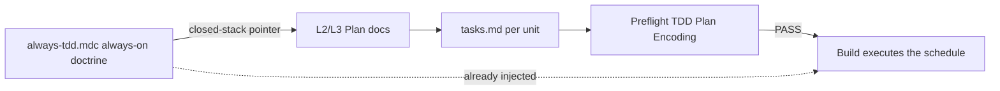

# TASK ARCHIVE: Niko Plan always-tdd schedule encoding

## SUMMARY

L2 and L3 Plan now emit per-unit typed work (`executable` | `prose/policy`) whose executable numbered substeps are always-tdd stages in order (stub tests → stub interface → write tests and run red → write code and run green). Plan Step 1 loads `.cursor/rules/shared/always-tdd.mdc` once. L3 Build Step 4.1 matches L2 Build. Preflight TDD encoding stays a blocking rearchitect gate. Shipped on draft PR [#113](https://github.com/Texarkanine/.cursor-rules/pull/113).

## REQUIREMENTS

- L2/L3 Plan schedules executable units stub → red → green, explicit enough that an implementer cannot follow the plan by coding first.
- Activation uses how agents follow instructions: numbered lists for order, a closed-stack pointer plus one load of always-tdd, not a copy of that rule.
- The `tasks.md` template is the output contract. A TDD disclaimer, a "maps to one TDD cycle" label, or sibling `Tests first:` / `Changes:` fields is the FAIL shape.
- Prose/policy units stay exempt. No change-detector tests.
- Preflight stays the hard gate. No TDD self-heal.
- Canonical edits under `rulesets/` only. L4 Plan stays a milestone list. L1 has no Plan phase.

## IMPLEMENTATION

**Design:** Plan owns the schedule (`tasks.md`). `always-tdd.mdc` owns doctrine. Preflight only checks that the schedule is unambiguous.

**Creative (plan-tdd-activation):** Options were A name-only, B explicit load, C copy the four steps, D template-as-schedule. Selected D, with B held in reserve. Stockroom (~31 preflight TDD patches) showed the failure: TDD in a preamble or label, work listed as Files + Changes. Sibling fields encode membership, not sequence. always-tdd is not a daz.is key (local policy, no pretraining mass). The pretrained gloss Plan already used ("TDD red-green-refactor") skips stubbing and invents a refactor stage. Operator later pulled B in: path once, in the Step 1 Read list.

**Files modified (canonical):**

- [`rulesets/niko/skills/niko/references/level2/level2-plan.md`](https://github.com/Texarkanine/.cursor-rules/blob/niko-plan-to-tdd/rulesets/niko/skills/niko/references/level2/level2-plan.md) — load always-tdd in Step 1; classify units; numbered always-tdd substeps; Behaviors to Verify exemption for prose/policy-only tasks.
- [`rulesets/niko/skills/niko/references/level3/level3-plan.md`](https://github.com/Texarkanine/.cursor-rules/blob/niko-plan-to-tdd/rulesets/niko/skills/niko/references/level3/level3-plan.md) — same, plus component grouping, Creative ref, diagrams.
- [`rulesets/niko/skills/niko/references/level3/level3-build.md`](https://github.com/Texarkanine/.cursor-rules/blob/niko-plan-to-tdd/rulesets/niko/skills/niko/references/level3/level3-build.md) — Step 4.1 uses L2 Build's stub → red → green line.

**Left unchanged:** `niko-plan` router, preflight TDD gate, `always-tdd.mdc`, L4 Plan, L2 Build (already named the sequence), L1 Build.

**Operator review after reflect:** Cut carve-out/path restatement; "classify" not "type"; one load. L3 Build was first restored (not the original defect), then matched to L2 so Plan and Build would not name two sequences after Plan changed.

## TESTING

No new automated tests (prose/policy; change-detectors banned). `make test` passed (symlink + README-link checks).

- Preflight PASS WITH ADVISORY. Amendments: installed-path form; Behaviors to Verify exemption slot; Unit 3 Build clash made a confirmed one-line fix. Advisory "point Plan at preflight FAIL clauses" not applied (would have stacked a second salience instrument on D). Checkbox vs "check off the step" mismatch recorded as pre-existing, out of scope.
- Build followed the plan (prose/policy units). QA PASS. Later operator edits (load, L3 Build restore, then L2 parity) are not re-QAd; they are wording, same contract.
- Live exercise of executable encoding is the next Niko task that changes code.

## LESSONS LEARNED

- Injecting always-tdd does not write `tasks.md`. The artifact the agent fills in wins.
- Sibling fields encode membership. Numbered substeps encode order.
- "fail → pass → refactor" is not always-tdd.
- Instruction loses to template: Preflight found the same failure one section up (`Behaviors to Verify` had no exemption slot). Completeness checks must read the template, not only the instruction.
- When two phases must name one ritual, search the phrase in both. L2 Build being right did not mean L3 Build was.
- Aligning L3 Build to L2 is not "Build was the defect." It is not leaving L3 Plan and L3 Build as the only pair that disagree after Plan moved.

## PROCESS IMPROVEMENTS

- Change Step 5/7 *and* the template. Leave no `Tests first` / `Changes` example behind.
- Path to always-tdd once, at the load. After that, name the rule.
- Do not add the preflight-rubric pointer in the same diff as D. B is in; the remaining lever if the next executable Plan still fails encoding is that advisory.

## TECHNICAL IMPROVEMENTS

- Both Build docs say "check off the completed step"; the Implementation Plan template has never used checkboxes. Headings widened that mismatch. Separate task.
- Generated `.cursor/` copies lag until `chore(dev): ai-rizz sync`. This repo's Plan phase still loads the installed `.cursor/skills/...` path.
- L1 Build still has no Plan-shaped schedule. Leave it until it is a problem.

## NEXT STEPS

- Merge [PR #113](https://github.com/Texarkanine/.cursor-rules/pull/113), then `chore(dev): ai-rizz sync`.
- Next executable L2/L3 Plan is the live test of template-as-schedule plus the one load.
- If that Plan still fails TDD encoding, add the preflight FAIL-clause pointer (advisory), not another preflight band-aid.
- Checkbox / heading mismatch: separate task if it bites.

## APPENDIX A — Creative decision (inlined)

**Selected:** D template-as-schedule. Operator later added B (explicit load in Plan Step 1).

**Rejected:** A (name-only; already lost in production). C (copy always-tdd; restating a sibling; the old red-green-refactor gloss was a miniature C and had already drifted).

**Rationale:** Stockroom incidents share one planning failure. Put the expanded shape in the template Plan copies. Stage names in a numbered list are the schedule; the how stays in always-tdd. Load is salience, not new information; it was the right second instrument and is now in.

**Implementation notes (as decided, then amended):** typed units; numbered always-tdd stages; prose/policy `No tests: prose/policy artifact`; do not paste the rule; do not edit preflight / always-tdd / L4 / the router. Build: leave unless a clash; L3 clash was real; final line matches L2.

## APPENDIX B — Reflection (inlined)

QA passed the D-only build. Reflection: sibling fields vs numbered lists; pretrained gloss is the wrong ritual; grep Plan and Build together; completeness on the template. Process note "do not add B in the same diff as D" was then overridden by the operator for path-once load, which is the shipped activation mix (D+B). L3 Build restore then L2 parity followed so execute-path wording matches the new schedule. L1 untouched.
