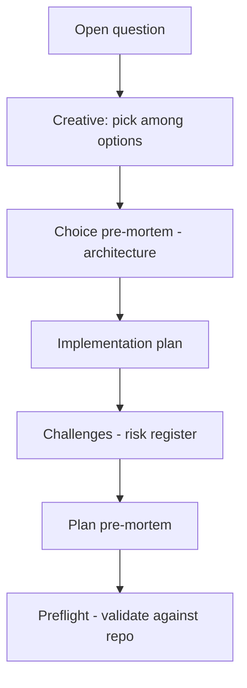

# TASK ARCHIVE: niko-plan-premortem

## SUMMARY

Shipped Klein pre-mortem lenses onto Niko's planning path ([issue #78](https://github.com/Texarkanine/.cursor-rules/issues/78)): (1) plan-end whole-plan Pre-Mortem after Challenges on L2/L3; (2) architecture creative choice-level pre-mortem after Decide. Challenges remain today's risk register. A separate "hard no" / what-must-never ritual was investigated and declined; useful residue folded into clarified L3 Invariants (positive framing). Build and QA passed; shipped in `feat(niko): Pre-Mortem (#78) (#80)`.

## REQUIREMENTS

From the project brief / issue #78:

1. Add a **pre-mortem** lens to Niko's planning path as the primary deliverable.
2. Decide placement (plan, creative, preflight, or new step) through design — not a bare paste of issue prompts.
3. Investigate "what must never" / hard-no: treat as secondary; prefer existing constraints/invariants or drop/reframe rather than a co-equal negative checklist.
4. Investigate a creative-phase complement (choice-level vs plan-level); specify and either ship or explicitly defer.
5. Follow prompt-authoring practice: prefer positive "do this / how" over "don't do that / how not."
6. Edit canonical sources under `rulesets/` only (never `.cursor/` / `.claude/` generated copies).
7. Full Niko path including creative/design for open questions.

**Acceptance met:** Named operable pre-mortem at L2/L3; creative complement specified and implemented (architecture-only); hard-no declined with positive invariants residue; QA/preflight passed.

## IMPLEMENTATION

### Approach

Two complementary objects, enforced by numbered steps and explicit transitions (not document position):

Verification was prose/workflow TDD: structural `rg` assertions B1–B11 (red baseline → green after edits) plus `/niko-qa`.

### Key files touched

| File | Change |
|------|--------|
| `rulesets/niko/skills/niko/references/level3/level3-plan.md` | Plan-end Pre-Mortem after Challenges; positive/plan-level Invariants clarify; `tasks.md` template `## Pre-Mortem`; Status/PASS log |
| `rulesets/niko/skills/niko/references/level2/level2-plan.md` | Same plan-end Pre-Mortem pattern; Challenges unchanged |
| `rulesets/niko/skills/niko/references/phases/creative/creative-phase-architecture.md` | Choice pre-mortem after Decide; confidence gate on unchecked constraints; output format under Decision; Risk criterion retained |
| `rulesets/niko/skills/niko/references/phases/creative/creative-phase-template.md` | Documents architecture-required / optional-elsewhere pattern |

No L1/L4/preflight mandatory changes. No shared Pre-Mortem extract (preflight advisory / YAGNI — match Challenges duplication pattern).

### Creative decisions (inlined)

#### Q1 — Placement (revised to B2)

**Selected:** Dedicated Pre-Mortem step in the plan phase **after** Challenges & Mitigations (Option B2).

**Options considered:** A (reframe Challenges as pre-mortem); B1 (Pre-Mortem before Challenges — original pick); B2 (after Challenges); C (preflight sibling); D (new phase/creative ritual).

**Rationale:** Challenges ≈ ShadowBox identify+mitigate and should stay intact. Pre-mortem's distinctive move is visualize-failure. After Challenges preserves the register and uses it as context for "step back; the plan failed; why?" Preflight stays concrete validation.

**Revision note:** First creative pick was B1 (before Challenges). Operator pushback mid-plan + corpus study of ~70 historical Challenges overturned that; creative doc and plan were revised and re-preflighted before build. That prevented shipping the wrong complementarity.

#### Q2 — Levels

**Selected:** L2 + L3 only (Option B).

**Rationale:** Pre-mortem attaches to an *implementation plan*. L1 has no plan phase; L4 top-level is a milestone list (wrong object); L4 sub-runs inherit via their L2/L3 plans.

#### Q3 — Hard-no disposition

**Selected:** Fold into existing Invariants; decline a separate hard-no ritual (Option B).

**Rationale:** "Never allow ¬X" and "must preserve X" are the same constraint set; keep the positive form. Clarify L3 Invariants for plan-level properties. Do not expand L2 with a new invariants section for this issue. Explicitly decline Option C (new Hard-No section).

#### Q4 — Creative complement

**Selected:** Architecture-only choice pre-mortem after Decide; ship in this task alongside plan-end (Option B + light E).

**Incantation:** If we shipped this decision and it turned out wrong, what would the likely reason be?

**Required:** 1–3 likely reasons; mark whether each is already checked; unchecked constraint/assumption → do not finalize high confidence until verified, or return low confidence.

**Rejected:** Plan-only-without-spec as final (A); expand-Risk-only (D — Risk is blast radius/reversibility, not Klein); mandatory beat on all creative types (C — YAGNI; evidence is architecture-heavy).

### Plan Challenges & dogfood Pre-Mortem (inlined)

**Challenges mitigated in wording:** agents conflating plan PM with Challenges; conflating choice PM with plan PM or Risk; hollow/N/A choice PM; ceremony on tiny creatives; step-renumbering breakage; scope creep into all creative types.

**Dogfood Pre-Mortem (if this plan failed):** (1) choice PM and plan PM blur into one vague risk pass — mitigated by different objects in copy + B4 vs B9 assertions; (2) architecture special-case forgotten — mitigated by first-class steps + B9–B11; (3) confidence gate too weak — mitigated by explicit "do not finalize high confidence" language.

## TESTING

No executable test harness (prose/workflow deliverables).

### Structural verification (B1–B11)

Red baseline confirmed Pre-Mortem absent; after build all assertions PASS:

- **B1–B3:** L2/L3 plan step + `tasks.md` template order (Pre-Mortem after Challenges, before Technology Validation)
- **B4:** Plan Pre-Mortem = imagine the *plan* already failed; must not re-list Challenges
- **B5:** No Hard-No / What-Must-Never section
- **B6:** L3 Invariants positively framed; plan-level properties invited
- **B7:** L1/L4 unchanged for plan Pre-Mortem
- **B8:** Challenges identify+mitigate intact
- **B9–B11:** Architecture choice PM + output template + creative template pattern note

**Verifier note:** Template prose mentioning ``## Pre-Mortem`` can false-positive naive string-order checks; assert on fenced `tasks.md` headings.

### Preflight / QA

- Preflight: PASS (and PASS after plan revisions / Q4 expansion). Advisory: declined shared Pre-Mortem extract.
- QA: PASS — completeness vs B1–B11; scope boundaries clean; architecture's extra step vs template's 5-step contract is intentional and documented.

## LESSONS LEARNED

### Technical

- Plan-end Pre-Mortem and Challenges are complementary only if Challenges stay an identify+mitigate register and Pre-Mortem owns visualize-failure; collapsing them either no-ops or overwrites the register.
- Choice pre-mortem (creative) and plan pre-mortem need different objects in the prompt ("this decision" vs "this plan") or agents blur them into one vague risk pass.
- Risk ≠ pre-mortem: Risk asks "how bad / how reversible?"; pre-mortem asks "assume it *is* wrong — *why?*"

### Process

- For prose/workflow Niko changes, encoding red→green structural assertions in the plan (and dogfooding Pre-Mortem on the plan itself) is enough TDD without inventing a test harness.
- When an operator challenges a creative decision after the fact, revise the creative doc and re-preflight before build — cheaper than shipping the first pick and undoing it.
- Expanding a creative complement (Q4) into the same build after a second preflight kept choice-level and plan-end coherent rather than leaving a half-specified follow-up.

## PROCESS IMPROVEMENTS

- Keep treating operator overturns of creative picks as first-class: revise creative artifact + re-preflight, do not patch only `tasks.md`.
- When adding parallel lenses (Challenges vs Pre-Mortem; Risk vs choice PM), write distinctness into both the numbered workflow and the verification behaviors — wording alone is not enough.

## TECHNICAL IMPROVEMENTS

None surfaced beyond the shipped design. Shared Pre-Mortem extract remains declined (YAGNI / match Challenges duplication). Optional later adoption of choice pre-mortem by generic/algorithm/uiux creative types if unevenness hurts — not required by this task.

## NEXT STEPS

None required for #78. Optional follow-ups if experience warrants:

- Mandate choice pre-mortem on other creative types if architecture-only special-casing causes drift.
- Revisit L4 milestone-list pre-mortem only if milestone decompositions fail for predictable reasons sub-runs do not catch.
