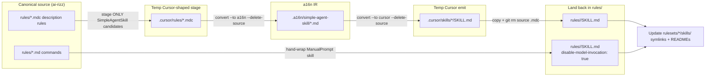

# TASK ARCHIVE: description-rules-and-commands-to-skills

## SUMMARY

Migrated ten agent-selected description rules under `rules/` through `npx a16n` (cursor → a16n IR → cursor) into `rules/<name>/SKILL.md`, hand-wrapped the two remaining slash commands as ManualPrompt skills (`disable-model-invocation: true`), and rewired ruleset symlinks/READMEs plus `systemPatterns.md` / `techContext.md`. End state: no residual SimpleAgentSkill `.mdc` or top-level command `.md` under `rules/`; GlobalPrompts and FileRules preserved; verify harness and staged discover green. Generated `.cursor/` / `.claude/` trees were intentionally not refreshed (consumers re-sync via ai-rizz).

## REQUIREMENTS

From the project brief and plan acceptance criteria:

1. Enumerate conversion targets with `npx a16n discover` / dry-runs against a16n and ai-rizz docs before converting.
2. Convert description-bearing agent-selected rules via cursor → a16n IR → cursor with `--delete-source` on the staged tree; land skills at `rules/<name>/SKILL.md` (ai-rizz authoring layout).
3. Convert remaining commands to ManualPrompt skills (hand-wrap when a16n skips `@`).
4. Preserve always-apply GlobalPrompts and glob-based FileRules.
5. Update ruleset symlinks/docs so ai-rizz install paths remain coherent.
6. Checkpoint liberally with recoverable git commits (`--no-gpg-sign`, `--no-pager`).
7. Do not edit generated `.cursor/**` / `.claude/**` canonical content in this repo.

**Acceptance (all met):** no in-scope description rules/commands remain; skills exist under `rules/`; sources deleted; rulesets resolve; migration checkpointed.

## IMPLEMENTATION

### Conversion topology

a16n only discovers `.cursor/{rules,commands,skills}/`, while this repo’s canonical source is `rules/` + `rulesets/`. Build used a temp Cursor-shaped stage for the ten SimpleAgentSkill candidates only, IR round-trip with `--delete-source` on stage/IR, harvest into `rules/<name>/SKILL.md`, then explicit `git rm` of canonical sources. Commands were hand-wrapped (not staged through a16n).

### Scope

| Class | Items | Outcome |
|-------|--------|---------|
| Description rules → SimpleAgentSkill | `bash-style`, `cursor-conversation-transcript`, `cursor-create-rule`, `github-open-a-pull-request-gh`, `how-to-script-it-instead`, `planning-execution`, `shell-posix-style`, `shell-tdd`, `task-list-management`, `visual-planning` | `rules/<name>/SKILL.md`; source `.mdc` removed |
| Commands → ManualPrompt | `pr-feedback-judge`, `wiggum-niko-coderabbit-pr` | skill dirs with `disable-model-invocation: true`; source `.md` removed |
| Keep-as-rules | 5 GlobalPrompts + 2 FileRules (`markdown-style`, `java-gradle-tdd`) | unchanged |
| Existing skills | `architecture-docs`, `prompt-authoring`, `xy-problem` | unchanged |

### Creative phase decisions

No creative phase documents. Open questions were resolved in plan/preflight:

- **Commands with `@`:** a16n skips them (false-positive vs GitHub/example mentions). Operator chose hand-wrap as ManualPrompt skills matching a16n’s successful emit shape — no `@` mutation.
- **FileRules that also have `description:`:** out of scope by a16n classification priority (`alwaysApply` → GlobalPrompt; `globs` → FileRule; else `description` → SimpleAgentSkill).
- **ai-rizz `rules/` layout vs a16n `.cursor/` discovery:** selective temp staging + harvest; never convert the live installed `.cursor/` tree.

That was the right call — remaining ambiguity was operational (tool classification quirks already settled by dry-run), not design.

### Execution summary

1. **Verify harness** — `scripts/verify-skillify.py` encoding B1–B8/I2; confirmed FAIL on clean tree (43 assertions), then green after migration.
2. **a16n convert** — batched all ten description rules in one commit (plan preferred per-name commits; atomic a16n step made batching acceptable).
3. **Hand-wrap commands** — ManualPrompt frontmatter + unchanged bodies; `git rm` sources.
4. **Ruleset symlink rewrite** — eight links: `shell` (3), `script-it` (1), `meta` (2 short names → cursor-* skill dirs), `authoring` + `niko` (`visual-planning`).
5. **Docs** — ruleset READMEs; `systemPatterns.md` File Organization (commands no longer a first-class source tier here); `techContext.md` visual-planning wording → skill.
6. **QA** — one trivial cleanup: drop unused `stale` local in the verifier.

### Key files

- New skills: `rules/<name>/SKILL.md` for the twelve migrated names above.
- Verifier: `scripts/verify-skillify.py` (kept through QA; still useful for regression of layout invariants).
- Rulesets: symlink moves under `rulesets/{shell,script-it,meta,authoring,niko}/skills/`; README updates.
- Persistent memory bank: `memory-bank/systemPatterns.md`, `memory-bank/techContext.md` (`productContext.md` left unchanged — still accurate at briefing altitude).

### Invariants honored

- Selective staging only (full-tree convert would rename FileRules to `cursor-rules-*`).
- `--delete-source` cleans stage/IR only; canonical `git rm` of `rules/` sources still required.
- No edits to generated `.cursor/` / `.claude/` trees in-repo.

## TESTING

No unit-test framework (content repo; scripted/inspection verification, matching prior migrations).

| Check | Result |
|-------|--------|
| B1–B8 via `scripts/verify-skillify.py` | FAIL first (skills missing / `.mdc` present) → PASS after land |
| B9 docs | ruleset READMEs + `systemPatterns.md` updated; root README high-level “rules” wording left (not factually wrong; out of B9 scope) |
| I1 staged discover | SimpleAgentSkill count from residual `.mdc` = 0; ManualPrompt for former commands; skills discoverable when staged under `.cursor/skills/` |
| I2 ruleset symlink resolve | PASS after rewrite (`is_symlink()` needed for dangling detection — see lessons) |
| Preflight | PASS (meta skill-link naming amended in plan) |
| QA | PASS (trivial verifier cleanup) |

## LESSONS LEARNED

### Technical

- After deleting symlink targets, Python `Path.exists()` is false for dangling links; migration verifiers that assert “stale symlink removed” must use `is_symlink() or exists()` (lexists semantics).
- a16n discover JSON uses `type` (kebab-case); ManualPrompt items expose `promptName`, not `name`.
- Selective staging is load-bearing: full-tree convert renames FileRules; a16n `--delete-source` does not remove ai-rizz canonical `rules/` sources.

### Process

- For content migrations where the converter only understands a foreign layout, a temp stage + harvest plan plus an end-state verifier is enough — creative phase is optional when the only unknowns are tool classification quirks already settled by dry-run.
- Operator rejection of `@`-neutralize during plan avoided a wrong creative/build path.
- Fail-first verify made the mid-migration B6 (ruleset) gap visible instead of discovering broken rulesets after “done.”
- Preflight’s explicit meta skill-link naming amendment prevented a build-time naming guess.

## PROCESS IMPROVEMENTS

- When a16n (or similar) only understands a harness layout different from the source-repo layout, pin the stage→IR→emit→harvest topology in the plan before build; treat selective staging as an invariant, not an optimization.
- Encode “stale symlink removed” with lexists/`is_symlink()` semantics in any layout verifier that runs across a delete+rewrite window.
- Prefer keeping a small migration verifier through QA even for one-shot content moves — it doubles as regression for ruleset link integrity.

## TECHNICAL IMPROVEMENTS

- Installed `.cursor/` trees may contain dangling links until consumers re-sync via ai-rizz (explicitly out of this task’s build scope). Post-merge operator/consumer sync is the remediation.
- Root `README.md` still uses high-level “rules” wording; optional later pass if maintainers want skill-tier terminology at the top level.

## NEXT STEPS

1. Consumers: re-sync via ai-rizz / a16n so local `.cursor/` / `.claude/` trees match the new skill layout.
2. Optional: align root README terminology with the skills-first source tiers if desired.
3. None otherwise — migration complete; verifier can remain for future layout regressions.
