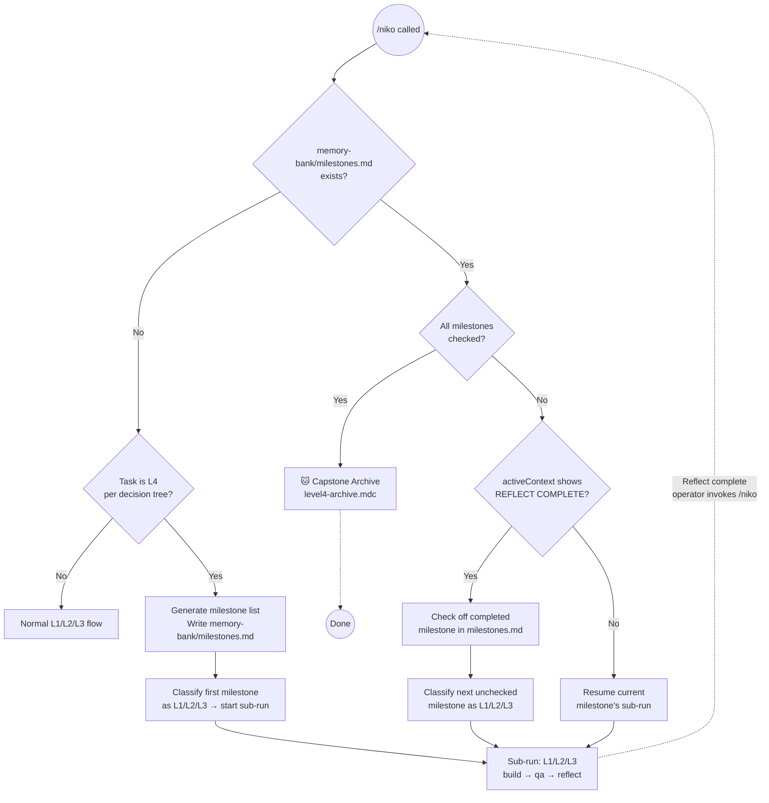

# Task: niko2-level4-impl

* Task ID: niko2-level4-impl
* Complexity: Level 3
* Type: Feature implementation (completing niko2 L4 stubs)

Implement the Level 4 workflow for niko2. L4 is project composition — not a sequential workflow — where a large task is decomposed into milestones, each executed as an L1/L2/L3 sub-run. The milestone list in `memory-bank/milestones.md` is the L4 signal and the state tracker.

## Pinned Info

### L4 Milestone Loop

The core L4 execution model — referenced by all phase files in this task.

## Component Analysis

### Affected Components

- `complexity-analysis.mdc`: L4 detection pre-check, milestone generation, re-entry mutation, completion routing
- `level4-workflow.mdc`: stub → full document (milestone loop description, capstone phase mapping)
- `level4-archive.mdc`: stub → full capstone archive document
- `memory-bank-paths.mdc`: add `milestones.md` ephemeral file entry
- `memory-bank/systemPatterns.md`: fix incorrect L4 row (shows sequential; should show milestone-based composition)
- `.claude/skills/level4-workflow/SKILL.md`: "not implemented" → load level4-workflow.mdc
- `.claude/skills/level4-plan/SKILL.md`: empty stub → clear N/A note
- `.claude/skills/level4-build/SKILL.md`: empty stub → clear N/A note

### Cross-Module Dependencies

- `complexity-analysis.mdc` → `level4-workflow.mdc`: on L4 detection, loads level4-workflow.mdc
- `complexity-analysis.mdc` → `memory-bank/milestones.md`: reads/writes for detection, mutation, completion check
- `level4-workflow.mdc` → `level4-archive.mdc`: phase mapping for capstone archive
- `level4-archive.mdc` → `memory-bank/reflection/`: reads accumulated sub-run reflections
- `.claude/skills/level4-workflow/SKILL.md` → `level4-workflow.mdc`: thin routing

### Boundary Changes

- `complexity-analysis.mdc` gains three new execution paths (fresh L4, re-entry, completion) — these are additive. The existing L1/L2/L3 classification logic is unchanged; the milestones.md pre-check fires only when the file is present.

## Open Questions

None — all design decisions resolved in previous session (milestone storage: `memory-bank/milestones.md`, no capstone reflect, no dedicated L4 plan/build .mdc).

## Test Plan (TDD)

This is a markdown/ruleset project. Verification is semantic review via niko-qa.

### Behaviors to Verify

- `complexity-analysis.mdc` — `milestones.md` absent + task signals L4 → generates milestone list, writes `milestones.md`, initiates first sub-run
- `complexity-analysis.mdc` — `milestones.md` absent + task signals L1/L2/L3 → normal flow, no regression
- `complexity-analysis.mdc` — `milestones.md` present + all checked → routes to capstone archive (level4-archive.mdc)
- `complexity-analysis.mdc` — `milestones.md` present + unchecked items + activeContext shows REFLECT COMPLETE → checks off completed milestone, pulls next, classifies as L1/L2/L3
- `complexity-analysis.mdc` — `milestones.md` present + unchecked items + activeContext does NOT show REFLECT COMPLETE → resumes current sub-run (re-classifies same milestone)
- `level4-workflow.mdc` — clearly describes the milestone-based composition model with mermaid diagram; capstone archive phase mapping present
- `level4-archive.mdc` — complete capstone archive instructions: inlines sub-run reflections, documents milestone list evolution, includes format template
- `.claude/skills/level4-workflow/SKILL.md` — loads and follows `level4-workflow.mdc` (not "stop, not implemented")
- `.claude/skills/level4-plan/SKILL.md` — clearly explains L4 has no dedicated plan phase and why
- `.claude/skills/level4-build/SKILL.md` — clearly explains L4 has no dedicated build phase and why
- `memory-bank-paths.mdc` — `milestones.md` entry present with correct lifecycle (born at L4 kickoff, deleted at capstone archive)
- `memory-bank/systemPatterns.md` — L4 row shows milestone-based composition, not sequential workflow

### Test Infrastructure

- Framework: niko-qa semantic review (manual)
- Test location: N/A (markdown project)
- Conventions: QA reviewer checks each behavior against the written document
- New test files: none

### Integration Tests

- End-to-end L4 loop: `complexity-analysis.mdc` generates milestones → sub-run initiated → reflect completes → `/niko` re-entry → milestone checked off → next sub-run or capstone. Trace the full path across all three files (complexity-analysis, level4-workflow, level4-archive).

## Implementation Plan

Ordered fewest-dependencies-first:

⚠️ **Preflight Amendment**: All `.mdc` content files exist under `rulesets/niko2/` (source of truth) AND `.cursor/rules/shared/niko/` (ai-rizz deployed copy). Per `agent-customization-locations.md`: **NEVER edit `.cursor/` directly for files that exist in rulesets/**. Edit only `rulesets/niko2/niko/` — ai-rizz handles the sync to `.cursor/`.

1. **`memory-bank-paths.mdc` — add milestones.md entry**
   - Files: `rulesets/niko2/niko/core/memory-bank-paths.mdc`
   - Changes: Add `memory-bank/milestones.md` to Ephemeral Files section. Note: L4-specific; created by complexity analysis on L4 kickoff, deleted by capstone archive. Its presence = L4 in-flight signal.

2. **`memory-bank/systemPatterns.md` — fix L4 row**
   - Files: `memory-bank/systemPatterns.md`
   - Changes: Replace incorrect "L4: NIKO → PLAN → CREATIVE → PREFLIGHT → BUILD → QA → REFLECT → ARCHIVE" with accurate description: L4 = milestone-based composition of L1/L2/L3 sub-runs.

3. **`level4-workflow.mdc` — full document**
   - Files: `rulesets/niko2/niko/level4/level4-workflow.mdc`
   - Changes: Replace stub with complete document. Structure: intro paragraph (L4 = composition), mermaid diagram (milestone loop — same as pinned diagram above), change-tracking requirement, phase mappings table (only entry: capstone archive → level4-archive.mdc). Note explicitly: no dedicated L4 plan or build phases.

4. **`level4-archive.mdc` — full document (CREATE NEW)**
   - Files: `rulesets/niko2/niko/level4/level4-archive.mdc` (new — does not exist yet)
   - Changes: Create complete capstone archive document. Structure: load memory bank files (all reflections + milestones.md + progress.md), verify all milestones checked, create archive doc at `memory-bank/archive/systems/YYYYMMDD-<task-id>.md`, clear ephemeral files (including milestones.md), commit.

5. **`complexity-analysis.mdc` — add L4 detection paths**
   - Files: `rulesets/niko2/niko/core/complexity-analysis.mdc`
   - Changes: Add a "Step 0: L4 Re-entry Check" BEFORE the decision tree. If `memory-bank/milestones.md` exists: (a) read it, (b) if activeContext shows REFLECT COMPLETE → check off that milestone in milestones.md, (c) re-read milestones.md, (d) if all checked → load level4-workflow.mdc and proceed to capstone archive, (e) else → classify first unchecked as L1/L2/L3 and proceed. Also: in the fresh-L4 path (decision tree results in L4), add: generate milestone list (prompt operator if task description is vague), write milestones.md, then classify first milestone as L1/L2/L3.

6. **SKILL.md stubs — routing updates**
   - Files: `.claude/skills/level4-workflow/SKILL.md`, `.claude/skills/level4-plan/SKILL.md`, `.claude/skills/level4-build/SKILL.md`
   - Note: these files do NOT exist in `rulesets/niko2/skills/` — they are `.claude/`-only; edit in place is correct.
   - Changes:
     - `level4-workflow/SKILL.md`: load and follow `rulesets/niko2/niko/level4/level4-workflow.mdc` (or the .cursor deployed path)
     - `level4-plan/SKILL.md`: explain L4 has no dedicated plan phase — the milestone list (produced by complexity analysis) IS the L4 plan. If invoked directly, redirect to `/niko`.
     - `level4-build/SKILL.md`: explain L4 has no dedicated build phase — sub-run builds are L1/L2/L3 builds. If invoked directly, redirect to `/niko`.

## Technology Validation

No new technology — validation not required.

## Challenges & Mitigations

- `complexity-analysis.mdc` core blast radius: Mitigation: the L4 pre-check (Step 0) fires only when `milestones.md` is present — it's a clean additive gate that doesn't touch the existing decision tree. The fresh-L4 path generates milestones only when the decision tree explicitly returns L4.
- `level4-workflow.mdc` is a reference doc, not just an execution guide: Mitigation: make this explicit in the opening paragraph so the agent reading it understands the document's role.
- Operator-authored `level4-workflow.mdc` in previous session had "not implemented yet": both `.cursor/` and `.claude/skills/` stubs need updating. Mitigation: step 6 covers both.

## Status

- [x] Component analysis complete
- [x] Open questions: none
- [x] Test planning complete (semantic review behaviors enumerated)
- [x] Implementation plan complete
- [x] Technology validation: N/A
- [x] Preflight (PASS WITH ADVISORY — plan amended to target rulesets/niko2/ not .cursor/)
- [ ] Build
- [ ] QA
