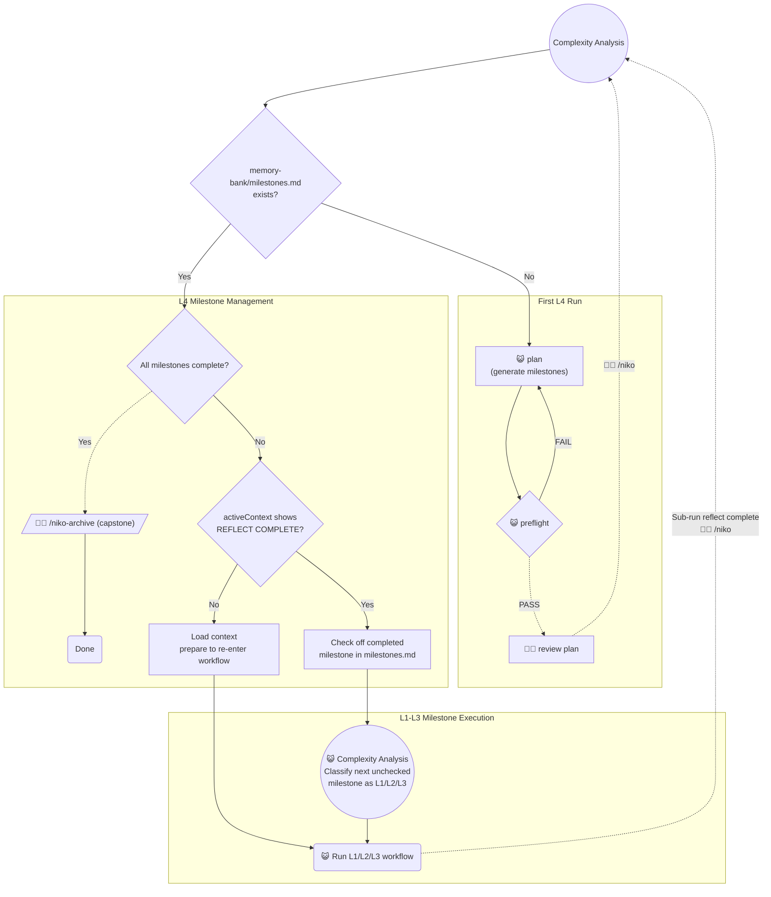

# Task: niko2-level4-impl

* Task ID: niko2-level4-impl
* Complexity: Level 3
* Type: Feature implementation (completing niko2 L4 workflow)

Implement the Level 4 workflow for niko2. L4 is project composition — a large task decomposed into milestones, each executed as an L1/L2/L3 sub-run. The original build completed the re-entry routing and archive. This continuation adds the L4 Plan phase (milestone list generation), a Milestones governance document, and updates complexity-analysis to route to the Plan phase instead of generating milestones inline.

## Pinned Info

### Target L4 Design (from user-finalized level4-workflow.mdc)

## Component Analysis

### Affected Components

- `level4-plan.mdc` (NEW): guides milestone list creation; Log Progress + Phase Transition triggers preflight
- `milestones.mdc` (NEW): governs milestones.md format and lifecycle; referenced from complexity-analysis and `/niko` entrypoint routing
- `complexity-analysis.mdc` (UPDATE): remove inline "Fresh L4 Kickoff" section; fresh L4 path simply routes to level4-workflow.mdc → Plan phase
- `level4-workflow.mdc` ✅ DONE (user-finalized)
- `level4-archive.mdc` ✅ DONE
- `memory-bank-paths.mdc` ✅ DONE
- `memory-bank/systemPatterns.md` ✅ DONE

### Cross-Module Dependencies

- `complexity-analysis.mdc` → `level4-workflow.mdc` → `level4-plan.mdc`: fresh L4 detection routes through workflow to plan phase
- `level4-plan.mdc` → `milestones.mdc`: uses format spec when writing milestones.md
- `complexity-analysis.mdc` (re-entry, Step 0) → `milestones.mdc`: referenced for reading/modifying milestones.md

### Boundary Changes

- `complexity-analysis.mdc` fresh-L4 path simplified: "Fresh L4 Kickoff" section removed entirely; routing is now just "load level4-workflow.mdc → proceed to Plan phase". Step 0 (re-entry check) unchanged.

## Behaviors to Verify

- `level4-plan.mdc` — generates 3–7 milestones, writes `milestones.md` per milestones.mdc format, updates tasks.md + activeContext.md
- `level4-plan.mdc` — if task is too vague to produce a confident milestone list, prompts operator for clarification before writing anything
- `level4-plan.mdc` — Log Progress + Phase Transition triggers preflight (via level4-workflow.mdc phase mapping)
- `milestones.mdc` — defines milestones.md format; documents lifecycle (created by Plan, checked off on re-entry, deleted by Archive); notes file presence = L4 in-flight signal
- `complexity-analysis.mdc` — fresh L4: routes to level4-workflow.mdc Plan phase (no inline generation); L1/L2/L3 paths unaffected (no regression)
- `complexity-analysis.mdc` — re-entry: milestones.md present + all checked → capstone archive ✅ (existing)
- `complexity-analysis.mdc` — re-entry: unchecked + REFLECT COMPLETE → check off, classify next as L1/L2/L3 ✅ (existing)
- `complexity-analysis.mdc` — re-entry: unchecked + NOT REFLECT COMPLETE → resume current sub-run ✅ (existing)

## Implementation Plan

⚠️ Edit only `rulesets/niko2/niko/` — ai-rizz handles sync to `.cursor/`.

### Remaining Steps

1. **`level4-plan.mdc` — CREATE NEW** (`rulesets/niko2/niko/level4/level4-plan.mdc`)
   - Step 1: Load memory bank files + milestones.mdc (for format spec)
   - Step 2: Verify prerequisites — no milestones.md exists yet (if it does, re-entry applies; stop and inform operator)
   - Step 3: Generate milestone list — 3–7 milestones, each L1/L2/L3-scoped and independently deliverable. If task description is too vague, prompt for clarification before proceeding.
   - Step 4: Write `memory-bank/milestones.md` using milestones.mdc format
   - Step 5: Update `memory-bank/tasks.md` (include milestone list) and `memory-bank/activeContext.md`
   - Step 6: Log Progress + Phase Transition → preflight (via level4-workflow.mdc)

2. **`milestones.mdc` — CREATE NEW** (`rulesets/niko2/niko/level4/milestones.mdc`)
   - Define milestones.md file format (YAML front matter or header, checklist of `- [ ] description`)
   - Define what makes a good milestone: independently deliverable, fits L1/L2/L3 scope, clear one-line description
   - Document lifecycle: created by level4-plan.mdc, read and modified by complexity-analysis.mdc (re-entry), deleted by level4-archive.mdc
   - Explicit note: file presence = L4 in-flight signal — do not create outside level4-plan.mdc

3. ~~**`complexity-analysis.mdc` — UPDATE** (`rulesets/niko2/niko/core/complexity-analysis.mdc`)~~ done!
   - ~~Remove the "Fresh L4 Kickoff" section entirely~~ done!
   - ~~In the "Next Steps" / routing section: for L4, note that level4-workflow.mdc's Plan phase handles milestone generation — no special inline behavior needed here~~ done!

## Technology Validation

No new technology — validation not required.

## Challenges & Mitigations

- `complexity-analysis.mdc` change is subtractive: verify re-entry Step 0 logic remains fully intact after removing the Fresh L4 Kickoff section.

## Status

- [x] Component analysis complete
- [x] Open questions: none
- [x] Behaviors to verify enumerated
- [x] Implementation plan complete
- [x] Technology validation: N/A
- [x] Preflight (PASS WITH ADVISORY — plan amended to target rulesets/niko2/ not .cursor/)
- [x] Build
- [x] QA (PASS — 4 trivial fixes applied)
