# Niko Ruleset

Based on:
* [vanzan01/cursor-memory-bank](https://github.com/vanzan01/cursor-memory-bank)
* [Getting Better Results from Cursor AI with Simple Rules](https://medium.com/@aashari/getting-better-results-from-cursor-ai-with-simple-rules-cbc87346ad88)

`niko` introduces a set of commands and rules that transform your AI code assistant into a seasoned senior dev (Niko) that can "oneshot" complex coding tasks.

This specific configuration of `niko` is designed to be used in Cursor, installed as *committed* rules with the [ai-rizz](https://github.com/texarkanine/ai-rizz) tool.
**You will need to make manual changes** if you want to use `niko` in other environments. If you want to do that, I recommend just starting with the `vanzan01/cursor-memory-bank` and using that as-is. Or, if you use Claude Code, check out [vanzan01/claude-code-sub-agent-collective](https://github.com/vanzan01/claude-code-sub-agent-collective).

## Niko

Niko's core *development procedures* are based on [vanzan01/cursor-memory-bank](https://github.com/vanzan01/cursor-memory-bank). Please go read about it!

Niko's core problem-solving toolkit is defined in [niko-core](../../rules/niko-core.mdc).

Niko will create **many** files in your repo. This is cool and good: Niko is storing memory on disk instead of in an LLM's context window.

## Supplementary Rules

The Niko ruleset includes other supplementary rules to give Niko the capabilities it needs:

* [always-tdd](../../rules/always-tdd.mdc) - forces test-driven development (TDD) for all code changes
* [visual-planning](../../rules/visual-planning.mdc) - Encourages use of `mermaid` diagrams when planning complex tasks.
* [test-running-practices](../../rules/test-running-practices.mdc) - best-practices for using tests to guide development

## Setup

### Step 1: Niko Core

Install the `niko` ruleset with [ai-rizz](https://github.com/texarkanine/ai-rizz).

	ai-rizz init https://github.com/texarkanine/.cursor-rules.git --commit
	ai-rizz add ruleset niko

## Usage

Use the `/niko` command to get started:

	/niko let's build this idea I had, it's like this...

Niko will start working on your request and will prompt you to use other commands **if necessary** to get the work done.

The full range of typical Niko workflows are:

```mermaid
flowchart LR

	%% Nodes
	Niko("🧑‍💻 /niko")
	NikoPlan["🐱 plans"]
	NikoBuild["🐱 builds"]

	Creative("🧑‍💻 /creative")
	QA("🧑‍💻 /qa")

	Archive("🧑‍💻 /archive")

	%% Paths
	subgraph Planning
        Niko -- "Level 2 & 3" --> NikoPlan

        NikoPlan -- "Level 3 (Feature)" --> Creative

        Creative --> QA
	end

    QA --> ManBuild

	subgraph Execution
        ManBuild("🧑‍💻 /build")
        Niko -- "Level 1 (Fix)" --> NikoBuild
        NikoPlan -- "Level 2 (Enhance)" --> NikoBuild
	end

    ManBuild --> Reflect
	
	subgraph Learning
        Reflect("🧑‍💻 /reflect")
        NikoBuild --> Reflect
        

        Reflect --> Archive
	end

	%% --- STYLING ---
	classDef humanNode fill:#f3e5f5,stroke:#4a148c,stroke-width:2px;
	classDef aiNode fill:#fff3e0,stroke:#e65100,stroke-width:2px;

	class Niko,Creative,QA,ManBuild,Reflect,Archive humanNode;
	class NikoPlan,NikoBuild aiNode;
```

### Context Refreshing

Niko stores progress on disk in the `memory-bank` directory. When your context window is getting full, let Niko finish the current task, then... start a new conversation! If Niko was building, you can just start a new chat with `/niko/build` and nothing else and Niko will resume the work!

### Advanced Troubleshooting

If you (or Niko!) get stuck on a problem, use the `/niko/refresh` command to have Niko rigorously investigate the problem and give you a solution *or* places to investigate next.

**Note:** `/niko/creative` is for exploring solution spaces and creating new things. `/niko/refresh` is for troubleshooting an existing defect.
