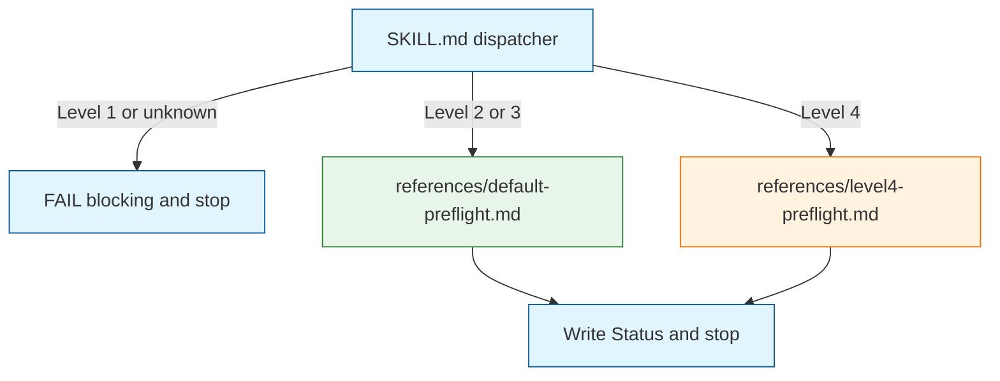

# Preflight Phase - Pre-Build Plan Validation

This command validates the plan against codebase reality before any code is written. A parent spawns it with only `Run the /niko-preflight skill`. It is not a plan/build workflow router: it does not load a level workflow. It loads exactly one sibling check file from Complexity, then writes status and stops.

## Step 1: Load Memory Bank Files

Read:

- `memory-bank/active/progress.md`
- `memory-bank/active/tasks.md`
- `memory-bank/active/projectbrief.md`
- `memory-bank/systemPatterns.md`
- `memory-bank/techContext.md`
- `memory-bank/active/creative/**/*.md` (if any exist)

`**Complexity:**` in `progress.md` is the dispatch switch. Presence of `milestones.md` is not.

## Step 2: Dispatch

Read `**Complexity:**`. Then take exactly one branch. Do not read the other reference. Do not load a level workflow.

1. **Missing or unknown Complexity** — record `FAIL (blocking)`. Skip to Step 3 Write Status. Do not load a check file.
2. **Level 1** — this skill is not used at Level 1. Record `FAIL (blocking)`. Skip to Step 3 Write Status. Do not load `default-preflight.md`.
3. **Level 2 or Level 3** — load `.cursor/skills/shared/niko-preflight/references/default-preflight.md`. Follow **only** that file. When its checks are done, continue to Step 3.
4. **Level 4** — load `.cursor/skills/shared/niko-preflight/references/level4-preflight.md`. Follow **only** that file. When its checks are done, continue to Step 3.

## Step 3: Shared close

If dispatch already recorded a terminal `FAIL (blocking)` before loading a check file, skip Radical Innovation. Otherwise run all three of the following.

1. **Radical Innovation** *(advisory - not blocking)*
   - What's the single smartest and most radically innovative and accretive and useful and compelling change you could make to the plan at this point?
   - Describe the change concretely - not as a vague suggestion, but as a specific structural sketch the operator can evaluate against the cost of redesign.
   - Record that idea as an advisory finding. Do not make the change to the plan, even if the idea fits the brief.
2. **Judge, Do Not Fix**
   - Surface and judge. Never modify the plan under review, except the TDD step swap and the strike, and only when the loaded checks performed those edits.
   - Allowed writes only: `memory-bank/active/.preflight-status`, the `**Phase:**` field in `activeContext.md` (under **End of Verification**), `progress.md`, and those two in-phase plan edits on `tasks.md`.
   - Do not rewrite Implementation Plan units, behavior lists, or other scheduled work except that swap and that strike.
   - Record every issue as a finding. FAIL when the plan must change before build (`FAIL (fixable)` or `FAIL (blocking)`); PASS only when the plan is acceptable as-is (advisories allowed).
3. **Write Status**
   - Overwrite `memory-bank/active/.preflight-status`. First line is exactly one allowed value from `.cursor/rules/shared/niko/memory-bank/active/preflight-status.mdc`. After a blank line, write this run's findings.

## Step 4: Log Progress

> 🚨 **Printing this notice is NOT the end of this phase.** After printing, continue immediately to the next step - do not stop.

Update `memory-bank/active/progress.md` to record that Preflight completed and what the first line of `.preflight-status` was.

Print the appropriate block:

### PASS

~~~markdown
# Preflight Result

✅ PASS

## Findings

1. **Findings** - bulleted list of each finding with severity
2. **Advisory items** (if any) - concrete recommendations the operator can evaluate

~~~

### FAIL

~~~markdown
# Preflight Result

❌ FAIL

## Findings

1. **Findings** - bulleted list of each finding with severity
2. **Advisory items** (if any) - concrete recommendations the operator can evaluate

~~~

## Step 5: End of Verification

Update `memory-bank/active/activeContext.md` so `**Phase:**` records Preflight complete with the first line of `.preflight-status` (e.g. `**Phase:** PREFLIGHT - COMPLETE (PASS)`). Do not load a level workflow or begin another phase. Stop.
