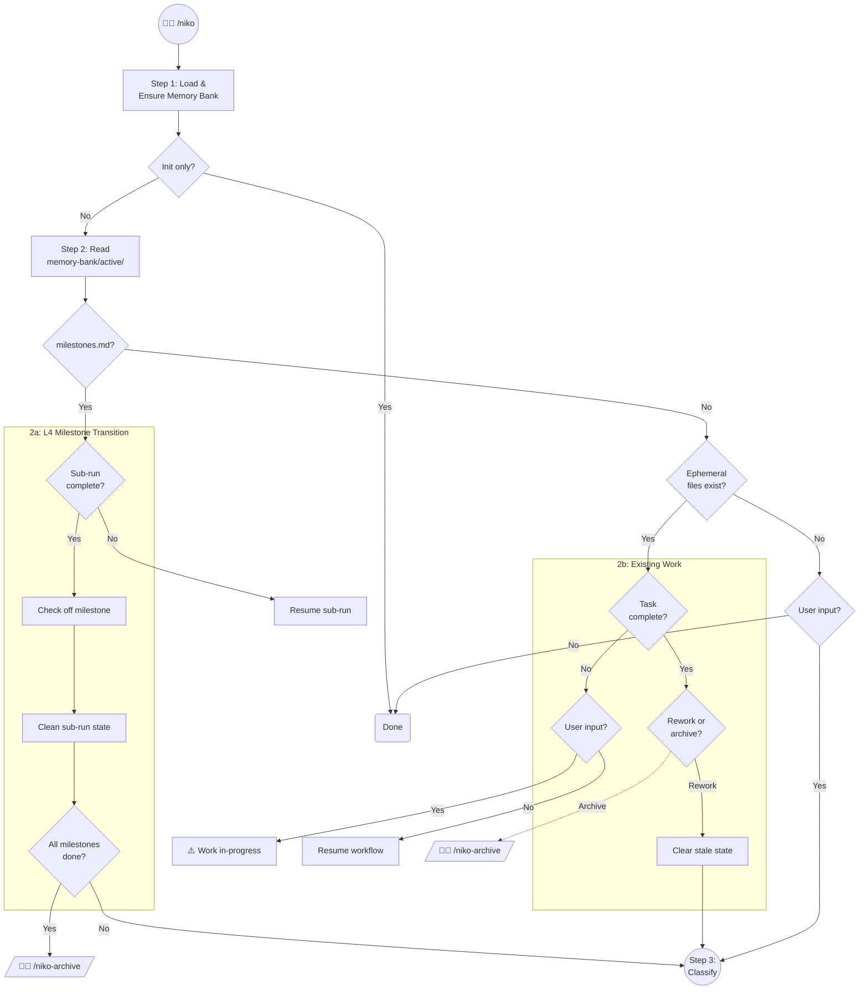

# Niko Phase - Initialization & Entry Point

`/niko` is the single entry point for the Niko system. It initializes the memory bank, routes based on current state, and delegates to complexity analysis for new or next work.



## Step 1: Load & Ensure Memory Bank Persistent Files

```
Load: .cursor/rules/shared/niko/core/memory-bank-paths.mdc
Load: .cursor/rules/shared/niko/core/memory-bank-init.mdc
```

**CRITICAL:** If *at least one* of the memory-bank's persistent files does not exist, initialize the memory bank's persistent files *immediately* according to the defined process.

If the only user input was to initialize the memory bank, you are done! Exit and do nothing else.

## Step 2: State Routing

Read the contents of `memory-bank/active/`, then follow the diagram.

### 2a: L4 Milestone Transition

`milestones.md` exists — an L4 project is in-flight.

Read:

- `milestones.md`
- `activeContext.md`
- `progress.md`
- `.qa-validation-status` (if present)

Then follow the L4 Milestone Transition subgraph.

**Sub-run complete?** YES if: `activeContext.md` shows REFLECT COMPLETE, or the task's complexity level (from `progress.md`) is Level 1 and `.qa-validation-status` shows PASS.

**Check off milestone.** Mark the completed sub-run's milestone as `- [x]` in `milestones.md`.

**Clean sub-run state.**

- Delete from `memory-bank/active/`:
    - `tasks.md`
    - `activeContext.md`
    - `creative/` (if present)
    - `.qa-validation-status`
    - `.preflight-status` (if present)
- Preserve (do NOT delete):
    - `milestones.md`
    - `projectbrief.md`
    - `progress.md`
    - `reflection/`

**All milestones done?** Every milestone is `- [x]`. The L4 project is complete — direct the operator to run `/niko-archive` for the capstone archive. STOP and wait.

**Resume sub-run.** Sub-run is not complete. Read `progress.md` for the `**Complexity:**` field and `activeContext.md` for the `**Phase:**` field. Load the appropriate level-specific workflow and resume execution from the current phase.

### 2b: Existing Work

No `milestones.md` — check for standalone in-progress work. All four core ephemeral files must exist: `projectbrief.md`, `activeContext.md`, `tasks.md`, `progress.md`.

**Task complete?** YES if: `activeContext.md` shows REFLECT COMPLETE, or the task's complexity level (from `progress.md`) is Level 1 and `.qa-validation-status` shows PASS.

**Rework or archive?** The previous task is complete. Ask the operator. Archive directs to `/niko-archive`; STOP and wait. Rework gathers feedback context from the operator.

**Clear stale state.** Rework path:

1. Append rework initiation and feedback to `progress.md`.
2. Append a **Rework** section to `projectbrief.md` (preserve the original brief above).
3. Delete `tasks.md`, `activeContext.md`, `.qa-validation-status`, `.preflight-status`.
4. Commit: `chore: initiating rework on [task-id]`

Rework complexity is classified independently of the original task. Proceed to Step 3.

**User input? (task not complete).** If the user provided new task input, warn that work is in-progress — the current task should be archived or explicitly abandoned. STOP and wait. If no user input, resume: read `progress.md` for the `**Complexity:**` field and `activeContext.md` for the `**Phase:**` field, load the appropriate level-specific workflow, and resume execution from the current phase.

### Fresh Task

No ephemeral files — no work in-progress. If the user provided task input, proceed to Step 3. If no user input, nothing to do — exit.

## Step 3: Classify

```
Load: .cursor/rules/shared/niko/core/complexity-analysis.mdc
```

Follow the instructions to determine the complexity level. Complexity analysis will populate the memory bank's ephemeral files and guide you to the next step.
