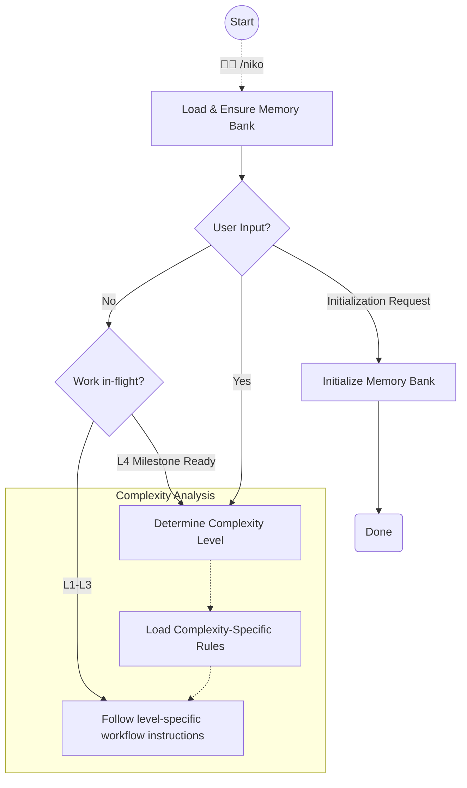

# Niko Phase - Initialization & Entry Point

This command determines task complexity, and routes to appropriate workflows based on the complexity level.



## Step 1: Load & Ensure Memory Bank Persistent Files

```
Load: .cursor/rules/shared/niko/core/memory-bank-paths.mdc
Load: .cursor/rules/shared/niko/core/memory-bank-init.mdc
```

**CRITICAL:** If *at least one* of the memory-bank's persistent files does not exist, initialize the memory bank's persistent files *immediately* according to the defined process.

If the only user input was to initialize the memory bank, you are done! Exit and do nothing else.

## Step 2: Resume Check (No User Input)

If the user provided task input, skip to Step 3.

When `/niko` is invoked with no user input, check for existing in-flight work:

1. **L4 in-flight:** If `memory-bank/active/milestones.md` exists, an L4 project is active. Proceed to Step 3 — complexity analysis handles L4 re-entry.
2. **L1-L3 in-flight:** If all four ephemeral files exist (`projectbrief.md`, `activeContext.md`, `tasks.md`, `progress.md`) but `milestones.md` does not, read `progress.md` for the `**Complexity:**` field (the level) and `activeContext.md` for the `**Phase:**` field (the current phase). Load the appropriate level-specific workflow and resume execution from the current phase.
3. **No work in-flight:** Nothing to resume. Exit and do nothing else.

## Step 3: Determine Complexity Level

```
Load: .cursor/rules/shared/niko/core/complexity-analysis.mdc
```

Follow the instructions to determine the complexity level of the task.

Complexity analysis will populate the memory bank's ephemeral files & guide you to the next step.
