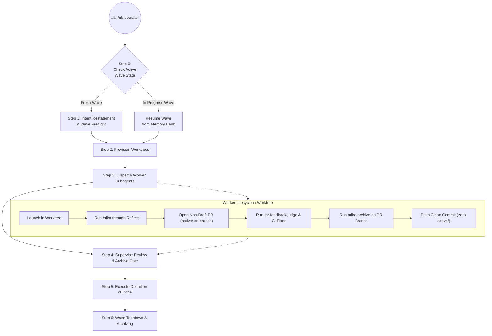

# /nk-operator - Multi-Task Wave Operator

`/nk-operator` coordinates and drives multiple Niko workflows autonomously across isolated git worktrees. The operator acts strictly as a coordinator, dispatcher, and gatekeeper.

## Roles & Operational Boundaries

1. **Hierarchy:**
   - **The Operator:** The caller driving the root session.
   - **Wave Operator (`nk-operator`):** The orchestrator session coordinating, dispatching, and supervising the wave.
   - **Worker:** An autonomous `/niko` instance executing in an isolated worktree. Workers drive their tasks through the Niko lifecycle, spawning verification subagents (QA, Preflight) as needed, and escalate blockers to the Wave Operator. The Wave Operator coordinates Workers or escalates blocking decisions to the Operator.
2. **The Wave Operator never writes product code in the primary checkout.** If a worker encounters test failures, red CI, or review feedback, the Wave Operator dispatches or resumes the worker inside that worker's worktree. The primary checkout remains clean.
3. **Worktrees provide physical isolation.** Every concurrent task runs in a dedicated git worktree branched off the latest base branch. Each worktree has its own `memory-bank/active/`, preventing index lock contention and state collision.
4. **Standing consent through pull request.** Workers receive pre-approved intent and standing consent to proceed through the full Niko lifecycle (plan, preflight, build, QA, reflect, pull request creation, and archiving). Workers stop only on genuine architectural forks (`BLOCKED`) or invalid issues (`CLOSE_CANDIDATE` or `DEFERRED`).
5. **Branches are permanent.** The Wave Operator cleans up worktree directories after tasks conclude, but never deletes local or remote git branches.
6. **Agnostic to session memory tools.** The Wave Operator does not dictate machine-specific memory wake or skip commands. Workers rely on standard workspace rules or repository guidelines for any session-start memory initialization.

## State Machine & Durability

The operator's wave plan and chosen Definition of Done must survive context window compaction and session restarts. The operator records its wave state durably in the primary checkout's `memory-bank/active/`:

- `memory-bank/active/projectbrief.md`: Stores the wave brief, list of task definitions, and the active Definition of Done.
- `memory-bank/active/activeContext.md`: Tracks current operator phase (`OPERATOR WAVE - [Phase]`) and in-flight workers.
- `memory-bank/active/tasks.md`: Ordered task manifest tracking worktree paths, branch names, PR numbers, and status.
- `memory-bank/active/progress.md`: Execution history and phase transitions.



---

## Step 0: Check Active Wave State (Re-entry)

Before initiating a new wave, inspect `memory-bank/active/activeContext.md`:

1. **Active Wave Detected:** If `activeContext.md` indicates an in-progress operator wave (`OPERATOR WAVE`):
   - Read `projectbrief.md` to restore the active Definition of Done and original task definitions.
   - Read `tasks.md` to identify existing worktrees, branches, and PR numbers.
   - Reconcile status against on-disk worktrees (`git worktree list`) and remote pull requests (`gh pr list`).
   - Resume execution at the current operator phase without prompting the user to re-specify the Definition of Done.
2. **Fresh Wave:** If no active wave exists, proceed to Step 1.

---

## Step 1: Intent Restatement & Wave Preflight

Inspect the input task specifications (issue URLs, tickets, or bug reports) and any appended Definition of Done directives.

### 1. Resolve Definition of Done (DoD)
- **Default:** If no DoD is specified, select `/nk-operator-dod-prready` (PR Ready for Operator review).
- **Merge to Main:** If the user specifies `and merge`, `merge to main`, or `/nk-operator-dod-mergemain`, select `/nk-operator-dod-mergemain` (autonomous serial landing and rebase).
- **Custom DoD:** If the user provides a custom `/nk-operator-dod-<name>` skill or custom prose requirements, adopt those criteria.

### 2. Triage Tasks and Dependencies
- **Parse tasks:** Extract ticket numbers, titles, and requirements.
- **Dependency analysis:**
  - *Independent tasks:* Tasks touching separate systems or files will run concurrently in parallel worktrees.
  - *Sequenced tasks:* If Task Y depends on Task X, Task Y must wait until Task X's PR is merged to the base branch.
- **File overlap:** Group two issues into a single worker only when they modify the exact same files and cannot be cleanly separated. Otherwise, assign exactly one worker per issue.

### 3. Emit Intent Restatement & Wave Preview
Before creating any branches or worktrees, print a clear preview to the operator:

~~~markdown
# Operator Wave Initialized

**Definition of Done:** [nk-operator-dod-prready | nk-operator-dod-mergemain | custom]

### Tasks Planned
1. **[Task-1 ID]**: [Title/Scope] — Parallel (Worktree: `[path]`, Branch: `feat/[ticket]-[slug]`)
2. **[Task-2 ID]**: [Title/Scope] — Parallel (Worktree: `[path]`, Branch: `feat/[ticket]-[slug]`)
3. **[Task-3 ID]**: [Title/Scope] — Sequenced (Waits on Task-1 merge)

**Landing Strategy:** [Leave PRs open for Operator review | Serial landing with automated rebase]
~~~

### 4. Persist Wave State
Write the wave brief and active Definition of Done to `memory-bank/active/projectbrief.md`, initialize the task manifest in `tasks.md`, and record the active phase in `activeContext.md`.

---

## Step 2: Provision Worktree Isolation

For each concurrent task to be dispatched, provision an isolated git worktree outside the primary checkout.

1. **Worktree directory convention:** Use a predictable hierarchy outside the repository root, such as `~/.cursor/worktrees/<repo>/<slug>/` or `~/git/worktrees/<org>/<repo>/<ticket-id>`.
2. **Create the worktree and branch:**
   ```bash
   git worktree add -b feat/<ticket-id>-<slug> <worktree-path> <base-branch>
   ```
3. **Initialize local dependencies:** Run repository-specific setup inside the worktree (e.g. `npm install`, `uv sync`, or copying required local uncommitted environment configs).
4. **Record path in manifest:** Update the worktree path and branch name in `memory-bank/active/tasks.md`.

---

## Step 3: Dispatch Worker Subagents

Launch each worker as a background subagent using the `Task` tool (`run_in_background: true`). Follow project model selection guidelines, mixing model families where appropriate.

### Standard Bootstrap Prompt

Worker prompts must remain lean and skill-first. Do not copy ticket text or spell out Niko phases manually. Use this prompt template:

~~~markdown
1. Working Directory: <absolute-worktree-path>. All edits and commands must execute inside this path. Never modify files in the parent checkout.
2. Task Definition: <ticket-or-issue-url>. Treat this task definition as pre-approved intent.
3. Autonomous Execution: Invoke `/niko do <ticket-or-issue-url>`. Drive the workflow through planning, preflight, TDD build, QA validation, and reflection. You have standing consent; do not stop for routine phase approvals. Stop only if the task is invalid (`CLOSE_CANDIDATE` or `DEFERRED`) or hits an undecided architectural fork (`BLOCKED`).
4. Pull Request Creation:
   - When reflection is complete, push the branch to origin: `git push -u origin HEAD`.
   - Open a non-draft pull request against `<base-branch>` linking to the ticket (`Fixes #<id>`). If the repository defines a pull request template (e.g. `.github/pull_request_template.md`), follow it. Otherwise, use the fallback template in `rulesets/niko/skills/nk-operator/references/default-pr-template.md`. Do not name specific external PR tools; rely on ambient skills and CLI tools in your environment.
   - Do NOT run `/niko-archive` yet. Keep `memory-bank/active/` on the branch so rework can update active reflection documents.
5. Review & CI Gate:
   - Monitor the pull request for continuous integration status checks and reviewer bot comments.
   - If CI fails, fix via TDD (maximum 2 attempts).
   - Evaluate reviewer bot feedback and diff comments by invoking `/pr-feedback-judge`.
   - Comments critiquing in-flight `memory-bank/active/` files (such as incomplete checkboxes) are dismissed by policy.
   - The review loop is strictly: `1 mandatory initial round + up to 2 follow-up rounds if critical blocking issues exist` (total rounds: between 1 and 3). Resolve critical blocking issues via TDD. Loop until no critical blocking issues remain.
6. Archive on the PR Branch:
   - Once CI is green and review feedback is resolved, run `/niko-archive`.
   - Commit the resulting archive and clean state: `chore: archive <task-id> and clear memory bank`.
   - Push the final commit to origin: `git push`.
7. Final Report: Return your PR URL, summary of changes, test suite results, and merge risk notes.
~~~

---

## Step 4: Supervise Review & Archive Gate

The operator monitors background workers as they transition through PR creation, review evaluation, and archiving.

### 1. Review Feedback Evaluation via `/pr-feedback-judge`
- Workers evaluate PR feedback using `/pr-feedback-judge` (available directly in the Niko ruleset).
- Both inline diff comments and review bodies/flowcharts are evaluated.
- **Categorization:**
  - *Critical / Blocking:* Contract breaks, deleted endpoints/symbols, broken tests, security vulnerabilities, or architecture/dataflow divergence. These must be addressed.
  - *Advisory / Non-blocking:* Stylistic preferences, nitpicks, out-of-scope suggestions. These may be dismissed or deferred to a follow-up ticket.
  - *In-Flight State Critiques:* Bot feedback complaining about incomplete checkboxes in `memory-bank/active/` is dismissed by policy.

### 2. Review Loop & CI Circuit Breakers
- **CI Failure Limit:** Maximum 2 automated fix attempts. If CI remains red after 2 attempts, escalate to the Operator (indicates an environment, runner, or secret assumption mismatch).
- **Review Loop Rule:** The review loop is plain and predictable: `1 mandatory initial round + up to 2 follow-up rounds if critical blocking issues exist` (total rounds: between 1 and 3).
  - *Round 1 (Initial Review):* After opening the non-draft PR, wait for initial checks and review bots (60–180s). Run `/pr-feedback-judge` and inspect any failing CI or review comments.
  - *Follow-Up Rounds (Conditional):* If critical blocking issues exist (broken tests, contract breaks, deleted endpoints, security flaws, architectural divergence), apply test-driven fixes, commit, push, and re-evaluate.
  - *Exit Condition:* Stop follow-up loops as soon as no critical blocking issues remain.
  - *Circuit Breaker:* If critical blocking issues remain after round 3 (1 initial + 2 follow-ups), halt and escalate to the Operator as `BLOCKED`.
  - Non-blocking/advisory items (style nits, active/ checkboxes) are dismissed or recorded as follow-ups without triggering extra review loops.

### 3. The Archive Gate
- Archiving happens **on the PR branch** after CI and reviews pass, never before.
- Running `/niko-archive` at this gate ensures:
  1. All learnings, creative decisions, and review rework are compiled into **one definitive archive document**.
  2. `memory-bank/active/` is wiped from the PR branch, eliminating ephemeral noise and preventing merge conflicts with sibling branches.
  3. The final commit contains only clean product code, tests, docs, and the single archive document.

---

## Step 5: Execute Definition of Done

Once all workers have completed the Archive Gate, the operator executes the active Definition of Done:

- **If DoD is `prready` (Default):** Invoke `/nk-operator-dod-prready`.
  - Verify all pull requests are green, archived, and cleanly open.
  - Leave pull requests open for the Operator to review and merge.
  - Report the list of open pull requests to the Operator.
- **If DoD is `mergemain`:** Invoke `/nk-operator-dod-mergemain`.
  - Execute serial landing one PR at a time.
  - Check mergeability and squash-merge the first PR.
  - Pull updated base into root checkout (`git pull origin <base-branch>`).
  - Rebase remaining sibling branches in their worktrees onto the updated base tip.
  - If rebase conflicts occur on shared files (lockfiles, documentation, common modules), dispatch a worker to resolve conflicts via TDD, verify tests, and force-push with lease.
  - Await green CI on rebased PR, then merge.
  - Repeat until all PRs are landed.
- **If custom DoD:** Follow the instructions specified by the custom DoD skill.

---

## Step 6: Wave Teardown & Archiving

After the Definition of Done is fully satisfied:

1. **Clean worktrees:** Remove all worktrees from disk using `git worktree remove <worktree-path>`.
2. **Preserve branches:** Never delete local or remote feature branches.
3. **Transition issue trackers:** Update tickets or GitHub issues to reflect their completed state.
4. **Wave capstone archive:** For multi-task waves, write a capstone archive to `memory-bank/archive/systems/YYYYMMDD-wave-<id>.md` documenting the overall wave, PRs landed, and architectural changes. Clear `memory-bank/active/` in the primary checkout.
5. **Operator branch disposition:** The operator operates on an orchestration branch (e.g. `feat/wave-...` or `orchestration-...`) where it tracked wave state. Once teardown and capstone archiving are complete, evaluate the net diff against the base branch (`git diff <base-branch>..HEAD`):
   - *Durable content exists:* If the branch contains durable value (the systems capstone archive, cross-cutting updates to `systemPatterns.md` or `techContext.md`, or central documentation updates), recommend opening a pull request for the operator branch (or squash-merge it if the DoD is `mergemain`).
   - *Transient orchestration only:* If all substantive work was landed in worker PRs and the operator branch contains only ephemeral orchestration noise that has now been cleared, recommend abandoning or deleting the operator branch cleanly without opening an empty PR.
   - Surface this explicit recommendation in the final wave report.
