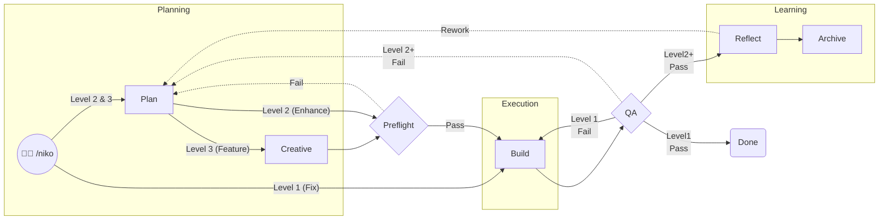
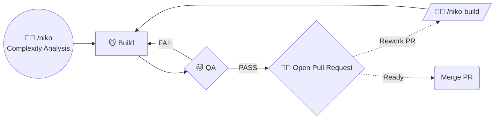
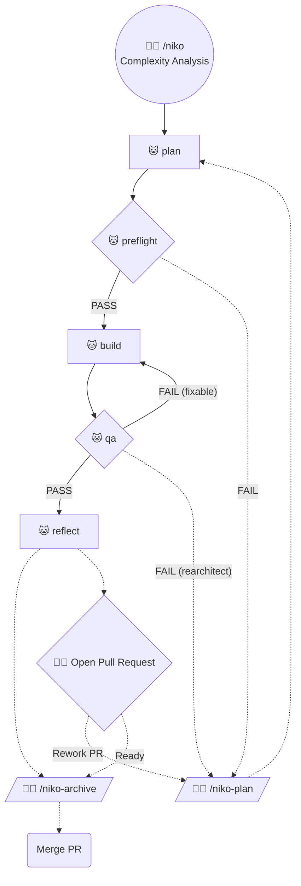
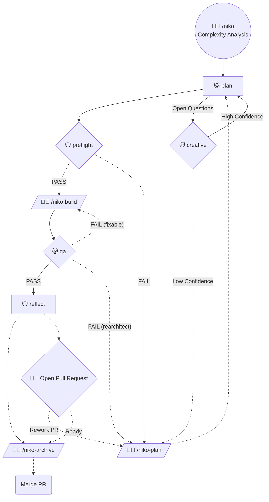

# ⚠️ Under Construction

This is a rewrite in-progress. Don't try to use it yet!

# Niko Ruleset

Structured workflows & expert prompts that transform your AI code assistant into a seasoned senior dev (Niko) that can "oneshot" complex coding tasks & survive beyond a single session's context window.

## Installation Notes - IMPORTANT!

This specific configuration of `niko` is designed to be used in Cursor, installed as *committed* rules with the [ai-rizz](https://github.com/texarkanine/ai-rizz) tool:

	ai-rizz init https://github.com/texarkanine/.cursor-rules.git --commit
	ai-rizz add ruleset niko

**You will need to make manual changes** if you want to use `niko` in other environments.

If you use Claude Code, you can install Niko that way, then use [a16n](https://npmjs.com/package/a16n) to convert Niko to a compatible format:

	a16n convert --from cursor --to claude --delete-source --rewrite-path-refs

## Niko, the Dev

Niko's core problem-solving toolkit is defined in [niko-core](../../rules/niko-core.mdc).

The Niko ruleset includes other supplementary rules to give Niko the capabilities it needs:

* [always-tdd](../../rules/always-tdd.mdc) - forces test-driven development (TDD) for all code changes
* [visual-planning](../../rules/visual-planning.mdc) - Encourages use of `mermaid` diagrams when planning complex tasks.
* [test-running-practices](../../rules/test-running-practices.mdc) - best-practices for using tests to guide development

## Niko's Memory Bank

Niko will create **many** files in your repo, mostly in the `memory-bank/` directory. This is cool and good: Niko is storing memory on disk instead of in an LLM's context window. See [memory-bank-paths.mdc](./niko/core/memory-bank-paths.mdc) for more details.

### Persistent Files

Some memory-bank files are long-lived, "persistent" files that serve as [AGENTS.md](https://agents.md/) but [better](https://blog.cani.ne.jp/2026/02/12/stop-doing-agents-md.html) - purpose-separated high-level indices to crucial information that your agents need to know about.

| File                | Kind       | Purpose                                                                                                          |
|---------------------|------------|------------------------------------------------------------------------------------------------------------------|
| `productContext.md` | Persistent | Business context: target users, use cases, success criteria, constraints.                                        |
| `systemPatterns.md` | Persistent | Architectural patterns: code organization, naming conventions, design patterns in use.                           |
| `techContext.md`    | Persistent | Technical stack: languages, frameworks, build tools, file conventions, dependencies, design system references.   |
| `archive/**/*.md`   | Persistent | A directory of summary documents of past work.                                                                   |

### Ephemeral Files

Other memory-bank files are ephemeral, created to track a task and its progress. They're cleaned up after you finish a task.

| File                     | Kind      | Purpose                                                                                                       |
|--------------------------|-----------|---------------------------------------------------------------------------------------------------------------|
| `projectbrief.md`        | Ephemeral | Current session deliverable: user story & requirements. This guides all development.                          |
| `activeContext.md`       | Ephemeral | Current session focus: what's being worked on now, recent decisions, immediate next steps.                    |
| `progress.md`            | Ephemeral | Implementation progress: history of completed work and phase transitions.                                     |
| `tasks.md`               | Ephemeral | Active task tracking: current task details, checklists, component lists. The work to do in the current phase. |
| `reflection/*.md`        | Ephemeral | Insights from work performed during the current task                                                          |
| `creative/*.md`          | Ephemeral | Records of exploring & deciding on thorny or ambiguous design decisions for the current task.                 |
| `.preflight-status`      | Ephemeral | Records the Plan's validation; gates Build                                                                    |
| `.qa-validation-status`  | Ephemeral | Records QA validation; gates completion / Reflect                                                             |

A key feature of the memory bank is `memory-bank/archive/` - a directory of summary documents of past work. These collect key decisions, insights, and tasks from past work. You can use them to help understand a specific piece of past work, *and* you can periodically comb over them to identify patterns and opportunities for improvement.

## Niko's Workflows

Niko's workflows will guide your agent and you through several well-defined phases, tuned to the complexity of the task.

These may look daunting, but don't worry:

1. Niko will do most phase transitions for you.
2. Niko will tell you which command to run when a phase transition requires your input.
3. Niko will evaluate the complexity of the task at hand and choose one of three workflows depending on the complexity. Simpler tasks will have much simpler workflows.

Level 1: Quick Fix

Level 2: Enhancement

Key differences from Level 1:

1. "Preflight" phase to validate plan
2. "Reflect" phase to capture insights before opening PR, may run multiple times depending on PR feedback/rework cycle
3. "Archive" phase to condense & record all Reflection insights 

Level 3: Feature

Key differences from Level 2:

1. "Creative" phase to resolve open-ended questions
2. Human must manually review plan after Preflight

## Usage

Use the `/niko` command to get started:

	/niko let's build this idea I had, it's like this...

Niko will start working on your request and will prompt you to use other commands **if necessary** to get the work done.

Key insights: 

When iterating, return to `/niko` and it may route your refinements to a different level - e.g. if you finished a Level 3 feature but want a minor change, that iteration might be routed to the Level 1 flow.

### Context Refreshing

Niko stores progress on disk in the `memory-bank` directory. When your context window is getting full, let Niko finish the current task, then... start a new conversation! If Niko was building, you can just start a new chat with `/niko-build` and nothing else and Niko will resume the work!

### Advanced Troubleshooting

If you (or Niko!) get stuck on a problem, use the `/refresh` command to have Niko rigorously investigate the problem and give you a solution *or* places to investigate next.

**Note:** `/niko-creative` is for exploring solution spaces and creating new things. `/refresh` is for troubleshooting an existing defect.
