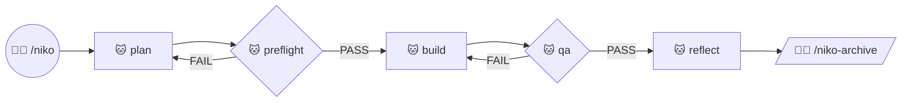
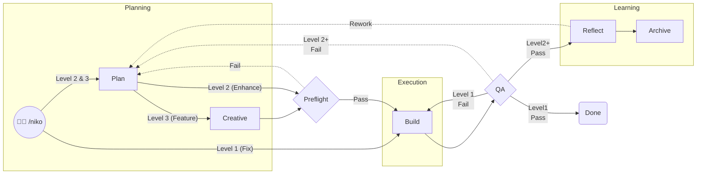
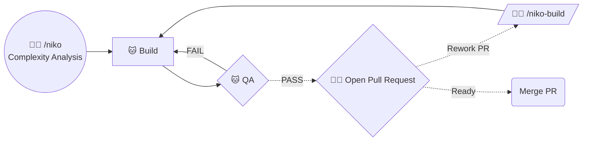
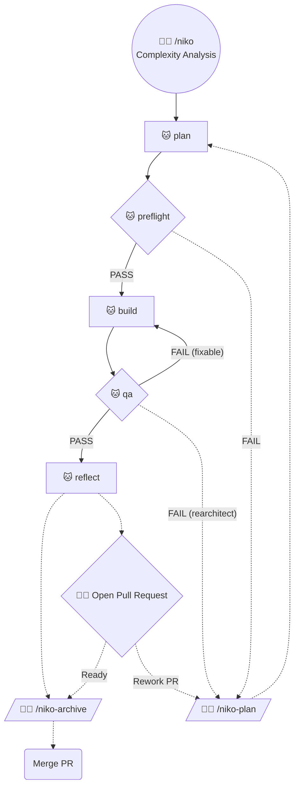
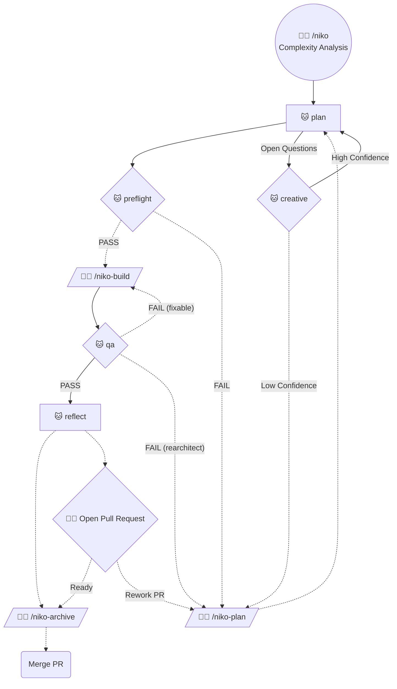
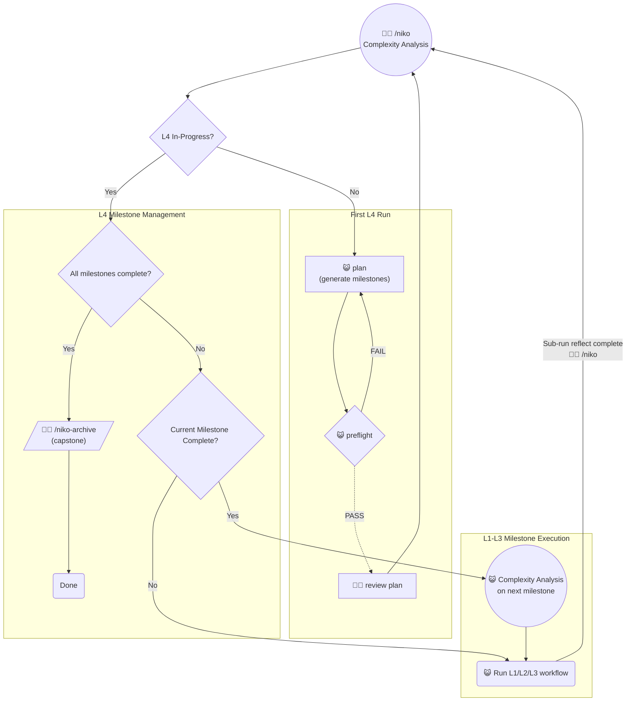

# ⚠️ Under Construction

This is a rewrite in-progress. Don't try to use it yet!

# Niko Ruleset

Structured workflows & expert prompts that transform your AI code assistant into a seasoned senior dev (Niko) that can "oneshot" complex coding tasks & survive beyond a single session's context window.

## Installation Notes - IMPORTANT!

This specific configuration of `niko` is designed to be used in Cursor, installed as *committed* rules with the [ai-rizz](https://github.com/texarkanine/ai-rizz) tool:

	ai-rizz init https://github.com/texarkanine/.cursor-rules.git --commit
	ai-rizz add ruleset niko

If you use Claude Code, you can install Niko that way, then use [a16n](https://npmjs.com/package/a16n) to convert Niko to a compatible format:

	a16n convert --from cursor --to claude --delete-source --rewrite-path-refs

**You will need to make manual changes** if you want to use `niko` in other environments.

## Niko, the Dev

Niko's core problem-solving toolkit is defined in [niko-core](../../rules/niko-core.mdc).

The Niko ruleset includes other supplementary rules to give Niko the capabilities it needs:

* [always-tdd](../../rules/always-tdd.mdc) - forces test-driven development (TDD) for all code changes
* [visual-planning](../../rules/visual-planning.mdc) - Encourages use of `mermaid` diagrams when planning complex tasks.
* [test-running-practices](../../rules/test-running-practices.mdc) - best-practices for using tests to guide development

## Niko's Memory Bank

Niko will create **many** files in your repo, mostly in the `memory-bank/` directory. This is cool and good: Niko is storing memory on disk instead of in an LLM's context window. See [memory-bank-paths.mdc](./niko/core/memory-bank-paths.mdc) for more details.

### Persistent Files

Some memory-bank files are long-lived, "persistent" files that serve as [AGENTS.md](https://agents.md/) but [better](https://blog.cani.ne.jp/2026/02/12/stop-doing-agents-md.html) - purpose-separated high-level indices to crucial information that your agents need to know about.

| File                | Kind       | Purpose                                                                                                          |
|---------------------|------------|------------------------------------------------------------------------------------------------------------------|
| `productContext.md` | Persistent | Business context: target users, use cases, success criteria, constraints.                                        |
| `systemPatterns.md` | Persistent | Architectural patterns: code organization, naming conventions, design patterns in use.                           |
| `techContext.md`    | Persistent | Technical stack: languages, frameworks, build tools, file conventions, dependencies, design system references.   |
| `archive/**/*.md`   | Persistent | A directory of summary documents of past work.                                                                   |

The archive is a *key* feature! Archives collect key decisions, insights, and tasks from past work. You can use them to help understand a specific piece of past work, *and* you can periodically comb over them to identify patterns and opportunities for improvement. The archive is the long-term memory of work on the project.

### Ephemeral Files

Other memory-bank files are ephemeral, created to track a task and its progress. They're stored in the `memory-bank/active/` folder and cleaned up after you finish a task. These are the short-term memory for work on the current task.

| File                     | Kind      | Purpose                                                                                                       |
|--------------------------|-----------|---------------------------------------------------------------------------------------------------------------|
| `projectbrief.md`        | Ephemeral | Current session deliverable: user story & requirements. This guides all development.                          |
| `activeContext.md`       | Ephemeral | Current session focus: what's being worked on now, recent decisions, immediate next steps.                    |
| `progress.md`            | Ephemeral | Implementation progress: history of completed work and phase transitions.                                     |
| `tasks.md`               | Ephemeral | Active task tracking: current task details, checklists, component lists. The work to do in the current phase. |
| `reflection/*.md`        | Ephemeral | Insights from work performed during the current task                                                          |
| `creative/*.md`          | Ephemeral | Records of exploring & deciding on thorny or ambiguous design decisions for the current task.                 |
| `.preflight-status`      | Ephemeral | Records the Plan's validation; gates Build                                                                    |
| `.qa-validation-status`  | Ephemeral | Records QA validation; gates completion / Reflect                                                             |

## Niko's Workflows

Niko's workflows will guide your agent and you through several well-defined phases, tuned to the complexity of the task.

The short version is:

The long version shows all the paths Niko can take, depending on the complexity of the task, with more details about phase transitions:

Long Version...

 
In case you want the "Long Version" but for just a single complexity level:

**Legend:**
- 🐱 = Phase executed autonomously
- 🧑‍💻 = Phase initiated by operator with explicit command
- Solid edge = Transition does not require operator input
- Dashed edge = Transition requires operator input

Level 1: Quick Fix

Level 2: Enhancement

**Key differences from Level 1:**

1. "Preflight" phase to validate plan
2. "Reflect" phase to capture insights before opening PR, may run multiple times depending on PR feedback/rework cycle
3. "Archive" phase to condense & record all Reflection insights 

Level 3: Feature

**Key differences from Level 2:**

1. "Creative" phase to resolve open-ended questions
2. Human must manually review plan after Preflight

Level 4: System

**Key differences from Level 3:**

1. Level 4 decomposes a complex task into multiple milestones, each of L1, L2, or L3 complexity.
2. "Reflections" accumulate after milestones are completed, and are archived once at the end ("Capstone" archive)
3. Manual `/niko` command required to advance from one completed milestone to the next
	- this is your chance to review Niko's work!

## Usage

Use the `/niko` command to get started:

	/niko let's build this idea I had, it's like this...

Niko will start working on your request and will prompt you to use other commands **if necessary** to get the work done.

### Context Refreshing

If Niko stops and asks for your input, once you provide it, ask Niko to update the memory bank. Then, you **start a new session** before running the next `/niko-*` command. This gives you a clean and empty context window - which is great for agents. How will Niko know what to do? Every `/niko-*` command will read the `memory-bank/` from disk and learn what it needs to know to continue!

If your context window is getting full, you can also just end the current conversation and start a new one. Niko will have to do a little extra work to figure out what was done since the last memory-bank update, but all the context will be there in the `memory-bank/`, so it'll figure it out!

### Advanced Troubleshooting

If you (or Niko!) get stuck on a problem, use the `/refresh` command to have Niko rigorously investigate the problem and give you a solution *or* places to investigate next.

**Note:** `/niko-creative` is for exploring solution spaces and creating new things. `/refresh` is for troubleshooting an existing defect.
