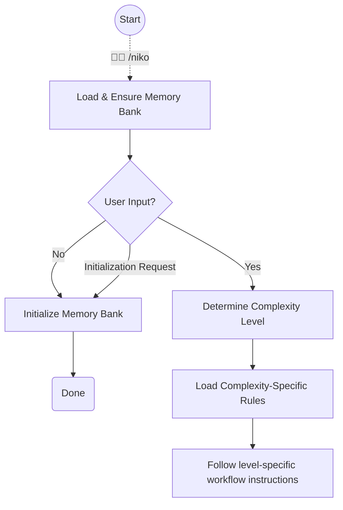

# Niko Command - Initialization & Entry Point

This command determines task complexity, and routes to appropriate workflows based on the complexity level.



## Step 1: Load & Ensure Memory Bank

```
Load: .cursor/rules/shared/niko/core/memory-bank-paths.mdc
Load: .cursor/rules/shared/niko/core/memory-bank-init.mdc
```

Follow the instructions to ensure that the memory bank's persistent files are created.

If there was no user input, or the only user input was to initialize the memory bank, you are done! Exit and do nothing else.

## Step 2: Determine Complexity Level

```
Load: .cursor/rules/shared/niko/core/complexity-analysis.mdc
```

Follow the instructions to determine the complexity level of the task.

Complexity analysis will populate the memory bank's ephemeral files.


## Step 3: Load Complexity-Specific Rules

After determining the complexity level, load the appropriate complexity-specific rules:

* Level 1: `.cursor/rules/shared/niko/level1/level1-workflow.mdc`
* Level 2: `.cursor/rules/shared/niko/level2/level2-workflow.mdc`
* Level 3: `.cursor/rules/shared/niko/level3/level3-workflow.mdc`
* Level 4: `.cursor/rules/shared/niko/level4/level4-workflow.mdc`

These will include instructions for the next steps.
